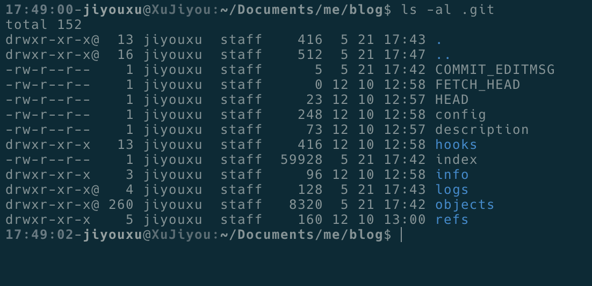

# 详解 .git 目录

每次在 `git init dir` 之后，都会创建一个 `.git` 目录。

`.git` 目录内有很多数据，甚至超过了原始数据。

比如以下目录：

.git里面包含 COMMIT_EDITMSG、FETCH_HEAD、HEAD、config、description 和 hooks、info、logs、objects、refs 五个文件夹。

下面依次看下这些文件。

## COMMIT_EDITMSG

这个文件的作用是记录最近一次 commit 的信息。

比如最近执行了一次 `git commit -m "hdfs"`，那这个文件里面就是 hdfs。

##FETCH_HEAD

git fetch从远程分支拉取代码。

fetch常结合merge一起用，git fetch + git merge == git pull
 一般要用git fetch+git merge，因为git pull会将代码直接合并，造成冲突等无法知道，fetch代码下来要git diff orgin/xx来看一下差异然后再合并。

