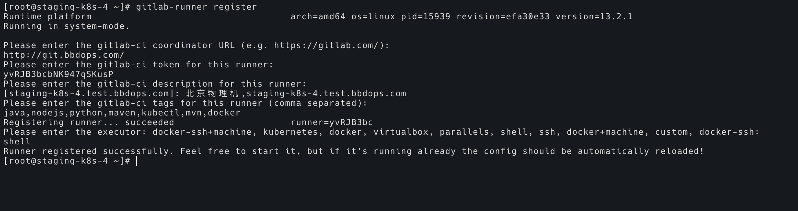
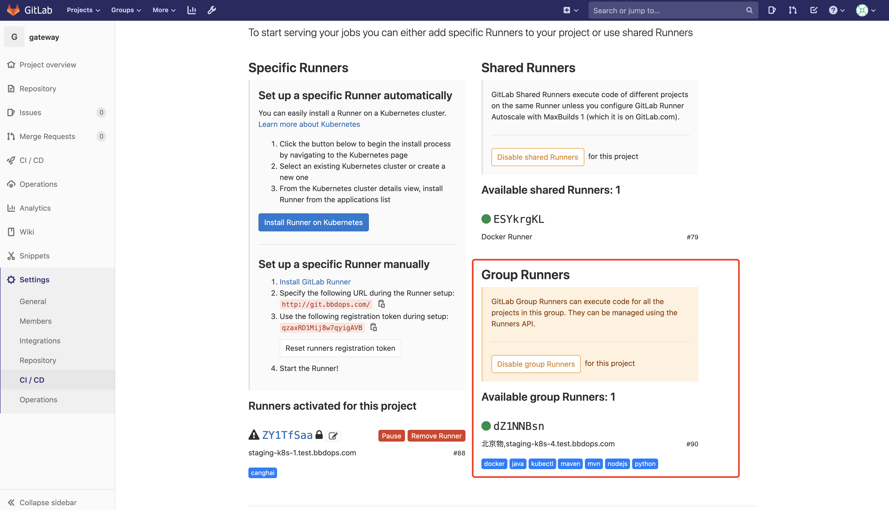
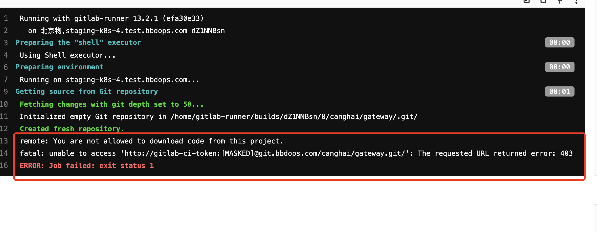

注意操作系统为 `CentOS8`  ！！！机器 IP为：10.28.112.14，主机名为：staging-k8s-4.test.bbdops.com，是一台位于北京的物理机。

CI/CD 过程中，需要依赖很多工具，比如 Git、kubectl、Docker、Maven、NodeJS 等，所以要一并安装。

安装 Gitlab-Runner：

```bash
curl -L https://packages.gitlab.com/install/repositories/runner/gitlab-runner/script.rpm.sh | sudo bash
sudo yum install gitlab-ci-multi-runner
```

安装 Git：

```bash
yum install git -y
```

安装 kubectl，需要和线上的 k8s 环境版本一致：

```bash
curl -LO https://storage.googleapis.com/kubernetes-release/release/v1.17.4/bin/linux/amd64/kubectl
chmod +x kubectl
sudo mv kubectl /usr/bin

sudo mv .kube/ /home/gitlab-runner/
sudo chown -R gitlab-runner:gitlab-runner /home/gitlab-runner/.kube
```

JDK 安装略过，安装 Maven：

```bash
sudo dnf install maven
```

安装 Docker：

```bash
sudo dnf config-manager --add-repo=https://download.docker.com/linux/centos/docker-ce.repo
sudo dnf list docker-ce
sudo dnf install docker-ce --nobest -y
```

`/etc/docker/daemon.json` 文件内容如下：

```json
{
  "exec-opts": ["native.cgroupdriver=systemd"],
  "log-driver": "json-file",
  "log-opts": {
    "max-size": "100m"
  },
  "storage-driver": "overlay2",
  "storage-opts": [
    "overlay2.override_kernel_check=true"
  ],
  "group": "docker",
  "registry-mirrors": ["https://4vra6qzb.mirror.aliyuncs.com"],
  "graph": "/data1/docker",
  "insecure-registries": ["registry.prod.bbdops.com"]
}
```

镜像和容器数据储存在了 `/data1/docker`，保证储存空间充足。

将用户加入 docker 组，保证有执行 docker 命令的权限，然后启动 Docker：

```bash
sudo usermod -aG docker gitlab-runner
sudo usermod -aG docker bbd

sudo systemctl start docker
sudo systemctl enable docker
```

安装 node.js，node 版本为 v10.22.0。

```bash
curl -sL https://rpm.nodesource.com/setup_10.x | bash -
sudo yum install -y nodejs
node --version
npm --version
```

Gitlab-runner 注册过程如下：



这里的 tag，要和 `.gitlab-ci.yaml` 文件中的 tag 相对应，要不然在 CI 时会找不到对应 tag 的 runner。

这里注意，项目和项目组都有自己的 token，如果这里填的是项目组的token，则项目组内的所有项目都可以使用这一 runner，如：




## 多个项目

如果多个项目同时使用一个 runner，可以使用以下命令依次添加多个 token：

```bash
sudo gitlab-ci-multi-runner register
sudo gitlab-ci-multi-runner register
sudo gitlab-ci-multi-runner restart
```

查看项目列表：

```bash
sudo gitlab-ci-multi-runner list
```

删除一个项目：

```bash
sudo gitlab-runner verify --delete --token dZ1NNBsnKWGZCMMmDseV  --url http://git.bbdops.com/
sudo gitlab-runner unregister --token -kSUxea5ULyybFjYP3ZP --url http://git.bbdops.com/
```

这里 `gitlab-ci-multi-runner` 命令只是 `gitlab-runner` 的一个软链接，用哪个都可以，用 `gitlab-runner` 最好。

查看状态：

```bash
sudo systemctl status gitlab-runnerg
```

配置完成后的配置文件在 `/etc/gitlab-runner/config.toml` 中，可以直接改这个文件，然后使用下面这个命令重启生效：

```bash
sudo systemctl restart gitlab-runner
```


## 错误

错误1，没有拉取代码的权限



可以通过将当前用户加入项目来解决，我这里把 root 用户加入了沧海项目组。

错误2，docker push 失败，解决方法：

```bash
sudo su gitlab-runner
docker login registry.prod.bbdops.com
```

输入管理员账户及密码。


