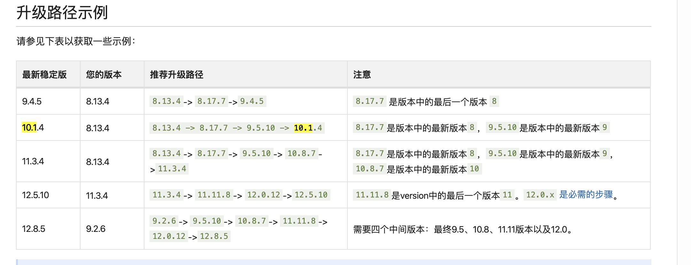
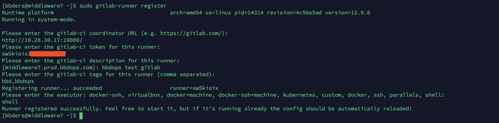

# Gitlab 升级

需要处理 Gitlab 升级的工作。

前同事的部署文档：http://asset.bbdops.com/software/info/e1d4c131-1a30-442c-a15f-c6c84100d79a （仅内网）

目前的版本是 `10.1.2` ，最新版本是 `12.8.5`

官方升级文档：https://docs.gitlab.com/ee/policy/maintenance.html#upgrade-recommendations


## 查看版本号

```bash
$ cat /opt/gitlab/embedded/service/gitlab-rails/VERSION
10.1.2
```


## 升级版本策略

根据官方升级文档：



决定升级路线是 ： `10.1.2`  ->  `10.8.7`  -> `11.11.8` ->  `12.0.12`  -> `12.8.5` 。共四次升级。


## 升级思路及准备

现在生产环境旁边建一相同版本的测试环境，将数据迁移到测试环境，然后在测试环境进行升级，测试环境升级完成后再进行生产环境的升级。

升级过程中，需要关闭服务，需要提前发邮件约定好。

需要准备好安装包，可以在 https://mirrors.tuna.tsinghua.edu.cn/gitlab-ce/yum/el7/ 查找特定版本号的 rpm 包。也可以配置好源，然后用 yum 安装指定版本。

万一生产环境升级失败，服务启动失败，可以直接改 DNS 将测试环境变为生产环境。

下面在测试环境进行升级。


## 升级到 10.8.7

先关闭服务：

```bash
$ sudo gitlab-ctl stop unicorn
$ sudo gitlab-ctl stop sidekiq
$ sudo gitlab-ctl stop nginx
```

创建数据备份：

````bash
$ sudo gitlab-rake gitlab:backup:create
````

安装 10.8.7 版本：

```bash
$ sudo yum install gitlab-ce-10.8.7-ce.0.el7.x86_64
```

重新建立配置：

```bash
$ sudo gitlab-ctl reconfigure
```

重启：

```bash
$ sudo gitlab-ctl restart
```

查看状态：

```bash
$ sudo gitlab-ctl status
```

查看版本号：

```bash
$ cat /opt/gitlab/embedded/service/gitlab-rails/VERSION
10.8.7
```

网页也能打开并登录，万事大吉。


## 升级到 11.11.8

步骤和上述一致，安装版本换成 11.11.8：

```bash
$ sudo yum install gitlab-ce-11.11.8-ce.0.el7.x86_64
```

稳定，没毛病。

查看版本号：

```bash
$ cat /opt/gitlab/embedded/service/gitlab-rails/VERSION
11.11.8
```


## 升级到 12.0.12

按照上面的套路再升级：

```bash
$ sudo yum install gitlab-ce-12.0.12-ce.0.el7.x86_64
```

查看版本号：

```bash
$ cat /opt/gitlab/embedded/service/gitlab-rails/VERSION
12.0.12
```

依旧没毛病。


## 升级到 12.8.5

```bash
$ sudo yum install gitlab-ce-12.8.5-ce.0.el7.x86_64
```

相安无事。。。

```bash
$ cat /opt/gitlab/embedded/service/gitlab-rails/VERSION
12.8.5
```


## 生产环境升级准备

四次升级，都没有特别注意的地方。备份只需要在关服务后进行一次即可。

产线环境，要把源从本地准备好，网上的源下载太慢，耽误时间。

先把测试环境弄好，包括 CI/DI等。测试没毛病之后，再进行升级。

准备凌晨进行线上环境升级。预计耗时一小时。


## 12.0 版本更新的 CI/CD 功能

在12.0 版本中，Gitlab 对 CI/CD 进行了升级，见官方文档：https://docs.gitlab.com/ee/ci/

需要在机器上安装 gitlab-runner ，官方地址：https://docs.gitlab.com/runner/install/linux-manually.html

可以按照这个地址来安装：https://packages.gitlab.com/runner/gitlab-runner

```bash
$ curl -s https://packages.gitlab.com/install/repositories/runner/gitlab-runner/script.rpm.sh | sudo bash
$ sudo yum install gitlab-runner -y
```

安装完成后，进行注册：https://docs.gitlab.com/runner/register/index.html#gnulinux

```bash
$ sudo gitlab-runner register
```

具体过程如下：



这里的地址和 token 要去项目中的 `setting` --->  `CI/CD`  ---> `Runners` 中获取。

配置完成后，`gitlab-runner` 会自己启动。。

手动启动，多启动一遍也没啥事：

```bash
$ sudo gitlab-runner start
```

查看状态：

```bash
$ sudo gitlab-runner status
```

