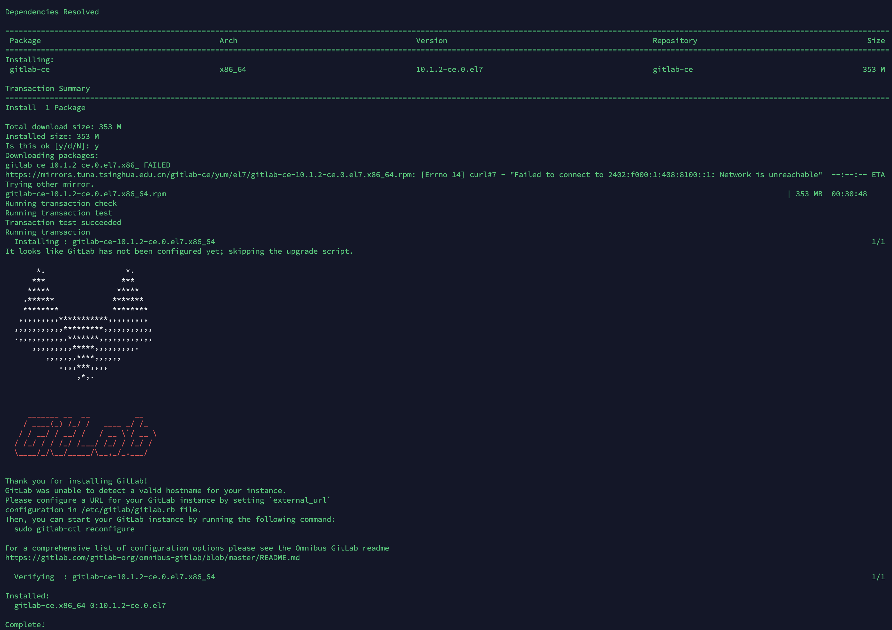

# Gitlab 安装

这里需要安装 10.1.2 版本的 Gitlab，并把数据导入到里面，之后在这里测试 Gitlab 的升级。


## 安装

添加 repo，名为 `/etc/yum.repos.d/gitlab-ce.repo`

```
[gitlab-ce]
name=Gitlab CE Repository
baseurl=https://mirrors.tuna.tsinghua.edu.cn/gitlab-ce/yum/el$releasever/
gpgcheck=0
enabled=1
```

安装 10.1.2 版本的 gitlab：

```bash
$ sudo yum makecache
$ sudo yum install gitlab-ce-10.1.2-ce.0.el7.x86_64
```

安装结果：




## 修改配置

配置文件是 `/etc/gitlab/gitlab.rb`  。

 `external_url` 要确保为正确的ip或者域名，git的链接才正常。 之后就可以通过浏览器访问了，默认是用80端口。

修改备份目录为 `/data1/gitlab/git-backups` 。

修改数据储存目录为 `/data1/gitlab/git-data` 。

全部修改的配置如下：

```properties
external_url 'http://10.28.30.17:10000'
gitlab_rails['backup_path'] = "/data1/gitlab/git-backups"
gitlab_rails['backup_archive_permissions'] = 0644
gitlab_rails['backup_keep_time'] = 604800
git_data_dirs({ "default" => { "path" => "/data1/gitlab/git-data" } })
gitlab_rails['gitlab_shell_ssh_port'] = 51668
```

604800 秒是 7 天。

然后执行命令。

```bash
$ sudo gitlab-ctl reconfigure
```

这个命令要执行一段时间。这个命令会把配置保存到 `/var/opt/gitlab` 目录中。


## 目录说明

- `/opt/gitlab` 保存 Gitlab 自身的代码和依赖

- `/var/opt/gitlab` 保存了 `gitlab-ctl reconfigure` 最终写入的配置，

- `/etc/gitlab` 保存了可以人肉编辑的配置和证书。

- `/var/log/gitlab` 保存了 gitlab 的日志。


## 启动

第一次查看状态：

```bash
$ sudo gitlab-ctl status
```

发现各组件都已经启动了。。。。

这里再启动一下保险：

```bash
$ sudo gitlab-ctl start
```

其他命令：

```bash
gitlab-ctl stop
# Restart all GitLab components
gitlab-ctl restart
gitlab-ctl restart sidekiq
# start a Rails console for GitLab
gitlab-rails console
```

查看数据目录发现已经有数据了，备份数据目录还没有数据：

```bash
$ sudo ls /data1/gitlab/git-data/
$ sudo ls /data1/gitlab/git-backups/
```


## 创建备份

上面已经制定了备份的目录和保存时间，下面来创建备份：

```bash
$ sudo gitlab-rake gitlab:backup:create
```

再次查看备份目录已经有东西了：

```bash
$ sudo ls /data1/gitlab/git-backups/
```

上面只是保存了 Gitlab 中的数据，即 Gitlab 中的用户、代码数据，但是没有保存 Gitlab 的配置。下面的脚本用来打包配置：

```bash
$ sudo sh -c 'umask 0077; tar -cf $(date "+etc-gitlab-%s.tar") -C / etc/gitlab'
```

亲测可行，解包验证：

```bash
$ sudo tar xvf etc-gitlab-1586852672.tar
```

自动备份：

```
#通过crontab使用备份命令实现自动备份:
0 2 * * * /opt/gitlab/bin/gitlab-rake gitlab:backup:create
```

备份脚本 `/data1/gitlab/git-backups/backup_gitlab.sh` ：

```bash
#!/bin/bash
#backuping gitlab configurations
back_dir='/data1/gitlab/git-backups/'

date=`date +'%F-%T'`
cd $back_dir
sh -c 'umask 0077; tar -cf $(date "+etc-gitlab-%s.tar") -C / etc/gitlab'
#backup gitlab data & delete old files
/bin/gitlab-rake gitlab:backup:create
find $back_dir -name "*.tar" -mtime +7 | xargs rm -f
#rsync to zfs server
rsync -a --delete --password-file=/root/rsyncd.passwd $back_dir gitlab@10.28.72.16::gitlab
echo "`date +%F-%T` rsync done" >> rsync_gitlab.log
```

这个脚本自动备份配置和数据，并且会自动删除7天前的旧备份。

**rsync命令**是一个远程数据同步工具，可通过LAN/WAN快速同步多台主机间的文件,这个算法只传送两个文件的不同部分，而不是每次都整份传送，因此速度相当快。。

rsync：

- -a 归档模式，表示以递归方式传输文件，并保持所有文件属性。
- --delete 删除那些目标中有，但是源地址中没有的文件。
- --password-file 从FILE中得到密码。

另外这里使用双冒号的原因是：从本地机器拷贝文件到远程rsync服务器中！

最后记录日志。

编辑 `/etc/crontab` 设置定时任务：

```
0 0 * * * root /data1/gitlab/git-backups/backup_gitlab.sh > /dev/null 2>&1
```

这样就实现了每日凌晨0:00 进行全量备份(数据&配置文件),数据保存最近7天,配置文件保存最近7天;


## 修改 root 密码

执行：

```bash
$ sudo gitlab-rails console production
```

依次输入：

```
 user = User.where(id: 1).first
 user.password="root:bbdyw@123"
 user.password_confirmation="root:bbdyw@123"
 user.save!
 quit
```


## 迁移 & 恢复

迁移只比恢复多了一步，就是把数据复制过来。

复制数据时注意，别复制太大的数据，生产环境要小心！！！这里略过复制。

恢复数据：

```bash
$ sudo gitlab-ctl stop unicorn
$ sudo gitlab-ctl stop sidekiq
$ sudo gitlab-rake gitlab:backup:restore BACKUP=1586804022_2020_04_14_10.1.2
$ sudo gitlab-ctl start
```


