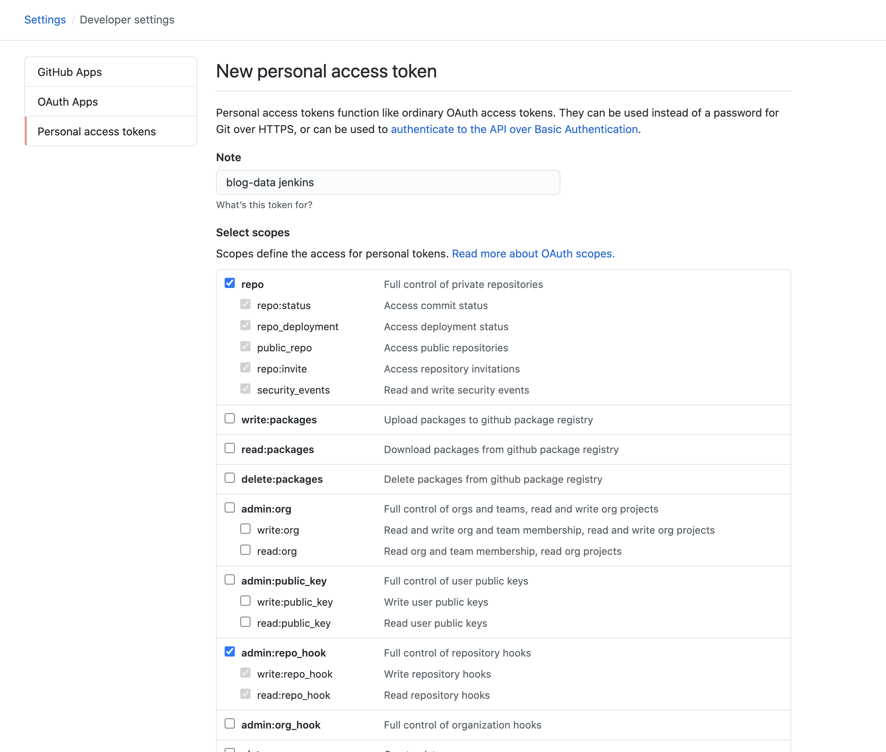
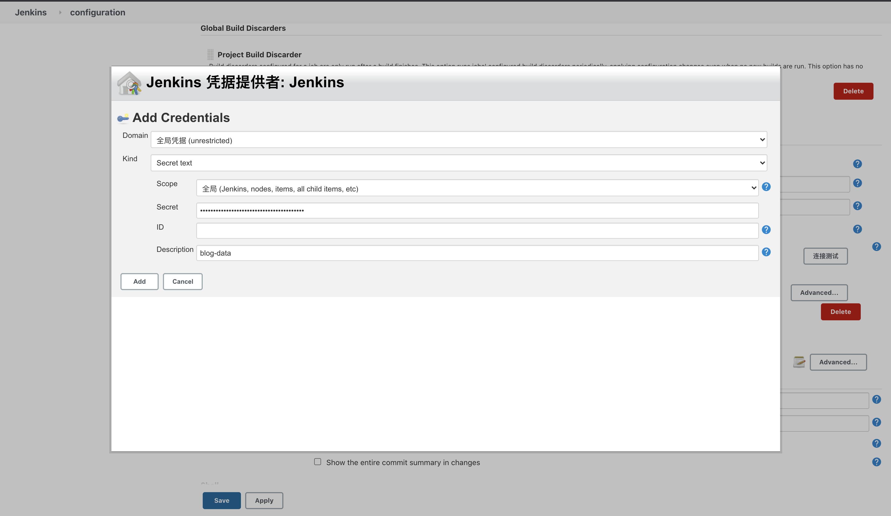
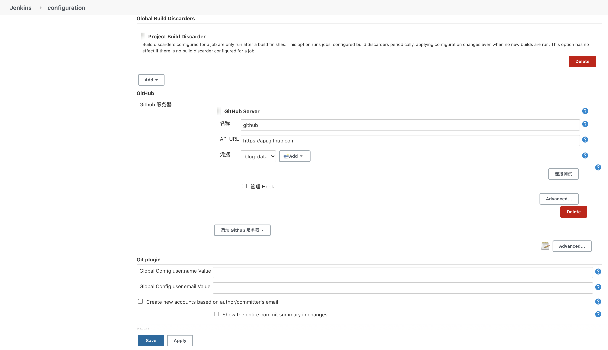
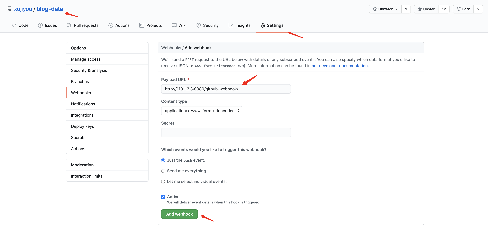
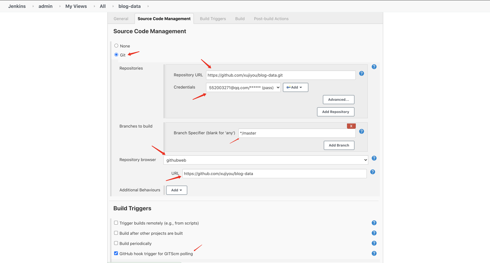
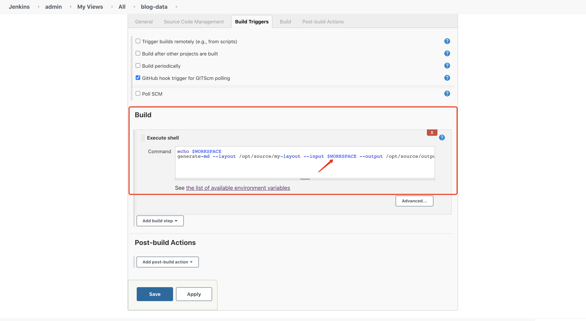

# Git 提交触发 Jenkins 自动构建

在 Jenkins 中，需要安装 Gihub 插件，这里安装过程略过，配置好代理还是很好下载的。


## 获取 GitHub 的 Personal access token

在 Github 的 Setting -> Developer settings -> Personal access tokens 中，点击 Generate new token 按钮，然后配置如下：



然后点击下面的按钮生成一个 Token，记住这个 Token，比如：228805e1c15e81ecc6107220db7b94fcaaf28ab3

**一定要保存，后面就看不到了**


## 配置 Jenkins

在  Manage Jenkins -> Configure System 中配置 Github。如下：





我这里在使用连接测试时，报错说连不上，一气之前就不用 Secret Text 了，而是用的 Username and Password。


## 在 GIthub 项目中配置 webhook

在 Github 中，做出如下配置：



注意这里的 url 要是一个公网地址。

http://118.1.2.3:8080/github-webhook/ 是一个固定的格式，替换 ip 地址即可。


## 在 Jenkins 中添加项目

在创建项目时 github 库的配置如下：



当遇到 push 时，执行以下命令：



这里要注意命令是不是在 Jenkins 的 PATH 中，可以在 Jenkins 中设置 PATH 的环境变量，将命令加入进去。这个 WORKSPACE 就是 Jenkins 下载到本地的代码地址。

```
echo $WORKSPACE
generate-md --layout /opt/blog/my-layout --input $WORKSPACE --output /opt/blog/output
```

默认 $WORKSPACE 是 `/var/lib/jenkins/workspace/`


---


