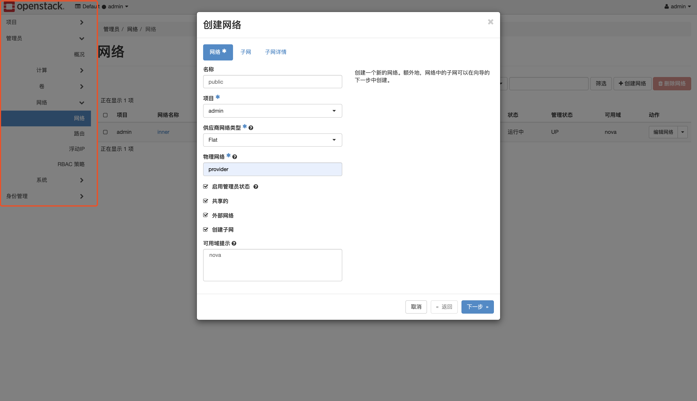
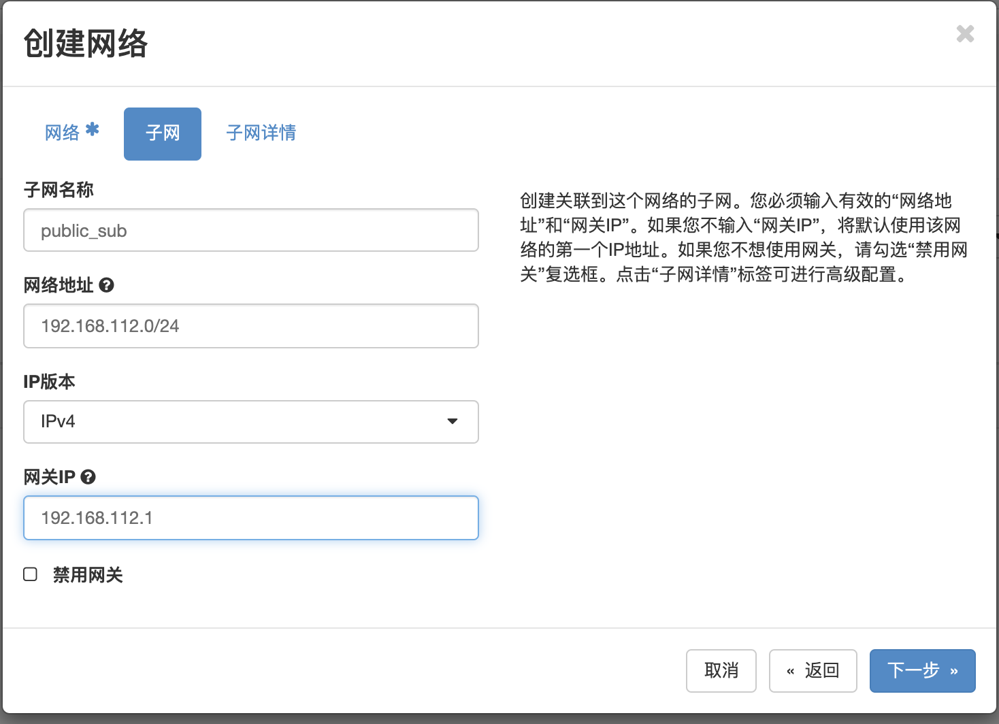
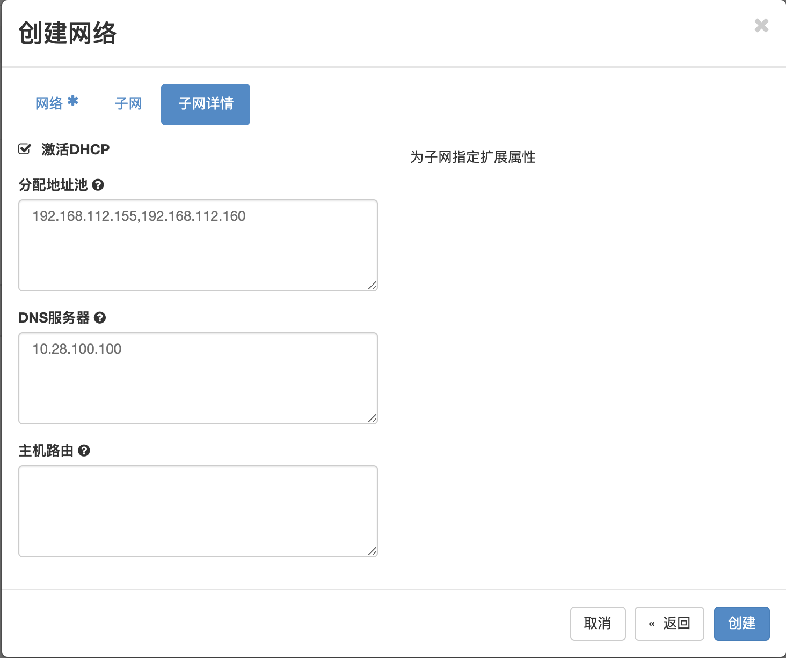

在  [OpenStack安装教程.md](OpenStack安装教程.md) 已经配置了一个比较简单的网络，主机已经可以跑起来了，但是还不能和外部联网。这节来改一下网络结构，让外部可以连接虚拟机。

Neutron 安装教程：https://docs.openstack.org/neutron/ussuri/install/controller-install-rdo.html#neutron-controller-metadata-agent-rdo

上一节图简单选择了选项一，这一节改为选项二。

我的宿主机的网卡名叫 ens192 。


## 清理网络

查看子网列表：

```bash
$ openstack subnet list
```

然后删掉利用了这个子网中IP的虚拟机实例，再删除子网：

```bash
$ openstack subnet delete provider
```

再查看网络：

```bash
$ openstack network list
```

删掉网络：

```bash
$ openstack network delete provider
```


## 控制节点修改配置

按照 https://docs.openstack.org/neutron/ussuri/install/controller-install-option2-rdo.html 来配置

修改控制节点的 `/etc/neutron/neutron.conf`:

```
[DEFAULT]
service_plugins = router
allow_overlapping_ips = true
```

在 `/etc/neutron/plugins/ml2/ml2_conf.ini` 中修改：

```
[ml2]

type_drivers = flat,vlan,vxlan
tenant_network_types = vxlan
mechanism_drivers = linuxbridge,l2population
extension_drivers = port_security

[ml2_type_vxlan]
vni_ranges = 1:1000

[ml2_type_flat]
flat_networks = provider

[securitygroup]
enable_ipset = true
```

修改`/etc/neutron/plugins/ml2/linuxbridge_agent.ini` :

```
[linux_bridge]
physical_interface_mappings = provider:ens192

[vxlan]
enable_vxlan = true
local_ip = 192.168.112.152
l2_population = true

[securitygroup]
enable_security_group = true
firewall_driver = neutron.agent.linux.iptables_firewall.IptablesFirewallDriver
```

修改 `/etc/neutron/l3_agent.ini` :

```
interface_driver = linuxbridge
```


重新配置：

```bash
$ ln -s /etc/neutron/plugins/ml2/ml2_conf.ini /etc/neutron/plugin.ini
$ su -s /bin/sh -c "neutron-db-manage --config-file /etc/neutron/neutron.conf \
  --config-file /etc/neutron/plugins/ml2/ml2_conf.ini upgrade head" neutron
```


## 控制节点重启

```bash
$ systemctl restart openstack-nova-api.service
$ systemctl restart neutron-server.service \
    neutron-linuxbridge-agent.service neutron-dhcp-agent.service \
    neutron-metadata-agent.service
```


```bash
$ systemctl enable neutron-l3-agent.service
$ systemctl start neutron-l3-agent.service
```


## 计算节点修改配置

修改 `/etc/neutron/plugins/ml2/linuxbridge_agent.ini` ：

```toml
[linux_bridge]
physical_interface_mappings = provider:ens192

[vxlan]
enable_vxlan = true
local_ip = 192.168.112.154
l2_population = true

[securitygroup]
enable_security_group = true
firewall_driver = neutron.agent.linux.iptables_firewall.IptablesFirewallDriver
```


## 计算节点重启

```
$ systemctl restart neutron-linuxbridge-agent.service
$ systemctl restart openstack-nova-compute.service
```


## 创建网络


#### 先创建一个外部网络

注意这里的**物理网络**要和 `/etc/neutron/plugins/ml2/ml2_conf.ini` 中的 `flat_networks` 一致



然后是子网：



子网详情：




####  内部网络

内部网络创建比较简单