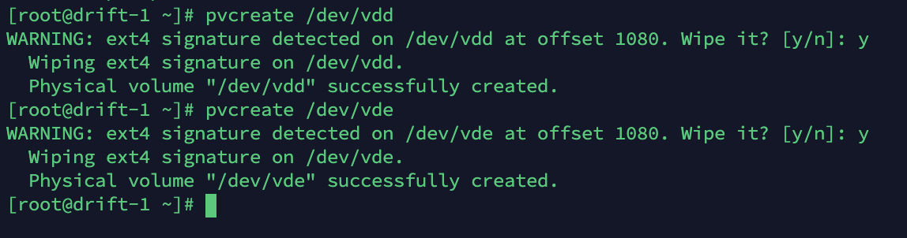
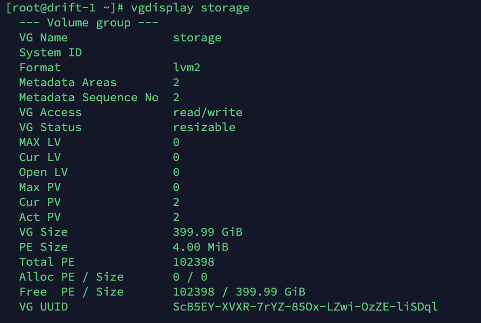
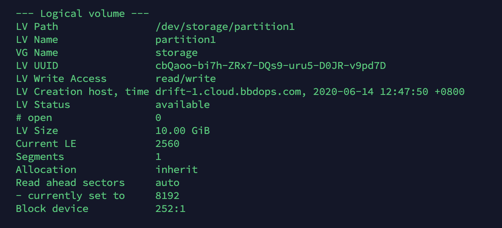
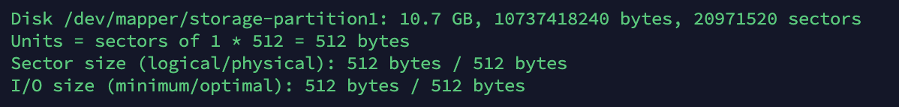

# LVM 实践

LVM是一种对于硬盘分区管理的一种机制，它可以允许用户对硬盘资源进行动态分配，解决硬盘设备在创建分区后不易修改分区大小的缺陷。

LVM技术的实质是在硬盘分区和文件系统之间添加了一个逻辑层，它可以将多块硬盘集合成一个卷组，可以理解成为将多块硬盘进行融合，组成一个更大的硬盘，这样用户就不必担心硬盘底层的架构和布局，直接在逻辑层上操作就可以。


#### 1. 将两块硬盘添加 LVM 资源池中

首先添加两个物理卷，我这里的磁盘为 /dev/vdd 和 /dev/vde

```bash
$ pvcreate /dev/sdd
$ pvcreate /dev/vde
```




#### 2. 创建新的卷组，将两块硬盘添加到卷组中，然后查看卷组状态：

```bash
$ vgcreate storage /dev/vdd
$ vgextend storage  /dev/vde
```

也可以使用 vgcreate 一次性使用多块硬盘，比如 `vgcreate storage /dev/vdd /dev/vde`


#### 3. 查看卷组：

```bash
$ vgdisplay storage
```




#### 4. 切割逻辑卷

切割逻辑卷时一共有两个计量参数：

-L 是直接制定容量，基础单位是MB，如果要切割出1G空间，则 -L 1G，MB以此类推。

-l 是以基本单元的个数为单位，每个基本单元的大小是4MB，-l 20，则是切割出4*20=80M空间。

-n 是指定生成逻辑卷的名称。

在卷组中切割出一个：名称为partition1，大小为10G的空间：

```bash
$ lvcreate -n partition1 -L 10G storage
```


#### 5. 查看逻辑卷，使用命令 `lvdisplay`



使用 `fdisk -l` 查看：




#### 6. 挂载使用

将切割好的逻辑卷格式化，并挂载才能使用。

LVM中的逻辑卷设备存放在/dev目录中，同时以卷组的名字建立文件夹，这个文件夹中保存了逻辑卷的设备映射文件（/dev/卷组名称/逻辑卷名称）

格式化：

```bash
$ mkfs.ext4 /dev/storage/partition1
```

挂载：

```bash
$ mkdir /data1
$ mount /dev/storage/partition1 /data1
```

可以使用 `/etc/fstab` 弄成开机挂载。


#### 7. 扩展逻辑卷

```bash
$ umount /dev/storage/partition1 #解除挂载
$ lvextend -L 15G /dev/storage/partition1 #扩展后的分区容量，这个容量必须大于原容量
$ e2fsck -f /dev/storage/partition #检查硬盘的完整性
$ resize2fs /dev/storage/partition1 #重置硬盘容量
```


#### 8. 缩小逻辑卷

注意事项：对逻辑卷进行缩容操作时，要先检查文件系统的完整性，以保证数据安全

```bash
$ lvreduce -L 10G /dev/storage/partition1
```


#### 9. 卷快照

类似于虚拟机软件的还原时间点功能，有以下两个特点：

① 快照卷的容量必须等同于逻辑卷的容量

② 快照卷仅一次有效，一旦执行还原操作之后则会被立即自动删除

重新挂载，并写入一些数据：

```bash
$ mkfs.ext4 /dev/storage/partition1
$ mount /dev/storage/partition1 /data1
$ echo "hello world" >> /data1/hello.txt
```

创建一个逻辑卷，用于存放快照，注意这里要和 /dev/storage/partition1 一样的容量：

```bash
$ lvcreate -L 15G -s -n SNAP /dev/storage/partition1 #为partition1创建快照卷SNAP -s参数是指生成的快照卷
```

先删除数据，再解除挂载：

```bash
$ rm /data1/hello.txt
$ umount /dev/storage/partition1
```

恢复快照：

```bash
$ lvconvert --merge /dev/storage/SNAP
```

快照恢复后，再使用 `lvdisplay` 查看 LVM，发现刚才的 SNAP 消失了。

重新挂载并查看数据：

```bash
$ mount /dev/storage/partition1 /data1
$ cat /data1/hello.txt
```


#### 10. 删除 && 卸载

先删除逻辑卷，使用 `lvdisplay` 查看有哪些逻辑卷，然后删除：

```bash
$ umount /dev/storage/partition1
$ lvremove /dev/storage/partition1
```

如果前面修改了 `/etc/fstab`，需要删除 `/etc/fstab` 中的自动挂载信息。

然后删除卷组，使用 `vgdisplay` 查看有哪些卷组，然后删除：

```bash
$ vgremove storage
```

最后删除物理卷，使用 `pvdisplay` 查看有哪些物理卷，然后删除：

```
$ pvremove /dev/vdd
$ pvremove /dev/vde
```

然后就可以拔掉硬盘了。


## LVM 中的各种概念

**LVM**（Logical Volume Manager），即逻辑卷管理，它是Linux环境下对磁盘分区进行管理的一种机制。

**PV** (physical volume)：物理卷在逻辑卷管理系统最底层，可为整个物理硬盘或实际物理硬盘上的分区。它只是在物理分区中划出了一个特殊的区域，用于记载与LVM相关的管理参数。

**VG** (volume group)：卷组建立在物理卷上，一卷组中至少要包括一物理卷，卷组建立后可动态的添加卷到卷组中，一个逻辑卷管理系统工程中可有多个卷组。

**LV** (logical volume)：逻辑卷建立在卷组基础上，卷组中未分配空间可用于建立新的逻辑卷，逻辑卷建立后可以动态扩展和缩小空间。

**PE** (physical extent)：物理区域是物理卷中可用于分配的最小存储单元，物理区域大小在建立卷组时指定，一旦确定不能更改，同一卷组所有物理卷的物理区域大小需一致，新的pv加入到vg后，pe的大小自动更改为vg中定义的pe大小。所以一个PE的大小就决定了逻辑卷的最大容量，4 MB(默认) 的PE决定了单个逻辑卷最大容量为 256 GB，若希望使用大于256G的逻辑卷，则创建卷组时需要指定更大的PE。在Red Hat Enterprise Linux AS 4中PE大小范围为8 KB 到 16GB，并且必须总是 2 的倍数。

**LE** (logical extent)：逻辑区域是逻辑卷中可用于分配的最小存储单元，逻辑区域的大小取决于逻辑卷所在卷组中的物理区域的大小。由于受内核限制的原因，一个逻辑卷（Logic Volume）最多只能包含65536个


#### LVM 工作原理

LVM在每个物理卷头部都维护了一个metadata，每个metadata中都包含了整个VG（volume group：卷组）的信息，包括每个VG的布局配置，PV（physical volume：物理卷）的编号，LV（logical volume：逻辑卷）的编号，以及每个PE（physical extends：物理扩展单元）到LE（logical extends：物理扩展单元）的映射关系。同一个VG中的每个PV头部的信息都是相同的，这样有利于故障时进行数据恢复。

LVM对上层文件系统提供LV层，隐藏了操作细节。对文件系统而言，对LV的操作与原先对partition的操作没有差别。当对LV进行写入操作的时候，LVM定位相应的LE，通过PV头部的映射表将数据写入到相应的PE上。LVM实现的关LVM最大的特点就是可以对磁盘进行动态管理。因为逻辑卷的大小是可以动态调整的，而且不会丢失现有的数据。我们如果新增加了硬盘，其也不会改变现有上层的逻辑卷。关键在于PE和LE之间建立映射关系，不同的映射规则决定了不同的LVM存储模型。LVM支持多个PV 的stripe和mirror。

LVM最大的特点就是可以对磁盘进行动态管理，因为逻辑卷的大小是可以动态调整的，而且不会丢失现有的数据，如果我们增加了硬盘也不会改变现有的上层逻辑卷。


#### LVM 优缺点

优点：
\- 文件系统可以跨多个磁盘，因此文件系统大小不会受物理磁盘的限制。
\- 可以在系统运行的状态下动态的扩展文件系统的大小。
\- 可以增加新的磁盘到LVM的存储池中。
\- 可以以镜像的方式冗余重要的数据到多个物理磁盘。
\- 可以方便的导出整个卷组到另外一台机器。

缺点：
\- 在从卷组中移除一个磁盘的时候必须使用reducevg命令（这个命令要求root权限，并且不允许在快照卷组中使用）。
\- 当卷组中的一个磁盘损坏时，整个卷组都会受到影响。
\- 因为加入了额外的操作，存贮性能受到影响。


