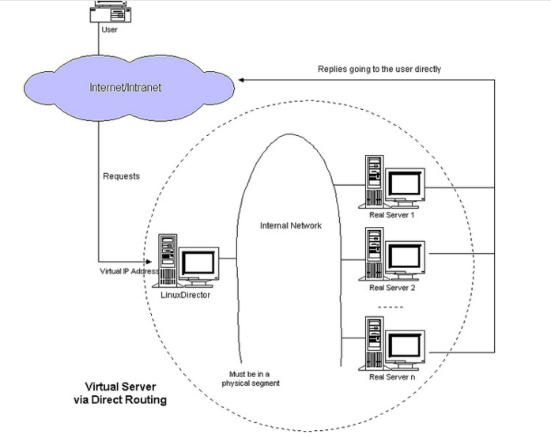
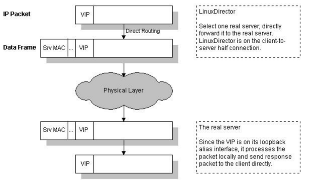
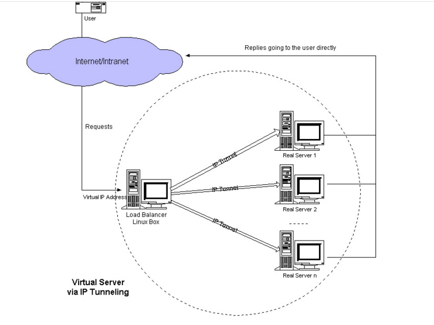
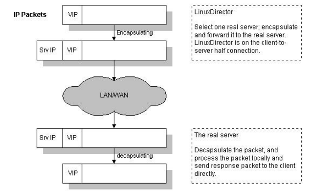
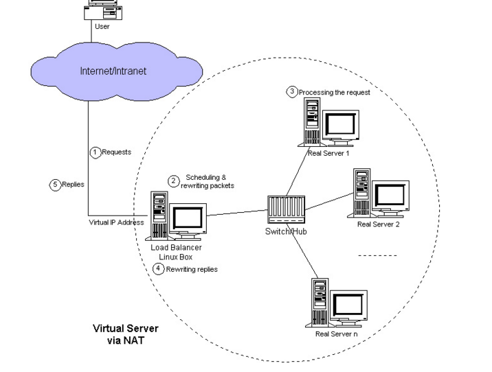

# LVS的三种模式

LVS 的三种模式如下：

1. DR模式：(Direct Routing)直接路由模式。
2. TUN模式：IP Tunneling（隧道）模式，和 VPN 类似。
3. NAT（网络地址转换）模式

术语：

- DS：Director Server。指的是前端负载均衡器节点。
- RS：Real Server。后端真实的工作服务器。
- VIP：向外部直接面向用户请求，作为用户请求的目标的IP地址。
- DIP：Director Server IP，主要用于和内部主机通讯的IP地址。
- RIP：Real Server IP，后端服务器的IP地址。
- CIP：Client IP，访问客户端的IP地址。

## DR模式：(Direct Routing)直接路由模式

DR模式的工作过程：

1、当一个client发送一个WEB请求到VIP，LVS服务器根据VIP选择对应的real-server，根据调度算法，在Pool中选择一台Real-server。

   LVS在hash表中记录该次连接，然后将client的请求包发给选择的Real-server，最后选择的Real-server把应答包直接传给client；

2、当client继续发包过来时，LVS根据刚才记录的hash表的信息，将属于此次连接的请求直接发到刚才选择的Real-server上；

3、当连接中止或者超时，hash表中的记录将被删除。

DR模式的几个细节：

**1、DR和RS必须在相同的网段；**

**2、DR模式在转发client的包时，只修改了包目的MAC地址为选定的Real-server的mac地址，**

   **如果LVS和Real-server在不同的广播域内，那么Real-server就没办法接收到转发的包。**

**3、DR上必须开启路由转发功能；**

**4、RS的网关不需要设置成DR（和NAT模式的区别）。**

**5、RS上需要禁用ARP通告，这样，RS就会直接回复客户端，而不是通过DR。**

下面是mac地址的修改过程：

## TUN: IP Tunneling（隧道）模式

IP Tunneling的工作过程

1. client 发送请求包到LVS服务器的VIP上。

2. VIP按照算法选择后端的一个Real-server，并将记录一条消息到hash表中，然后将client的请求包封装到一个新的IP包里，新IP包的目的IP是Real-server的IP，然后转发给Real-server。

3. Real-server收到包后，解封装，取出client的请求包，发现他的目的地址是VIP，而Real-server发现在自己的lo:0口上有这个IP地址，于是处理client的请求，然后将relpy这个request包直接发给client。

4. 该client的后面的request包，LVS直接按照hash表中的记录直接转发给Real-server，当传输完毕或者连接超时，那么将删除hash表中的记录。

IP Tunneling的几个细节问题

IP封包的过程：(如图)

IP Tunneling的几个细节问题

IP封包的过程：DR和RS不需要在一个网段，所以适用于跨机房的场景。

由于通过IP Tunneling 封装后，封装后的IP包的目的地址为Real-server的IP地址，那么只要Real-server的地址能路由可达，Real-server在什么网络里都可以，这样可以减少对于公网IP地址的消耗，但是因为要处理IP Tunneling封装和解封装的开销，那么效率不如DR模式。

Real-server的系统设置：

由于需要Real-server支持IP Tunneling，所以设置与DR模式不太一样，LVS不需要设置tunl设备，LVS本身可以进行封装 ， 需要配置VIP在tunl设备上。

ARP问题：

如果LVS和Real-server不在一个网络内，不需要处理ARP问题，如果在相同网络，那么处理方法和DR模式一样，但是如果一样，那么你的方案就错了，因为此时DR模式完全可以满足你的需求，而且更加高效。

内核的包转发：

IP Tunneling模式不需要LVS开启ip_forward功能。

## NAT（网络地址转换）模式

NAT模式的工作过程:

1. client发送request到LVS的VIP上，VIP选择一个Real-server，并记录连接信息到hash表中，然后修改client的request的目的IP地址为Real-server的地址，将请求发给Real-server;

2. Real-server收到request包后，发现目的IP是自己的IP，于是处理请求，然后发送reply给LVS;

3. LVS收到reply包后，修改reply包的的源地址为VIP，发送给client;

4. 从client来的属于本次连接的包，查hash表，然后发给对应的Real-server。

5. 当client发送完毕，此次连接结束或者连接超时，那么LVS自动从hash表中删除此条记录。

NAT模式的几个细节问题

1、后端RS和DS在同一个网络环境中，且RS的网关必须设定为DS；

2、NAT的初衷就是为了隐藏内部IP和节省公网IP

3、开启路由转发功能

## 总结-三种模式的适用场景及局限性

| **模式** | **适用场景**                                                 | **瓶颈或局限性**                                             |
| -------- | ------------------------------------------------------------ | ------------------------------------------------------------ |
| NAT      | 1、公网IP少2、需要隐藏内部IP（比如游戏的登录服务器）         | 1、DS需要承担所有转发功能，所以瓶颈在DS上                    |
| DR       | 1、为了解决NAT模式的瓶颈，DR模式采用二层帧重写，提高效率     | 1、DS承担二层帧重写工作，当规模非常大时，DS会有瓶颈，但是如果DS足够强劲，问题不是很大。2、由于DR模式是通过重写二层帧的方式，所以DS和DS必须在同一网络内，所以DR模式下无法跨网段。 |
| TUNL     | 1、为了解决DR模式无法跨网段的问题，DR采用IP层二次封装模式进行解决 | 1、因为DS需要进行IP层二次封装，所以会牺牲效率                |

