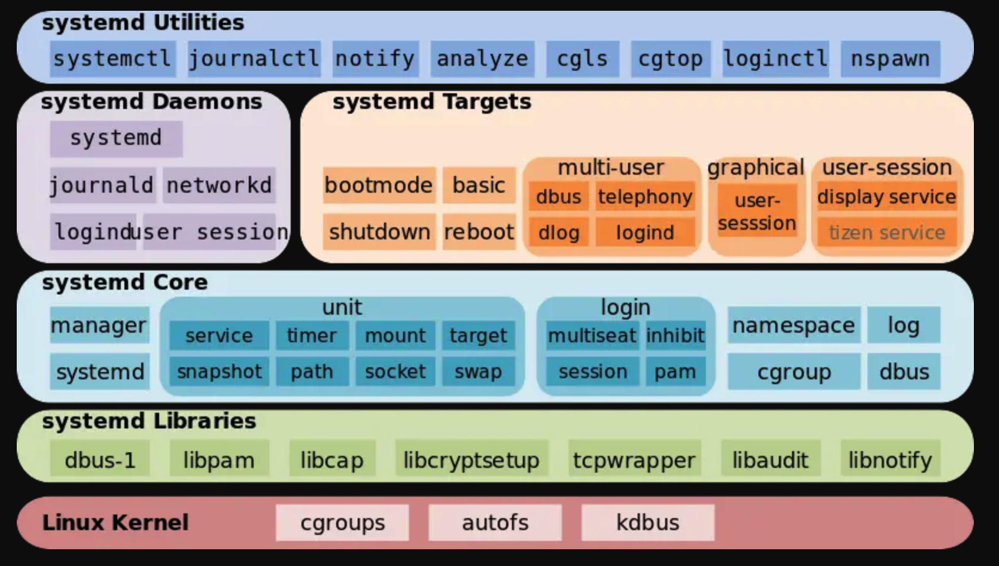
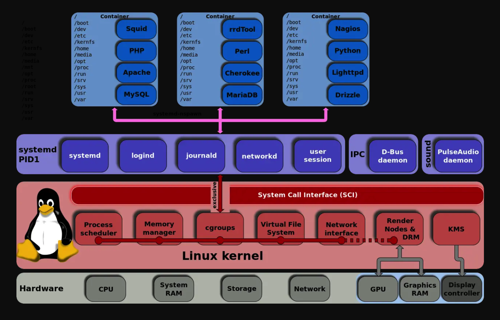

# Systemd 详解

Systemd 官方文档：https://systemd.io/


systemd 是一个 Linux 系统基础组件的集合，提供了一个系统和服务管理器，运行为 PID 1 并负责启动其它程序。功能包括：

- 支持并行化任务；
- 同时采用 socket 式与 [D-Bus](https://wiki.archlinux.org/index.php/D-Bus_(简体中文)) 总线式激活服务；
- 按需启动守护进程（daemon）；
- 利用 Linux 的 [cgroups](https://wiki.archlinux.org/index.php/Cgroups) 监视进程；
- 支持快照和系统恢复；
- 维护挂载点和自动挂载点；
- 各服务间基于依赖关系进行精密控制。
- systemd* 支持 SysV 和 LSB 初始脚本，可以替代 sysvinit。
- 除此之外，功能还包括日志进程、控制基础系统配置，维护登陆用户列表以及系统账户、运行时目录和设置，可以运行容器和虚拟机，可以简单的管理网络配置、网络时间同步、日志转发和名称解析等。


Systemd 被许多人记恨，原因就是不符合 Linux 精神，管的太多，甚至在某些方面借鉴 windows、osx 等闭源系统，比如 unit 配置文件就是 windows 的 ini 格式的。


## Linux 启动过程

Linux 从按下电源键到进入用户交互界面整个启动流程大致可以分为四个阶段：

- BIOS 阶段
- BootLoader 阶段
- kernel 加载阶段
- init：systemd/sysvinit 初始化阶段


#### BIOS/EFI 阶段

BIOS 想必大家都熟悉，也就是做一些基本的硬件自检准备以及加载 bootloader 程序。在按下电源电源键（冷启动）后， CPU 的程序计数器被初始化为一个特定的內存地址，存储在只读存储器（ROM）中的 BIOS 就是从这个特定的內存地址开始执行。**所以没有 CPU 是无法启动主板上的 BIOS 的** 。

BIOS 启动后就开始执行硬件的基本初始化也称之为（POST: 上电自检），并根据引导设备的优先级将系统控制权交给硬件启动项（比如硬盘/网络/U盘等）。也就是我们 BIOS 上的启动菜单，这一步是可以被打断的。当我们按下 F12 或者 ESC 键（根据主板芯片组而异）就会弹出选择启动项的界面，而且这些按键高度依赖硬件。

BIOS 选择好硬件启动项之后就开始执行硬件设备上的初级引导程序代码，对于 MBR 硬盘来讲是最开始的一个扇区（512字节）將被加载到內存，並执行行其中的初始化代码来加载下一阶段的 Bootloader 。

可以使用 dd 命令读取 MBR 里的内容 `dd if=/dev/sda of=mbr.bin bs=512 count=1`

使用 od 命令来查看 `od -xa mbr.bin`


#### BootLoader 阶段

主引导记录加载完 Bootloader（主要为GRUB）到 RAM 中之后，GRUB 会根据需求显示一个可用的内核列表（定义在/etc/grub.conf，以及/etc/grub/menu.lst和/etc/grub.conf的软连接）。根据 GRUB 的配置加载默认内核镜像和 initrd 镜像到内存中，当所有镜像准备好后，即跳转到内核镜像。


#### kernel 阶段

BootLoader 阶段完成之后内核镜像加载到内存中，系统的控制权就交给内核镜像，由此内核阶段开始了。内核镜像不是一个可以执行的内核，而是一个被压缩的内核镜像 （zImage 或 bzImage）。在内核镜像的头部有一个小型程序 routine ，其做少量的硬件设置，然后自解压压缩的内核镜像并放到高端内存。如果存在初始磁盘镜像（initrd），routine 将拷贝 initrd 以供稍后安装使用，然后 routine 将调用内核开始内核启动。


#### init 初始化阶段

一旦内核自解压完成，启动并初始化后，内核启动第一个**用户空间应用程序**，即 systemd 进程（其是老式 System V 系统的 init 程序的替代品)，并转移控制权到 systemd。这是调用的第一个使用标准 C 库编译的程序，在此进程之前，还没有执行任何标准的 C 应用程序。至此整个系统引导过程的结束，kernel和 systemd 处于运行状态，接下来就由 systemd 来启动各项程序。

从 dmesg 的输出日志我们可以看到，直到 2.516258 秒才开始执行 `/sbin/init` 命令，而对于采用 systemd 的发行版来说，`/sbin/init` 是指向 `/sbin/init -> /lib/systemd/systemd` ，的链接文件，实际上就是在启动 systemd 。


## systemd 体系结构



- 最底层：systemd 内核层面依赖 cgroup、autofs、kdbus
- 第二层：systemd libraries 是 systemd 依赖库
- 第三层：systemd Core 是 systemd 自己的库
- 第四层：systemd daemons 以及 targets 是自带的一些基本 unit、target，类似于 sysvinit 中自带的脚本
- 最上层就是和 systemd 交互的一些工具




## unit

systemd 将各种系统启动和运行相关的对象， 表示为各种不同类型的单元`unit`， 并提供了 处理不同单元之间依赖关系的能力。

| type           | name       | 作用                                                         |
| :------------- | :--------- | :----------------------------------------------------------- |
| Service unit   | .service   | 用于封装一个后台服务进程                                     |
| Target unit    | .target    | 用于将多个单元在逻辑上组合在一起。                           |
| Device unit    | .device    | 用于定义内核识别的设备，在 sysfs(5) 里面作为 udev(7) 设备树展示 |
| Socket unit    | .socket    | 用于标识进程间通信用到的socket文件                           |
| Snapshot unit  | .snapshot  | 管理系统快照                                                 |
| Swap unit      | .swap      | 用于标识swap 文件或设备                                      |
| Mount unit     | .mount     | 用于封装一个文件系统挂载点(也向后兼容传统的 /etc/fstab 文件) |
| Automount unit | .automount | 用于封装一个文件系统自动挂载点                               |
| Path unit      | .path      | 用于根据文件系统上特定对象的变化来启动其他服务。             |
| Time unit      | .timer     | 用于封装一个基于时间触发的动作。取代传统的 crond 等任务计划服务 |
| Slice unit     | *.slice    | 用于控制特定 CGroup 内所有进程的总体资源占用。               |

查看当前系统的 unit 列表：

```bash
$ systemctl list-units 
$ systemctl list-units --failed # 运行失败的 unit
$ systemctl list-units --type=service # 类型为 service 的
```

需要注意的是 systemd 只在内存中加载最小化的一组单元。 只有至少满足下列条件之一的单元，才会被加载到内存中：

- 处于 活动(active)、启动中(activating)、停止中(deactivating)、失败(failed) 状态之一(也就是停止(inactive)之外的状态)
- 至少有一个作业正在作业队列中
- 至少有一个其他已经加载到内存中的单元依赖于它
- 仍然占有某些资源 (例如一个已停止的服务单元的进程忽略了终止请求，仍在逗留)
- 被 D-Bus 调用以程序化的方式固定到了内存中

> 只要有需要，systemd 就会自动从磁盘加载所需的单元。 因此实际上用户并不能显而易见的看到某个单元是否已被加载到内存。 使用 **systemctl list-units –all** 命令可以显示当前已加载到内存中的所有单元。 不满足加载条件(见上文)的单元会被立即从内存中卸载，并且它的记帐数据(accounting data)也会被清空。 不过，因为每当一个单元关闭时，都会生成一条日志记录声明该单元所消耗的资源， 所以这些数据通常不会彻底消失。


## 运行级别

Linux 运行级别是 sysvinit 中的概念，在 systemd 中，运行级别得到了替换。

运行级别如下：

- 0 停机，关机
- 1 单用户，无网络连接，不运行守护进程，不允许非超级用户登录
- 2 多用户，无网络连接，不运行守护进程
- 3 多用户，正常启动系统
- 4 用户自定义
- 5 多用户，带图形界面
- 6 重启

在 systemd 中，运行级别被 target 替换了：

```bash
$ ls -al /usr/lib/systemd/system/runlevel*.target
lrwxrwxrwx. 1 root root 15 Jul 21 22:57 /usr/lib/systemd/system/runlevel0.target -> poweroff.target
lrwxrwxrwx. 1 root root 13 Jul 21 22:57 /usr/lib/systemd/system/runlevel1.target -> rescue.target
lrwxrwxrwx. 1 root root 17 Jul 21 22:57 /usr/lib/systemd/system/runlevel2.target -> multi-user.target
lrwxrwxrwx. 1 root root 17 Jul 21 22:57 /usr/lib/systemd/system/runlevel3.target -> multi-user.target
lrwxrwxrwx. 1 root root 17 Jul 21 22:57 /usr/lib/systemd/system/runlevel4.target -> multi-user.target
lrwxrwxrwx. 1 root root 16 Jul 21 22:57 /usr/lib/systemd/system/runlevel5.target -> graphical.target
lrwxrwxrwx. 1 root root 13 Jul 21 22:57 /usr/lib/systemd/system/runlevel6.target -> reboot.target
```

默认级别：

```bash
$ ls -al /etc/systemd/system/default.target
lrwxrwxrwx. 1 root root 37 Sep 14 12:42 /etc/systemd/system/default.target -> /lib/systemd/system/multi-user.target
```

切换运行级别：

```bash
$ systemctl isolate runlevel3.target
```


## systemd-logind

Linux 系统的登录系统也被 systemd 控制了。`/usr/lib/systemd/system/systemd-logind.service` 是服务文件，`/usr/lib/systemd/systemd-logind` 是启动命令。

查看状态：

```bash
$ systemctl status systemd-logind
$ loginctl list-sessions #列出当前session 
$ loginctl list-users #列出当前登录用户 
```

**systemd-logind** 是一个管理用户登录的系统服务。 其职责如下：

- 持续跟踪用户的会话、进程、空闲状态。 这将在 `user.slice` 之下，为每个用户分配一个 slice 单元、为每个用户的当前会话分配一个 scope 单元。 同时，针对每个已登录的用户，将会启动一个专属的服务管理器(作为 `user@.service` 模版的一个实例)。
- 生成并管理"session ID"。如果启用了审计并且已经为一个会话设置了审计"session ID"， 那么该ID也将同时被用作"session ID"， 否则将会使用一个独立的会话计数器(也就是独立生成一个"session ID")。
- 为用户的特权操作(例如关闭或休眠系统) 提供基于 [polkit](https://www.freedesktop.org/wiki/Software/polkit) 的认证与授权
- 为应用程序实现 阻止关闭/休眠系统的逻辑
- 处理 硬件关机/休眠按钮的动作
- 多席位(Multi-Seat)管理
- 会话切换管理
- 管理 用户对设备的访问
- 在启动虚拟终端时 自动启动文本登录程序(agetty)， 并管理用户的运行时目录。


## 挂载

`systemd-mount` 用于创建并启动一个临时`.mount`或`.automount` 单元，也就是将`What`（比如 What=tmpfs）文件系统挂载到 `Where` （比如 Where=/tmp）目录。

`systemd-mount` 在功能上与传统的`mount` 命令很相似， 不同之处在于，`systemd-mount` 并不立即直接执行挂载操作，而是将挂载操作封装到一个临时的 `.mount`或`.automount`单元中，以接受 systemd 对各种单元的统一管理， 从而可以实现将挂载操作自动按照依赖关系排入任务队列、自动处理依赖关系、挂载前进行文件系统检查、按需自动挂载等好处。

在此之前，使用自动挂载的话，一般使用`autofs`来完成。但是`autofs`问题还是蛮多，现在有了`systemd-mount`之后，完全可以不用考虑`autofs`了。

查看挂载列表：

```bash
$ systemd-mount --list
```


## 配置

systemd 的配置文件是 `/etc/systemd/system.conf`，为了在使用 systemctl status 的时候显示 cpu、内存、task 数量可以添加如下配置：

```
[Manager]
DefaultCPUAccounting=yes
DefaultMemoryAccounting=yes
DefaultTasksAccounting=yes
```

然后运行 `systemctl daemon-reload` 使之生效。

systemd 使用的 CGroup 来实现的这一点。


## systemd 启动流程

下面的图表解释了 这些具有特定含义的 target 单元之间的依赖关系 以及各自在启动流程中的位置。图中的箭头表示了单元之间的依赖关系与先后顺序， 整个图表按照自上而下的时间顺序执行。

```
local-fs-pre.target
            |
            v
   (various mounts and   (various swap   (various cryptsetup
    fsck services...)     devices...)        devices...)       (various low-level   (various low-level
            |                  |                  |             services: udevd,     API VFS mounts:
            v                  v                  v             tmpfiles, random     mqueue, configfs,
     local-fs.target      swap.target     cryptsetup.target    seed, sysctl, ...)      debugfs, ...)
            |                  |                  |                    |                    |
            \__________________|_________________ | 
                                                 \|/
                                                  v
                                           sysinit.target
                                                  |
             
            /                  |                  |                    |                    \
            |                  |                  |                    |                    |
            v                  v                  |                    v                    v
        (various           (various               |                (various          rescue.service
       timers...)          paths...)              |               sockets...)               |
            |                  |                  |                    |                    v
            v                  v                  |                    v             *rescue.target
      timers.target      paths.target             |             sockets.target
            |                  |                  |                    |
            v                  \_________________ | 
                                                 \|/
                                                  v
                                            basic.target
                                                  |
             
            /                  |                  |                                         |
            |                  |                  |                                         v
            v                  v                  v                                *emergency.target
        display-        (various system    (various system
    manager.service         services           services)
            |             required for            |
            |            graphical UIs)           v
            |                  |          *multi-user.target
            |                  |                  |
            \_________________ | 
                              \|/
                               v
                  *graphical.target
```

systemd 执行的第一个目标是 **default.target**。但实际上 default.target 是指向 **graphical.target** 的软链接。Graphical.target 的实际位置是`/lib/systemd/system/multi-user.target`。

在**default.target**这个阶段，会启动**multi-user.target**而这个 target 将自己的子单元放在目录`/etc/systemd/system/multi-user.target.wants`里。这个 target 为多用户支持设定系统环境。非 root用户会在这个阶段的引导过程中启用。防火墙相关的服务也会在这个阶段启动。**multi-user.target**会将控制权交给另一层**basic.target**。


