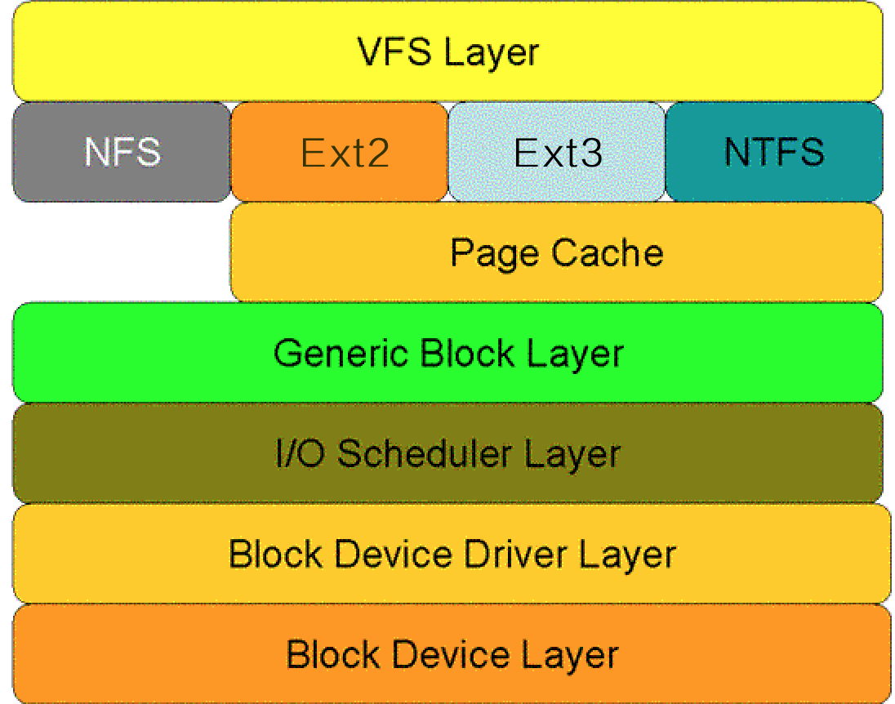
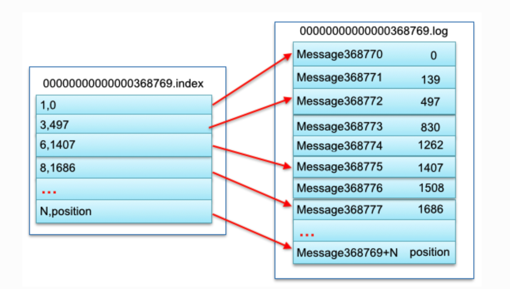

# Linux 磁盘 IO 详解

## IOPS 与 吞吐量

机械硬盘的连续读写性能很好，但随机读写性能很差。一般随机读写看 IOPS，顺序读写看吞吐量。

#### IOPS

IOPS（Input/Output Per Second）即每秒的输入输出量（或读写次数），即指每秒内系统能处理的I/O请求数量。随机读写频繁的应用，如小文件存储等，关注随机读写性能，IOPS是关键衡量指标。可以推算出磁盘的IOPS = 1000ms / (Tseek + Trotation + Transfer)，如果忽略数据传输时间，理论上可以计算出随机读写最大的IOPS。常见磁盘的随机读写最大IOPS为：

- 7200rpm的磁盘 IOPS = 76 IOPS
- 10000rpm的磁盘IOPS = 111 IOPS
- 15000rpm的磁盘IOPS = 166 IOPS

> Trotation是指盘片旋转将请求数据所在的扇区移动到读写磁盘下方所需要的时间。旋转延迟取决于磁盘转速，通常用磁盘旋转一周所需时间的1/2表示。比如：7200rpm的磁盘平均旋转延迟大约为60*1000/7200/2 = 4.17ms，而转速为15000rpm的磁盘其平均旋转延迟为2ms。

#### 吞吐量

吞吐量（Throughput），指单位时间内可以成功传输的数据数量。顺序读写频繁的应用，如视频点播，关注连续读写性能、数据吞吐量是关键衡量指标。它主要取决于磁盘阵列的架构，通道的大小以及磁盘的个数。不同的磁盘阵列存在不同的架构，但他们都有自己的内部带宽，一般情况下，内部带宽都设计足够充足，不会存在瓶颈。磁盘阵列与服务器之间的数据通道对吞吐量影响很大，比如一个2Gbps的光纤通道，其所能支撑的最大流量仅为250MB/s。最后，当前面的瓶颈都不再存在时，硬盘越多的情况下吞吐量越大。

## Linux 储存架构

其中，VFS 是面向上层的通用接口，通用块层是面向下层的通用接口。

#### I/O调度层

I/O调度层的功能是管理块设备的请求队列。即接收通用块层发出的I/O请求，缓存请求并试图合并相邻的请求。并根据设置好的调度算法，回调驱动层提供的请求处理函数，以处理具体的I/O请求。

如果简单地以内核产生请求的次序直接将请求发给块设备的话，那么块设备性能肯定让人难以接受，因为磁盘寻址是整个计算机中最慢的操作之一。为了优化寻址操作，内核不会一旦接收到I/O请求后，就按照请求的次序发起块I/O请求。为此Linux实现了几种I/O调度算法，算法基本思想就是通过合并和排序I/O请求队列中的请求，以此大大降低所需的磁盘寻道时间，从而提高整体I/O性能。

常见的I/O调度算法包括Noop调度算法（No Operation）、CFQ（完全公正排队I/O调度算法）、DeadLine（截止时间调度算法）、AS预测调度算法等。

- Noop算法：最简单的I/O调度算法。该算法仅适当合并用户请求，并不排序请求。新的请求通常被插在调度队列的开头或末尾，下一个要处理的请求总是队列中的第一个请求。这种算法是为不需要寻道的块设备设计的，如SSD。因为其他三个算法的优化是基于缩短寻道时间的，而SSD硬盘没有所谓的寻道时间且I/O响应时间非常短。
- CFQ算法：算法的主要目标是在触发I/O请求的所有进程中确保磁盘I/O带宽的公平分配。算法使用许多个排序队列，存放了不同进程发出的请求。通过散列将同一个进程发出的请求插入同一个队列中。采用轮询方式扫描队列，从第一个非空队列开始，依次调度不同队列中特定个数（公平）的请求，然后将这些请求移动到调度队列的末尾。
- Deadline算法：算法引入了两个排队队列分别包含读请求和写请求，两个最后期限队列包含相同的读和写请求。本质就是一个超时定时器，当请求被传给电梯算法时开始计时。一旦最后期限队列中的超时时间已到，就想请求移至调度队列末尾。Deadline算法避免了电梯调度策略（为了减少寻道时间，会优先处理与上一个请求相近的请求）带来的对某个请求忽略很长一段时间的可能。
- AS算法：AS算法本质上依据局部性原理，预测进程发出的读请求与刚被调度的请求在磁盘上可能是“近邻”。算法统计每个进程I/O操作信息，当刚刚调度了由某个进程的一个读请求之后，算法马上检查排序队列中的下一个请求是否来自同一个进程。如果是，立即调度下一个请求。否则，查看关于该进程的统计信息，如果确定进程p可能很快发出另一个读请求，那么就延迟一小段时间。

前文中计算出的IOPS是理论上的随机读写的最大IOPS，在随机读写中，每次I/O操作的寻址和旋转延时都不能忽略不计，有了这两个时间的存在也就限制了IOPS的大小。现在如果我们考虑在读取一个很大的存储连续分布在磁盘的文件，因为文件的存储的分布是连续的，磁头在完成一个读I/O操作之后，不需要重新寻址，也不需要旋转延时，在这种情况下我们能到一个很大的IOPS值。这时由于不再考虑寻址和旋转延时，则性能瓶颈仅是数据传输时延，假设数据传输时延为0.4ms，那么IOPS=1000 / 0.4 = 2500 IOPS。

在许多的开源框架如Kafka、HBase中，都通过追加写的方式来尽可能的将随机I/O转换为顺序I/O，以此来降低寻址时间和旋转延时，从而最大限度的提高IOPS。

## 缓存IO

缓存I/O又被称作标准I/O，大多数文件系统的默认I/O操作都是缓存I/O。在Linux的缓存I/O机制中，数据先从磁盘复制到内核空间的缓冲区，然后从内核空间缓冲区复制到应用程序的地址空间。

- 读操作：操作系统检查内核的缓冲区有没有需要的数据，如果已经缓存了，那么就直接从缓存中返回；否则从磁盘中读取，然后缓存在操作系统的缓存中。
- 写操作：将数据从用户空间复制到内核空间的缓存中。这时对用户程序来说写操作就已经完成，至于什么时候再写到磁盘中由操作系统决定，除非显示地调用了sync同步命令。

缓存I/O的优点：**1）在一定程度上分离了内核空间和用户空间，保护系统本身的运行安全；2）可以减少读盘的次数，从而提高性能**。

缓存I/O的缺点：在缓存 I/O 机制中，DMA 方式可以将数据直接从磁盘读到页缓存中，或者将数据从页缓存直接写回到磁盘上，而不能直接在应用程序地址空间和磁盘之间进行数据传输，这样，数据在传输过程中需要在**应用程序地址空间（用户空间）和缓存（内核空间）之间进行多次数据拷贝操作**，这些数据拷贝操作所带来的CPU以及内存开销是非常大的。

## 同步IO: sync、fsync与fdatasync

传统的UNIX实现在内核中设有缓冲区高速缓存或页面高速缓存，大多数磁盘I/O都通过缓冲进行。**当将数据写入文件时，内核通常先将该数据复制到其中一个缓冲区中，如果该缓冲区尚未写满，则并不将其排入输出队列，而是等待其写满或者当内核需要重用该缓冲区以便存放其他磁盘块数据时，再将该缓冲排入输出队列，然后待其到达队首时，才进行实际的I/O操作**。这种输出方式被称为**延迟写（delayed write）**。

延迟写**减少了磁盘读写次数**，但是却**降低了文件内容的更新速度**，使得欲写到文件中的数据在一段时间内并没有写到磁盘上。当系统发生故障时，这种延迟可能造成文件更新内容的丢失。为了保证磁盘上实际文件系统与缓冲区高速缓存中内容的一致性，UNIX系统提供了sync、fsync和fdatasync三个函数。

1. **sync函数只是将所有修改过的块缓冲区排入写队列**，然后就返回，它并不等待实际写磁盘操作结束。通常称为update的系统守护进程会周期性地（一般每隔30秒）调用sync函数。这就保证了定期冲洗内核的块缓冲区。命令sync(1)也调用sync函数。
2.  fsync函数只对由文件描述符filedes指定的单一文件起作用，并且**等待写磁盘操作结束，然后返回**。fsync可用于数据库这样的应用程序，这种应用程序需要确保将修改过的块立即写到磁盘上。
3.  fdatasync函数类似于fsync，**但它只影响文件的数据部分**。而除数据外，fsync还会同步更新文件的属性。

#### 事务保证

 对于提供事务支持的数据库，在事务提交时，都要确保事务日志（包含该事务所有的修改操作以及一个提交记录）完全写到硬盘上，才认定事务提交成功并返回给应用层。

一个简单的问题：在linux/unix操作系统上，怎样保证对文件的更新内容成功持久化到硬盘？

#### write不够，需要fsync

​    一般情况下，对硬盘（或者其他持久存储设备）文件的write操作，更新的只是内存中的页缓存（page cache），而脏页面不会立即更新到硬盘中，而是由操作系统统一调度，如由专门的flusher内核线程在满足一定条件时（如一定时间间隔、内存中的脏页达到一定比例）内将脏页面同步到硬盘上（放入设备的IO请求队列）。

   因为write调用不会等到硬盘IO完成之后才返回，因此如果OS在write调用之后、硬盘同步之前崩溃，则数据可能丢失。虽然这样的时间窗口很小，但是对于需**要保证事务的持久化（durability）和一致性（consistency）的数据库程序来说，write()所提供的“** ***\*松散的异步语义”\**\**是不够的，通常需要OS提供的\**\**同步IO\**** **（synchronized-IO）原语来保证**：**fsync**

#### fsync性能问题，与fdatasync

fsync不但同步文件的修改内容（脏页），还会同步文件的描述信息（metadata，包括size、访问时间st_atime & st_mtime等等），因为文件的数据和metadata通常存在硬盘的不同地方，因此**fsync至少需要两次IO写操作**

多余的一次IO操作，有多么昂贵呢？根据[Wikipedia的数据](http://en.wikipedia.org/wiki/Disk-drive_performance_characteristics#Seek_time)，**当前硬盘驱动的平均寻道时间（Average seek time）大约是3~15ms**，7200RPM硬盘的平均旋转延迟（Average rotational latency）大约为4ms，因此一次IO操作的耗时大约为10ms左右。这个数字意味着什么？下文还会提到。

fdatasync的功能与fsync类似，但是**仅仅在必要的情况下才会同步metadata，因此可以减少一次IO写操作**。那么，什么是“必要的情况”呢？

文件的尺寸（st_size）如果变化，是需要立即同步的，否则OS一旦崩溃，即使文件的数据部分已同步，由于metadata没有同步，依然读不到修改的内容。而最后访问时间(atime)/修改时间(mtime)是不需要每次都同步的，只要应用程序对这两个时间戳没有苛刻的要求，基本无伤大雅。

#### 使用fdatasync优化日志同步

文章开头时已提到，为了满足事务要求，数据库的日志文件是常常需要同步IO的。由于需要同步等待硬盘IO完成，所以事务的提交操作常常十分耗时，成为性能的瓶颈。

> 在Berkeley DB下，如果开启了AUTO_COMMIT（所有独立的写操作自动具有事务语义）并使用默认的同步级别（日志完全同步到硬盘才返回），写一条记录的耗时大约为5~10ms级别，基本和一次IO操作（10ms）的耗时相同。

我们已经知道，在同步上fsync是低效的。但是如果需要使用fdatasync减少对metadata的更新，则需要确保文件的尺寸在write前后没有发生变化。日志文件天生是追加型（append-only）的，总是在不断增大，似乎很难利用好fdatasync。

解决方案：

1. 每个log文件固定为10MB大小，从1开始编号，名称格式为“log.%010d"

2. 每次log文件创建时，先写文件的最后1个page，将log文件扩展为10MB大小

3. 向log文件中追加记录时，由于文件的尺寸不发生变化，使用fdatasync可以大大优化写log的效率

4. 如果一个log文件写满了，则新建一个log文件，也只有一次同步metadata的开销

## 磁盘IO优化手段

罗列一下常用的磁盘IO优化手段

#### 采用追加写

在进行系统设计时，良好的读性能和写性能往往不可兼得。在许多常见的开源系统中都是优先在保证写性能的前提下来优化读性能。

每次将数据添加到文件。由于完全是顺序的，寻道时间被大大缩小，所以可以具有非常好的写操作性能。但是这种方式也存在一些缺点：从文件中读一些数据时将会需要更多的时间：需要倒序扫描，直到找到所需要的内容。当然在一些简单的场景下也能够保证读操作的性能：

- 数据是被整体访问，比如HDFS

  HDFS建立在一次写多次读的模型之上。在HDFS中就是采用了追加写并且设计为高数据吞吐量；高吞吐量必然以高延迟为代价，所以HDFS并不适用于对数据访问要求低延迟的场景；由于采用是的追加写，也并不适用于任意修改文件的场景。HDFS设计为流式访问大文件，使用大数据块并且采用流式数据访问来保证数据被整体访问，同时最小化硬盘的寻址开销，只需要一次寻址即可，这时寻址时间相比于传输时延可忽略，从而也拥有良好的读性能。HDFS不适合存储小文件，原因之一是由于NameNode内存不足问题，还有就是因为访问大量小文件需要执行大量的寻址操作，并且需要不断的从一个datanode跳到另一个datanode，这样会大大降低数据访问性能。

- 知道文件明确的偏移量，比如Kafka

  在Kafka中，采用消息追加的方式来写入每个消息，每个消息读写时都会利用Page Cache的预读和后写特性，同时partition中都使用顺序读写，以此来提高I/O性能。虽然Kafka能够根据偏移量查找到具体的某个消息，但是查找过程是顺序查找，因此如果数据很大的话，查找效率就很低。所以Kafka中采用了分段和索引的方式来解决查找效率问题。Kafka把一个patition大文件又分成了多个小文件段，每个小文件段以偏移量命名，通过多个小文件段，不仅可以使用二分搜索法很快定位消息，同时也容易定期清除或删除已经消费完的文件，减少磁盘占用。为了进一步提高查找效率，Kafka为每个分段后的数据建立了索引文件，并通过索引文件稀疏存储来降低元数据占用大小。一个段中数据对应结构如下图所示：

  

在面对更复杂的读场景（比如按key）时，如何来保证读操作的性能呢？简单的方式是像Kafka那样，将文件数据有序保存，使用二分查找来优化效率；或者通过建索引的方式来进行优化；也可以采用hash的方式将数据分割为不同的桶。以上的方法都能增加读操作的性能，但是由于在数据上强加了数据结构，又会降低写操作的性能。比如如果采用索引的方式来优化读操作，那么在更新索引时就需要更新B-tree中的特定部分，这时候的写操作就是随机写。那么有没有一种办法在保证写性能不损失的同时也提供较好的读性能呢？一个好的选择就是使用LSM-tree。LSM-tree与B-tree相比，LSM-tree牺牲了部分读操作，以此大幅提高写性能。

- 日志结构的合并树LSM（The Log-Structured Merge-Tree）是HBase，LevelDB等NoSQL数据库的存储引擎。Log-Structured的思想是将整个磁盘看做一个日志，在日志中存放永久性数据及其索引，每次都添加到日志的末尾。并且通过将很多小文件的存取转换为连续的大批量传输，使得对于文件系统的大多数存取都是顺序的，从而提高磁盘I/O。LSM-tree就是这样一种采用追加写、数据有序以及将随机I/O转换为顺序I/O的延迟更新，批量写入硬盘的数据结构。LSM-tree将数据的修改增量先保存在内存中，达到指定的大小限制后再将这些修改操作批量写入磁盘。因此比较旧的文件不会被更新，重复的纪录只会通过创建新的纪录来覆盖，这也就产生了一些冗余的数据。所以系统会周期性的合并一些数据，移除重复的更新或者删除纪录，同时也会删除上述的冗余。在进行读操作时，如果内存中没有找到相应的key，那么就是倒序从一个个磁盘文件中查找。如果文件越来越多那么读性能就会越来越低，目前的解决方案是采用页缓存来减少查询次数，周期合并文件也有助于提高读性能。在文件越来越多时，可通过布隆过滤器来避免大量的读文件操作。LSM-tree牺牲了部分读性能，以此来换取写入的最大化性能，特别适用于读需求低，会产生大量插入操作的应用环境。

#### 文件合并和元数据优化

目前的大多数文件系统，如XFS/Ext4、GFS、HDFS，在元数据管理、缓存管理等实现策略上都侧重大文件。上述基于磁盘I/O特性设计的系统都有一个共性特点就是都运行在这些文件系统之上。这些文件系统在面临海量时在性能和存储效率方面都大幅降低，本节来探讨下海量小文件下的系统设计。

常见文件系统在海量小文件应用下性能表现不佳的根本原因是磁盘最适合顺序的大文件I/O读写模式，而非常不适合随机的小文件I/O读写模式。主要原因体现在元数据管理低效和数据布局低效：

- 元数据管理低效：由于小文件数据内容较少，因此元数据的访问性能对小文件访问性能影响巨大。Ext2文件系统中Inode和Data Block分别保存在不同的物理位置上，一次读操作需要至少经过两次的独立访问。在海量小文件应用下，Inode的频繁访问，使得原本的并发访问转变为了海量的随机访问，大大降低了性能。另外，大量的小文件会快速耗尽Inode资源，导致磁盘尽管有大量Data Block剩余也无法存储文件，会浪费磁盘空间。
- 数据布局低效：Ext2在Inode中使用多级指针来索引数据块。对于大文件，数据块的分配会尽量连续，这样会具有比较好的空间局部性。但是对于小文件，数据块可能零散分布在磁盘上的不同位置，并且会造成大量的磁盘碎片，不仅造成访问性能下降，还大量浪费了磁盘空间。数据块一般为1KB、2KB或4KB，对于小于4KB的小文件，Inode与数据的分开存储破坏了空间局部性，同时也造成了大量的随机I/O。

对于海量小文件应用，常见的I/O流程复杂也是造成磁盘性能不佳的原因。对于小文件，磁盘的读写所占用的时间较少，而用于文件的open()操作占用了绝大部分系统时间，导致磁盘有效服务时间非常低，磁盘性能低下。针对于问题的根源，优化的思路大体上分为：

1. 针对数据布局低效，采用小文件合并策略，将小文件合并为大文件。
2. 针对元数据管理低效，优化元数据的存储和管理。针对这两种优化方式，业内也出现了许多优秀的开源软件。

**小文件合并**

小文件合并为大文件后，首先减少了大量元数据，提高了元数据的检索和查询效率，降低了文件读写的I/O操作延时。其次将可能连续访问的小文件一同合并存储，增加了文件之间的局部性，将原本小文件间的随机访问变为了顺序访问，大大提高了性能。同时，合并存储能够有效的减少小文件存储时所产生的磁盘碎片问题，提高了磁盘的利用率。最后，合并之后小文件的访问流程也有了很大的变化，由原来许多的open操作转变为了seek操作，定位到大文件具体的位置即可。如何寻址这个大文件中的小文件呢？其实就是利用一个旁路数据库来记录每个小文件在这个大文件中的偏移量和长度等信息。其实小文件合并的策略本质上就是通过分层的思想来存储元数据。中控节点存储一级元数据，也就是大文件与底层块的对应关系；数据节点存放二级元数据，也就是最终的用户文件在这些一级大块中的存储位置对应关系，经过两级寻址来读写数据。

- 淘宝的TFS就采用了小文件合并存储的策略。TFS中默认Block大小为64M，每个块中会存储许多不同的小文件，但是这个块只占用一个Inode。假设一个Block为64M，数量级为1PB。那么NameServer上会有 1 * 1024 * 1024 * 1024 / 64 = 16.7M个Block。假设每个Block的元数据大小为0.1K，则占用内存不到2G。在TFS中，文件名中包含了Block ID和File ID，通过Block ID定位到具体的DataServer上，然后DataServer会根据本地记录的信息来得到File ID所在Block的偏移量，从而读取到正确的文件内容。

**元数据管理优化**

一般来说元数据信息包括名称、文件大小、设备标识符、用户标识符、用户组标识符等等，在小文件系统中可以对元数据信息进行精简，仅保存足够的信息即可。元数据精简可以减少元数据通信延时，同时相同容量的Cache能存储更多的元数据，从而提高元数据使用效率。另外可以在文件名中就包含元数据信息，从而减少一个元数据的查询操作。最后针对特别小的一些文件，可以采取元数据和数据并存的策略，将数据直接存储在元数据之中，通过减少一次寻址操作从而大大提高性能。

- TFS中文件命名就隐含了位置信息等部分元数据，从而减少了一个元数据的查询操作。在Rerserfs中，对于小于1KB的小文件，Rerserfs可以将数据直接存储在Inode中。

