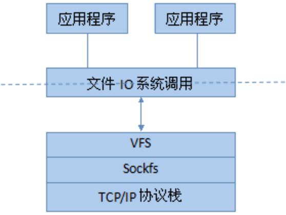
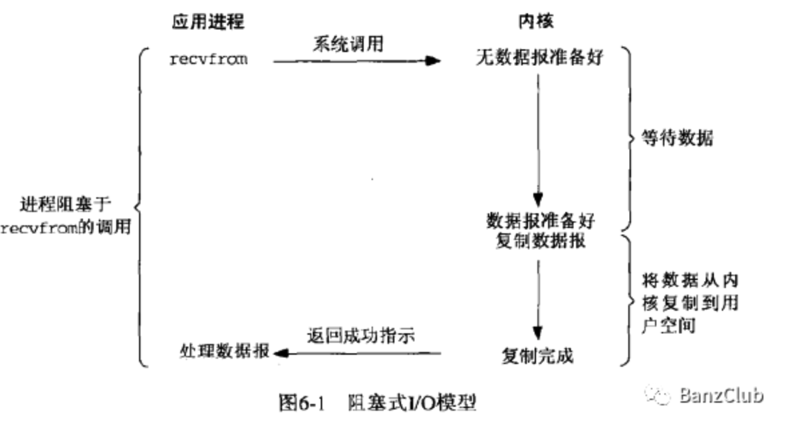
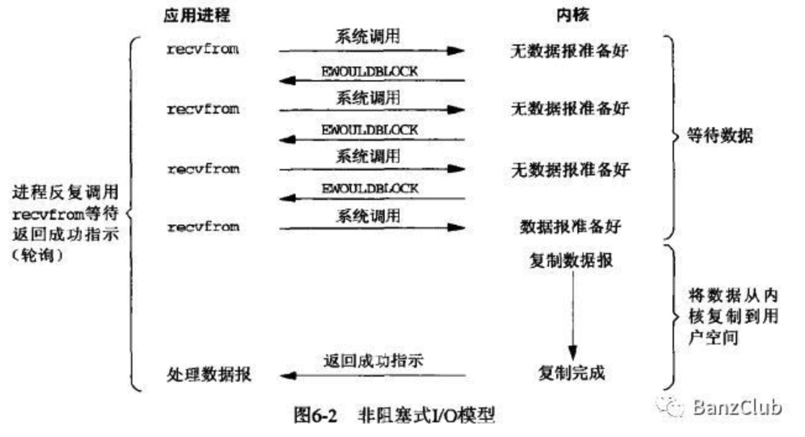
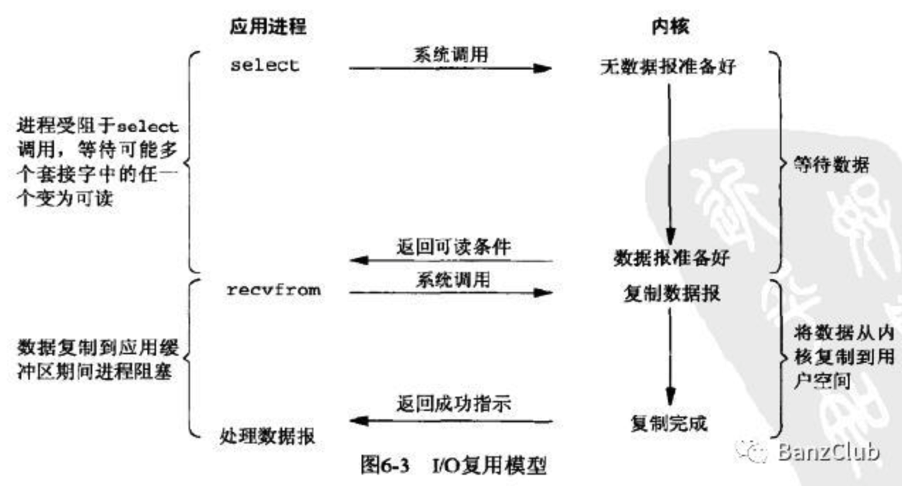
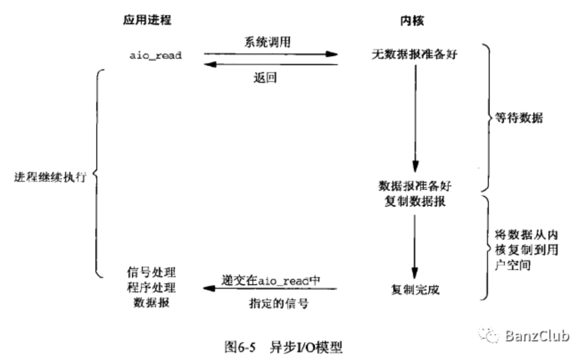
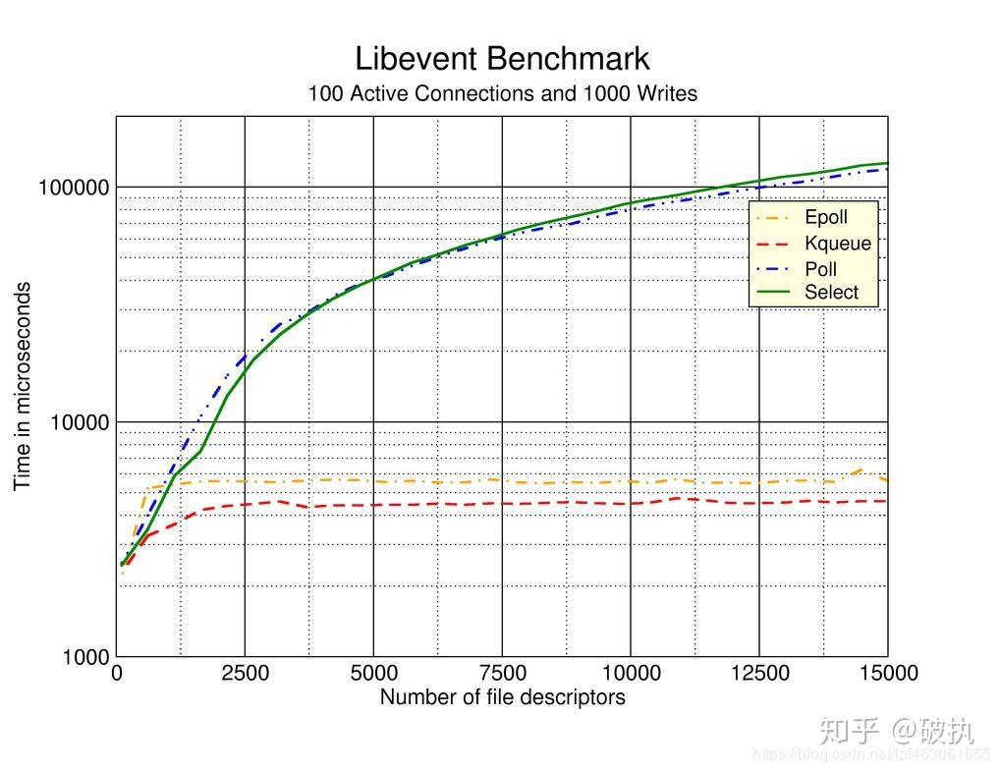

# Linux 网络 IO 详解

## Socket

在操作系统中，所有的I/O设备（磁盘、外设、网络等）都被模型化为文件，所有的输入和输出动作都被当成相应的文件的读和写来执行，这些文件通过操作系统的VFS机制（虚拟文件系统），以文件系统形式挂载在Linux内核中，对外提供一致的文件操作接口，由VFS根据不同的文件类型，执行不同的操作。如操作系统的Ext3、Ext4、NTFS、FAT等文件系统，进程的所有文件操作都是通过VFS来适配不同的文件系统，完成实际的文件操作。

在网络通信中，为了适配各种网络协议的复杂性，而使操作系统能够统一操作网络中的数据，在网络与进程间增加了一个抽象层，即套接字（socket）。客户端和服务器通过使用套接字接口建立连接，连接以文件描述符形式提供给进程，套接字接口提供了打开和关闭套接字描述符的函数，客户端和服务器通过读写这些描述符来实现彼此间的通信。所以，socket是一种特殊的文件。

## 网络IO模型

I/O操作的输入：

1. 进程向内核发起一个系统调用（read、readv、recv、recvfrom、recvmsg）；
2. 内核收到系统调用，通知I/O设备读取数据；
3. 设备将数据载入内核缓冲区；
4. 内核缓冲区接到数据后，复制到用户进程的缓冲区；
5. 进程缓冲区得到数据，通知内核；
6. 内核将控制权交给应用进程，进程继续下一步操作；

输出：

1. 进程向内核发起一个系统调用（write、writev、send、sendto、sendmsg）；
2. 内核收到系统调用，内核将数据从应用进程的缓冲区到内核缓冲区（或设备缓冲区，如Socket缓冲区）；
3. 内核将控制权交给应用进程，由设备执行下一步操作（如磁盘将数据写到磁盘；网卡将数据通过网络发出）；

操作系统对于这些I/O操作有几种特定的处理方式，也就是I/O模型，包括阻塞式I/O、非阻塞式I/O、I/O复用、信号驱动式I/O、异步I/O。

#### 阻塞式I/O

当进程发起一个系统调用时，到返回处理数据结果过程中，进程阻塞于这个系统调用的函数，如：调用系统的接收函数（recvfrom），从设备准备数据到系统缓冲区，到数据从内核拷贝到进程用户空间过程，进程都处于阻塞状态。

#### 非阻塞式I/O

非阻塞I/O与阻塞I/O不同的是，进程不会在内核准备数据过程中阻塞，而是如果内核没有准备好数据时，直接返回EWOULDBLOCK错误，然后进程一直轮询访问内核，直到内核准备好数据。

#### IO多路复用

I/O复用提供一种机制，可以通过新的系统调用，实现进程一次多个I/O操作，并通过监听每一个I/O操作的数据准备情况，如果某个I/O的数据准备完成，则内核会通知进程，可以进行某一个的I/O操作。操作系统提供的这种I/O复用的调用函数有select、poll、epoll。

进程虽然受阻于 select、但是可以监听很多 socket，如果进程只专注于处理网络数据，这种模型就非常适合，实际中，也有很多软件使用这种IO复用。

这种依赖于操作系统的 select、poll、epoll 的实现。

Java 中的 NIO 就是利用的多路复用IO。

#### 信号驱动式I/O

一般并不会用。

#### 异步IO

异步IO就是AIO。相对于同步I/O，异步I/O在进程发出异步请求之后，无论内核是否准备好数据，系统调用都会直接返回给用户进程，内核准备好数据之后，向进程复制数据，然后发送通知给进程，由进程继续操作，整个过程都是非阻塞的。

如果内核不给进程发信号，就差不多相当于非阻塞式IO，内核不给通知，就需要进程自己去轮询。

异步IO的好处还有直接把内核缓冲区的数据复制到用户空间，复制完成后才通知用户进程，这一点在非阻塞式IO是需要用户进程使用系统调用去做的。

现在Linux 上，没有比较完美的异步文件IO 方案，很多方案都有缺陷或限制，比如有的不能利用操作系统的缓冲区，有的不能利用 sendfile 实现零拷贝等。

#### 对比

## select、poll、epoll之间的区别

三个系统调用都是用于多路复用IO，可以监视多个描述符的读/写等事件。

#### select

Select会将全量`fd_set`从用户空间拷贝到内核空间，并注册回调函数， 在内核态空间来判断每个请求是否准备好数据 。select在没有查询到有文件描述符就绪的情况下，将一直阻塞（I/O多路服用中提过：select是一个阻塞函数）。如果有一个或者多个描述符就绪，那么select将就绪的文件描述符置位，然后select返回。返回后，由程序遍历查看哪个请求有数据。

缺陷：

- 每次调用select，都需要把fd集合从用户态拷贝到内核态，fd越多开销则越大；
- 每次调用select都需要在内核遍历传递进来的所有fd，这个开销在fd很多时也很大
- select支持的文件描述符数量有限，默认是1024。参见`/usr/include/linux/posix_types.h`中的定义：`# define __FD_SETSIZE 1024`

#### poll

poll的实现和select非常相似，只是描述fd集合的方式不同，poll使用`pollfd`结构代替select的`fd_set`（网上讲：类似于位图）结构，其他的本质上都差不多。所以**Poll机制突破了Select机制中的文件描述符数量最大为1024的限制**。

缺陷

Poll机制相较于Select机制中，解决了文件描述符数量上限为1024的缺陷。但另外两点缺陷依然存在：

- 每次调用poll，都需要把fd集合从用户态拷贝到内核态，fd越多开销则越大；
- 每次调用poll，都需要在内核遍历传递进来的所有fd，这个开销在fd很多时也很大

#### epoll

Epoll在Linux2.6内核正式提出，是基于事件驱动的I/O方式。相对于select来说，epoll没有描述符个数限制；使用一个文件描述符管理多个描述符，将用户关心的文件描述符的事件存放到内核的一个事件表中，通过内存映射，使其在用户空间也可直接访问，省去了拷贝带来的资源消耗。

epoll既然是对select和poll的改进，就应该能避免上述的三个缺点。那epoll都是怎么解决的呢？在此之前，我们先看一下epoll和select和poll的调用接口上的不同，select和poll都只提供了一个函数——select或者poll函数。而epoll提供了三个函数，epoll_create,epoll_ctl和epoll_wait，epoll_create是创建一个epoll句柄；epoll_ctl是注册要监听的事件类型；epoll_wait则是等待事件的产生。

　　对于第一个缺点，epoll的解决方案在epoll_ctl函数中。每次注册新的事件到epoll句柄中时（在epoll_ctl中指定EPOLL_CTL_ADD），会把所有的fd拷贝进内核，而不是在epoll_wait的时候重复拷贝。epoll保证了每个fd在整个过程中只会拷贝一次。

　　对于第二个缺点，epoll的解决方案不像select或poll一样每次都把current轮流加入fd对应的设备等待队列中，而只在epoll_ctl时把current挂一遍（这一遍必不可少）并为每个fd指定一个回调函数，当设备就绪，唤醒等待队列上的等待者时，就会调用这个回调函数，而这个回调函数会把就绪的fd加入一个就绪链表）。epoll_wait的工作实际上就是在这个就绪链表中查看有没有就绪的fd（利用schedule_timeout()实现睡一会，判断一会的效果，和select实现中的第7步是类似的）。

　　对于第三个缺点，epoll没有这个限制，它所支持的FD上限是最大可以打开文件的数目，这个数字一般远大于2048,举个例子,在1GB内存的机器上大约是10万左右，具体数目可以cat /proc/sys/fs/file-max察看,一般来说这个数目和系统内存关系很大。

**工作模式**

相较于Select和Poll，Epoll内部还分为两种工作模式： **LT水平触发（level trigger）**和**ET边缘触发（edge trigger）**。

- **LT模式：** 默认的工作模式，即当epoll_wait检测到某描述符事件就绪并通知应用程序时，应用程序**可以不立即处理**该事件；事件会被放回到就绪链表中，下次调用epoll_wait时，会再次通知此事件。
- **ET模式：** 当epoll_wait检测到某描述符事件就绪并通知应用程序时，应用程序**必须立即处理**该事件。如果不处理，下次调用epoll_wait时，不会再次响应并通知此事件。

由于上述两种工作模式的区别，LT模式同时支持block和no-block socket两种，而ET模式下仅支持no-block socket。即epoll工作在ET模式的时候，必须使用非阻塞套接口，以避免由于一个fd的阻塞I/O操作把多个处理其他文件描述符的任务饿死。ET模式在很大程度上减少了epoll事件被重复触发的次数，因此效率要比LT模式高。

优点

- 使用内存映射技术，节省了用户态和内核态间数据拷贝的资源消耗；
- 通过每个fd定义的回调函数来实现的，只有就绪的fd才会执行回调函数。I/O的效率不会随着监视fd的数量的增长而下降；
- 文件描述符数量不再受限；

#### 效率对比

