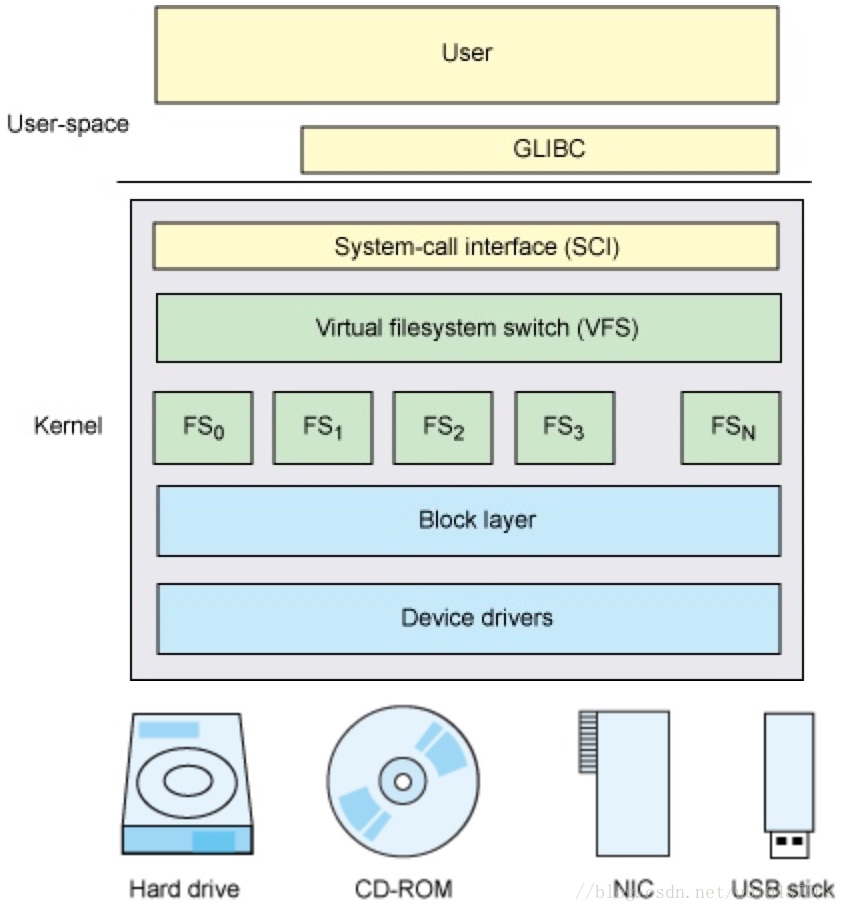

# VFS 虚拟文件系统

VFS（Virtual Filesystem Switch）称为虚拟文件系统或虚拟文件系统转换，是一个内核软件层，在具体的文件系统之上抽象的一层，用来处理与Posix文件系统相关的所有调用，表现为能够给各种文件系统提供一个通用的接口，使上层的应用程序能够使用通用的接口访问不同文件系统，同时也为不同文件系统的通信提供了媒介。

与VFS相关的数据结构只存在于物理内存当中。

## 架构

Linux系统的User使用GLIBC（POSIX标准、GUN C运行时库）作为应用程序的运行时库，然后通过操作系统，将其转换为系统调用SCI（system-call interface），SCI是操作系统内核定义的系统调用接口，这层抽象允许用户程序的I/O操作转换为内核的接口调用。VFS提供了一个抽象层，将POSIX API接口与不同存储设备的具体接口实现进行了分离，使得底层的文件系统类型、设备类型对上层应用程序透明。

## VFS的抽象接口

上述示例中提到VFS也有自己的文件模型，用来支持操作系统的系统调用。下面是VFS抽象模型支持的所有Linux系统调用：

- 文件系统相关：mount, umount, umount2, sysfs,  statfs,  fstatfs,  fstatfs64, ustat
- 目录相关：chroot，pivot_root，chdir，fchdir，getcwd，mkdir，rmdir，getdents，getdents64，readdir，link，unlink，rename，lookup_dcookie
- 链接相关：readlink，symlink
- 文件相关：chown， fchown，lchown，chown16，fchown16，lchown16，hmod，fchmod，utime，stat，fstat，lstat，acess，oldstat，oldfstat，oldlstat，stat64，lstat64，lstat64，open，close，creat，umask，dup，dup2，fcntl， fcntl64，select，poll，truncate，ftruncate，truncate64，ftruncate64，lseek，llseek，read，write，readv，writev，sendfile，sendfile64，readahead

## VFS支持的文件系统

- Disk-based 文件系统：Ext2, ext3, ReiserFS，Sysv, UFS, MINIX, VxFS，VFAT, NTFS，ISO9660 CD-ROM, UDF DVD，HPFS, HFS, AFFS, ADFS,
- Network 文件系统：NFS, Coda, AFS, CIFS, NCP
- 特殊文件系统：/proc，/tmpfs等

## 通用文件模型

VFS为了提供对不同底层文件系统的统一接口，需要有一个高度的抽象和建模，这就是VFS的核心设计——统一文件模型。目前的Linux系统的VFS都是源于Unix家族，因此这里所说的VFS对所有Unix家族的系统都适用。Unix家族的VFS的文件模型定义了四种对象，这四种对象构建起了统一文件模型。

1. 超级块对象(superblock object)，用于存放已经注册的文件系统的信息。比如ext2，ext3等这些基础的磁盘文件系统，还有用于读写socket的socket文件系统，以及当前的用于读写cgroups配置信息的 cgroups 文件系统等。
2. 索引节点对象(inode object)，用于存放具体文件的信息。对于一般的磁盘文件系统而言，inode 节点中一般会存放文件在硬盘中的存储块等信息；对于socket文件系统，inode会存放socket的相关属性，而对于cgroups这样的特殊文件系统，inode会存放与 cgroup 节点相关的属性信息。这里面比较重要的一个部分是一个叫做 inode_operations 的结构体，这个结构体定义了在具体文件系统中创建文件，删除文件等的具体实现。
3. 文件对象(file object)，一个文件对象表示进程内打开的一个文件，文件对象是存放在进程的文件描述符表里面的。同样这个文件中比较重要的部分是一个叫 file_operations 的结构体，这个结构体描述了具体的文件系统的读写实现。当进程在某一个文件描述符上调用读写操作时，实际调用的是 file_operations 中定义的方法。 对于普通的磁盘文件系统，file_operations 中定义的就是普通的块设备读写操作；对于socket文件系统，file_operations 中定义的就是 socket 对应的 send/recv 等操作；而对于cgroups这样的特殊文件系统，file_operations 中定义的就是操作 cgroup 结构体等具体的实现。
4. 目录项对象(dentry object)，在每个文件系统中，内核在查找某一个路径中的文件时，会为内核路径上的每一个分量都生成一个目录项对象，通过目录项对象能够找到对应的 inode 对象，目录项对象一般会被缓存，从而提高内核查找速度。

## SockFS

处于网络和进程之间的 socket 也是一种特殊文件，而这种 socket 文件属于 SockFS，它也实现了 VFS 的接口。

