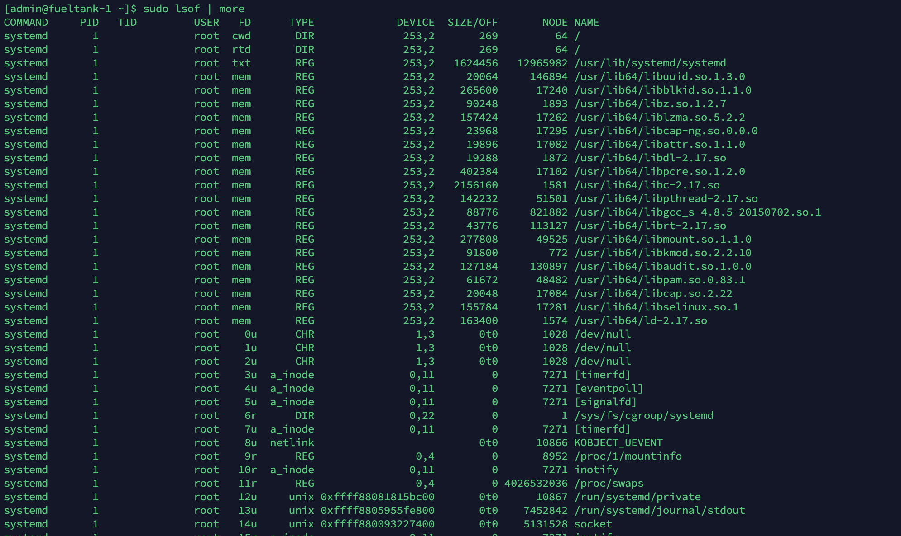

# lsof 命令详解

lsof（list open files）是一个查看当前系统文件的工具。在linux环境下，任何事物都以文件的形式存在，通过文件不仅仅可以访问常规数据，还可以访问网络连接和硬件。如传输控制协议 (TCP) 和用户数据报协议 (UDP) 套接字等，系统在后台都为该应用程序分配了一个文件描述符，该文件描述符提供了大量关于这个应用程序本身的信息。

lsof打开的文件可以是：

1. 普通文件
2. 目录
3. 网络文件系统的文件
4. 字符或设备文件
5. (函数)共享库
6. 管道，命名管道
7. 符号链接
8. 网络文件（例如：NFS file、网络socket，unix域名socket）
9. 还有其它类型的文件，等等

## 命令参数

- -a 列出打开文件的进程
- -c 列出指定进程所打开的文件
- -g 列出GID号进程详情
- -d<文件号> 列出占用该文件号的进程
- +d<目录> 列出目录下被打开的文件
- +D<目录> 递归列出目录下被打开的文件
- -n<目录> 列出使用NFS的文件
- -i<条件> 列出符合条件的进程。（4、6、协议、:端口、 @ip ）
- -p<进程号> 列出指定进程号所打开的文件
- -u 列出UID号进程详情
- -r int 每过多少秒刷新一次
- -h 显示帮助信息
- -v 显示版本信息

## 实例

无参数：



- COMMADN 表示命令

- PID：进程标识符

- PPID：父进程标识符（需要指定-R参数）

- USER：进程所有者

- PGID：进程所属组

- FD：文件描述符，应用程序通过文件描述符识别该文件。如cwd、txt等:

  ```
  （1）cwd：表示current work dirctory，即：应用程序的当前工作目录，这是该应用程序启动的目录，除非它本身对这个目录进行更改
  （2）txt ：该类型的文件是程序代码，如应用程序二进制文件本身或共享库，如上列表中显示的 /sbin/init 程序
  （3）lnn：library references (AIX);
  （4）er：FD information error (see NAME column);
  （5）jld：jail directory (FreeBSD);
  （6）ltx：shared library text (code and data);
  （7）mxx ：hex memory-mapped type number xx.
  （8）m86：DOS Merge mapped file;
  （9）mem：memory-mapped file;
  （10）mmap：memory-mapped device;
  （11）pd：parent directory;
  （12）rtd：root directory;
  （13）tr：kernel trace file (OpenBSD);
  （14）v86  VP/ix mapped file;
  （15）0：表示标准输入
  （16）1：表示标准输出
  （17）2：表示标准错误
  一般在标准输出、标准错误、标准输入后还跟着文件状态模式：r、w、u等
  （1）u：表示该文件被打开并处于读取/写入模式
  （2）r：表示该文件被打开并处于只读模式
  （3）w：表示该文件被打开并处于
  （4）空格：表示该文件的状态模式为unknow，且没有锁定
  （5）-：表示该文件的状态模式为unknow，且被锁定
  同时在文件状态模式后面，还跟着相关的锁
  （1）N：for a Solaris NFS lock of unknown type;
  （2）r：for read lock on part of the file;
  （3）R：for a read lock on the entire file;
  （4）w：for a write lock on part of the file;（文件的部分写锁）
  （5）W：for a write lock on the entire file;（整个文件的写锁）
  （6）u：for a read and write lock of any length;
  （7）U：for a lock of unknown type;
  （8）x：for an SCO OpenServer Xenix lock on part      of the file;
  （9）X：for an SCO OpenServer Xenix lock on the      entire file;
  （10）space：if there is no lock.
  ```

  

- TYPE：文件类型，如DIR、REG等，常见的文件类型:

  ```
  （1）DIR：表示目录
  （2）CHR：表示字符类型
  （3）BLK：块设备类型
  （4）UNIX： UNIX 域套接字
  （5）FIFO：先进先出 (FIFO) 队列
  （6）IPv4：网际协议 (IP) 套接字
  ```

- DEVICE：指定磁盘的名称

- SIZE：文件的大小

- NODE：索引节点（文件在磁盘上的标识）

- NAME：打开文件的确切名称


#### 查看某个文件相关的进程

```
$ lsof -R /bin/bash
COMMAND     PID  PPID  USER  FD   TYPE DEVICE SIZE/OFF     NODE NAME
domain.sh 11689     1 admin txt    REG  253,2   964600 12583347 /usr/bin/bash
launch.sh 23250     1 admin txt    REG  253,2   964600 12583347 /usr/bin/bash
standalon 23252 23250 admin txt    REG  253,2   964600 12583347 /usr/bin/bash
bash      29478 29477 admin txt    REG  253,2   964600 12583347 /usr/bin/bash
```

```
$ sudo lsof -R /var/run/docker.sock
COMMAND  PID PPID USER   FD   TYPE             DEVICE SIZE/OFF  NODE NAME
systemd    1    0 root   89u  unix 0xffff880819eb5800      0t0 19686 /var/run/docker.sock
dockerd 3060    1 root    3u  unix 0xffff880819eb5800      0t0 19686 /var/run/docker.sock
dockerd 3060    1 root    7u  unix 0xffff8808194ad000      0t0 29834 /var/run/docker.sock
```


#### 列出某个用户打开的文件的信息

```bash
$ sudo lsof -u admin
$ sudo lsof -u etcd
```


#### 列出某个程序打开的文件

```bash
$ sudo lsof -c mysql
$ sudo lsof -c docker
```


#### 列出某个 PID 打开的文件

```bash
$ sudo lsof -p 2864
```


#### 列出所有的网络连接

```bash
$ sudo -i
$ sudo lsof -i 4
$ sudo lsof -i:443
$ sudo lsof -i @127.0.0.1
$ sudo lsof -i tcp
```


#### 列出与文件描述符相关的进程

上面说过，FD 代表的是文件描述符，这里列出使用了同一文件描述符的进程列表

```bash
$ sudo lsof -d 62
```

说明： 0表示标准输入，1表示标准输出，2表示标准错误，从而可知：所以大多数应用程序所打开的文件的 FD 都是从 3 开始


#### 列出 fueltank-1 上 6443 端口的进程，每三秒刷新一次

```bash
 $ sudo lsof -i @fueltank-1:6443 -r 3
```


#### 

