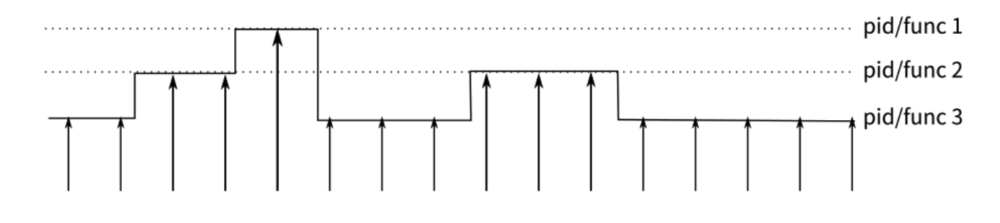
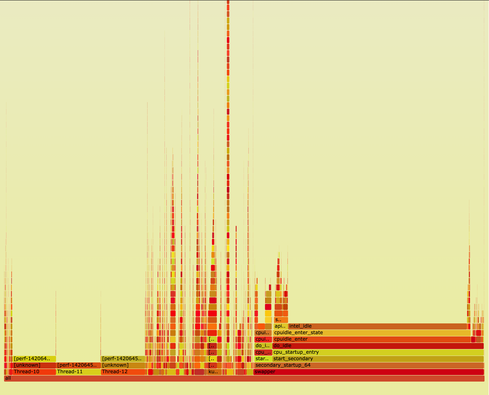

# pref 命令详解

安装：

```bash
$ yum install perf
```

Perf 是一个非常强大的工具。

perf的原理是这样的：每隔一个固定的时间，就在CPU上（每个核上都有）产生一个中断，在中断上看看，当前是哪个pid，哪个函数，然后给对应的pid和函数加一个统计值，这样，我们就知道CPU有百分几的时间在某个pid，或者某个函数上了。这个原理图示如下：




## perf list

`perf list` 列出了所有可以被监听的事件，


## perf stat

查看所有或某个进程的事件统计信息：

```
$ sudo perf stat
^C
 Performance counter stats for 'system wide':

      5,462,373.60 msec cpu-clock                 #   23.999 CPUs utilized          
         7,632,858      context-switches          #    0.001 M/sec                  
           203,262      cpu-migrations            #    0.037 K/sec                  
         2,303,190      page-faults               #    0.422 K/sec                  
 2,515,120,949,053      cycles                    #    0.460 GHz                    
 2,794,530,101,478      stalled-cycles-frontend   #  111.11% frontend cycles idle   
 6,859,093,206,785      instructions              #    2.73  insn per cycle         
                                                  #    0.41  stalled cycles per insn
 1,679,120,346,802      branches                  #  307.398 M/sec                  
     3,837,907,591      branch-misses             #    0.23% of all branches        

     227.610249924 seconds time elapsed
```

注意：命令不会自动返回，过一段时间要手动按 ctrl + c 才会返回信息。

以上是默认统计的事件：

- cpu-clock：任务真正占用的处理器时间，单位为ms。CPUs utilized = task-clock / time elapsed，CPU的占用率。

- context-switches：程序在运行过程中上下文的切换次数。

- cpu-migrations：程序在运行过程中发生的处理器迁移次数。Linux为了维持多个处理器的负载均衡，在特定条件下会将某个任务从一个CPU迁移到另一个CPU。

  > CPU迁移和上下文切换：发生上下文切换不一定会发生CPU迁移，而发生CPU迁移时肯定会发生上下文切换。发生上下文切换有可能只是把上下文从当前CPU中换出，下一次调度器还是将进程安排在这个CPU上执行。

- page-faults：缺页异常的次数。当应用程序请求的页面尚未建立、请求的页面不在内存中，或者请求的页面虽然在内存中，但物理地址和虚拟地址的映射关系尚未建立时，都会触发一次缺页异常。另外TLB不命中，页面访问权限不匹配等情况也会触发缺页异常。

- cycles：消耗的处理器周期数。如果把被ls使用的cpu cycles看成是一个处理器的，那么它的主频为1.916GHz。可以用cycles / task-clock算出。

- stalled-cycles-frontend：指令读取或解码的质量步骤，未能按理想状态发挥并行左右，发生停滞的时钟周期。

- stalled-cycles-backend：指令执行步骤，发生停滞的时钟周期。

- instructions：执行了多少条指令。IPC为平均每个cpu cycle执行了多少条指令。

- branches：遇到的分支指令数。
- branch-misses是预测错误的分支指令数。


## perf top

默认按照时钟周期排序。

用法：

```bash
$ sudo perf top -e 'cycles' -s comm,pid,dso
```


## 火焰图

一个游泳命令是`perf record`，它可以对事件进行采样，将采样的数据收集在一个 perf.data 的文件中，这将会带来一定的性能开销，不过这个命令很有用，可以用来找出最占 CPU 的进程。下面的命令对系统 CPU 事件做采样，采样时间为 60 秒，每秒采样 99 个事件，`-g`表示记录程序的调用栈。

```bash
$ sudo perf record -F 99 -a -g -- sleep 60
$ sudo perf script > out.perf
```

生产火焰图的工具是：https://github.com/brendangregg/FlameGraph

```bash
$ sudo yum install perl
$ FlameGraph/stackcollapse-perf.pl out.perf > out.folded
$ FlameGraph/flamegraph.pl out.folded > out.svg
```

然后浏览器打开 out.svg 即可。



y 轴表示调用栈，每一层都是一个函数。调用栈越深，火焰就越高，顶部就是正在执行的函数，下方都是它的父函数。

x 轴表示抽样数，如果一个函数在 x 轴占据的宽度越宽，就表示它被抽到的次数多，即执行的时间长。注意，x 轴不代表时间，而是所有的调用栈合并后，按字母顺序排列的。

**火焰图就是看顶层的哪个函数占据的宽度最大。只要有"平顶"（plateaus），就表示该函数可能存在性能问题。**

颜色没有特殊含义，因为火焰图表示的是 CPU 的繁忙程度，所以一般选择暖色调。


火焰的每一层都会标注函数名，鼠标悬浮时会显示完整的函数名、抽样抽中的次数、占据总抽样次数的百分比。下面是一个例子。

```
mysqld'JOIN::exec (272,959 samples, 78.34 percent)
```


