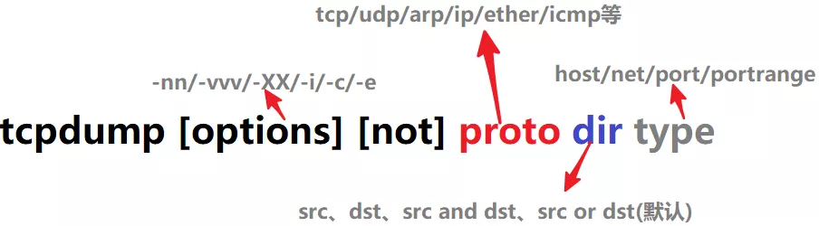

参考：https://www.cnblogs.com/bakari/p/10748721.html

**tcpdump** 是一款 Linux 平台的抓包工具。它可以抓取涵盖整个 TCP/IP 协议族的数据包，支持针对网络层、协议、主机、端口的过滤，并提供 and、or、not 等逻辑语句来过滤无用的信息。

tcpdump 是一个非常复杂的工具，掌握它的方方面面实属不易，也不推荐，能够用它来解决日常工作问题才是关键。


## 选项

`tcpdump -h` 查看帮助信息，完整的帮助信息通过 `man tcpdump` 查看。

下面列举一些常用选项：

- -A 只使用 ASCII 打印报文的全部数据，不要和 `-X` 一起使用，获取 http 可以用 `tcpdump -nSA port 80`
- -b 在数据链路层上选择协议，包括 ip, arp, rarp, ipx 等
- -c 指定要抓取包的数量
- -D 列出操作系统所有可以用于抓包的接口
- -e 输出链路层报头
- -i 指定监听的网卡，`-i any` 显示所有网卡
- -n 表示不解析主机名，直接用 IP 显示，默认是用 hostname 显示
- -nn 表示不解析主机名和端口，直接用端口号显示，默认显示是端口号对应的服务名
- -p 关闭接口的混杂模式
- -P 指定抓取的包是流入的包还是流出的，可以指定参数 in, out, inout 等，默认是 inout
- -q 快速打印输出，即只输出少量的协议相关信息
- -s len 设置要抓取数据包长度为 len，默认只会截取前 96bytes 的内容，`-s 0` 的话，会截取全部内容。
- -S 将 TCP 的序列号以绝对值形式输出，而不是相对值
- -t 不要打印时间戳
- -vv 输出详细信息（比如 tos、ttl、checksum等）
- -X 同时用 hex 和 ascii 显示报文内容
- -XX 同 -X，但同时显示以太网头部


## 过滤器

网络报文是很多的，很多时候我们在主机上抓包，会抓到很多我们并不关心的无用包，然后要从这些包里面去找我们需要的信息，无疑是一件费时费力的事情，tcpdump 提供了灵活的语法可以精确获取我们关心的数据，这些语法说得专业点就是过滤器。

过滤器简单可分为三类：协议（proto）、传输方向（dir）和类型（type）。

一般格式为：




## 常用操作

抓取主机 172.18.82.173 上所有收到（DST_IP）和发出（SRC_IP）的所有数据包:

```bash
$ tcpdump host 192.168.98.118
```

抓取经过指定网口 interface ，并且 DST_IP 或 SRC_IP 是 172.18.82.173 的数据包

```bash
$ tcpdump -i eth0 host 192.168.98.118
```

筛选 SRC_IP，抓取经过 interface 且从 172.18.82.173 发出的包

```bash
$ tcpdump -i eth0 src host 192.168.98.118
```

抓取主机 200.200.200.1 和主机 200.200.200.2 或 200.200.200.3 通信的包

```bash
$ tcpdump host 200.200.200.1 and \(200.200.200.2 or 200.200.200.3\)
```

抓取主机 200.200.200.1 和除了主机 200.200.200.2 之外所有主机通信的包

```bash
$ tcpdump ip host 200.200.200.1 and ! 200.200.200.2
```


## 抓取某端口的数据包

抓取所有端口，显示 IP 地址

```bash
$ tcpdump -nS
```

抓取某端口上的包:

```bash
$ tcpdump port 22
```

抓取经过指定 interface，并且 DST_PORT 或 SRC_PORT 是 22 的数据包

```bash
$ tcpdump -i eth0 port 22
```

筛选 SRC_PORT

```bash
$ tcpdump -i eth0 src port 22
```

比如希望查看发送到 host 192.168.98.118 的网口 eth0 的 22 号端口的包，只收取10个包

```bash
$ tcpdump -i eth0 -nnt dst host 192.168.98.118 and port 22 -c 10 -vv
```


## 抓取某网络（网段）的数据包

抓取经过指定 interface，并且 DST_NET 或 SRC_NET 是 172.18.82 的包

```bash
$ tcpdump -i eth0 net 172.18.82
```

筛选 SRC_NET

```bash
$ tcpdump -i eth0 src net 172.18.82
```

筛选 DST_NET

```bash
$ tcpdump -i eth0 dst net 172.18.82
```


## 抓取某协议的数据包

````
tcpdump -i eth0 icmp
tcpdump -i eth0 ip
tcpdump -i eth0 tcp
tcpdump -i eth0 udp
tcpdump -i eth0 arp
````


## 复杂的逻辑表达式抓取过滤条件

抓取经过 interface eth0 发送到 host 200.200.200.1 或 200.200.200.2 的 TCP 协议 22 号端口的数据包

```bash
$ tcpdump -i eth0 -nntvv -c 10 '((tcp) and (port 22) and ((dst host 200.200.200.1) or (dst host 200.200.200.2)))'
```

PS：对于复杂的过滤器表达式，为了逻辑清晰，可以使用 `()`，不过默认情况下，tcpdump 会将 `()` 当做特殊字符，所以必须使用 `''` 来消除歧义。

抓取经过 interface eth0， DST_MAC 或 SRC_MAC 地址是 00:16:3e:12:16:e7 的 ICMP 数据包

```bash
$ tcpdump -i eth0 '((icmp) and ((ether host 00:16:3e:12:16:e7)))' -nnvv
```

抓取经过 interface eth0，目标网络是 172.18 但目标主机又不是 172.18.82.173 的 TCP 且非 22 号端口号的数据包

```bash
$ tcpdump -i eth0 -nntvv '((dst net 172.18) and (not dst host 172.18.82.173) and (tcp) and (not port 22))'
```

抓取流入 interface eth0，host 为 172.18.82.173 且协议为 ICMP 的数据包

```bash
$ tcpdump -i eth0 -nntvv -P in host 172.18.82.173 and icmp
```

抓取流出 interface eth0，host 为 172.18.82.173 且协议为 ICMP 的数据包

```bash
$ tcpdump -i eth0 -nntvv -P out host 172.18.82.173 and icmp
```


## 与 wireshark、Snort 等工具的结合

tcpdump 抓包的时候，默认是打印到屏幕输出，如果是抓取包少还好，如果包很多，很多行数据，刷刷刷从眼前一闪而过，根本来不及看清内容。不过，tcpdump 提供了将抓取的数据保存到文件的功能，查看文件就方便分析多了，而且还能与其他图形工具一起配合分析，比如 wireshark、Snort 等。

-w 选项表示把数据报文输出到文件

```bash
$ tcpdump -w capture_file.pcap port 80 # 把所有 80 端口的数据导出到文件
```

-r 选项表示读取文件里的数据报文，显示到屏幕上

```bash
$ tcpdump -nXr capture_file.pcap host host1
```

PS：`.pcap` 格式的文件需要用 wireshark、Snort 等工具查看，使用 `vim` 或 `cat` 会出现乱码。


##  tcpdump 的输出格式

tcpdump 的输出格式总体上为：

```
系统时间 源主机.端口 > 目标主机.端口 数据包参数
```

比如下面的例子，显示了 TCP 的三次握手过程：

```
21:27:06.995846 IP (tos 0x0, ttl 64, id 45646, offset 0, flags [DF], proto TCP (6), length 64)
    192.168.1.106.56166 > 124.192.132.54.80: Flags [S], cksum 0xa730 (correct), seq 992042666, win 65535, options [mss 1460,nop,wscale 4,nop,nop,TS val 663433143 ecr 0,sackOK,eol], length 0

21:27:07.030487 IP (tos 0x0, ttl 51, id 0, offset 0, flags [DF], proto TCP (6), length 44)
    124.192.132.54.80 > 192.168.1.106.56166: Flags [S.], cksum 0xedc0 (correct), seq 2147006684, ack 992042667, win 14600, options [mss 1440], length 0

21:27:07.030527 IP (tos 0x0, ttl 64, id 59119, offset 0, flags [DF], proto TCP (6), length 40)
    192.168.1.106.56166 > 124.192.132.54.80: Flags [.], cksum 0x3e72 (correct), ack 2147006685, win 65535, length 0
```

第一条是 `SYN` 报文，通过 `Flags[S]` 看出。第二条是 `[S.]`，表示 `SYN-ACK` 报文。常见的 TCP 报文的 Flags 如下：

- `[S]`： SYN（开始连接）
- `[.]`: 没有 Flag
- `[P]`: PSH（推送数据）
- `[F]`: FIN （结束连接）
- `[R]`: RST（重置连接）


