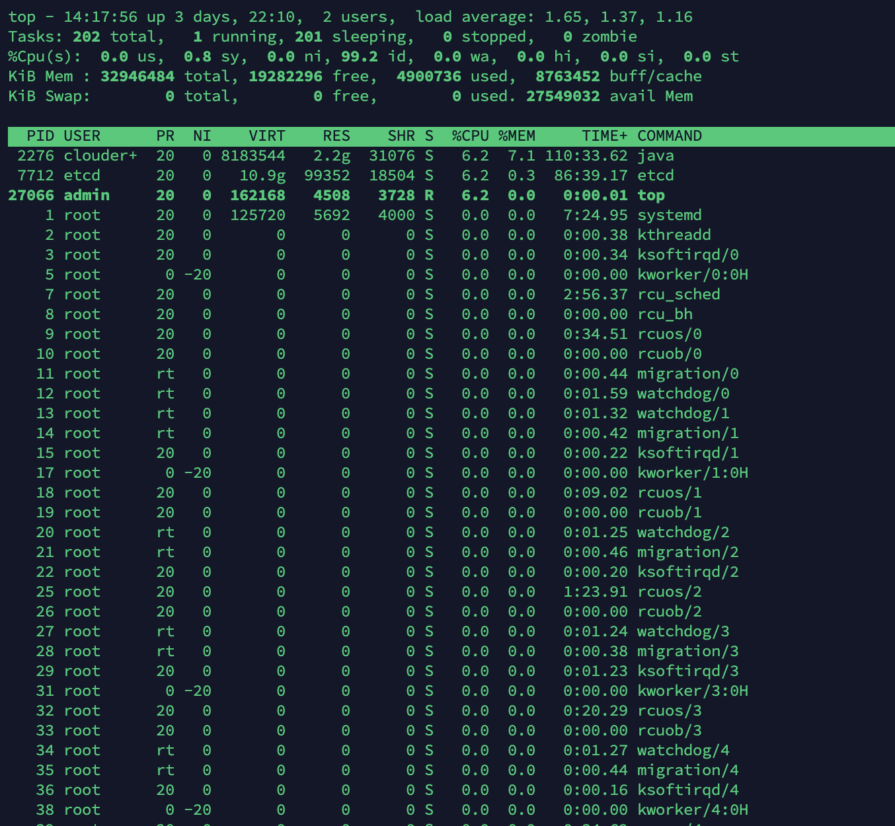

# top 命令详解

top命令是Linux下常用的性能分析工具，能够实时显示系统中各个进程的资源占用状况，类似于Windows的任务管理器。下面详细介绍它的使用方法。top是一个动态显示过程,即可以通过用户按键来不断刷新当前状态.如果在前台执行该命令,它将独占前台,直到用户终止该程序为止.比较准确的说,top命令提供了实时的对系统处理器的状态监视.它将显示系统中CPU最“敏感”的任务列表.该命令可以按CPU使用.内存使用和执行时间对任务进行排序；而且该命令的很多特性都可以通过交互式命令或者在个人定制文件中进行设定。

## 命令参数

- -d 指定每两次屏幕信息刷新之间的时间间隔。当然用户可以使用s交互命令来改变之。 单位秒。
- -p 通过指定监控进程ID来仅仅监控某个进程的状态。 
- -i 使top不显示任何闲置或者僵死进程。 
- -c 显示整个命令行而不只是显示命令名 
- -u 显示某用户的进程。
- -help 显示帮助信息

## 内容详解

第一行，分别是当前时间，当前系统的运行时间，当前两个用户在线，load average 是系统1分钟、5分钟、15分钟的CPU负载信息。查看 CPU 个数用 `cat /proc/cpuinfo| grep "physical id"| sort| uniq| wc -l` ，查看每个 CPU 的核数用：`cat /proc/cpuinfo| grep "cpu cores"` 

平均负载（load average）是指某段时间内占用cpu时间的进程和等待cpu时间的进程数，这里等待cpu时间的进程是指等待被唤醒的进程，不包括处于wait状态进程。

第二行，总共有多少任务，多少在运行的，多少在睡觉的，多少停止的，多少僵尸进程。

第三行，显示 CPU 的总体信息：

- us 用户态进程占用CPU时间百分比，不包含renice值为负的任务占用的CPU的时间。
- sy：内核占用CPU时间百分比
- ni：改变过优先级的进程占用CPU的百分比
- id：空闲CPU时间百分比
- wa：等待I/O的CPU时间百分比
- hi：CPU硬中断时间百分比
- si：CPU软中断时间百分比

注：这里显示数据是所有cpu的平均值，如果想看每一个cpu的处理情况，按1即可；折叠，再次按1；

第四行，总共多少内存，多少空闲的，多少使用的，多少用作内核缓存的物理内存量。

第五行 ，交换空间总量，空闲的，使用的，缓冲交换区总量

然后下面就是进程信息了：

- PID：进程的ID
- USER：进程所有者
- PR：进程的优先级别，越小越优先被执行
- NI：nice 值
- VIRT：进程占用的虚拟内存
- RES：进程占用的物理内存
- SHR：进程使用的共享内存
- S：进程的状态。S表示休眠，R表示正在运行，Z表示僵死状态，N表示该进程优先值为负数
- %CPU：进程占用CPU的使用率
- %MEM：进程使用的物理内存和总内存的百分比
- TIME+：该进程启动后占用的总的CPU时间，即占用CPU使用时间的累加值。
- COMMAND：进程启动命令名称

## 交互指令

- q：退出
- <Space>：立即刷新
- s：设置刷新时间间隔，默认 3.
- c：显示命令完全模式
- t:：显示或隐藏进程和CPU状态信息
- m：显示或隐藏内存状态信息
- l：显示或隐藏uptime信息
- f：增加或减少进程显示标志
- S：累计模式，会把已完成或退出的子进程占用的CPU时间累计到父进程的MITE+
- P：按%CPU使用率排行
- T：按MITE+排行
- M：按%MEM排行
- u：指定显示用户进程
- r：修改进程renice值
- k：kill进程
- i：只显示正在运行的进程
- W：保存对top的设置到文件^/.toprc，下次启动将自动调用toprc文件的设置。
- h：帮助命令。

注：强调一下，使用频率最高的是P、T、M，因为通常使用top，我们就想看看是哪些进程最耗cpu资源、占用的内存最多； 注：通过”shift + >”或”shift + <”可以向右或左改变排序列 如果只需要查看内存：可用free命令。只查看uptime信息（第一行），可用uptime命令；

> 查看程序所在的 CPU 核心：
>
> 在 top 中，按下 Shift + P、F、J，上下选择 Last used cpu 按空格，然后 q 退出，即可看到进程运行在哪一个 CPU 核心上面了。列名是 P

## 8.3. 更强大的工具

### htop

htop 是一个 Linux 下的交互式的进程浏览器，可以用来替换Linux下的top命令。

与Linux传统的top相比，htop更加人性化。它可让用户交互式操作，支持颜色主题，可横向或纵向滚动浏览进程列表，并支持鼠标操作。

与top相比，htop有以下优点：

- 可以横向或纵向滚动浏览进程列表，以便看到所有的进程和完整的命令行。
- 在启动上，比top 更快。
- 杀进程时不需要输入进程号。
- htop 支持鼠标操作。

