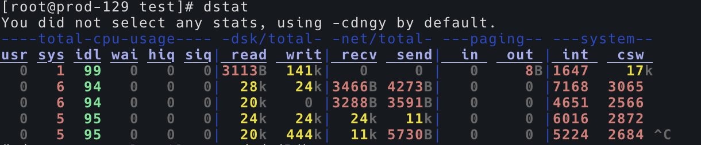

# 常用命令

## 通配符

当命令中有多个连续数字时，可用以下命令：

```
scp kiali1.9.tar admin@fueltank-{1,2,3,4,5}:/home/admin
```

有时候不能用通配符的原因是没权限。

## netstat

常用组合：

n参数表示显示数字

```bash
$ netstat -tulpn
```

## journalctl

查看全部系统日志，注意这个命令在使用 `shift + g` 时容易卡死，因为日志太多，翻到底部造成卡死

```bash
$ journalctl
```

可以使用 -n 参数来指定查看末尾的多少行，如：

```bash
$ journalctl -n 200
```

查看某个服务的详细日志：

```bash
$ journalctl -u kibana
```

Failed to execute action {:action=>LogStash::PipelineAction::Create/pipeline_id:main, :exception=>"LogStash::ConfigurationError", :message=>"Expected one of [A-Za-z0-9_-], [ \\t\\r\\n], \"#\", \"{\", [A-Za-z0-9_], \"}\" at line 21, column 28 (byte 372) after output {\n  if [@metadata][beat] ==

## kill

查看信号列表：

```bash
$ kill -l
 1) SIGHUP	 2) SIGINT	 3) SIGQUIT	 4) SIGILL	 5) SIGTRAP
 6) SIGABRT	 7) SIGBUS	 8) SIGFPE	 9) SIGKILL	10) SIGUSR1
11) SIGSEGV	12) SIGUSR2	13) SIGPIPE	14) SIGALRM	15) SIGTERM
16) SIGSTKFLT	17) SIGCHLD	18) SIGCONT	19) SIGSTOP	20) SIGTSTP
21) SIGTTIN	22) SIGTTOU	23) SIGURG	24) SIGXCPU	25) SIGXFSZ
26) SIGVTALRM	27) SIGPROF	28) SIGWINCH	29) SIGIO	30) SIGPWR
31) SIGSYS	34) SIGRTMIN	35) SIGRTMIN+1	36) SIGRTMIN+2	37) SIGRTMIN+3
38) SIGRTMIN+4	39) SIGRTMIN+5	40) SIGRTMIN+6	41) SIGRTMIN+7	42) SIGRTMIN+8
43) SIGRTMIN+9	44) SIGRTMIN+10	45) SIGRTMIN+11	46) SIGRTMIN+12	47) SIGRTMIN+13
48) SIGRTMIN+14	49) SIGRTMIN+15	50) SIGRTMAX-14	51) SIGRTMAX-13	52) SIGRTMAX-12
53) SIGRTMAX-11	54) SIGRTMAX-10	55) SIGRTMAX-9	56) SIGRTMAX-8	57) SIGRTMAX-7
58) SIGRTMAX-6	59) SIGRTMAX-5	60) SIGRTMAX-4	61) SIGRTMAX-3	62) SIGRTMAX-2
63) SIGRTMAX-1	64) SIGRTMAX
```

## set

暂时禁用 history，禁用后，history和上下键看不到历史命令

```
set +o history
```

打开 history

```
set -o history
```

### 删除操作

先把要删除的文件记录到一个文件里边

```
sudo ls /nsm/moloch/raw/ | grep 200101 > rm-SecOnion-200101
```

然后写脚本删除：

```
for i in `cat rm-SecOnion-200101`; do sudo rm /nsm/moloch/raw/$i; done
```

这样的好处是记录了删除了的文件名

### 查看内存

```bash
[secops@IDS-node2 ~]$ free -h
              total        used        free      shared  buff/cache   available
Mem:            31G        5.4G        945M         13M         24G         25G
Swap:           15G         97M         15G
```

### 清空 buff/cache 内存

需要使用 sh -c

```bash
$ sudo sh -c 'echo 3 > /proc/sys/vm/drop_caches'
```

### 防火墙相关

Centos 7 以后使用 firewalld 服务管理防火墙，对应的命令为 firewall-cmd

```bash
$ systemctl status firewalld
$ firewall-cmd --query-port=9300/tcp    #提示no表示未开
$ firewall-cmd --add-port=666/tcp --permanent   #提示    success 表示成功
$ firewall-cmd --reload    #比如添加规则之后，需要执行此命令
```

ubuntu 系列为 ufw,

```bash
$ sudo ufw status
$ sudo ufw allow 9300/tcp
```

### iproute2 系列配置工具

iproute2是linux下管理控制TCP/IP网络和流量控制的新一代工具包，旨在替代老派的工具链net-tools，即大家比较熟悉的ifconfig，arp，route，netstat等命令。

要说这两套工具本质的区别，应该是net-tools是通过procfs(/proc)和ioctl系统调用去访问和改变内核网络配置，而iproute2则通过netlink套接字接口与内核通讯。

其次，net-tools的用法给人的感觉是比较乱，而iproute2的用户接口相对net-tools来说相对来说，更加直观。比如，各种网络资源（如link、IP地址、路由和隧道等）均使用合适的对象抽象去定义，使得用户可使用一致的语法去管理不同的对象。

所以，net-tools和iproute2都需要去学习掌握了。

iproute2的核心命令是`ip`:


除了 `ip` 还有 `ss`

`ss`是**S**ocket **S**tatistics的缩写，是用于统计socket信息。几乎所有的Linux系统都会默认包含netstat命令，但并非所有的系统都会默认包含ss命令。netstat是net-tool的成员，而ss是iproute2的成员，如果出现无法使用ss命令时，可以使用

另外还有 `tc` 命令

# 统计行数

```bash
$ cat abc.txt | wc -l
```


# 挂载硬盘

查看硬盘列表

```bash
$ sudo fdisk -l
```

创建目录：

```bash
$ sudo mkdir /mnt/vde
```

挂载：

```bash
$ sudo mount /dev/vde /mnt/vde
```

开机自动挂载：

```bash
$ sudo vim /etc/rc.d/rc.local
mount /dev/vde /mnt/vde
```

也可以通过写入 /etc/fstab 文件如下内容来开机自动挂载：

```
/dev/vdb /data ext4 auto  0 0
```

测试  /etc/fstab 文件是否生效：

```bash
$ sudo mount -a
```


#### uuid

查看磁盘的 uuid：

```
sudo blkid /dev/sda1
ls -l /dev/disk/by-uuid/
```

在 /etc/fstab 中使用 uuid ，而不是使用盘符的好处是，在机器重启时，盘符有可能错乱，而 uuid 是唯一的。

在 /etc/fstab 中这样写：

```
UUID=17ea981d-a314-482e-9755-f4e4549c4def /data1     xfs     defaults        0 0
UUID=110925ac-465e-4800-b21e-7a2a210c8f41 /data2     xfs     defaults        0 0
```


NTFS 格式的硬盘挂载：https://blog.csdn.net/scorpio3k/article/details/48633351

先源码安装 ntfs-3g:

```bash
$ tar -zxvf tar ntfs-3g_ntfsprogs-2013.1.13.tgz 
$ cd ntfs-3g_ntfsprogs-2013.1.13
$ sudo ./configure
$ sudo make
$ sudo make install
```

挂载：

```bash
$ mount -t ntfs-3g /dev/sd2 /samu/sd2/
```


# 查看目录大小

```
$ sudo du -sh /var/lib/docker
```


## sudo 技巧记录

`sudo -s` 可以让之后的命令都带上 sudo 权限


## tar 记录

```bash
$ tar -xf all.tar
$ tar -xvf linux-4.4.215.tar.xz
$ gzip -d XXX.gz
$ tar -xvf nginx-ingress-1.41.3.tgz 
```


## 强删网卡

```bash
$ sudo ip link del flannel.1
```

另：https://blog.51cto.com/goodegg/1709787


## 监控 iptables 流量

```bash
$ sudo watch -n 1 iptables -vL cali-FORWARD
```


## tcpdump

```bash
$ sudo tcpdump host fueltank-3.cloud.bbdops.com -i cali91e89095379
```

## 输出当前 PID

```bash
$ echo $$
```

## 命令别名

```bash
$ alias la="ls -al --color=auto"
$ alias ll="ls -al --color=auto"
```

## 查看时间状态：

在系统初始化时看一下

```bash
$ timedatectl status
```

## 反解 BASE64

```bash
$ echo YmFy | base64 -d
```

## BASE64 编码

```bash
$ echo "aaa" | base64
```


## JSON 格式化

```bash
$ echo '{"header":{"cluster_id":7547750694637828692,"member_id":9756569466652966434,"revision":558387,"raft_term":6440},"kvs":[{"key":"Zm9v","create_revision":242905,"mod_revision":558355,"version":2,"value":"YmFy"}],"count":1}' | json_reformat 
{
    "header": {
        "cluster_id": 7547750694637828692,
        "member_id": 9756569466652966434,
        "revision": 558387,
        "raft_term": 6440
    },
    "kvs": [
        {
            "key": "Zm9v",
            "create_revision": 242905,
            "mod_revision": 558355,
            "version": 2,
            "value": "YmFy"
        }
    ],
    "count": 1
}
```

## 后台运行，并重定向日志

```bash
$ etcd > etcd.log 2>&1 &
```

## 查看命令别名

```
$ alias
```

## 查看程序的依赖库

```
$ ldd /usr/bin/docker
        linux-vdso.so.1 =>  (0x00007ffe895d9000)
        libpthread.so.0 => /lib64/libpthread.so.0 (0x00007f6e41253000)
        libdl.so.2 => /lib64/libdl.so.2 (0x00007f6e4104f000)
        libc.so.6 => /lib64/libc.so.6 (0x00007f6e40c81000)
        /lib64/ld-linux-x86-64.so.2 (0x00007f6e46049000)
```

## 查看 TCP 连接数

```bash
$ sudo netstat -anp | grep ESTABLISHED | wc -l
```


## 挂载文件系统选项nodiratime、noatime

参考：https://blog.csdn.net/jc_benben/article/details/78224212

/etc/fstab文件的详解：https://blog.csdn.net/youmatterhsp/article/details/83933158


## grep 的使用

忽略大小写：

```bash
$ grep -i mount
```

查看上下五行：

``` bash
$ grep -i mount -A 5 -B 5
```

相当于：

```bash
$ grep -i mount -C 5
```


## 查看磁盘

```bash
$ lsblk
```


## 避免’sudo echo x >’（sudo 重定向） 时’Permission denied’

1.

```bash
sudo sh -c "echo a > 1.txt"
```

2.

```bash
echo a |sudo tee 1.txt
echo a |sudo tee -a 1.txt   // -a 是追加的意思，等同于 >>
```


## 更新系统的 CA 证书

```bash
$ sudo update-ca-trust
```

会创建以下文件：

```
/etc/pki/ca-trust/extracted/openssl/ca-bundle.trust.crt
/etc/pki/ca-trust/extracted/pem/tls-ca-bundle.pem
/etc/pki/ca-trust/extracted/pem/email-ca-bundle.pem
/etc/pki/ca-trust/extracted/pem/objsign-ca-bundle.pem
/etc/pki/ca-trust/extracted/java/cacerts
```


## tar 操作

tar 压缩目录

```bash
$ tar -czvf myetc.tar.gz etc
```

tar 包解开：

```
$ tar -xf mysql.tar
```


## 支持断点续传的 SCP

```bash
$ rsync -P -e 'ssh -p 51668' bbders@10.28.52.47:/home/bbders/wgj_lf_1.tar.gz wgj_lf.tar.gz
```


## 一直查看文件内容

```bash
$ ping www.baidu.com > test.log &
$ tail -f test.log
```


## 设置主机名

查看主机名：

```bash
$ hostname
```

设置主机名：

```bash
$ hostnamectl set-hostname server08
```


## 查看网络速率

```bash
$ iftop
```


## 拷贝命令

在拷贝非常多的小文件时，cp 就很慢，使用以下命令：

```bash
$ rsync -av fb all/
```


## 设置主机名

重启也会生效。

```bash
$ hostnamectl set-hostname xujiyou
```


## 移动命令

在小文件非常多时，想把本目录的文件全部移动到上一级目录：

```bash
$ ls | xargs -t -I {} mv {} ../
```

后台执行：

```bash
$ nohup bash -c "ls | xargs -t -I {} mv {} ../" &
```

后台执行查看进度：

```bash
$ tail -f nohup.out
```


## 查看inode使用情况

```bash
$ df -i
```


## 查看文件系统类型

```bash
$ df -Th
```


## SSH 端口映射

```bash
$ ssh -L 19000:localhost:19000 root@103.44.252.132
```


## 查看当前系统总体情况

非常强大的一个命令

```
$ dstat
```



cpu：hiq、siq分别为硬中断和软中断次数。

system：int、csw分别为系统的中断次数（interrupt）和上下文切换（context switch）。

```bash
$ dstat --list # 查看能使用的所有参数
internal:
	aio, cpu, cpu24, disk, disk24, disk24old, epoch, fs, int, int24, io, ipc, load, lock, mem, net, page, page24, proc, raw, socket, swap, swapold, sys, tcp, time, udp, unix, vm
/usr/share/dstat:
	battery, battery-remain, cpufreq, dbus, disk-tps, disk-util, dstat, dstat-cpu, dstat-ctxt, dstat-mem, fan, freespace, gpfs, gpfs-ops, helloworld, innodb-buffer, innodb-io, innodb-ops, lustre,
	memcache-hits, mysql-io, mysql-keys, mysql5-cmds, mysql5-conn, mysql5-io, mysql5-keys, net-packets, nfs3, nfs3-ops, nfsd3, nfsd3-ops, ntp, postfix, power, proc-count, qmail, rpc, rpcd, sendmail,
	snooze, squid, test, thermal, top-bio, top-bio-adv, top-childwait, top-cpu, top-cpu-adv, top-cputime, top-cputime-avg, top-int, top-io, top-io-adv, top-latency, top-latency-avg, top-mem, top-oom,
	utmp, vm-memctl, vmk-hba, vmk-int, vmk-nic, vz-cpu, vz-io, vz-ubc, wifi
```

比如：

```bash
$ dstat -tsp --socket --fs
```


## 清空 nohup.out 

在使用 nohup 时，会发生 nohup.out 很大的情况，不能直接删除这个文件，如果直接删除了，会导致后续程序输出再也找不到了，下面这个命令这个解决这个问题：

```bash
$ cat /dev/null > nohup.out
```


## 查看文件，而不看注释

即不看以 # 开头的行。

```bash
$ cat /etc/vsftpd/vsftpd.conf |grep -v '^#';
```


## 文件太多，怎么 ls

在文件太多的情况下，ls 会被卡住，可以使用以下命令只查看头部几个：

```bash
$ ls -1 -f /data1/imgs/test | head
```


## CentOS 8 重启网络

在 CentOS 8 中，`systemctl restart network` 已失效，可使用以下方法：

```bash
$ nmcli c up enp9s0
```


添加路由

```
$ route add -net 192.168.0.0/24 gw 192.168.0.1
```


## 查看磁盘使用率

```bash
$ iostat -cxmNd 5 5
$ iostat -dx 5 5 # 看设备使用率（%util）、响应时间（await）
$ iostat -dk 5 5 # 看tps，tps是每秒传输次数

Device:         rrqm/s   wrqm/s     r/s     w/s    rkB/s    wkB/s avgrq-sz avgqu-sz   await  svctm  %util
sda               0.02     7.25    0.04    1.90     0.74    35.47    37.15     0.04   19.13   5.58   1.09
dm-0              0.00     0.00    0.04    3.05     0.28    12.18     8.07     0.65  209.01   1.11   0.34
dm-1              0.00     0.00    0.02    5.82     0.46    23.26     8.13     0.43   74.33   1.30   0.76
dm-2              0.00     0.00    0.00    0.01     0.00     0.02     8.00     0.00    5.41   3.28   0.00
```

打印的第一次往往不准确，所以这里打印5次，间隔5秒。

- 如果%iowait的值过高，表示硬盘存在I/O瓶颈。
- 如果 %util 接近 100%，说明产生的I/O请求太多，I/O系统已经满负荷，该磁盘可能存在瓶颈。
- 如果 svctm 比较接近 await，说明 I/O 几乎没有等待时间；
- 如果 await 远大于 svctm，说明I/O 队列太长，io响应太慢，则需要进行必要优化。
- 如果avgqu-sz比较大，也表示有大量io在等待。


## 关闭 iptables

```bash
$ chkconfig iptables off
```


## 查看块大小

查看文件系统块大小：

```bash
$ tune2fs -l /dev/sda1|grep "Block size"
```

查看内存块大小：

```bash
$ getconf PAGESIZE
```

单位都是字节。

tune2fs 专门用于 ext 系列文件系统，如果是其他文件系统可以使用：

```bash
$ stat -f /data1
  File: "/data1"
    ID: 81000000000 Namelen: 255     Type: xfs
Block size: 4096       Fundamental block size: 4096
Blocks: Total: 732208948  Free: 727095534  Available: 727095534
Inodes: Total: 293026624  Free: 293026506
```

**stat命令**用于显示文件的状态信息

除了 tune2fs 用于显示 ext 文件系统的信息外，dumpe2fs 也可以显示 ext 系列的文件系统，并且还会显示块组的信息。


## ARP 广播虚拟IP

```bash
$ arping -I ens192 -c 10 -s 192.168.112.160 192.168.112.156
```

192.168.112.160 是虚拟 ip，这条命令的意思是告诉 192.168.112.156，192.168.112.160 的 mac 地址就是 ens192 网卡所在的 mac 地址。


## 检测丢包率

```bash
mtr -r 10.28.92.11
```


## 格式化磁盘

```bash
$ sudo dd if=/dev/zero of=/dev/sdd bs=1M count=1024
```


## 测网速

```bash
$ iperf3 -c 192.168.1.2
```


## XFS 修复

```bash
$ xfs_repair -L  /dev/sdg
```


## 拷贝带上权限

```bash
$ cp -p 
```


## 切割文件

```bash
$ split -l 43652567 qq_2020-09-29.csv split_file_qq
```


## 在文件第一行添加数据

```bash
$ sed '1i\first line' split_file_qqac > split_file_qqac.csv
```


## 设置时区

```bash
$ sudo timedatectl set-timezone Asia/Shanghai
```


## 测试两点间的带宽

安装：

```bash
$ sudo yum install iperf3
```

对于服务端需要注意，需要确保本地的 5201 端口没有被其它进程占用：

```
netstat -nltp | grep 5201
```

服务端：

```bash
$ iperf3 -s # 或 iperf3 -p <port> -s
```

客户端：

```bash
$ iperf3 -c <server-address> # iperf3 -p <port> -c <server-address>
```


## 让进程运行在指定的CPU

**使用taskset命令绑定进程到CPU上，避免进程在多个处理器之间切换，引起cache刷新。**

对运行中的进程，把CPU#1 #2 #3分配给PID为2345的进程：

```
# taskset -cp 1,2,3 2345
```


## Sed 替换文件中的字符串

```bash
$ sed -i "s/oldstring/newstring/g" file
```

-i 表示直接替换file中的字符串，如果不加 -i 就会把替换结果打印到屏幕上。


## 查看文件夹大小

```bash
$ sudo du -h --max-depth=1 /
```


## [执行umount 的时候却提示:device is busy 的处理方法](https://www.cnblogs.com/xuey/p/7878529.html)

```bash
$ sudo fuser -m /data2
/data2:              21476c 30111c
$ sudo ps aux |grep 21476
$ kill -9 21476 30111
$ sudo fuser -m /data2
$ sudo umount /data2
```


