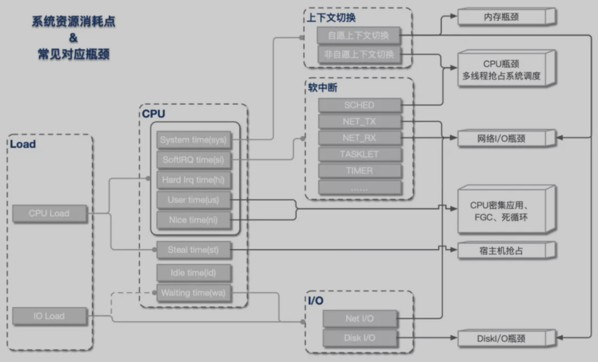
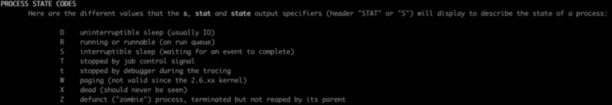
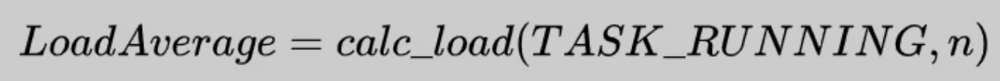
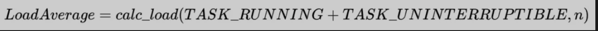
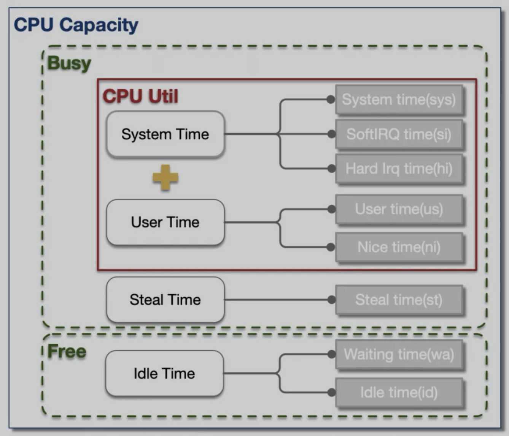
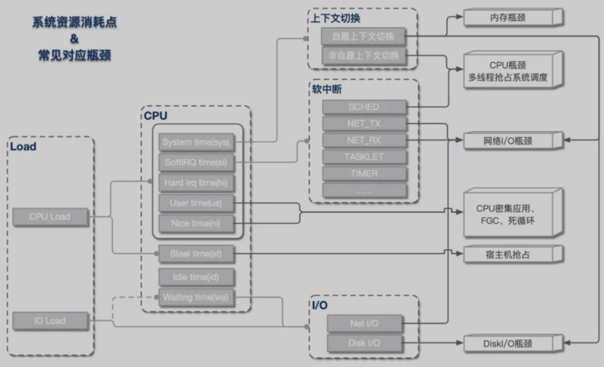

# CPU 占用高性能问题排查





**一 背景知识**


LINUX进程状态


LINUX 2.6以后的内核中，进程一般存在7种基础状态：D-不可中断睡眠、R-可执行、S-可中断睡眠、T-暂停态、t-跟踪态、X-死亡态、Z-僵尸态，这几种状态在PS命令中有对应解释。





- D (TASK_UNINTERRUPTIBLE)，不可中断睡眠态。顾名思义，位于这种状态的进程处于睡眠中，并且不允许被其他进程或中断(异步信号)打断。因此这种状态的进程，是无法使用kill -9杀死的(kill也是一种信号)，除非重启系统(没错，就是这么头硬)。不过这种状态一般由I/O等待(比如磁盘I/O、网络I/O、外设I/O等)引起，出现时间非常短暂，大多很难被PS或者TOP命令捕获(除非I/O HANG死)。SLEEP态进程不会占用任何CPU资源。


- R (TASK_RUNNING)，可执行态。这种状态的进程都位于CPU的可执行队列中，正在运行或者正在等待运行，即不是在上班就是在上班的路上。


- S (TASK_INTERRUPTIBLE)，可中断睡眠态。不同于D，这种状态的进程虽然也处于睡眠中，但是是允许被中断的。这种进程一般在等待某事件的发生（比如socket连接、信号量等），而被挂起。一旦这些时间完成，进程将被唤醒转为R态。如果不在高负载时期，系统中大部分进程都处于S态。SLEEP态进程不会占用任何CPU资源。


- T&t (__TASK_STOPPED & __TASK_TRACED)，暂停or跟踪态。这种两种状态的进程都处于运行停止的状态。不同之处是暂停态一般由于收到SIGSTOP、SIGTSTP、SIGTTIN、SIGTTOUT四种信号被停止，而跟踪态是由于进程被另一个进程跟踪引起(比如gdb断点）。暂停态进程会释放所有占用资源。


- Z (EXIT_ZOMBIE), 僵尸态。这种状态的进程实际上已经结束了，但是父进程还没有回收它的资源（比如进程的描述符、PID等）。僵尸态进程会释放除进程入口之外的所有资源。


- X (EXIT_DEAD), 死亡态。进程的真正结束态，这种状态一般在正常系统中捕获不到。


Load Average & CPU使用率


谈到系统性能，Load和CPU使用率是最直观的两个指标，那么这两个指标是怎么被计算出来的呢？是否能互相等价呢？


**Load Average**


不少人都认为，Load代表正在CPU上运行&等待运行的进程数，即





但Linux系统中，这种描述并不完全准确。


以下为Linux内核源码中Load Average计算方法，可以看出来，因此除了可执行态进程，不可中断睡眠态进程也会被一起纳入计算，即：





- 
- 
- 
- 
- 
- 
- 
- 
- 
- 
- 
- 
- 
- 
- 
- 
- 
- 
- 
- 
- 
- 
- 
- 
- 

```
602staticunsignedlongcount_active_tasks(void)603 {604structtask_struct*p;605unsignedlongnr=0;606607read_lock(&tasklist_lock);608for_each_task(p) {609if ((p->state==TASK_RUNNING610 (p->state&TASK_UNINTERRUPTIBLE)))611nr+=FIXED_1;612 }613read_unlock(&tasklist_lock);614returnnr;615 }......625staticinlinevoidcalc_load(unsignedlongticks)626 {627unsignedlongactive_tasks; /* fixed-point */628staticintcount=LOAD_FREQ;629630count-=ticks;631if (count<0) {632count+=LOAD_FREQ;633active_tasks=count_active_tasks();634CALC_LOAD(avenrun[0], EXP_1, active_tasks);635CALC_LOAD(avenrun[1], EXP_5, active_tasks);636CALC_LOAD(avenrun[2], EXP_15, active_tasks);637 }638 }
```


在前文 Linux进程状态 中有提到过，不可中断睡眠态的进程(TASK_UNINTERRUTED)一般都在进行I/O等待，比如磁盘、网络或者其他外设等待。由此我们可以看出，Load Average在Linux中体现的是整体系统负载，即CPU负载 + Disk负载 + 网络负载 + 其余外设负载，并不能完全等同于CPU使用率(这种情况只出现在Linux中，其余系统比如Unix，Load还是只代表CPU负载)。


**CPU使用率**


CPU的时间分片一般可分为4大类：用户进程运行时间 - User Time, 系统内核运行时间 - System Time, 空闲时间 - Idle Time, 被抢占时间 - Steal Time。除了Idle Time外，其余时间CPU都处于工作运行状态。


通常而言，我们泛指的整体CPU使用率为User Time 和 Systime占比之和(例如tsar中CPU util)，即：


为了便于定位问题，大多数性能统计工具都将这4类时间片进一步细化成了8类，如下为TOP对CPU时间片的分类。


- us：用户进程空间中未改变过优先级的进程占用CPU百分比
- sy：内核空间占用CPU百分比
- ni：用户进程空间内改变过优先级的进程占用CPU百分比
- id：空闲时间百分比
- wa：空闲&等待I/O的时间百分比
- hi：硬中断时间百分比
- si：软中断时间百分比
- st：虚拟化时被其余VM窃取时间百分比


这8类分片中，除wa和id外，其余分片CPU都处于工作态。


**二 资源&瓶颈分析**


从上文我们了解到，Load Average和CPU使用率可被细分为不同的子域指标，指向不同的资源瓶颈。总体来说，指标与资源瓶颈的对应关系基本如下图所示。





Load高 & CPU高


这是我们最常遇到的一类情况，即load上涨是CPU负载上升导致。根据CPU具体资源分配表现，可分为以下几类：


**CPU sys高**


这种情况CPU主要开销在于系统内核，可进一步查看上下文切换情况。


- 如果非自愿上下文切换较多，说明CPU抢占较为激烈，大量进程由于时间片已到等原因，被系统强制调度，进而发生的上下文切换。


- 如果自愿上下文切换较多，说明可能存在I/O、内存等系统资源瓶颈，大量进程无法获取所需资源，导致的上下文切换。


**CPU si高**


这种情况CPU大量消耗在软中断，可进一步查看软中断类型。一般而言，网络I/O或者线程调度引起软中断最为常见：


- NET_TX & NET_RX。NET_TX是发送网络数据包的软中断，NET_RX是接收网络数据包的软中断，这两种类型的软中断较高时，系统存在网络I/O瓶颈可能性较大。


- SCHED。SCHED为进程调度以及负载均衡引起的中断，这种中断出现较多时，系统存在较多进程切换，一般与非自愿上下文切换高同时出现，可能存在CPU瓶颈。


**CPU us高**


这种情况说明资源主要消耗在应用进程，可能引发的原因有以下几类：


- 死循环或代码中存在CPU密集计算。这种情况多核CPU us会同时上涨。


- 内存问题，导致大量FULLGC，阻塞线程。这种情况一般只有一核CPU us上涨。


- 资源等待造成线程池满，连带引发CPU上涨。这种情况下，线程池满等异常会同时出现。


**Load高 & CPU低**


这种情况出现的根本原因在于不可中断睡眠态(TASK_UNINTERRUPTIBLE)进程数较多，即CPU负载不高，但I/O负载较高。可进一步定位是磁盘I/O还是网络I/O导致。


**三 排查策略**


利用现有常用的工具，我们常用的排查策略基本如下图所示：





从问题发现到最终定位，基本可分为四个阶段：


资源瓶颈定位


这一阶段通过全局性能检测工具，初步定位资源消耗异常位点。


常用的工具有：


- top、vmstat、tsar(历史)

- 中断：/proc/softirqs、/proc/interrupts
- I/O：iostat、dstat


热点进程定位


定位到资源瓶颈后，可进一步分析具体进程资源消耗情况，找到热点进程。


常用工具有：


- 上下文切换：pidstat -w
- CPU：pidstat -u
- I/O：iotop、pidstat -d
- 僵尸进程：ps


线程&进程内部资源定位


找到具体进程后，可细化分析进程内部资源开销情况。


常用工具有：


- 上下文切换：pidstat -w -p [pid]
- CPU：pidstat -u -p [pid]
- I/O: lsof


热点事件&方法分析


获取到热点线程后，我们可用trace或者dump工具，将线程反向关联，将问题范围定位到具体方法&堆栈。


常用的工具有：


- perf：Linux自带性能分析工具，功能类似hotmethod，基于事件采样原理，以性能事件为基础，支持针对处理器相关性能指标与操作系统相关性能指标的性能剖析。


- jstack

- 结合ps -Lp或者pidstat -p一起使用，可初步定位热点线程。
- 结合zprofile-threaddump一起使用，可统计线程分布、等锁情况，常用与线程数增加分析。


- strace：跟踪进程执行时的系统调用和所接收的信号。


- tcpdump：抓包分析，常用于网络I/O瓶颈定位。