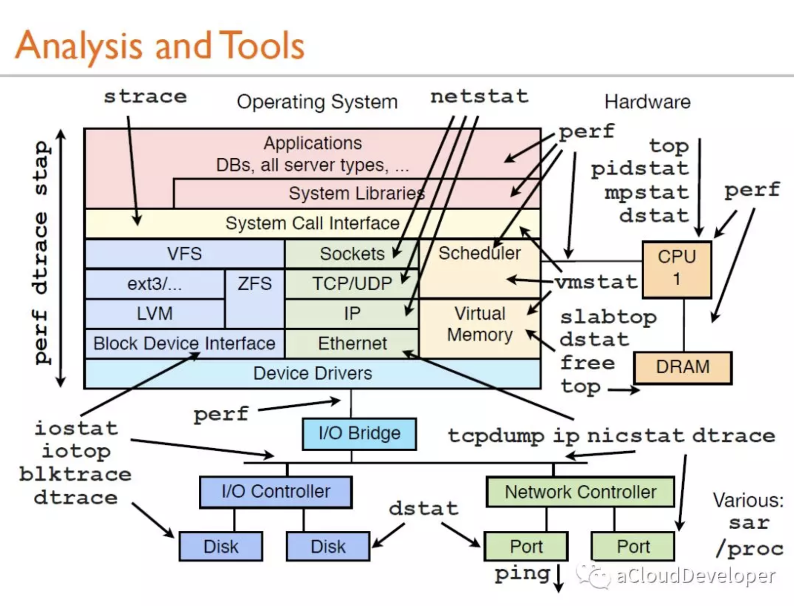

这篇来学习和记录 CPU性能分析。进行性能分析之前，首先得知道 CPU 有哪些信息，可以通过以下方法查看 CPU 配置信息。


## lscpu

在 Linux 下，类似 lsxxx 这样的命令都是用来查看基本信息的，如 ls 查看当前目录文件信息，lscpu 就用来查看 CPU 信息，类似还有 lspci 查看 PCI 信息，lsblk 查看磁盘信息，

```
$ lscpu 
Architecture:          x86_64
CPU op-mode(s):        32-bit, 64-bit
Byte Order:            Little Endian
CPU(s):                8
On-line CPU(s) list:   0-7
Thread(s) per core:    2
Core(s) per socket:    4
Socket(s):             1
NUMA node(s):          1
Vendor ID:             GenuineIntel
CPU family:            6
Model:                 60
Model name:            Intel(R) Core(TM) i7-4790K CPU @ 4.00GHz
Stepping:              3
CPU MHz:               800.000
CPU max MHz:           4400.0000
CPU min MHz:           800.0000
BogoMIPS:              7981.52
Virtualization:        VT-x
L1d cache:             32K
L1i cache:             32K
L2 cache:              256K
L3 cache:              8192K
NUMA node0 CPU(s):     0-7
Flags:                 fpu vme de pse tsc msr pae mce cx8 apic sep mtrr pge mca cmov pat pse36 clflush dts acpi mmx fxsr sse sse2 ss ht tm pbe syscall nx pdpe1gb rdtscp lm constant_tsc arch_perfmon 
pebs bts rep_good nopl xtopology nonstop_tsc aperfmperf pni pclmulqdq dtes64 monitor ds_cpl vmx est tm2 ssse3 sdbg fma cx16 xtpr pdcm pcid sse4_1 sse4_2 x2apic movbe popcnt tsc_deadline_timer aes xs
ave avx f16c rdrand lahf_lm abm invpcid_single kaiser tpr_shadow vnmi flexpriority ept vpid fsgsbase tsc_adjust bmi1 hle avx2 smep bmi2 erms invpcid rtm xsaveopt dtherm ida arat pln pts
```

解释下各项的意思：

- Architecture：CPU 架构

- CPU op-mode(s)：CPU 支持的位数

- Byte Order：字节序，我这里是小端序

- CPU(s)：CPU 逻辑数，由 Socket * Core * Thread 得来，我这里的 Socket(s) 为 1，Core(s) per socket 为 4，Thread(s) per core 为 2，所以 1 * 4 * 2 得 8。

- On-line CPU(s) list：在线的 CPU 核心列表，我这里全部在线

- Thread(s) per core：每个核心的线程数，线程数是个逻辑概念，简单地说，就是模拟出的CPU核心数，是使用超线程技术模拟出来的

- Core(s) per socket：每个 Socket 上的 CPU 核心数量

- Socket(s)：Socket就是主板上插CPU的槽的数量

- NUMA node(s)：由于多核CPU会共享数据总线，所以多核CPU的性能并不是线性增长的，这时 Intel 就采用了 NUMA，将多个 CPU 划分为多个 Node ，每个 Node 由自己的总线和内存。

- Vendor ID：CPU 的 ID，用来区分 CPU 的牌子，这里表示 Inter，还有牌子：

  ```
  CYRIX：CyrixInstead
  AMD：AuthenticAMD
  UMC：UMC UMC UMC
  NEXGEN：NexGenDriven
  CENTAUR：CentaurHauls
  RISE：RiseRiseRise
  TRANSMETA：GenuineTMx86
  TRANSMETA：TransmetaCPU
  NSC：Geode by NSC
  SiS：SiS SiS SiS
  ```

- CPU MHz：主频，越高越好
- BogoMIPS：BogoMIPS 是 Linus 本人的独创，Bogo 意思是“假的，伪造的”，MIPS 意思是“Millions of Instructions Per Second”，如果系统启动时，计算出 BogoMIPS 为 100，可记为 100万条伪指令每秒。之所以叫伪指令，是因为在计算 BogoMIPS 的值时，CPU 一直在单一的执行 NOP （空操作），而不是随机执行指令集中的任意指令，所以不能以此作为 CPU 的性能指标。
- Virtualization：支持的虚拟化
- cache： 多级缓存


## **/proc/cpuinfo**

这个文件的信息和 lscpu 显示的信息基本一致，只不过是分开显示的。


## dmidecode

这个命令是用来获取 DMI（Desktop Management Interface）硬件信息的，包括 BIOS、系统、主板、处理器、内存、缓存等等。对于 CPU 信息，可以使用 dmidecode -t processor 来查看。

```
$ dmidecode -t processor
Getting SMBIOS data from sysfs.
SMBIOS 2.7 present.

Handle 0x0041, DMI type 4, 42 bytes
Processor Information
        Socket Designation: SOCKET 0
        Type: Central Processor
        Family: Core i7
        Manufacturer: Intel
        ID: C3 06 03 00 FF FB EB BF
        Signature: Type 0, Family 6, Model 60, Stepping 3
        Flags:
                FPU (Floating-point unit on-chip)
                VME (Virtual mode extension)
                DE (Debugging extension)
                PSE (Page size extension)
                TSC (Time stamp counter)
                MSR (Model specific registers)
                PAE (Physical address extension)
                MCE (Machine check exception)
                CX8 (CMPXCHG8 instruction supported)
                APIC (On-chip APIC hardware supported)
                SEP (Fast system call)
                MTRR (Memory type range registers)
                PGE (Page global enable)
                MCA (Machine check architecture)
                CMOV (Conditional move instruction supported)
                PAT (Page attribute table)
                PSE-36 (36-bit page size extension)
                CLFSH (CLFLUSH instruction supported)
                DS (Debug store)
                ACPI (ACPI supported)
                MMX (MMX technology supported)
                FXSR (FXSAVE and FXSTOR instructions supported)
                SSE (Streaming SIMD extensions)
                SSE2 (Streaming SIMD extensions 2)
                SS (Self-snoop)
                HTT (Multi-threading)
                TM (Thermal monitor supported)
                PBE (Pending break enabled)
        Version: Intel(R) Core(TM) i7-4790K CPU @ 4.00GHz
        Voltage: 1.1 V
        External Clock: 100 MHz
        Max Speed: 7000 MHz
        Current Speed: 4100 MHz
        Status: Populated, Enabled
        Upgrade: Other
        L1 Cache Handle: 0x0004
        L2 Cache Handle: 0x0005
        L3 Cache Handle: 0x0006
        Serial Number: Not Specified
        Asset Tag: Fill By OEM
        Part Number: Fill By OEM
        Core Count: 4
        Core Enabled: 1
        Thread Count: 2
        Characteristics:
                64-bit capable
```


## Top

top 命令中关于 CPU 的由两块：

- load average：三个数字分别表示最近 1 分钟，5 分钟和 15 分钟的负载，数值越大负载越重。一般要求不超过核数，比如对于单核情况要 < 1。如果机器长期处于高于核数的情况，说明机器 CPU 消耗严重了。
- 每个进程的使用情况：这里可以罗列每个进程的使用情况，包括内存和 CPU 的，如果要看某个具体的进程，可以使用 top -p pid 查看。
- %Cpu(s)：表示当前 CPU 的使用情况，如果要查看所有核（逻辑核）的使用情况，可以**按下数字 “1” 查看**。这里有几个参数，表示如下：

```
- us    用户空间占用 CPU 时间比例
- sy    系统占用 CPU 时间比例
- ni    用户空间改变过优先级的进程占用 CPU 时间比例
- id    CPU 空闲时间比
- wa    IO等待时间比（IO等待高时，可能是磁盘性能有问题了）
- hi    硬件中断
- si    软件中断
- st    steal time
```

us 和 sy 是相对的，us 越高越好，当然 sy 也不是不务正业，它是必须的。


## vmstat

这个命令基本能看出当前机器的运行状态和问题，非常强大。可以使用 vmstat n 后面跟一个数字，表示每隔 ns 显示系统的状态，信息包括 CPU、内存和 IO 等。

几个关键的字段：

- r 值：表示在 CPU 运行队列中等待的进程数，如果这个值很大，表示很多进程在排队等待执行，CPU 压力山大。
- in 和 cs 值：表示中断次数和上下文切换次数，这两个值越大，表示系统在进行大量的进程（或线程）切换。切换的开销是非常大的，这时候应该减少系统进程（或线程）数。
- us、sy、id、wa 值：这些值上面也提到过，分别表示用户空间进程，系统进程，空闲和 IO 等待的 CPU 占比，这里只有 id 很高是好的，表示系统比较闲，其他值飚高都不好。

这个工具强大之处在于它不仅可以分析 CPU，还可以分析内存、IO 等信息，犹如瑞士军刀。


## 总结

下面放一张图，来自 Linux 大牛，Netflix 高级性能架构师 **Brendan Gregg**。看完了，你也许会感叹“这世界太疯狂了（just crazy）”。




