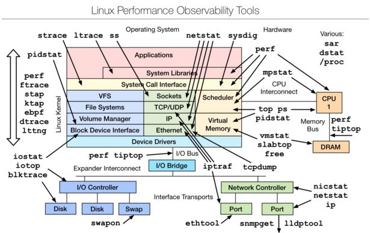
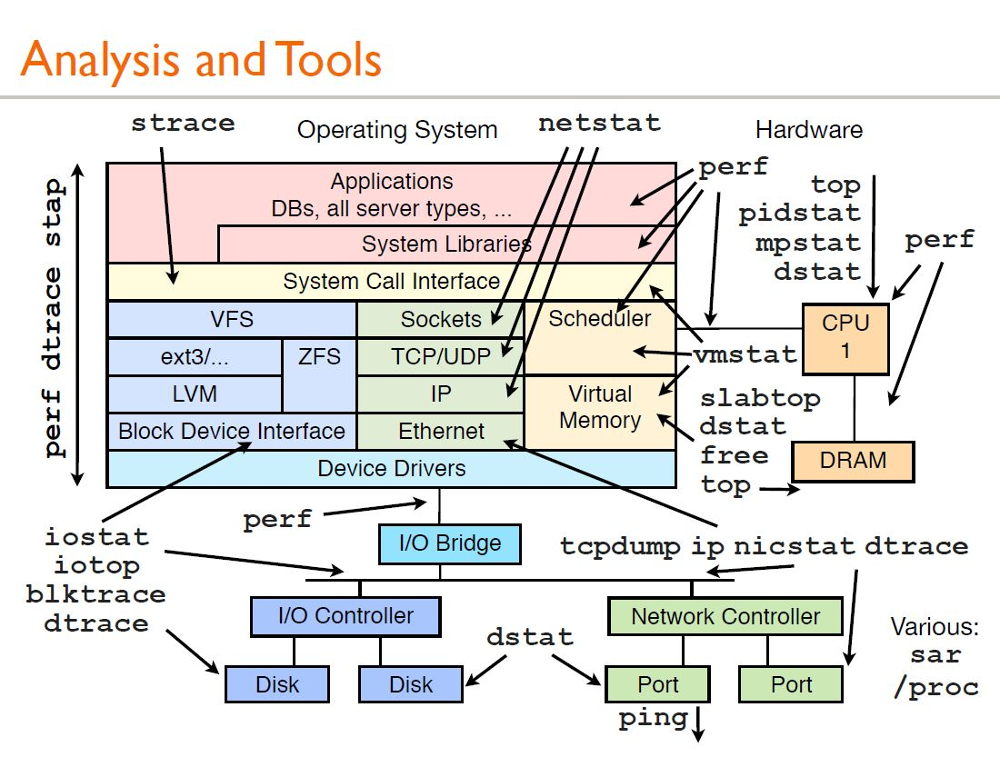
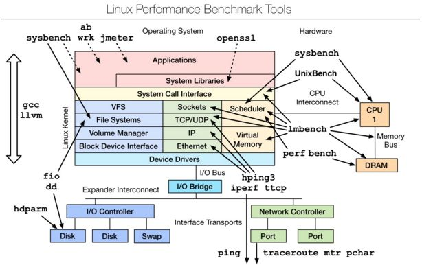
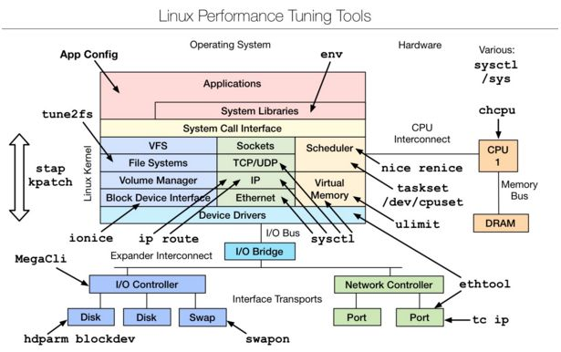
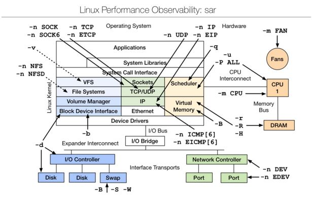

Linux 系统层面的性能分析，一般包括这几个方面：CPU、内存、磁盘IO、网络、文件系统等。另外还包括一些内核参数调优、优先级等。

需要掌握一些工具的使用，帮助我们分析。

参考下面几张图


##  Linux observability tools | Linux 性能观测工具



首先学习的Basic Tool有如下： uptime、top(htop)、mpstat、isstat、vmstat、free、ping、nicstat、dstat.

高级的命令如下： sar、netstat、pidstat、strace、tcpdump、blktrace、iotop、slabtop、sysctl、/proc。

安装部分工具：

```bash
$ sudo yum install sysstat
```


还有一张图：



#### mpstat

**mpstat命令** 指令主要用于多CPU环境下，它显示各个可用CPU的状态系你想。这些信息存放在`/proc/stat`文件中。在多CPUs系统里，其不但能查看所有CPU的平均状况信息，而且能够查看特定CPU的信息。

默认显示所有CPU核心的统计信息：

```
$ mpstat 
Linux 5.7.6-1.el7.elrepo.x86_64 (server-01)     12/10/2020      _x86_64_        (32 CPU)

02:04:53 PM  CPU    %usr   %nice    %sys %iowait    %irq   %soft  %steal  %guest  %gnice   %idle
02:04:53 PM  all   17.01    0.00    6.23    0.93    0.00    0.18    0.00    0.00    0.00   75.64
```

可以显示某个具体核心的：

```
$ mpstat -P 4
Linux 5.7.6-1.el7.elrepo.x86_64 (server-01)     12/10/2020      _x86_64_        (32 CPU)

02:05:15 PM  CPU    %usr   %nice    %sys %iowait    %irq   %soft  %steal  %guest  %gnice   %idle
02:05:15 PM    4   18.17    0.00    7.34    0.72    0.00    0.39    0.00    0.00    0.00   73.38
```

每5秒执行一次，共执行5次：

```
$ mpstat -P 4 5 5
Linux 5.7.6-1.el7.elrepo.x86_64 (server-01)     12/10/2020      _x86_64_        (32 CPU)

02:06:53 PM  CPU    %usr   %nice    %sys %iowait    %irq   %soft  %steal  %guest  %gnice   %idle
02:06:58 PM    4    7.63    0.00    8.45    0.00    0.00    0.00    0.00    0.00    0.00   83.92
02:07:03 PM    4   11.13    0.00    7.42    0.41    0.00    0.21    0.00    0.00    0.00   80.82
02:07:08 PM    4    7.35    0.00    7.35    0.61    0.00    0.00    0.00    0.00    0.00   84.69
02:07:13 PM    4    9.61    0.00    9.00    0.00    0.00    0.20    0.00    0.00    0.00   81.19
02:07:18 PM    4    9.61    0.00    8.59    0.20    0.00    0.00    0.00    0.00    0.00   81.60
Average:       4    9.06    0.00    8.16    0.25    0.00    0.08    0.00    0.00    0.00   82.44
```


## Linux benchmarking tools | Linux 性能测评工具




## Linux tuning tools | Linux 性能调优工具



## Linux observability sar | linux性能观测工具



sar（System Activity Reporter系统活动情况报告）是目前LINUX上最为全面的系统性能分析工具之一，可以从多方面对系统的活动进行报告，包括：文件的读写情况、系统调用的使用情况、磁盘I/O、CPU效率、内存使用状况、进程活动及IPC有关的活动等方面。


