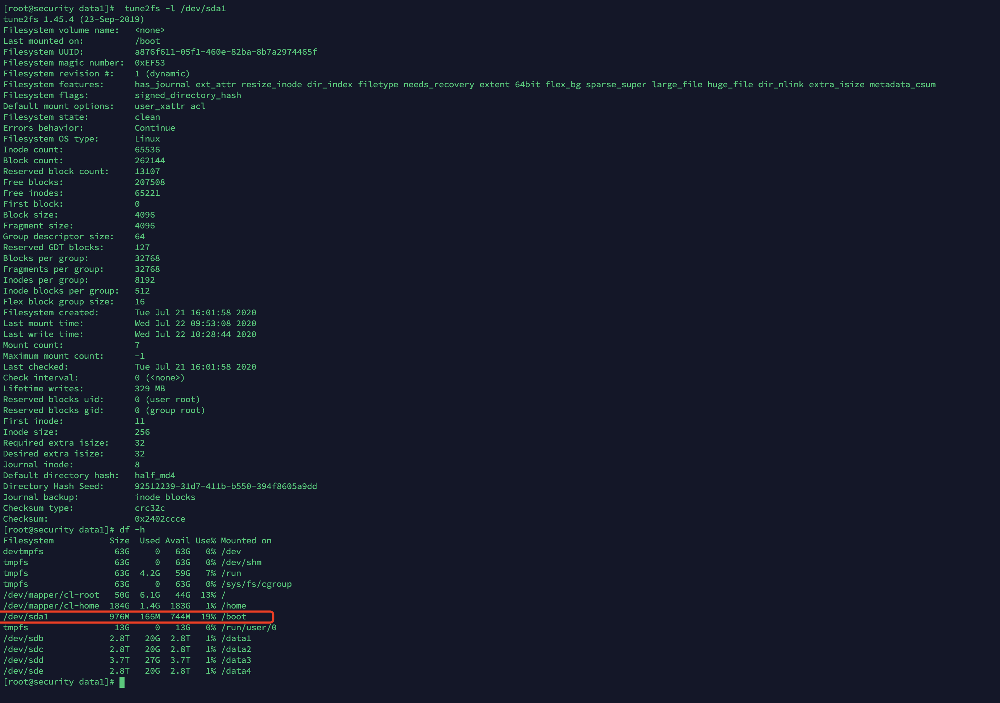

在一个磁盘中，存放的小文件太多了，在移动文件时如下以下错误：

```bash
$ mv * ../
mv: 无法将"927274679.jpg" 移动至"../927274679.jpg": 设备上没有空间
mv: 无法将"934427924.jpg" 移动至"../934427924.jpg": 设备上没有空间
```

英文错误是 ：No space left on device


## 排查

查看磁盘容量，发现空闲还很多：

```bash
$ df -Th
/dev/sdm                ext4      826G  110G  674G   14% /data1
```

查看磁盘的 inode 数量，发现也没用完，用了 30%，说明不是 inode 超出的问题：

```bash
$ df -Ti
/dev/sdm                ext4      54943744 16335331  38608413      30% /data1
```

查看 /data1/imgs/all 内的文件数量：

```bash
$ cd /data1/imgs/all
$ ls -l |grep "^-"|wc -l
10207682
```

这个数量和使用的 inode 数量是说得通的，因为 /data1/imgs/all 中文件最多，其他目录中也有文件。


查看有没有被删除的文件，看看是不是因为没释放导致的：

```bash
$ lsof -n /data1 |grep delete
```

发现没有被删除的文件，说明不是因为进程占用文件，强制停止进程的问题。


## 真正的错误原因

查看 `/var/log/message` 日志，发现了这么一条错误：

```
Jul 13 10:22:56 prod-129 kernel: EXT4-fs warning (device sdm): ext4_dx_add_entry:2022: Directory index full!
```

可以明显看出，ext4 文件系统的 Directory index（目录索引）占满了！


## 解决方法

这个目录索引应该是用来提高查找文件的速度的，我这里想暂时禁用掉这个功能。

参考：https://access.redhat.com/solutions/29894

关于 dir_index：https://bean-li.github.io/EXT4_DIR_INDEX/

查看文件系统特性：

```bash
$ tune2fs -l /dev/sdm | grep features
Filesystem features:      has_journal ext_attr resize_inode dir_index filetype needs_recovery extent 64bit flex_bg sparse_super large_file huge_file uninit_bg dir_nlink extra_isize
```

发现其中有 `dir_index` 

在创建文件系统时，会有默认的特性选项，默认选项见配置文件：`/etc/mke2fs.conf`

在 ext4 中，目录最多可以有64000个子目录。查看所有的子目录数量：

```bash
$ cd /data1
$ ls -lR | grep "^d" | wc -l
65819
```

确实是超过了限制。

禁掉磁盘的 `dir_index` 文件系统选项，-O 表示添加或禁掉选项，加上 ^ 表示禁掉，不加 ^ 表示添加，先禁掉：

```bash
$ tune2fs -O ^dir_index /dev/sdm 
```

这样禁掉后，移动文件就可以了。

移动完文件后，重新创建 `dir_index`：

```bash
$ tune2fs -O dir_index /dev/sdm 
```


## 建议

关于文件夹中有太多小文件的讨论：https://qastack.cn/unix/411091/millions-of-small-text-files-in-a-folder

根据讨论来看，即使有千万小文件，再保存更多文件也是没有性能问题的，但是 ls ，mv 使用通配符等需要遍历的操作会变得非常慢。

我实际测试，在 /data1/imgs/all 中写入文件挺快的。

程序里面有遍历目录相关的操作？

解决方案：一种方案是分子目录；另一种方案是用 MinIO 分布式储存。


## tune2fs

tune2fs 专门用于 ext 系列文件系统

来学习下这个命令。



其中 df -h 中显示的 Size 等于：(`Block count` * `Block size` - `Reserved block count` * `Block size`) / 1024 MB

`Blocks per group` 表示每个组有 32768 个块，即 128MB，在分配储存空间时，会尽量在一个组中分配，以避免碎片的问题。


