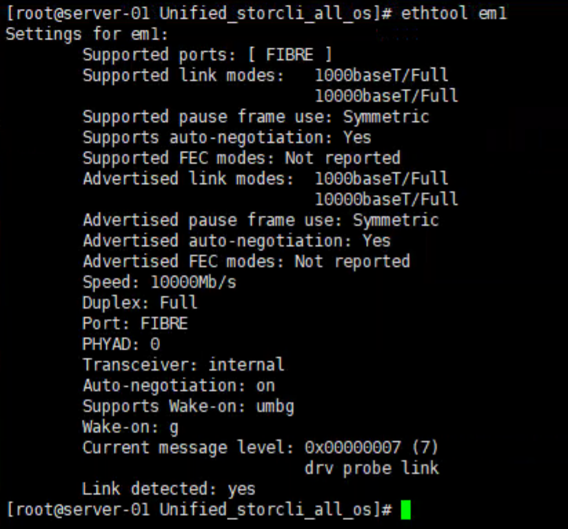
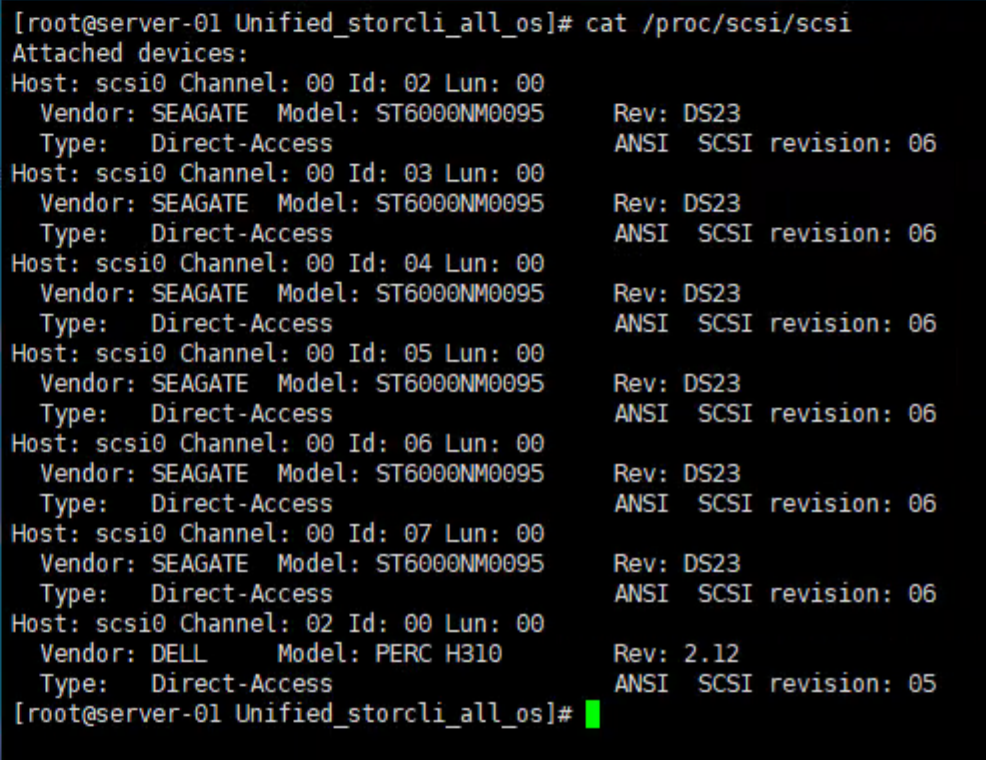
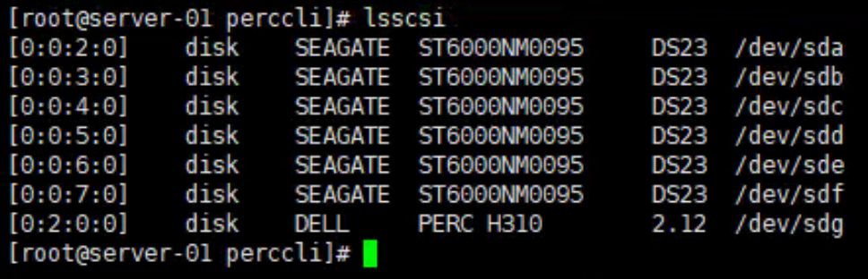
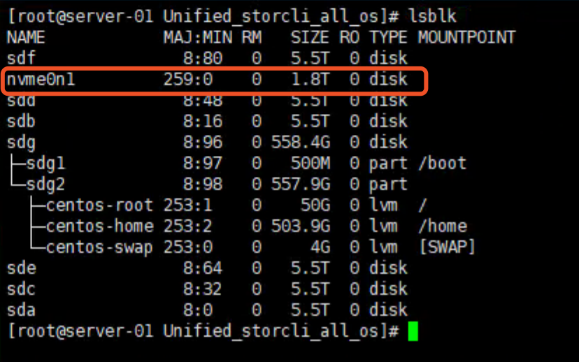
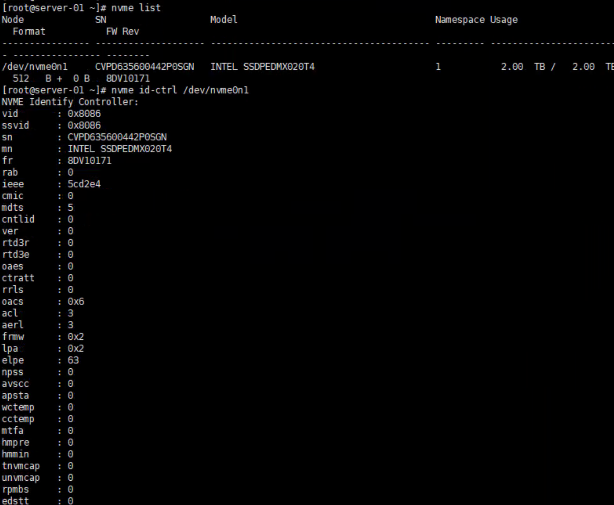
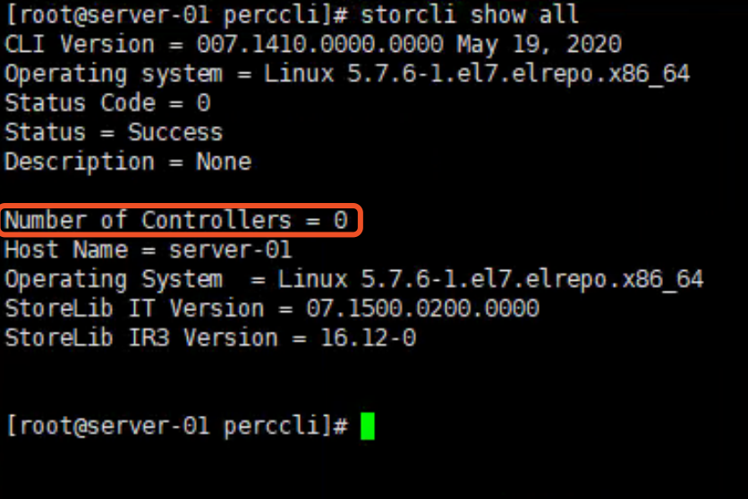
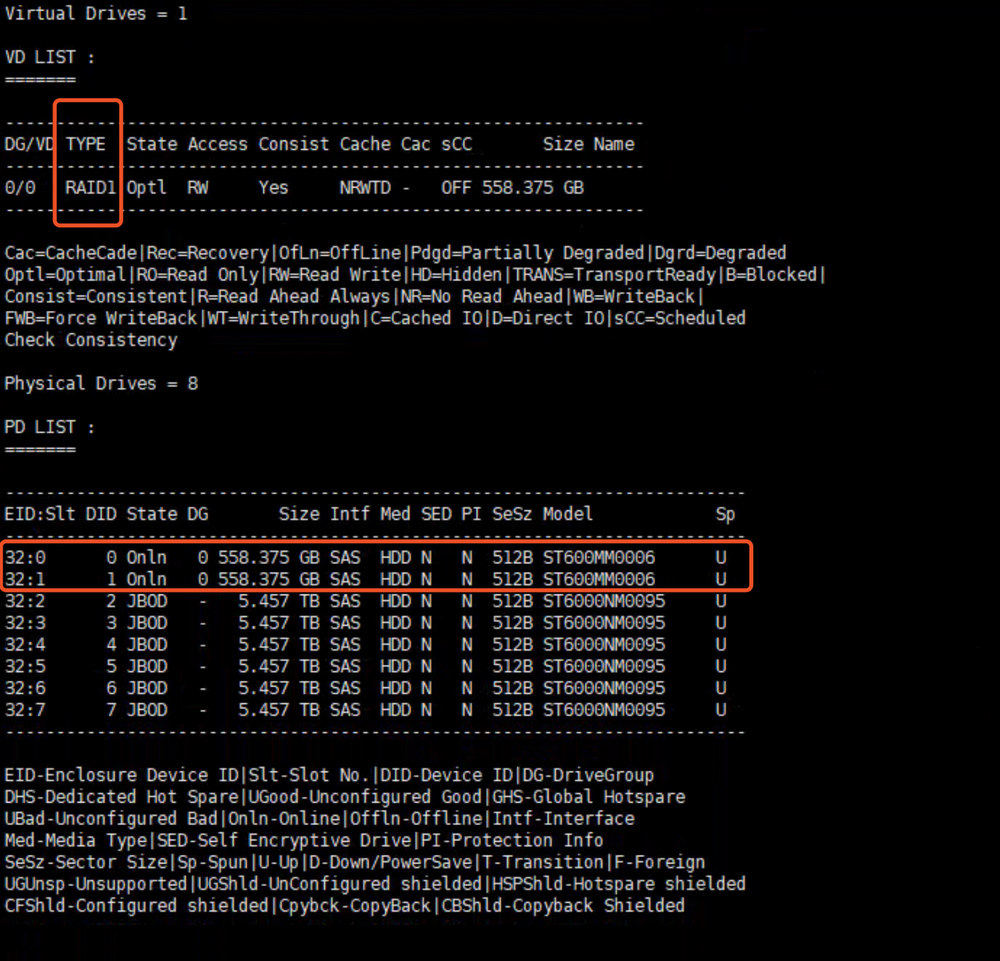

## 查看网卡是万兆还是千兆

```bash
$ ethtool em1
```



speed 这里显示的是万兆网卡。


## 查看磁盘信息

查看 scsi 接口的磁盘信息：

```
$ cat /proc/scsi/scsi
```



前 6 个是磁盘，Seagate 是希捷，型号是 ST6000NM0095 ，这个型号的硬盘是 6 T的，网上可以查到。

第七个是 Dell 的 PERC H310，PERC 是 [PowerEdge RAID Controller](https://i.dell.com/sites/doccontent/shared-content/data-sheets/Documents/dell-perc-h310-spec-sheet.pdf) 的简称，是一个磁盘阵列，相对应的，后面查看磁盘阵列时就需要使用 perccli 来查看，而不是 storcli 。

从这里还可以看出，这七个设备全部是 Direct-Access 的，即直连的，所以前 6 个硬盘没有做 Raid，第 7 个是磁盘阵列卡，所以这块盘肯定是做了磁盘阵列的。

另外还可以使用下列命令查看 scsi 接口的硬盘：

```bash
$ lsscsi
```



这里显示的第一列，是 /proc/scsi/scsi 中编号的简写。

虽然这里 Dell 的 PERC H310 是磁盘阵列，但是实际上还是连着硬盘的，所以这里可以挂载到 /dev/sdg。

/dev/sdg 在我这里实际是系统盘，所以系统盘是做了 Raid 的，Raid 级别后面再看。


## NVMe SSD 磁盘



NVMe 是一个比较新的接口规范，比 PCI-E 更牛。

查看具体信息：

```bash
$ yum install nvme-cli -y
$ nvme list
$ nvme id-ctrl /dev/nvme0n1
```



这的 SN 是唯一编号，也可以使用下面的命令查看：

```bash
$ lsblk --raw -o name,type,serial
```


## 磁盘阵列工具

参考：[https://wiki2.xbits.net:4430/hardware:lsi:storcli%E6%89%8B%E5%86%8C?s%5B%5D=storcli](https://wiki2.xbits.net:4430/hardware:lsi:storcli手册?s[]=storcli)

由于OEM给DELL的阵列卡原厂的storcli工具不能识别,只能用DELL自家的PERCCLI工具,但其实应该就是在storcli基础上修改的,安装用法都和storcli一致!

storcli 官方下载地址：https://www.broadcom.com/support/download-search?pg=&pf=&pn=&pa=&po=&dk=storcli&pl=

LSI 的磁盘阵列都可以使用 storcli 这个工具，LSI 是一个公司。

安装：

```bash
$ unzip ul_avago_storcli_1.18.11_anyos.zip
$ rpm -ivh storcli_all_os/Linux/storcli-1.18.11-1.noarch.rpm
$ rpm -qi storcli
$ ln -s /opt/MegaRAID/storcli/storcli64 /usr/local/bin/storcli
```

使用：

```bash
$ storcli show all
$ storcli show ctrlcount # 查看阵列卡
```

但是查询的时候发现查不到控制器：



上面说了，我的机器要用 Perccli 工具，而不是 Storcli，Perccli 和上面的安装方法一致。

下面使用 perccli：

```bash
$ perccli show all # 查看控制器列表，我这里只有一个控制器，即 c0
$ perccli /c0 show all # 查看控制器的详细信息
```

结果如下：



结果显示，使用了两块磁盘做了 RAID 1，用作系统盘。


## dmidecode

**dmidecode命令**可以让你在Linux系统下获取有关硬件方面的信息。dmidecode的作用是将DMI数据库中的信息解码，以可读的文本方式显示。由于DMI信息可以人为修改，因此里面的信息不一定是系统准确的信息。dmidecode遵循SMBIOS/DMI标准，其输出的信息包括BIOS、系统、主板、处理器、内存、缓存等等。

DMI（Desktop Management Interface,DMI）就是帮助收集电脑系统信息的管理系统，DMI信息的收集必须在严格遵照SMBIOS规范的前提下进行。SMBIOS（System Management BIOS）是主板或系统制造者以标准格式显示产品管理信息所需遵循的统一规范。SMBIOS和DMI是由行业指导机构Desktop Management Task Force(DMTF)起草的开放性的技术标准，其中DMI设计适用于任何的平台和操作系统。

DMI充当了管理工具和系统层之间接口的角色。它建立了标准的可管理系统更加方便了电脑厂商和用户对系统的了解。DMI的主要组成部分是Management Information Format(MIF)数据库。这个数据库包括了所有有关电脑系统和配件的信息。通过DMI，用户可以获取序列号、电脑厂商、串口信息以及其它系统配件信息。

几个选项：

```
-d：(default:/dev/mem)从设备文件读取信息，输出内容与不加参数标准输出相同。
-h：显示帮助信息。
-s：只显示指定DMI字符串的信息。(string)
-t：只显示指定条目的信息。(type)
-u：显示未解码的原始条目内容。
--dump-bin file：将DMI数据转储到一个二进制文件中。
--from-dump FILE：从一个二进制文件读取DMI数据。
-V：显示版本信息。
```

type 的部分类型，这些类型可以使用名称，processor 是处理器的意思：

```
bios
system
baseboard
chassis
processor
memory
Cache
connector
slot
```

使用方式比如：

```
$ dmidecode -t bios
```


## lspci

安装 ：

```bash
$ yum install pciutils
```

使用：

```bash
$ lspci
```


## dmesg

查看启动信息的 raid 信息


