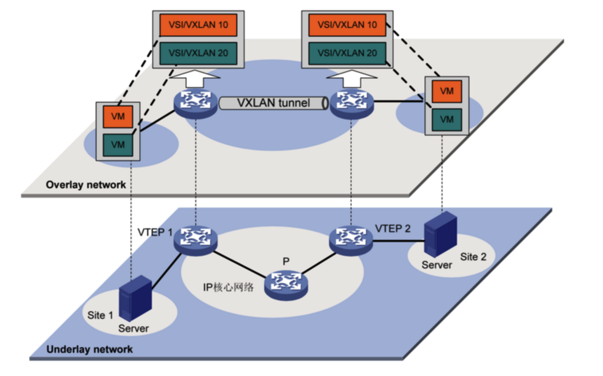
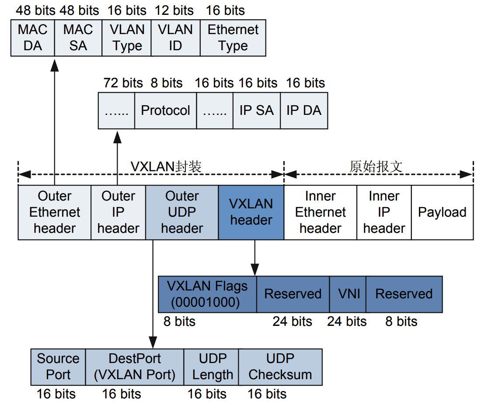

# Linux 下 VxLAN 实践

## VxLAN 简介

任何技术的产生，都有其特定的时代背景与实际需求，VXLAN正是为了解决云计算时代虚拟化中的一系列问题而产生的一项技术。那么我们先看看 VXLAN 到底要解决哪些问题。

- **虚拟机规模受网络设备表项规格的限制**

  对于同网段主机的通信而言，报文通过查询MAC表进行二层转发。服务器虚拟化后，数据中心中VM的数量比原有的物理机发生了数量级的增长，伴随而来的便是虚拟机网卡MAC地址数量的空前增加。一般而言，接入侧二层设备的规格较小，MAC地址表项规模已经无法满足快速增长的VM数量。

- **传统网络的隔离能力有限**

  虚拟化（虚拟机和容器）的兴起使得一个数据中心会有动辄上万的机器需要通信，而传统的 VLAN 技术在标准定义中只有12比特，也就只能支持 4096 个网络上限，已经显然满足不了不断扩展的数据中心规模。

- **虚拟机迁移范围受限**

  虚拟机迁移，顾名思义，就是将虚拟机从一个物理机迁移到另一个物理机，但是要求在迁移过程中业务不能中断。要做到这一点，需要保证虚拟机迁移前后，其IP地址、MAC地址等参数维持不变。这就决定了，虚拟机迁移必须发生在一个二层域中。而传统数据中心网络的二层域，将虚拟机迁移限制在了一个较小的局部范围内。此外，解决这个问题同时还需保证二层的广播域不会过分扩大，这也是云计算网络的要求。

传统“二层+三层”的网络在应对这些要求时变得力不从心，虽然通过很多改进型的技术比如堆叠、SVF、TRILL等可以构建物理上的大二层网络，可以将虚拟机迁移的范围扩大。但是，构建物理上的大二层，难免需要对原来的网络做大的改动，并且大二层网络的范围依然会受到种种条件的限制。

为了解决这些问题，有很多方案被提出来，VxLAN就是其中之一。VxLAN 是 VMware、Cisco 等一众大型企业共同推出的。


#### 定义

在介绍完VxLAN要解决的问题也就是技术背景之后，接下来正式阐述一下VxLAN的定义，也就是它到底是什么。

VXLAN 全称是 `Virtual eXtensible Local Area Network`，虚拟可扩展的局域网。它是一种 Overlay 技术，采用L2 over L4（MAC-in-UDP）封装方式，是NVO3（Network Virtualization over Layer 3）中的一种网络虚拟化技术，将二层报文用三层协议进行封装，可实现虚拟的二层网络在三层范围内进行扩展，同时满足数据中心大二层虚拟迁移和多租户的需求。RFC7348上的介绍是这样的：

*A framework for overlaying virtualized layer 2 networks over lay 3 networks.*


#### 意义

针对大二层网络，VxLAN技术的出现很好的解决了云计算时代背景下数据中心在物理网络基础设施上实施服务器虚拟化的隔离和可扩展性问题：

- 通过24比特的VNI可以支持多达16M的VXLAN段的网络隔离，对用户进行隔离和标识不再受到限制，可满足海量租户。
- 除VXLAN网络边缘设备，网络中的其他设备不需要识别虚拟机的MAC地址，减轻了设备的MAC地址学习压力，提升了设备性能。
- 通过采用MAC in UDP封装来延伸二层网络，实现了物理网络和虚拟网络解耦，租户可以规划自己的虚拟网络，不需要考虑物理网络IP地址和广播域的限制，大大降低了网络管理的难度。


## VxLAN 模型



VxLAN的典型网络模型中主要包含以下几个基本元素：

- VM (Virtual Machine): 虚拟机。在一台服务器上可以创建多台虚拟机，不同的虚拟机可以属于不同的 VXLAN。处于相同VxLAN的虚拟机处于同一个逻辑二层网络，彼此之间二层互通；属于不同VxLAN的虚拟机之间二层隔离。
- VxLAN Tunnel: VxLAN隧道。“隧道”是一个逻辑上的概念，它并不新鲜，比如大家熟悉的GRE。说白了就是将原始报文“变身”下，加以“包装”，好让它可以在承载网络（比如IP网络）上传输。从主机的角度看，就好像原始报文的起点和终点之间，有一条直通的链路一样。而这个看起来直通的链路，就是“隧道”。顾名思义，“VXLAN隧道”便是用来传输经过VXLAN封装的报文的，它是建立在两个VTEP之间的一条虚拟通道。Vxlan 通信双方（图中的虚拟机）认为自己是通过二层VSI直接通信，并不知道底层网络的存在。
- VTEP (VxLAN Tunnel Endpoints): VXLAN隧道端点。VXLAN网络的边缘设备，是VXLAN隧道的起点和终点，VXLAN报文的封装和解封装处理均在这上面进行。VTEP可以理解为Overlay网络立足于Underlay物理网络之上的支脚点，分配有物理网络的IP地址，该地址与虚拟网络无关。VXLAN报文中源IP地址为隧道一端节点的VTEP地址，目的IP地址为隧道另一端节点的VTEP地址，一对VTEP地址就对应着一个VXLAN隧道。VTEP 可以是一个独立的网络设备（比如交换机），也可以是一台物理服务器（比如虚拟机所在的宿主机）。
- VNI (VXLAN Network Identifier): VXLAN 网络标识符。以太网数据帧中VLAN只占了12比特的空间，这使得VLAN的隔离能力在数据中心网络中力不从心。而VNI的出现，就是专门解决这个问题的。VNI是一种类似于VLAN ID的用户标示，一个VNI代表了一个租户，即使多个终端用户属于同一个VNI，也表示一个租户。VNI
  由24比特组成，支持多达16M的租户。属于不同VNI的虚拟机之间不能直接进行二层通信。VXLAN报文封装时，给VNI分配了足够的空间使其可以支持海量租户的隔离。
- IP核心设备/隧道中间设备: 网络中普通的路由/转发设备，不参与VxLAN处理，仅需根据封装后的VxLAN报文的目的VTEP IP地址沿着VxLAN隧道路径进行普通的三层转发。
- VSI (Virtual Switch Instance): 虚拟交换实例。VTEP上为每个VxLAN提供二层交换服务的虚拟交换实例。VSI可以看做是VTEP上的一台针对某个VxLAN内的数据帧进行二层转发的虚拟交换机，它具有传统以太网交换机的所有功能，包括源MAC地址学习、MAC地址老化、泛洪等。VSI与VxLAN一一对应。
- VSI-Interface: VSI的虚拟三层接口。类似于Vlan-Interface，用来处理跨VNI即跨VXLAN的流量。VSI-Interface与VSI一一对应，在没有跨VNI流量时可以没有VSI-Interface。


## VxLAN报文格式



VXLAN是MAC in UDP的网络虚拟化技术，所以其报文封装是在原始以太报文之前添加了一个UDP头及VXLAN头封装：VTEP会将VM发出的原始报文封装成一个新的UDP报文，并使用物理网络的IP和MAC地址作为外层头，对网络中的其他设备只表现为封装后的参数。也就是说，网络中的其他设备看不到VM发送的原始报文。

如果服务器作为VTEP，那从服务器发送到接入设备的报文便是经过封装后的报文，这样，接入设备就不需要学习VM的MAC地址了，它只需要根据外层封装的报文头负责基本的三层转发就可以了。因此，虚拟机规模就不会受网络设备表项规格的限制了。

当然，如果网络设备作为VTEP，它还是需要学习VM的MAC地址。但是，从对报文进行封装的角度来说，网络设备的性能还是要比服务器强很多。

上图是 VxLAN 协议的报文，白色的部分是虚拟机发出的原始报文（二层帧，包含了 MAC 头部、IP 头部和传输层头部的报文），前面加了VxLAN 头部用来专门保存 VxLAN 相关的内容，再前面是标准的 UDP 协议头部（UDP 头部、IP 头部和 MAC 头部）用来在物理网路上传输报文。

从这个报文中可以看到三个部分：

1. 最外层的 UDP 协议报文用来在底层物理网络上传输，也就是 VTEP 之间互相通信的基础；
2. 中间是 VXLAN 头部，VTEP 接受到报文之后，去除前面的 UDP 协议部分，根据这部分来处理 VxLAN 的逻辑，主要是根据 VNI 发送到最终的虚拟机；
3. 最里面是原始的二层帧，也就是虚拟机所见的报文内容。


VxLAN Header: VxLAN头。8字节。

- Flags: 8比特，RRRRIRRR。“I”位为1时，表示VXLAN头中的VXLAN ID有效；为0，表示VXLAN ID无效。“R”位保留未用，设置为0。
- VxLAN ID (VNI): 24比特，用于标识一个单独的VXLAN网络。这也是 VxLAN 能支持千万租户的地方。
- Reserved: 两个保留字段，分别为24比特和8比特。


## VxLAN 缺点

VxLAN协议比原始报文多出50字节的内容，这会降低网络链路传输有效数据的比例。此外，新增加的VXLAN报文封装也引入了一个问题，即MTU值的设置。一般来说，虚拟机的默认MTU为1500 Bytes，也就是说原始以太网报文最大为1500字节。这个报文在经过VTEP时，会封装上50字节的新报文头（VXLAN头8字节+UDP头8字节+外部IP头20字节+外部MAC头14字节），这样一来，整个报文长度达到了1550字节。而现有的VTEP设备，一般在解封装VXLAN报文时，要求VXLAN报文不能被分片，否则无法正确解封装。这就要求VTEP之间的所有网络设备的MTU最小为 1550字节。如果中间设备的MTU值不方便进行更改，那么设置虚拟机的MTU值为1450，也可以暂时解决这个问题。

VxLAN头部最重要的是VNID字段，其他的保留字段主要是为了未来的扩展，很多厂商都会加以运用来实现自己组网的一些特性。


## 最简单的点对点 VxLAN

宿主机器网络：

```
10.28.63.16 vm1
10.28.63.19 vm2
```

对应的上层虚拟地址是：

```
192.168.0.16
192.168.0.19
```

在 vm1 上执行：

```bash
$ sudo ip link add vxlan1 type vxlan id 1 remote 10.28.63.19 dstport 4789 dev bond0
$ sudo ip link set vxlan1 up
$ sudo ip addr add 192.168.0.16/24 dev vxlan1
```

上面的第一条命令创建了一个 Linux 上类型为 vxlan 的网络接口，名为 vxlan1。

- id: VNI标识是1。
- remote: 作为一个VTEP设备来封装和解封VXLAN报文，需要知道将封装好的VXLAN报文发送到哪个对端VTEP。Linux上可以利用group指定组播组地址，或者利用remote指定对端单播地址。在实验的云环境中默认不支持组播，这里利用remote指定点对点的对端IP地址为10.28.63.19。
- dstport: 指定目的端口为4789。因为当Linux内核3.7版本首次实现VXLAN时，UDP端口还并没有规定下来。很多厂商利用了8472这个端口，Linux也采用了相同的端口。后来IANA分配了4789作为VXLAN的目的UDP端口。如果你需要使用IANA端口，需要用dstport指定。
- dev: 指定VTEP通过哪个物理device来通信，这里是使用 bond0。

第二条命令让 vxlan1 接口 up 起来。第三条命令给设备分配 IP 地址 192.168.0.16, 子网掩码为 24 (255.255.255.0)。


在 vm2 上，利用类似方法创建名为 vxlan1 的网络接口：

```bash
$ sudo ip link add vxlan1 type vxlan id 1 remote 10.28.63.16 dstport 4789 dev bond0
$ sudo ip link set vxlan1 up
$ sudo ip addr add 192.168.0.19/24 dev vxlan1
```

以上简单的命令就完成了所有配置，使用 `ip a` 可以看到接口。

看下路由表，发现已经自动创建好了路由表：

```
$ route -n
Destination     Gateway         Genmask         Flags Metric Ref    Use Iface
192.168.0.0     0.0.0.0         255.255.255.0   U     0      0        0 vxlan1
```

Ping 一下试试，发现可以ping通：

```
$ ping 192.168.0.19
PING 192.168.0.19 (192.168.0.19) 56(84) bytes of data.
64 bytes from 192.168.0.19: icmp_seq=1 ttl=64 time=0.212 ms
64 bytes from 192.168.0.19: icmp_seq=2 ttl=64 time=0.247 ms
64 bytes from 192.168.0.19: icmp_seq=3 ttl=64 time=0.235 ms
64 bytes from 192.168.0.19: icmp_seq=4 ttl=64 time=0.256 ms
^C
--- 192.168.0.19 ping statistics ---
4 packets transmitted, 4 received, 0% packet loss, time 107ms
rtt min/avg/max/mdev = 0.212/0.237/0.256/0.022 ms
```

在 vm1 上抓包：

```
$ sudo tcpdump -i bond0 host 192.168.0.19 -s0 -v -w vxlan_vni_1.pcap
```


