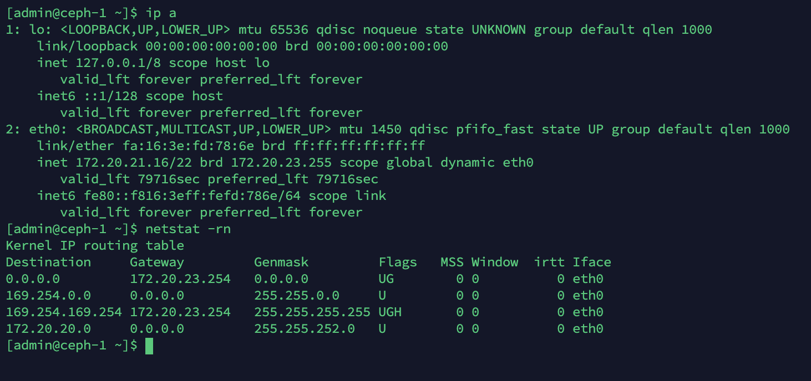

我 ceph-1 的网卡为 eth0，地址为 172.20.21.16/22，网关为 172.20.23.254。




## 创建网桥

添加网桥：

```bash
$ brctl addbr br0
```

将eth0接口加入此网桥：

```bash
$ brctl addif br0 eth0 
```

去除 eth0 的地址：

```bash
$ ifconfig eth0 0.0.0.0
```

为 br0 添加地址：

```bash
$ ifconfig br0 172.20.21.16 netmask 255.255.252.0
```

增加网关：

```bash
$ route add default gw 172.20.23.254 dev br0
```


## 测试

网桥的地址就是为了可以方面进行ssh登录宿主机。与网桥连接的虚拟机IP地址可以设置为网桥处于同一个ip地址网段，也可是设置为不相同的ip地址。

现在通过 SSH 就可以连接 Linux 了。

查看网桥：

```
$ brctl show
```


## VLAN和虚拟交换机

vlan的定义不再多说，只需记住将数据包打上vlan标签的端口叫做access，而将不处理标签转发数据包的端口叫做trunk.

linux的vlan就是由不同的网桥实现，如下所示


安装工具：

```bash
$ yum install epel-release #不安装epel源找不到vconfig
$ yum install vconfig
$ sudo modprobe 8021q
```

创建 VLAN：

```
$ vconfig add eth0 10
$ vconfig add eth0 20
$ ifconfig eth0.10 192.168.10.1 netmask 255.255.255.0 up
$ ifconfig eth0.20 192.168.20.1 netmask 255.255.255.0 up
```


