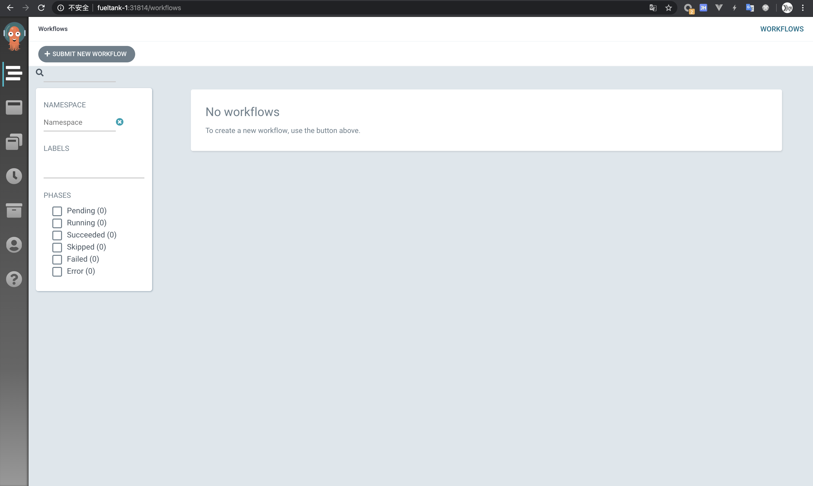

# Argo 介绍及入门

Argo 是一款基于 Kubernetes 的工作流组件。

Github：https://github.com/argoproj/argo

官网：https://argoproj.github.io/

## 安装

教程：https://argoproj.github.io/docs/argo/getting-started.html

安装 argo 命令行工具：

```bash
$ curl -sLO https://github.com/argoproj/argo/releases/download/v2.7.2/argo-linux-amd64
$ chmod +x argo-linux-amd64
$ sudo mv ./argo-linux-amd64 /usr/bin/argo
$ argo version
```

部署 Controller：

```bash
$ kubectl create namespace argo
$ kubectl apply -n argo -f https://raw.githubusercontent.com/argoproj/argo/stable/manifests/install.yaml
```

确保 pod 全部创建完成：

```bash
$ kubectl get pods -n argo
```


## 跑一些简单的工作流

```bash
$ argo submit --watch https://raw.githubusercontent.com/argoproj/argo/master/examples/hello-world.yaml
$ argo submit --watch https://raw.githubusercontent.com/argoproj/argo/master/examples/coinflip.yaml
$ argo submit --watch https://raw.githubusercontent.com/argoproj/argo/master/examples/loops-maps.yaml
$ argo list
$ argo get xxx-workflow-name-xxx
$ argo logs xxx-pod-name-xxx #from get command above
```


## UI 界面

查看UI界面：

```bash
$ kubectl get svc -n argo
NAME                          TYPE        CLUSTER-IP      EXTERNAL-IP   PORT(S)          AGE
argo-server                   NodePort    10.43.180.232   <none>        2746:31814/TCP   33m
workflow-controller-metrics   ClusterIP   10.43.248.23    <none>        9090/TCP         33m
```

这里我使用了 `NodePort` 的方式来报漏服务。在浏览器打开：http://fueltank-1:31814/workflows


