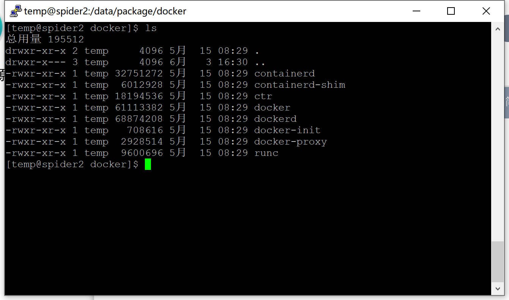

离线环境下，使用 rpm 包安装比较痛苦，各种依赖版本、操作系统版本不统一，安装费劲。二进制安装就不需要操心这么多，直接使用二进制命令即可。

下载 Docker 的二进制包，官方下载地址：https://download.docker.com/linux/static/stable/x86_64/

下载完成之后是一个 tgz 包，解压之后的内容如下：



将这些二级制文件拷贝至 PATH路径中，我这里拷贝到了 `/usr/bin`。

写 `/usr/lib/systemd/system/docker.service`，内容如下：

```
[Unit]
Description=Docker Application Container Engine
Documentation=https://docs.docker.com
After=network-online.target firewalld.service
Wants=network-online.target
  
[Service]
Type=notify
# the default is not to use systemd for cgroups because the delegate issues still
# exists and systemd currently does not support the cgroup feature set required
# for containers run by docker
ExecStart=/usr/bin/dockerd -H tcp://0.0.0.0:2375 -H unix://var/run/docker.sock
ExecReload=/bin/kill -s HUP $MAINPID
# Having non-zero Limit*s causes performance problems due to accounting overhead
# in the kernel. We recommend using cgroups to do container-local accounting.
LimitNOFILE=infinity
LimitNPROC=infinity
LimitCORE=infinity
# Uncomment TasksMax if your systemd version supports it.
# Only systemd 226 and above support this version.
#TasksMax=infinity
TimeoutStartSec=0
# set delegate yes so that systemd does not reset the cgroups of docker containers
Delegate=yes
# kill only the docker process, not all processes in the cgroup
KillMode=process
# restart the docker process if it exits prematurely
Restart=on-failure
StartLimitBurst=3
StartLimitInterval=60s
  
[Install]
WantedBy=multi-user.target
```

启动 docker 服务端：

```bash
sudo systemctl daemon-reload
sudo systemctl enable docker
sudo systemctl start docker
sudo systemctl status docker
```