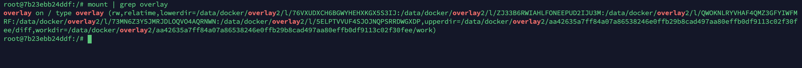
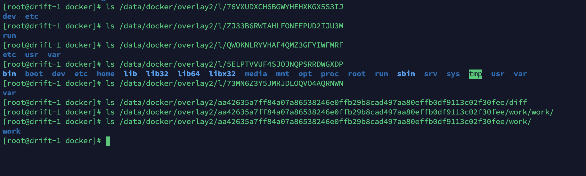
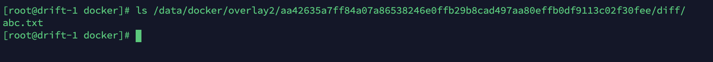
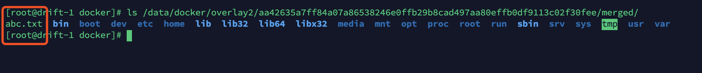

# Docker 储存驱动


## overlay2 储存驱动实战

查看当前系统中 Docker 使用的储存驱动：

```bash
$ docker info | grep "Storage Driver"
Storage Driver: overlay2
```

参考：https://zhuanlan.zhihu.com/p/41958018

当 pull 一个镜像时：

```
[root@drift-1 ~]# docker pull ubuntu
Using default tag: latest
latest: Pulling from library/ubuntu
d51af753c3d3: Pull complete 
fc878cd0a91c: Pull complete 
6154df8ff988: Pull complete 
fee5db0ff82f: Pull complete 
Digest: sha256:747d2dbbaaee995098c9792d99bd333c6783ce56150d1b11e333bbceed5c54d7
Status: Downloaded newer image for ubuntu:latest
docker.io/library/ubuntu:latest
```

可以看到镜像是分层的，并且每一层都有一个签名。这个 ubuntu 镜像一共 5 层，这5层都是只读的。

起一个容器：

```bash
$ docker run -it ubuntu /bin/bash
```

查看挂载点：



这里可以看到，lowerdir  有五个目录，upperdir 一个目录，workdir 一个目录，这七个目录合并在一起组成了挂在了根目录。

其中`lowerdir`是镜像只读层，`upperdir`是容器可读可写层，`workdir`是执行涉及修改`lowerdir`执行`copy_up`操作的中转层。

这些目录的实际内容如下：



下面来验证一下：

在容器内执行：

```bash
$ echo "hello world" > /abc.txt
```

然后看 upperdir 中的文件：



不出所料。并且在 ../merged 文件夹内也有一个完整的目录结构：



这个 merged 文件夹就是容器用到的文件系统。


## Docker 储存驱动

参考：http://dockone.io/article/1765

【编者的话】本文深入探讨了Docker容器的存储驱动，内容包括graphdriver以及各个选项比如Vfs、Aufs、Overlay、Overlay2、Btrfs、ZFS、Devicemapper和Windows，还有具体如何选择的规则。


#### graphdriver是何物？

要开始理解graphdriver这个概念，我们首先得理解本地的Docker引擎有一个Docker镜像层的缓存。层叠镜像模型（layered image model）是Docker引擎最具特色的特性之一。它能允许一个或者多个容器进程共享文件系统内容。这些分层的缓存会在`docker pull`或者`docker build`命令执行的时候，显式地进行构建。当`docker run`运行的时候，因为分层在本地不存在需要从注册表中拉取的时候，也会向缓存中隐式地添加。要在运行的时候管理这些分层，需要一个支持一组特定能力的驱动 - 这组能力被抽象成接口可以[在Docker引擎代码里找到](https://github.com/docker/docker/blob/v1.12.1/daemon/graphdriver/driver.go) - 来将这些分层挂载到一个合并的根文件系统里面。因为分层内容的“镜像图*（image graph）*”代表了各种分层之间的关系，用来处理这些分层的驱动就被叫做“图驱动*（graphdriver）*”。


在运行的时候用来处理这个*分层图*有两个非常重要的概念。一个概念是**联合文件系统**（union filesystem），它最好的定义位于[维基百科词条](https://en.wikipedia.org/wiki/Union_mount)中。*（译注：该维基词条说的是，“在操作系统中，联合挂载（union mounting）是一种将多个目录结合成一个目录的方式，这个目录看起来就像包含了他们结合的内容一样。”）* 联合文件系统的实现将这种文件系统内容合并来，形成一个单一的挂载点。除非只读的根文件系统已经能满足你的需求，联合文件系统的实现通常辅有“[写时复制（CoW）](https://en.wikipedia.org/wiki/Copy-on-write)”的实现技术，这样任何对于底层文件系统分层的更改都会被“向上拷贝”到文件系统的一个临时、工作、或高层的分层里面。这个可写的层然后可以被看做是一个“改动（diff）”，能将之应用到下层只读的层，而这些层很可能作为底层被很多容器的进程中共享。这是一个很重要的点。一个Docker中使用分层文件系统的好处就是，1000个运行着`bash`的`ubuntu:latest`容器的副本，会共享一个底层的镜像，而并不会产生1000个文件系统的副本（vfs是个例外，请参考下边vfs部分）。并且同样重要的是，对于aufs和overlay的实现，用来读取或执行共享库的共享内存也在所有运行的容器之间共享，大大的减少了通用库如'libc'的内存占用。这是一个分层策略的巨大优势，同时也是Docker的graphdriver是引擎中相当重要的一部分的原因之一。


现在诸君应该清楚了graphdriver是何物了，并且为什么Dokcer引擎要实现这个特性。现在让我们接着看看为什么Docker中有众多graphdriver的选择吧。


## 都有哪些graphdriver

在最近的Docker引擎1.12版本中，会发现如下的graphdriver：vfs、aufs、overlay、overlay2、btrfs、zfs、devicemapper和windows。将这个列表归一下类有助于对它们进行更好地定义。

#### 特别的白雪公主：vfs

首先，让我们挑出一个特别的graphdriver - vsf。vfs是接口的“原生”的实现，完全没有使用联合文件系统或者写时复制技术，而是将所有的分层依次拷贝到静态的子文件夹中，然后将最终结果挂载到容器的根文件系统。它并不适合实际或者生产环境使用，但是对于需要进行简单验证的场景，或者需要测试Docker引擎的其他部件的场景，是很有价值的。对于在Docker中运行Docker的场景也很有用，要知道graphdriver嵌套起来，可能会让你丈二和尚摸不着头脑。顺便一提：Docker引擎开发者用来构建Docker自己所使用的`Dockerfile`，也是采用vfs来作为里边Docker的graphdriver。

#### 联合文件系统

有意思的是，现有的graphdriver中只有少部分是真正的有写时复制语义的联合文件系统：Overlay的两个版本，从Docker早期就存在的aufs。记住联合文件系统只是一个基于文件的接口，通过把一组目录交错起来来，形成一个单一视图。所以与它不是一个真正的文件系统，如ext4或者xfs，它仅仅是站在一个已有的文件系统上提供了这些功能。在一些场景，对于底层文件系统是有要求的，并且Docker也会同时检查请求的联合文件系统和底层的文件系统，来保证它们是兼容的。


#### 特定文件系统的实现

剩下的graphdriver都是建立在具体文件系统实现的基础上，需要依赖其内置特性（如快照）能提供必需的能力。这些包含devicemaper、zfs和btrfs驱动。在这每一个情形中，你都需要新建一个磁盘并用该文件系统格式化磁盘（或者为了快速测试，用循环挂载的文件作为磁盘），来使用这些选项作为Docker引擎的存储后端。


## graphdriver必须要执行什么操作？

首先我们要简要地解释一下graphdriver必须执行什么操作。相关信息在已经被代码化在了[守护进程代码库中`ProtoDriver`和`Driver`接口](https://github.com/docker/docker/blob/v1.12.1/daemon/graphdriver/driver.go#L46-L98)的定义中。同时值得注意的是，有一个ProtoDriver接口的包装器实现叫做NativeDiffDriver。对于那些无法通过原生处理方式来得出分层差异或改动的文件系统，该包装器能通过借用归档软件包，和驱动实现一起来提供这些计算差异的特性。除了（计算）差别和改动相关的方法，graphdriver最重要的能力是`Get`,`Put`,`Create`和`Remove`方法。要帮助理解graphdriver的API，我们需要简单地谈一下这个API的消费者。在docker中的实现被称作`layerStore（分层仓库）`。当终端用户使用Docker客户端或者API下载或导入镜像时，分发（注册表）客户端代码用“分层仓库”来进行添加或者删除层的操作。我们知道镜像可以包含多个分层，并且这些分层有存在父级子级的关系。“分层仓库”的代码利用graphdriver驱动，采用最适合该文件系统实现中类似联合和写时复制（union+CoW-like）的叠层技术，来保存这些分层和它们之间的关系。要处理这些分层镜像的创建和解开（un-tar）操作，以及将镜像解开的内容放到创建的位置，会用到graphdriver的`Create`和`ApplyDiff`接口。显然，当镜像从本地缓存删除的时候需要执行的相反的操作，“分层仓库”会调用graphdriver的`Remove`接口来将分层的内容从系统中删除。

经历了上面这些过程，graphdriver现在已经包含了很多分层的本地缓存，同时包含下载的具名镜像之间的关系。容器需要运行时，在容器启动之前这些必须被组装成可运行的根文件系统。graphdriver的`Get`方法会被调用并带上一个特定的标识符，此时根据graphdriver特定文件系统的实现，需要根据父级连接关系遍历并且使用该文件系统提供的相应技术来将分层堆叠成一个单独的挂载点，并创建可写的上层或者顶部分层来满足容器更改文件系统的需要。`Put`方法来告知graphdriver，某挂载的资源没有用了，并在绝大多数的场景下卸载相关的层。


## 现在的Graphdriver概览

知道了graphdriver在意图解决什么问题之后，让我们快速概览一下在当下Docker 1.12引擎中可以有哪些选择。对于那些将要尝试，或者已经尝试过不同的grpahdriver的人来说，因为每一个graphdriver的分层存储是依赖具体实现的，当更改了graphdriver并重启了Docker引擎后，之前拉取或者构建的任何镜像将无法继续使用。这是一个之前广为人知的会让用户困惑的地方，但是不要害怕；切换回之前的graphdriver会唤回之前的镜像或者容器，它们没有消失，只是在你切换了不同的graphdrirver之后从你的视野中躲起来了而已。


#### AUFS

**历史**：aufs驱动老早就在Docker中存在了！其实，他在使用`graphdriver`这个名字之前就存在了。如果你查看项目在那（即首次使用graphdriver名称）提交之前的历史，之前项目中当时只有一个aufs的实现。下边devicemapper部分会讲到更多关于graphdriver这个名称诞生的历史。

**实现**：Aufs最初代表的意思“另一个联合文件系统（another union filesystem）”，试图对当时已经存在的UnionFS实现进行重写。正如你期望的那样，它是一个传统意义的上层覆盖，通过利用aufs称作为“分支（branch）”的特性，让堆叠的目录合并成一个堆叠内容单一挂载点视图。此驱动会将父级信息组合一个有序列表，并把它作为挂载参数，然后把重活移交给aufs来把这些分层组装成一个联合视图。更多的细节信息可以在aufs的[帮助文档](http://aufs.sourceforge.net/aufs3/man.html)上看到。

**优点**：这可能是历史最久且测试最完善的graphdriver后端了。它拥有不错的性能，也比较稳定，适用于广泛的场景。尽管它只在Ubuntu或者Debian的内核上才可以启用（下边有说明），但是这两个发行版和Docker一起使用的场景已经非常多，这让它在广阔的环境中得到了验证。同时，通过让不同的容器从同一个分层里面加载相同的库（因为他们在磁盘上是相同的inode）达到了共享内存页的效果。

**缺点**：Aufs从来没有被上游Linux内核社区接受。多年来Ubuntu和Debian都需要往内核集成一个历史久远的补丁包，且原作者已经放弃了让它被内核采纳的努力。可能与IPV4和IPv6的辩论有些类似，人们担心某一天内核更新后会出现难以整合aufs的补丁的情况，从而导致aufs没得玩。但是就如IPv6，替换aufs势在必行的决心讲了一年又一年。除此之外，它面临着很多其他比较棘手的问题。其中一个最麻烦的、也是比较有历史的问题（尽管某种程度上这是一个安全的特性），是关于在高层更改向上拷贝的文件的权限的，这个问题困扰了不少用户。最终在2015年早期的时候通过编号为[#11799](http://dockone.io/docker/docker#11799)的PR使用aufs的`dirperm1`特性修复了。自然，这需要内核中有具有`dirperm1`能力aufs，然而这在今天任何较新版本的Ubuntu或者Debian上都已经不成问题了。

**总结**：如果你在使用Ubtuntu或者Debian，那默认的graphdriver就是aufs，它能满足你绝大多数需求。有人期望有一天它能被overlay的实现取代，但是考虑到overlay文件系统的诸多问题，以及在上游内核中的成熟程度等挑战，这尚未实现。最后，aufs中没有配额的支持。


