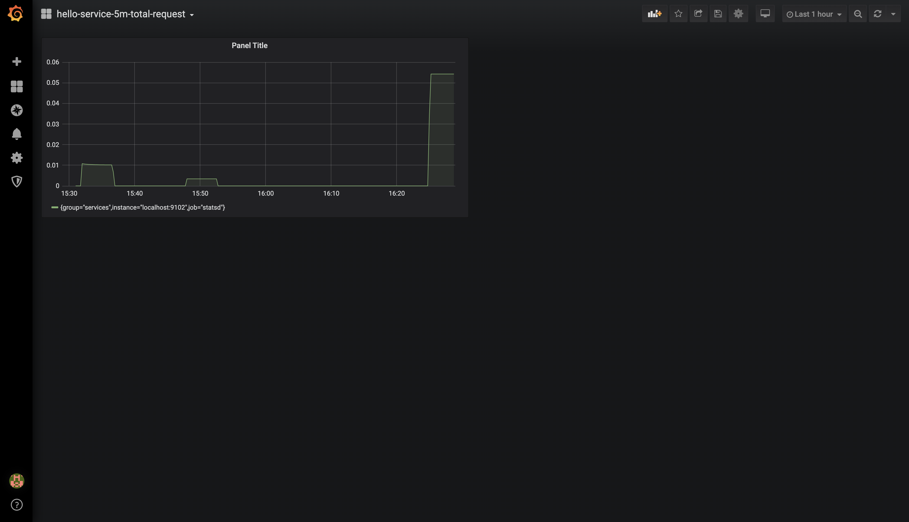

# Envoy - API (二)  -  Boorstrap

官方文档地址：https://www.envoyproxy.io/docs/envoy/latest/api-v2/bootstrap/bootstrap

---

## Bootstrap

Bootstrap 是所有配置的顶级配置。在启动指定配置文件时：

```bash
$ envoy -c <path to config>.{json,yaml,pb,pb_text}
```

这个配置文件中的顶级配置就是 Bootstrap API。配置大概如下：

```json
{
  "node": "{...}",
  "static_resources": "{...}",
  "dynamic_resources": "{...}",
  "cluster_manager": "{...}",
  "hds_config": "{...}",
  "flags_path": "...",
  "stats_sinks": [],
  "stats_config": "{...}",
  "stats_flush_interval": "{...}",
  "watchdog": "{...}",
  "tracing": "{...}",
  "runtime": "{...}",
  "layered_runtime": "{...}",
  "admin": "{...}",
  "overload_manager": "{...}",
  "enable_dispatcher_stats": "...",
  "header_prefix": "...",
  "stats_server_version_override": "{...}",
  "use_tcp_for_dns_lookups": "..."
}
```

其中，`node`、`static_resources` 、`dynamic_resources` 、`admin` 是之前遇到的，比较熟悉的，剩下的不熟悉的就需要学习了。

其中大部分在后面的文章学习。下面先学习下 `stats` 


---


## Stats

统计。

Envoy的主要目标之一是使网络易于理解。Envoy会根据其配置方式发出大量统计信息。通常，统计信息分为三类：

- **下游**：下游统计信息与传入的连接/请求有关。它们由侦听器，HTTP连接管理器，TCP代理过滤器等发出。
- **上游**：上游统计信息与传出连接/请求有关。它们由连接池，路由器过滤器，TCP代理过滤器等发出。
- **服务器**：服务器统计信息描述Envoy服务器实例的工作方式。诸如服务器正常运行时间或已分配内存量之类的统计信息在这里分类。

从v2 API开始，Envoy能够支持自定义可插入接收器。Envoy中包含一些标准接收器实现，就是这里的 `Stats`。这也是 Istio 取消 Mixer 的原因，因为统计数据的功能已经部署在 Envoy 中了。

Envoy发出三种类型的值作为统计信息：

- **计数器**：只会增加而不会减少的无符号整数。例如，总请求数。
- **量规**：递增和递减的无符号整数。例如，当前活动的请求。
- **直方图**：无符号整数，它们是值流的一部分，然后由收集器汇总以最终产生汇总的百分位值。例如，上游请求时间。

在内部，对计数器和量规进行批处理并定期冲洗以提高性能。直方图在接收时被写入。

在 Boorstrap 中，包含三个相关配置：

```json
 "stats_sinks": [],
 "stats_config": "{...}",
 "stats_flush_interval": "{...}",
```


---


## StatsSink

StatsSink 用来配置接收器。

在上面 Boorstrap 中的定义为 ：

```json
{
	"stats_sinks": [],
}
```

Envoy 内置了几种 Stats Sink，分别是：

- [envoy.stat_sinks.statsd](https://www.envoyproxy.io/docs/envoy/latest/api-v2/config/metrics/v2/stats.proto#envoy-api-msg-config-metrics-v2-statsdsink)
- [envoy.stat_sinks.dog_statsd](https://www.envoyproxy.io/docs/envoy/latest/api-v2/config/metrics/v2/stats.proto#envoy-api-msg-config-metrics-v2-dogstatsdsink)
- [envoy.stat_sinks.metrics_service](https://www.envoyproxy.io/docs/envoy/latest/api-v2/config/metrics/v2/metrics_service.proto#envoy-api-msg-config-metrics-v2-metricsserviceconfig)
- [envoy.stat_sinks.hystrix](https://www.envoyproxy.io/docs/envoy/latest/api-v2/config/metrics/v2/stats.proto#envoy-api-msg-config-metrics-v2-hystrixsink)

分别对应不同的收集、展示系统。

下面来动手搭一套 envoy.statsd  ---> statsd exporter  ---> prometheus  --->  Grafana 的系统。

下面从头到尾搭建这套系统，使用  [Envoy二进制构建及安装.md](../Envoy二进制构建及安装.md)  中搭建的环境。

StatsSink 的具体配置如下：

```json
{
  "name": "...",
  "config": "{...}",
  "typed_config": "{...}"
}
```

其中，config 和 typed_config 是互斥的。这两者的区别就是类型不同，config 的类型是 struct，typed_config 的类型是 Any。

如果这里 name 选择了 `envoy.stat_sinks.statsd` ，那么 config 需要配置如下信息：

```json
{
  "address": "{...}",
  "tcp_cluster_name": "...",
  "prefix": "..."
}
```

这里 `address` 和 `tcp_cluster_name`  也是互斥的，address 中的配置是通过 udp 访问的，tcp_cluster_name 中的配置是通过 tcp 访问的。

address 的示例如下：

```
address:
  socket_address:
    address: 127.0.0.1
    port_value: 9125
```

tcp_cluster_name 的示例下面有具体讲解。

`prefix` 这里指的就是记录的 metrics 的前缀。


---


## 搭建 Envoy

开始动手。。。

创建一个项目，名为 stats，所有文件都在这个项目之下。

下面使用 `envoy.stat_sinks.statsd` 来收集 metrics，statsd 也是一个开源项目，github 地址：https://github.com/statsd/statsd

创建 Envoy 的配置文件，文件名是 envoy-config.yaml ，内容如下：

```yaml
admin:
  access_log_path: /dev/stdout
  address:
    socket_address:
      address: 0.0.0.0
      port_value: 8081

node:
  cluster: hello-service
  id: node1

stats_sinks:
  - name: envoy.stat_sinks.statsd
    config:
      tcp_cluster_name: statsd-exporter
      prefix: hello-service

static_resources:
  listeners:
  - address:
      socket_address:
        address: 0.0.0.0
        port_value: 82
    filter_chains:
    - filters:
      - name: envoy.filters.network.http_connection_manager
        typed_config:
          "@type": type.googleapis.com/envoy.config.filter.network.http_connection_manager.v2.HttpConnectionManager
          codec_type: auto
          stat_prefix: ingress_http
          access_log:
            name: envoy.file_access_log
            typed_config:
              "@type": type.googleapis.com/envoy.config.accesslog.v2.FileAccessLog
              path: /dev/stdout
          route_config:
            name: local_route
            virtual_hosts:
            - name: service
              domains:
              - "*"
              routes:
              - match:
                  prefix: "/hello"
                route:
                  cluster: hello-service
          http_filters:
          - name: envoy.filters.http.router
  clusters:
  - name: hello-service
    connect_timeout: 0.25s
    type: strict_dns
    lb_policy: round_robin
    load_assignment:
      cluster_name: hello-service
      endpoints:
      - lb_endpoints:
        - endpoint:
            address:
              socket_address:
                address: 127.0.0.1
                port_value: 8082
  - name: statsd-exporter
    connect_timeout: 0.25s
    type: strict_dns
    lb_policy: ROUND_ROBIN
    hosts:
    - socket_address:
        address: 127.0.0.1
        port_value: 9125
```

这里使用静态配置，简单，直观，方便理解。

注意这里定义了 `stats_sinks` ，并指向一个 cluster，这个名为 statsd-exporter 的 cluster 后面部署。

下面来搭建后台服务，很简单，就是一个 go 语言实现的 HTTP 服务，文件名为 main.go，具体代码如下：

```go
package main

import (
    "github.com/emicklei/go-restful"
    "io"
    "log"
    "net/http"
)

// This example shows the minimal code needed to get a restful.WebService working.
//
// GET http://localhost:8082/hello

func main() {
    ws := new(restful.WebService)
    ws.Route(ws.GET("/hello").To(hello))
    restful.Add(ws)
    log.Println("server start in 8082")
    log.Fatal(http.ListenAndServe(":8082", nil))
}

func hello(req *restful.Request, resp *restful.Response) {
    log.Println("request hello")
    _,_ = io.WriteString(resp, "world")
}
```

然后依次在一个新命令行中执行：

```bash
$ go mod init stats
$ go build
$ ./stats
```

这样就把服务启动起来了。

这样配置好之后，在访问 Envoy 时，会形成 statsd 格式的统计信息，并会把信息发送给 statsd-exporter，后面来部署  statsd-exporter。

然后在本地命令行中启动 Envoy：

```bash
$ sudo getenvoy run standard:1.14.1 -- --config-path ./envoy-config.yaml
```

在另外一个新命令行中测试访问：

```bash
$ curl http://localhost:82/hello
world
```

成功，说明配置都没出错，下面来部署 statsd-exporter


---


## 部署  statsd-exporter

stated-exporter github 仓库：https://github.com/prometheus/statsd_exporter

我这里使用 docker-compose 来部署。

先编写 `statsd_mapping.yml` 文件，我也不会配置，只写一行就行了：

```yaml
mappings:
```

然后修改 docker-compose：

```yaml
version: "3.7"
services:

  statsd-exporter:
    image: prom/statsd-exporter
    volumes:
      - ./statsd_mapping.yml:/etc/statsd_mapping.yml
    environment:
      STATSD.MAPPING-CONFIG: /etc/statsd_mapping.yml
    expose:
      - "9125"
      - "9102"
    ports:
      - "9125:9125"
      - "9102:9102"
```

启动容器：

```bash
$ sudo docker-compose up --build -d
```

这时候看下端口占用，发现在宿主机已经有端口占用了，下面来启动 Prometheus。


---


## 启动 Prometheus

安装方式见： [Prometheus入门.md](../../Prometheus/Prometheus入门.md) 

修改配置文件如下：

```yaml
global:
  scrape_interval:     15s
  evaluation_interval: 15s
scrape_configs:
  - job_name: 'statsd'
    scrape_interval: 5s
    static_configs:
      - targets: ['localhost:9102']
        labels:
          group: 'services'
```

启动 prometheus：

```bash
$ ./prometheus --config.file=prometheus.yml
```

启动完成后，访问几下 envoy，再等上 15 秒，就可以在 Prometheus 中看到数据了！！！

可以通过访问 `http://fueltank-1:9090/graph` 来搜索。

通过下面方式来查看 statsd-exporter 的所有 metrics：

```bash
$ curl http://fueltank-1:9102/metrics
```

发现其中已经有关于 hello-service 的 metrics 了。

比如我查找访问成功了多少次：

```
hello_service_cluster_hello_service_upstream_rq_200
```

对比 go 服务打印的日志数量，发现结果挺准的！

因为我前面配置了 ` prefix: hello-service` 所以这里的 metrics 是以 hello-service 为前缀的，虽然和 cluster 重名了哈哈，可以修改后再来测试。

注意：一旦修改了前缀，会重置计数器！！！


---


## 启动 Grafana

首先，安装，编辑 `/etc/yum.repos.d/grafana.repo` 文件：

```
[grafana]
name=grafana
baseurl=https://packages.grafana.com/oss/rpm
repo_gpgcheck=1
enabled=1
gpgcheck=1
gpgkey=https://packages.grafana.com/gpg.key
sslverify=1
sslcacert=/etc/pki/tls/certs/ca-bundle.crt
```

然后安装：

```bash
$ sudo yum install grafana -y
```

启动：

```bash
$ sudo systemctl enable grafana-server.service
$ sudo systemctl daemon-reload
$ sudo systemctl start grafana-server
$ sudo systemctl status grafana-server
```

完成后，打开： http://fueltank-1:3000 ，用户名及密码默认是 admin/admin，登录完成后需改密码，我这里改成了123456。

进入后，先添加 Prometheus 的数据源。statsd-exporter 自带了俩 Dashboard，我们也可以根据 PromQL 自定义 Dashboard，比如：

```
rate(hello_service_cluster_hello_service_upstream_rq_200[5m])
```

我自定义的图如下：



至此，就完全理解了这些过程！可以回过头来测试修改 Envoy 的配置。


---


## envoy.stat_sinks.metrics_service

上面提到了 Envoy 内置的 4 种接收器，这里再来测试一下 `envoy.stat_sinks.metrics_service`。

metrics_service 接收器可以让我们灵活处理 metrics，想怎么玩就怎么玩！！！！！！

修改 envoy 的配置文件，添加如下内容：

```yaml
stats_sinks:
  - name: envoy.stat_sinks.metrics_service
    config:
      grpc_service: 
        envoy_grpc:
          cluster_name: grpc-exporter
static_resources:      
  clusters:
  - name: grpc-exporter
    connect_timeout: 0.25s
    type: strict_dns
    lb_policy: ROUND_ROBIN
    http2_protocol_options: {}
    hosts:
    - socket_address:
        address: 127.0.0.1
        port_value: 10001
```

注意其中的 `http2_protocol_options` 不能漏掉！！！因为 gRPC 需要 HTTP2 协议。

服务端要实现这个 proto ：https://github.com/envoyproxy/data-plane-api/blob/master/envoy/service/metrics/v2/metrics_service.proto

其中的关键代码如下：

```protobuf
service MetricsService {
  // Envoy will connect and send StreamMetricsMessage messages forever. It does not expect any
  // response to be sent as nothing would be done in the case of failure.
  rpc StreamMetrics(stream StreamMetricsMessage) returns (StreamMetricsResponse) {
  }
}
```

可以看到是一个客户端流的 gRPC 方法。

编译后的 go 代码在 `go-control-plane` 项目的 `envoy/service/metrics/v2/metrics_service.pb.go` 中。

其中 `MetricsServiceServer` 如下：

```go
type MetricsServiceServer interface {
	StreamMetrics(MetricsService_StreamMetricsServer) error
}
```


下面来写服务端代码：

创建项目 `metrics_service`，初始化模块：

```bash
$ go mod init metrics_service
```

写 server.go :

```go
package main

import (
	v2 "github.com/envoyproxy/go-control-plane/envoy/service/metrics/v2"
	"io"
	"log"
)

type MyMetricsServer struct {}

func (myServer *MyMetricsServer) StreamMetrics(server v2.MetricsService_StreamMetricsServer) error {
	for {
		message, err := server.Recv()
		if err == io.EOF {
			_ = server.SendAndClose(&v2.StreamMetricsResponse{})
			return nil
		}
		if err != nil {
			log.Printf("failed to recv: %v", err)
			return err
		}
		log.Println(message)
	}
}
```

注意这里的 `message`，这就是 envoy 传过来的统计信息，这里可以对这个信息做任意处理，比如传到 Fluentd、Logstash、Kafka、或者 Elasticsearch 都是可以的，我这里就是打印到控制台了。

然后写 main.go :

```go
package main

import (
	"flag"
	"fmt"
	v2 "github.com/envoyproxy/go-control-plane/envoy/service/metrics/v2"
	"google.golang.org/grpc"
	"log"
	"net"
)

func main() {
	flag.Parse()
	lis, err := net.Listen("tcp", fmt.Sprintf(":%d", 10001))
	log.Println("metrics server listen to 10001")
	if err != nil {
		log.Fatalf("failed to listen: %v", err)
	}

	grpcServer := grpc.NewServer()
	v2.RegisterMetricsServiceServer(grpcServer, &MyMetricsServer{})
	_ = grpcServer.Serve(lis)
}
```

在服务端编译并启动:

```bash
$ go build
$ ./metrics_service
```


在另外一个命令行中启动 envoy，之后再对服务进行访问，会发现在 metrics_service 的命令行中打印了一堆日志，这些日志就是 envoy 的统计信息了！


## StatsConfig

统计信息配置，他的配置如下：

```json
{
  "stats_tags": [],
  "use_all_default_tags": "{...}",
  "stats_matcher": "{...}"
}
```

其中，statsd 不支持 stats_tags ，use_all_default_tags 默认为 true。下面主要学习下 stats_matcher。

stats_matcher 用于创建统计名称的包含/排除匹配器。如果未提供，则所有统计信息都会照常实例化。对于运行特别大的配置的Envoy，防止实例化某些统计信息系列可以提高内存性能。

对上文的 Envoy 添加以下配置：

```yaml
stats_config:
  stats_matcher: 
    reject_all: true
```

重启 Envoy ，并对服务进行访问，会发现不论是 Prometheus 中，还是 metrics_service 中都不会再有新 metrics 了，这相当于把统计信息给禁用了！

如果改为：

```yaml
stats_config:
  stats_matcher:
    exclusion_list:
      patterns:
        - prefix: cluster
```

这样配置的话，就不会统计所有以 cluster 开头的 metrics，这里的名称不是 prometheus 中的 metrics 名，而是以 Envoy admin 管理端 /stats 中的名字为准，比如我这里是 `http://fueltank-1:8081/stats`。


---


## Overload Manager

Overload Manager提供了一个可扩展的框架来保护Envoy实例免受各种资源（内存，cpu，文件描述符等）的过载。它监视一组可配置的资源，并在触发与那些资源相关的触发器时通知注册的侦听器。

在 Bootstrap 中表示如下：

```json
{
  "overload_manager": "{...}",
}
```

它的具体字段如下：

```json
{
  "name": "...",
  "config": "{...}",
  "typed_config": "{...}"
}
```

Name 的取值如下：

- [envoy.resource_monitors.fixed_heap](https://www.envoyproxy.io/docs/envoy/latest/api-v2/config/resource_monitor/fixed_heap/v2alpha/fixed_heap.proto#envoy-api-msg-config-resource-monitor-fixed-heap-v2alpha-fixedheapconfig)
- [envoy.resource_monitors.injected_resource](https://www.envoyproxy.io/docs/envoy/latest/api-v2/config/resource_monitor/injected_resource/v2alpha/injected_resource.proto#envoy-api-msg-config-resource-monitor-injected-resource-v2alpha-injectedresourceconfig)

Overload Manager 目前处于 v2alpha 阶段，还不稳定。


---


## Rate limit service

用于处理 Envoy 的访问速率限制。

需要配置并运行全局速率限制服务，代码地址：https://github.com/envoyproxy/ratelimit

将这份代码下载到服务器，然后进行编译：

```bash
$ make bootstrap
$ make compile
```

这会在当前目录生成一个 bin 目录，这个 bin 目录里面有三个可执行文件，分别是：`ratelimit`、`ratelimit_client`、`ratelimit_config_check`

修改配置文件 `./examples/ratelimit/config/config.yaml`

```yaml
---
domain: rate_per_ip
descriptors:
  - key: generic_key
    value: default
    rate_limit:
      unit: minute
      requests_per_unit: 1
```

这里为了方便看到效果，设置了一分钟只接受一次请求。

ratelimit_config_check 用于检查配置文件是否正确，比如这样：

```bash
$ ./bin/ratelimit_config_check -config_dir ./examples/ratelimit/config/
```

然后在当前目录启动 docker-compose：

```bash
$ sudo cp bin/ratelimit /usr/local/bin/
$ docker-compose up
```

使用客户端工具测试：

```bash
$ ./bin/ratelimit_client -domain rate_per_ip -descriptors generic_key=default
```

返回如下：

```
dial string: localhost:8081
domain: rate_per_ip
descriptors: entries:<key:"generic_key" value:"default" > 
response: overall_code:OK statuses:<code:OK current_limit:<requests_per_unit:1 unit:SECOND > >
```


修改 envoy 中的配置，我的全部相关配置如下：

```yaml
static_resources:
  listeners:
  - address:
      socket_address:
        address: 0.0.0.0
        port_value: 82
    filter_chains:
    - filters:
      - name: envoy.filters.network.http_connection_manager
        typed_config:
          "@type": type.googleapis.com/envoy.config.filter.network.http_connection_manager.v2.HttpConnectionManager
          codec_type: auto
          stat_prefix: ingress_http
          access_log:
            name: envoy.file_access_log
            typed_config:
              "@type": type.googleapis.com/envoy.config.accesslog.v2.FileAccessLog
              path: /dev/stdout
          route_config:
            name: local_route
            virtual_hosts:
            - name: service
              domains:
                - "*"
              routes:
                - match:
                    prefix: "/hello"
                  route:
                    cluster: hello-service
              rate_limits:
                - stage: 0
                  actions:
                    - {generic_key: {descriptor_value: "default"}}
          http_filters:
          - name: envoy.filters.http.ratelimit
            typed_config:
              "@type": type.googleapis.com/envoy.config.filter.http.rate_limit.v2.RateLimit
              domain: rate_per_ip
              stage: 0
              rate_limit_service:
                grpc_service:
                  envoy_grpc:
                    cluster_name: rate_limit_cluster
          - name: envoy.filters.http.router
  clusters:
  - name: rate_limit_cluster
    type: strict_dns
    connect_timeout: 0.25s
    lb_policy: round_robin
    http2_protocol_options: {}
    hosts:
    - socket_address:
        address: 127.0.0.1
        port_value: 8081
```

需要注意上面的 `rate_limits` 、 `envoy.filters.http.ratelimit` 。关于 `http_filters` ，必须以 `- name: envoy.filters.http.router` 结尾。`actions` 和 `domain` 中的配置，要和上面的 ratelimit 服务端的配置一样！

另外还要注意其中的 `typed_config` 和 `@type` 也是有讲究的！

启动 Envoy。

再次对服务进行访问，会发现一分钟内的请求，只有一个是成功的，其他都返回 429 错误，429 的意思就是太多请求的意思。


## 总结

Bootstrap 中直接包含的内容就这些，我觉得官网的内容并不规范，但是人家就这么分类的，咱也只有这样学习了。


