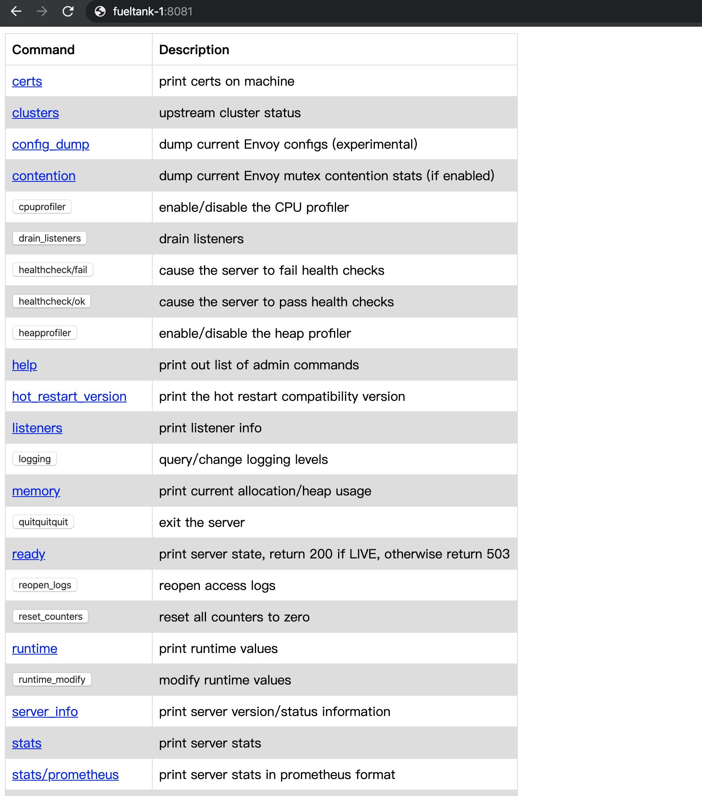

# Envoy 代理自己的服务

Envoy 和 Nginx 一样，都具有反向代理的功能，但是相对而言，Envoy 在某些方面更强大一些，比如对 HTTP 2.0、gRPC 的支持，动态配置更新的特性等。

Envoy 是 Istio 的核心，Istio 的所有流量治理功能最终都是通过 Envoy 来实现的，可以将 Istio 看作是 Envoy 的一层包装。

Envoy 并没有二进制文件（但可以自己编译），只能使用 Envoy 提供的官方镜像为基础镜像，然后在这个基础镜像的基础上来添加自己的服务。

下面就来从头到尾来创建一个自己的服务，并用 Envoy 进行代理。

本文使用 `go-restful` 进行构建 web 服务。

本文参考：https://www.envoyproxy.io/docs/envoy/latest/start/start


## 创建 Web 服务

创建项目，名为 hello-envoy

然后编写 golang 代码，命名为 main.go ：

```go
package main

import (
	"github.com/emicklei/go-restful"
	"io"
	"log"
	"net/http"
)

// This example shows the minimal code needed to get a restful.WebService working.
//
// GET http://localhost:8080/hello

func main() {
	ws := new(restful.WebService)
	ws.Route(ws.GET("/hello").To(hello))
	restful.Add(ws)
	log.Println("server start in 8080")
	log.Fatal(http.ListenAndServe(":8080", nil))
}

func hello(req *restful.Request, resp *restful.Response) {
	log.Println("request hello")
	_,_ = io.WriteString(resp, "world")
}
```

本地启动访问：

```bash
$ curl http://localhost:8080/hello
world
```

交叉编译 ：

```bash
$ GOOS=linux GOARCH=amd64 go build
```

编译完成后，会生成一个名为 `hello-envoy` 的二进制文件，这个文件只能在 amd64 的 Linux 中运行。


## 编写 envoy 的 yaml 配置文件

这里命名为 hello-envoy-config.yaml ，后续会把这个文件挂载到容器中，供 envoy 使用。

```yaml
admin:
  access_log_path: "/dev/null"
  address:
    socket_address:
      address: 0.0.0.0
      port_value: 8081

static_resources:
  listeners:
  - address:
      socket_address:
        address: 0.0.0.0
        port_value: 80
    filter_chains:
    - filters:
      - name: envoy.filters.network.http_connection_manager
        typed_config:
          "@type": type.googleapis.com/envoy.config.filter.network.http_connection_manager.v2.HttpConnectionManager
          codec_type: auto
          stat_prefix: ingress_http
          route_config:
            name: local_route
            virtual_hosts:
            - name: service
              domains:
              - "*"
              routes:
              - match:
                  prefix: "/hello"
                route:
                  cluster: local_service
          http_filters:
          - name: envoy.filters.http.router
  clusters:
  - name: local_service
    connect_timeout: 0.25s
    type: strict_dns
    lb_policy: round_robin
    load_assignment:
      cluster_name: local_service
      endpoints:
      - lb_endpoints:
        - endpoint:
            address:
              socket_address:
                address: 127.0.0.1
                port_value: 8080
```

官方 Getting Start 的那个配置是重定向到 www.google.com，我们这里是重定向到自己的服务。

这里说明几个关键点，`admin` 中配置了 envoy 的管理端口，`listeners` 中的 `address` 指定了 envoy 对外的服务地址和端口，`match` 表示匹配到之后转移到哪个 `cluster` ，`clusters` 中，指向了刚刚我们创建的服务端口 8080，这个端口只能容器内部访问。

这里都是用的静态人肉配置，后续学习 xDS 进行动态配置。

这里对 `admin` 进行说明一下，`admin` 是 Envoy 自带的一个管理端口，在文章最后将进行展示。


## 创建启动脚本

创建名为 hello-start.sh 的文件，后续会把这个文件放到自己创建的镜像中，以启动服务和 envoy：

```sh
#!/bin/sh
./code/hello-envoy &
envoy -c /etc/hello-envoy-config.yaml --service-cluster service
```


## 创建 Dockerfile 文件

创建名为 Dockerfile-hello 的文件：

```dockerfile
FROM envoyproxy/envoy-alpine-dev:latest

RUN mkdir /code
ADD ./hello-envoy /code
ADD ./hello-start.sh /usr/local/bin/hello-start.sh
RUN chmod u+x /code/hello-envoy
RUN chmod u+x /usr/local/bin/hello-start.sh
ENTRYPOINT /usr/local/bin/hello-start.sh
```

注意这里使用了 `envoy` 的基础镜像，里面带有 `envoy` 命令。然后会把 `hello-envoy` 二进制文件和启动脚本都放入镜像中，并赋予执行权限，最后是容器的启动点。


## 创建 docker-compose 文件

创建名为 `docker-compose.yaml` 的文件：

```yaml
version: "3.7"
services:

  hello-service:
    build:
      context: .
      dockerfile: Dockerfile-hello
    volumes:
      - ./hello-envoy-config.yaml:/etc/hello-envoy-config.yaml
    expose:
      - "80"
      - "8081"
    ports:
      - "8000:80"
      - "8081:8081"
```

在这个 docker-compose 文件中，指定了 Dockerfile 文件，然后会把 `hello-envoy-config.yaml` 挂载到容器中，最后映射好端口，把 Envoy 提供服务的 80 端口映射到宿主机的 8080 端口，把 Envoy 的 admin 管理端口 8081 映射到宿主机的 8081 端口。

注意这里的 hello-service ，就是 docker compose 中容器的主机名


## 上传 & 构建 & 测试

将上面的项目上传到服务器。然后进行构建：

```bash
$ sudo docker-compose up --build -d
```

测试：

```bash
$ curl http://localhost:8000/hello
world
```

成功！！！

访问 Envoy 管理界面：




## 创建一个前端代理

我想多部署一个容器，作为上面那个 hello 容器的前端。

创建 front-envoy.yaml 文件：

```yaml
static_resources:
  listeners:
  - address:
      socket_address:
        address: 0.0.0.0
        port_value: 80
    filter_chains:
    - filters:
      - name: envoy.filters.network.http_connection_manager
        typed_config:
          "@type": type.googleapis.com/envoy.config.filter.network.http_connection_manager.v2.HttpConnectionManager
          codec_type: auto
          stat_prefix: ingress_http
          route_config:
            name: local_route
            virtual_hosts:
            - name: backend
              domains:
              - "*"
              routes:
              - match:
                  prefix: "/hello"
                route:
                  cluster: service
          http_filters:
          - name: envoy.filters.http.router
            typed_config: {}
  clusters:
  - name: service
    connect_timeout: 0.25s
    type: strict_dns
    lb_policy: round_robin
    http2_protocol_options: {}
    load_assignment:
      cluster_name: service
      endpoints:
      - lb_endpoints:
        - endpoint:
            address:
              socket_address:
                address: hello-service
                port_value: 80
admin:
  access_log_path: "/dev/null"
  address:
    socket_address:
      address: 0.0.0.0
      port_value: 8001
```

当访问这个容器时，这个容器的 envoy 会重定向到 `hello-service` 容器的 80 端口。

创建 Dockfile-frontenvoy 文件：

```dockerfile
FROM envoyproxy/envoy-dev:latest

CMD /usr/local/bin/envoy -c /etc/front-envoy-config.yaml --service-cluster front-proxy
```

修改 docker-compose.yaml 文件：

```yaml
version: "3.7"
services:

  front-envoy:
    build:
      context: .
      dockerfile: Dockerfile-frontenvoy
    volumes:
      - ./front-envoy-config.yaml:/etc/front-envoy-config.yaml
    expose:
      - "80"
      - "8001"
    ports:
      - "8000:80"
      - "8001:8001"

  hello-service:
    build:
      context: .
      dockerfile: Dockerfile-hello
    volumes:
      - ./hello-envoy-config.yaml:/etc/hello-envoy-config.yaml
    expose:
      - "80"
      - "8081"
```

删除并重新构建：

```bash
$ sudo docker-compose down
$ sudo docker-compose up --build -d
```

测试：

```
$ curl http://localhost:8000/hello
world
```

成功。


套路就是这么个套路，玩法就是这么个玩法。


## 卸载容器

```bash
$ sudo docker-compose down
```

