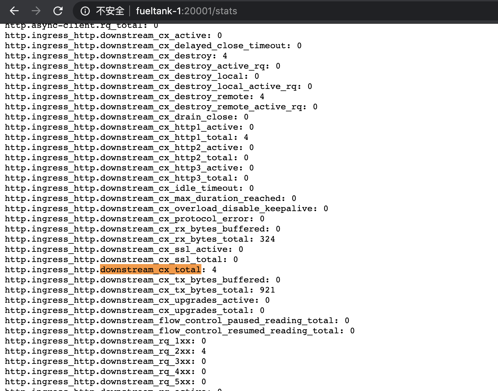

# HTTP 统计信息

每次连接 Envoy 都会收集统计信息，格式是：`http.<stat_prefix>.<SOME_NAME>`，其中的 SOME_NAME 表示下面表格中的条目。

通过访问 `http://admin_address:port/stats` 中可以查看所有统计信息。比如有以下配置：

```yaml
admin:
  access_log_path: "/dev/null"
  address:
    socket_address:
      address: 0.0.0.0
      port_value: 20001
```

则这个地址可以是 http://127.0.0.1:20001/stats 。

比如我这里的：




下面分别学习下这些字段的含义：

| 名称                            | 类型    | 描述                                                         |
| ------------------------------- | ------- | ------------------------------------------------------------ |
| downstream_cx_total             | Counter | 全部的连接数                                                 |
| downstream_cx_ssl_total         | Counter | 全部的 SSL 连接数                                            |
| downstream_cx_http1_total       | Counter | 全部的 HTTP/1.1 连接数                                       |
| downstream_cx_upgrades_total    | Counter | 成功升级的连接总数。这些也算到了 http1 / http2 连接总数里面。 |
| downstream_cx_http2_total       | Counter | 全部的 Counter 连接数                                        |
| downstream_cx_destroy           | Counter | 全部销毁的连接数量                                           |
| downstream_cx_destroy_remote    | Counter | 由于远程关闭而被取消的连接总数                               |
| downstream_cx_destroy_local     | Counter | 由于本地关闭而被取消的连接总数                               |
| downstream_cx_destroy_active_rq | Counter | 总连接数被1个以上的活跃请求破坏                              |

