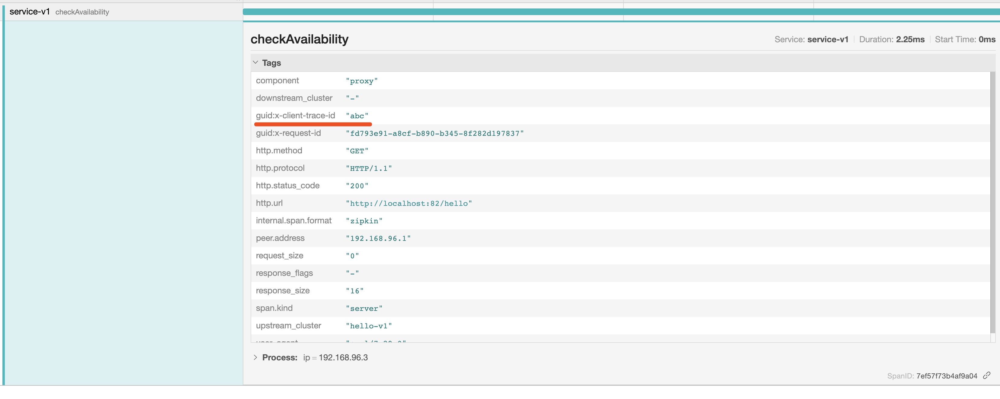

# Header 处理


在 [流量转移与分流.md](流量转移与分流.md) 中  对于 Envoy 的访问，会返回以下信息，注意其中的 Header：

```bash
$ curl -v http://127.0.0.1:82/hello
```

响应：

```
* About to connect() to 127.0.0.1 port 82 (#0)
*   Trying 127.0.0.1...
* Connected to 127.0.0.1 (127.0.0.1) port 82 (#0)
> GET /hello HTTP/1.1
> User-Agent: curl/7.29.0
> Host: 127.0.0.1:82
> Accept: */*
> 
< HTTP/1.1 200 OK
< date: Thu, 23 Apr 2020 05:35:50 GMT
< content-length: 8
< content-type: text/plain; charset=utf-8
< x-envoy-upstream-service-time: 1
< server: envoy
< 
* Connection #0 to host 127.0.0.1 left intact
world v1
```

注意这里的 `server: envoy` ，Envoy 会默认为响应加入一个 key 为 `server`，值为 `envoy` 的 header，我们可以自定义这个值，修改 Envoy 配置中的 `server_name`，如下：

```yaml
static_resources:
  listeners:
  - filter_chains:
    - filters:
      - name: envoy.filters.network.http_connection_manager
        typed_config:
          "@type": type.googleapis.com/envoy.config.filter.network.http_connection_manager.v2.HttpConnectionManager
          server_name: my-envoy
         
```

再次访问，会发现以下效果：

```
* About to connect() to 127.0.0.1 port 82 (#0)
*   Trying 127.0.0.1...
* Connected to 127.0.0.1 (127.0.0.1) port 82 (#0)
> GET /hello HTTP/1.1
> User-Agent: curl/7.29.0
> Host: 127.0.0.1:82
> Accept: */*
> 
< HTTP/1.1 200 OK
< date: Thu, 23 Apr 2020 05:41:35 GMT
< content-length: 8
< content-type: text/plain; charset=utf-8
< x-envoy-upstream-service-time: 2
< server: my-envoy
< 
* Connection #0 to host 127.0.0.1 left intact
world v1
```


以上仅仅是 Envoy 操作的其中一个 Header，下面来学习 Envoy 操作的更多 Header。


#### user-agent

如果使用默认 `add_user_agent` (为 false)的话，如果客户端不设置 user-agent ，则 Envoy 不会自动添加 user-agent。

如果指定 `add_user_agent` 为 true 的话，如果客户端不设置 user-agent ，则 Envoy 会自动为请求添加 user-agent Header，值为启动 Envoy 时指定的 `--service-cluster` 选项值，或者为 Envoy 中配置的 `node.cluster` 值。

下面来动手做测试，需要记录访问日志，如下：

```yaml
static_resources:
  listeners:
  - filter_chains:
    - filters:
      - name: envoy.filters.network.http_connection_manager
        typed_config:
          "@type": type.googleapis.com/envoy.config.filter.network.http_connection_manager.v2.HttpConnectionManager
          access_log:
            name: envoy.file_access_log
            typed_config:
              "@type": type.googleapis.com/envoy.config.accesslog.v2.FileAccessLog
              path: /dev/stdout
```

首先测试什么都不指定，curl 访问后，会打印以下日志：

```
"GET /hello HTTP/1.1" 200 - 0 8 5 2 "-" "curl/7.29.0" "8d60a831-ae72-486d-aac1-3bc6faca88c8" "127.0.0.1:82" "127.0.0.1:8081"
```

默认 curl 会使用名为 `curl/7.29.0` 的代理，如果不指定 user-agent 的话：

```bash
$ curl -v http://127.0.0.1:82/hello --user-agent ""
```

Envoy 会打印以下日志：

```
"GET /hello HTTP/1.1" 200 - 0 8 2 1 "-" "" "5254f89f-54cd-4f43-88d5-38858627ba8d" "127.0.0.1:82" "127.0.0.1:8082"
```

可以注意到，原本会出现 `curl/7.29.0` 的位置变成了空。

如果我们指定 `add_user_agent` 为 true ，如下：

```yaml
static_resources:
  listeners:
  - filter_chains:
    - filters:
      - name: envoy.filters.network.http_connection_manager
        typed_config:
          "@type": type.googleapis.com/envoy.config.filter.network.http_connection_manager.v2.HttpConnectionManager
          add_user_agent: true
```

注意 `add_user_agent` 的位置，重新启动 Envoy 之后，curl 再不指定 user-agent 的话，Envoy 会打印以下日志：

```
"GET /hello HTTP/1.1" 200 - 0 8 6 2 "-" "" "b268dafa-43ed-4b66-89e5-f57067b5bfe1" "127.0.0.1:82" "127.0.0.1:8081"
```

可以看到没啥效果啊，怎么回事那，如果使用下面的方式启动 Envoy 就会看到效果了：

```bash
$ sudo getenvoy run standard:1.14.1 -- --config-path ./envoy-config-splitting.yaml --service-cluster test-name
```

注意这里为 Envoy 指定了 `--service-cluster` ，值随意定，我这里设置成了 test-name，然后再次不指定  user-agent 访问，就会有以下效果：

```
"GET /hello HTTP/1.1" 200 - 0 8 3 1 "-" "test-name" "bf5a3da0-c839-4129-8160-057425026ff7" "127.0.0.1:82" "127.0.0.1:8081"
```

这时候 Envoy 会自动为把 user-agent 的值设置为 `--service-cluster` 的值。

也可以不设置 `--service-cluster` ，而是使用 `node.cluster`，在 Envoy 的最上层配置中，添加如下配置：

```yaml
node:
  cluster: test-name2
```

再次无 user-agent 访问，Envoy 会打印以下日志：

```
"GET /hello HTTP/1.1" 200 - 0 8 4 1 "-" "test-name2" "732c88be-6686-4852-b21d-59ed38f80bec" "127.0.0.1:82" "127.0.0.1:8081"
```

这里需要注意，`--service-cluster` 的优先级高于  `node.cluster`。


#### x-client-trace-id

如果外部客户端设置了此 Header，则Envoy会将提供的跟踪ID与内部生成的 `x-client-trace-id` 连接起来。x-client-trace-id必须是全局唯一的，建议生成一个uuid4。如果设置了此标头，则其效果与x-envoy-force-trace相似。请参阅tracing.client_enabled运行时配置设置。

参考 [Envoy集成Jaeger.md](../../../Envoy集成Jaeger.md) 

如果客户端设置了 `x-client-trace-id`：

```bash
$ curl http://localhost:82/hello -H "x-client-trace-id: abc"
```

就会在 Jaeger UI 看到看到以下效果：




#### x-request-id

Envoy使用x-request-id标头来唯一标识请求以及执行稳定的访问日志记录和跟踪。Envoy将为所有外部原始请求生成一个x-request-id标头

Envoy 为每个请求都生成一个 `x-request-id` ，也可以手动指定，会在日志中打印，比如：

```bash
$ curl -v http://127.0.0.1:82/hello -H "x-request-id: abc"
```

会打印如下日志：

```
"GET /hello HTTP/1.1" 200 - 0 8 0 0 "-" "curl/7.29.0" "abc" "127.0.0.1:82" "127.0.0.1:8081"
```

如果对 `x-request-id` 进行自定义，会导致 `tracing` 无效。


