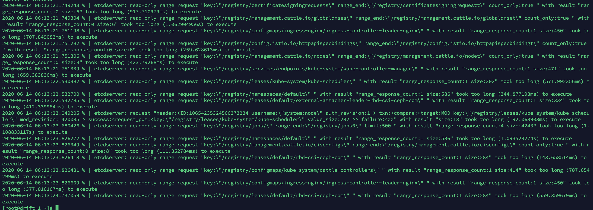

# etcd 性能调优

etcd 是搭建在 openstack 内的虚拟机之上的，磁盘不够好，所以经常出现查询超时，比如：



首先调整 etcd 的 ionice 值，即 IO 优先级。

```bash
$ ps -ef | grep etcd # 查看 etcd 进程的 PID
$ ionice  -p 134816 # 查看 ionice 值
```

提高进程优先级：

```
$ ionice -c 2 -n 0 -p 134816
```

这里 -c 2 表示使用调度类型 Best effort。-n 0 表示优先级，这里为最高优先级。


## 调度类型

#### Idle   

以Idle io优先级运行的程序只会在没有其他任何程序请求磁盘I/O的情况下得到磁盘I/O处理     时间。Idle调度类型不带任何参数。从内核2.6.25，Idle调度类型可以允许普通用户使用

#### Best effort

对那些还没有申请一个指定的io优先级的任何进程，这是有效的调度类型。这个类型会带一个优先级参数，0-7，数字越小，优先级越高。如果多个进程的优先级相同，Linux内核会以     Round-robin轮询的方式为其提供I/O服务。

需要注意的是，2.6.26内核之前，没有申请I/O优先级的进程通常使用“none”作为调度类型，但是IO调度算法会当作这些进程使用的是best effort调度类型。使用best effort调度类型的进程的I/O优先级会根据这些进程的CPU nice级别动态变更， io_priority = (cpu_nice +20)/5

2.6.26内核版本之后，并且使用CFQ作为调度算法的情况下，如果一个进程没有申请I/O优先级，那么它将使用CPU的调度类型作为I/O的调度类型，I/O优先级和2.6.26内核版本之前的计算方式相同。

#### Real time

使用这个调度类型的进程会不管系统上的任何其他任务，会第一时间去访问磁盘。以此使用RT调度类型时需要小心，因为它可能会饿死其他进程(starve other processes)。同best effor一样，RT也有8个优先级。RT不允许普通用户使用。