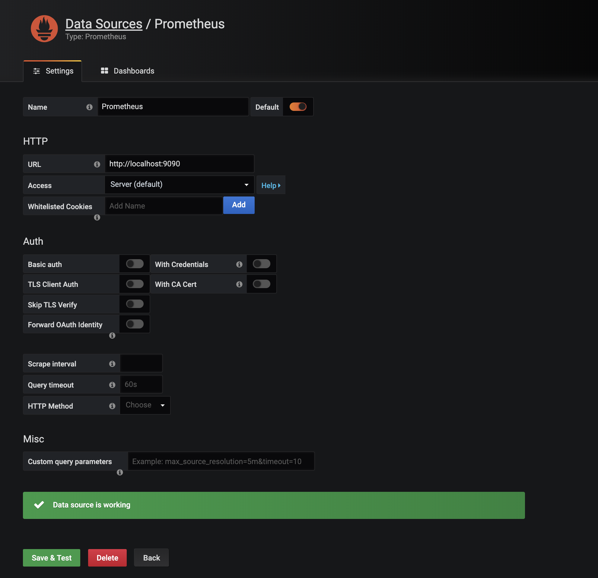
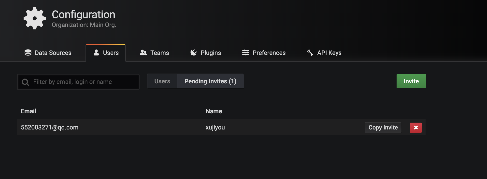
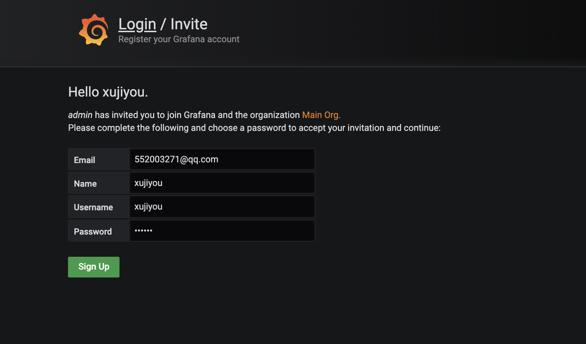

# Grafana 入门

官方文档地址：https://grafana.com/docs/grafana/latest/

一篇不错的教程：https://www.jianshu.com/p/7e7e0d06709b

## MacOS 安装

安装：

```bash
$ brew update
$ brew install grafana
```

启动：

```bash
$ brew services start grafana
```

更新：

```bash
$ brew update
$ brew reinstall grafana
```


## 登录

运行成功后，浏览器打开 http://localhost:3000/ ，默认用户名和密码都是 admin，登录后让修改密码，因为我这是本地学习，所以都设置成了123456.

## 配置数据源

这里我本地也启动了 Prometheus ，具体配置在  [Prometheus入门.md](../Prometheus/Prometheus入门.md) 

所以这里我选了 Prometheus 的数据源，如下：



创建用户：


创建完成后，会这样子：



这里我没选择给我发 email，所以我这里要点 Copy Invite 这个按钮，这会复制到一个链接，在新标签页打开这个链接，会出现更新密码的界面：



注意，这里的用户角色别选 admin，选 editor。选了 editor 之后，会出现 Dashboard，要是 admin 的话，还是出现 Configuration 界面。

但总起来说，还是 admin 权限多。剩下的先熟悉下界面吧。


## 重置密码

```
[root@local]# sqlite3 /var/lib/grafana/grafana.db
#查看数据库中包含的表
.tables

#查看user表内容
select * from user;

#重置admin用户的密码为默认admin
update user set password = '59acf18b94d7eb0694c61e60ce44c110c7a683ac6a8f09580d626f90f4a242000746579358d77dd9e570e83fa24faa88a8a6', salt = 'F3FAxVm33R' where login = 'admin';

#退出sqlite3
.exit
```