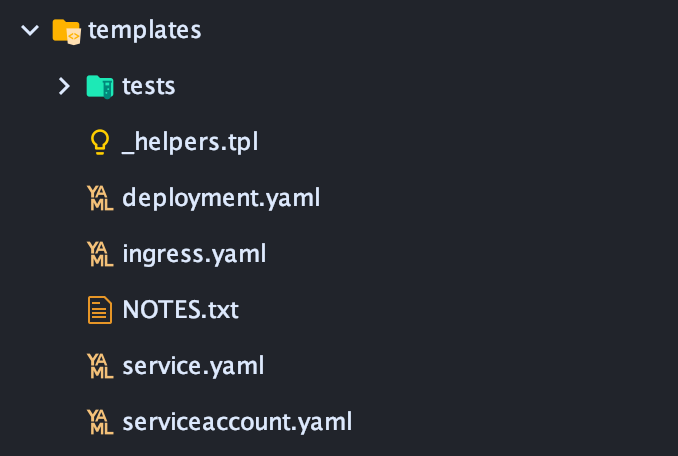

# Helm Chart Template 手册

在这篇教程中，我们将创建一个 chart ，并添加一个template 。

官方文档地址：https://helm.sh/docs/chart_template_guide/getting_started/


---


## 创建Chart

教程开始

### 目录结构

Helm Chart 的目录结构如下：

```
mychart/
  Chart.yaml
  values.yaml
  charts/
  templates/
  ...
```

- `templates/` 目录用于存放模版文件，当 Helm 构建 Chart 时，Helm 会解析这个目录中的文件，并将结果发送到 Kubernetes。

- `values.yaml` 包含了templates/ 目录中使用的默认值，在 `helm install` 或 `helm upgrarde` 期间，用户可能会覆盖这些值。

- `Chart.yaml` 文件包含对 Chart 的描述，可以在 templates/ 目录中访问这个文件。

- `charts/`目录可能包含其他 Chart（称为 subcharts）

### 创建项目

可以使用命令生成项目：

```bash
$ helm create mychart
```

也可以使用 IDEA 的 kubernetes 插件来创建一个 Helm Chart。

---

### `templates/` 目录

先来看下 这个目录



- `NOTES.txt` 这个文件是 Chart 的帮助文本，会在 `helm install` 之后显示
- `deployment.yaml` Kubernetes 的 Deployment 部署文件
- `service.yaml` Kubernetes 的 Service 部署文件
- `ingress.yaml` Kubernetes 的 Ingress 部署文件
- `serviceaccount` Kubernetes 的 ServiceAccount 部署文件
- `_helpers.tpl` 放置可在整个图表中重复使用的常量的地方

第一次创建 Chart ，为了学习，将删除这些文件。当然，平常留着这些文件，可以提升开发速度。

---

### 第一个模版

我们要创建的第一个模板将是`ConfigMap`。

configmap.yaml：

```yaml
apiVersion: v1
kind: ConfigMap
metadata:
  name: mychart-configmap
data:
  myvalue: "Hello World"
```

创建好这个 yaml 文件后，就可以用 Helm 安装了：

```bash
$ helm install myname ./xujiyou/
NAME: myname
LAST DEPLOYED: Sun Feb 23 11:46:02 2020
NAMESPACE: default
STATUS: deployed
REVISION: 1
TEST SUITE: None
```

使用 Helm 命令，也可以检索并查看已加载的模版：

```bash
$ helm list
NAME    NAMESPACE       REVISION        UPDATED                                 STATUS          CHART           APP VERSION
myname  default         1               2020-02-23 11:46:02.008166 +0800 CST    deployed        xujiyou-0.1.0   1.16.0 
$ helm get manifest myname
---
# Source: xujiyou/templates/configmap.yaml
apiVersion: v1
kind: ConfigMap
metadata:
  name: mychart-configmap
data:
  myvalue: "Hello World"

```

使用 Kubectl 查看刚才创建的 ConfigMap：

```bash
$ kubectl get ConfigMap mychart-configmap
NAME                DATA   AGE
mychart-configmap   1      2m47s
```

卸载刚才的 Chart：

```bash
$ helm uninstall myname
```

---

### 添加一个简单的模版调用

我们将 name 抽取出来，提取成变量。

修改 configmap.yaml：

```
apiVersion: v1
kind: ConfigMap
metadata:
  name: {{ .Release.Name }}-configmap
data:
  myvalue: "Hello World"
```

模板指令包含在`{{`和`}}`块中，具体语法要参考 go template。

该`Release`对象是Helm的内置对象之一。

再按照上边的方法部署以下，再看一下生成的模版：

```bash
$ helm get manifest myname
---
# Source: xujiyou/templates/configmap.yaml
apiVersion: v1
kind: ConfigMap
metadata:
    name: myname-configmap
data:
    myvalue: "Hello World"
```

---

### 调试方式

上边的命令没次修改了代码之后都需要重装，可以使用 `--debug` 和 `--dry-run` 参数来调试，而不必没次都重装：

```bash
$ helm install myname ./xujiyou --debug --dry-run
install.go:158: [debug] Original chart version: ""
install.go:175: [debug] CHART PATH: /Users/jiyouxu/IdeaProjects/helm/xujiyou

NAME: myname
LAST DEPLOYED: Sun Feb 23 12:02:57 2020
NAMESPACE: default
STATUS: pending-install
REVISION: 1
TEST SUITE: None
USER-SUPPLIED VALUES:
{}

COMPUTED VALUES:
affinity: {}
fullnameOverride: ""
image:
  pullPolicy: IfNotPresent
  repository: nginx
imagePullSecrets: []
ingress:
  annotations: {}
  enabled: false
  hosts:
  - host: chart-example.local
    paths: []
  tls: []
nameOverride: ""
nodeSelector: {}
podSecurityContext: {}
replicaCount: 1
resources: {}
securityContext: {}
service:
  port: 80
  type: ClusterIP
serviceAccount:
  annotations: {}
  create: true
  name: null
tolerations: []

HOOKS:
MANIFEST:
---
# Source: xujiyou/templates/configmap.yaml
apiVersion: v1
kind: ConfigMap
metadata:
    name: myname-configmap
data:
    myvalue: "Hello World"
```


---


## 内置对象

搞定了部署过程之后，下面就来看一哈 Helm 有哪些内置对象。

内置对象一定是首字母大写的，

`Release`：此对象描述发行版本身。它内部有几个对象：

```
- `Release.Name`：发行名称
- `Release.Namespace`：要释放到的名称空间（如果清单未覆盖）
- `Release.IsUpgrade`：如果当前操作是升级或回滚，则为 true。
- `Release.IsInstall`：如果当前操作是安装，则为 true。
- `Release.Revision`：此版本的修订号。在安装时，该值为1，并且每次升级和回滚时都会增加。
- `Release.Service`：呈现当前模板的服务。在Helm上，这始终是`Helm`。

`Values`：从`values.yaml`文件和用户提供的文件传递到模板的值。默认情况下`Values`为空。

`Chart`：`Chart.yaml`文件的内容。`Chart.yaml`输入的任何数据都可以用此内置变量访问。例如`{{ .Chart.Name }}-{{ .Chart.Version }}`将打印出`mychart-0.1.0`。

- 可用字段在“ [图表指南”](https://helm.sh/docs/topics/charts/#the-chartyaml-file)中列出

`Files`：这提供对图表中所有非特殊文件的访问。虽然您不能使用它来访问模板，但是可以使用它来访问图表中的其他文件。有关更多信息，请参见“ *访问文件* ”部分。

- `Files.Get`是用于通过名称（`.Files.Get config.ini`）获取文件的功能
- `Files.GetBytes`是用于以字节数组而不是字符串形式获取文件内容的函数。这对于诸如图像之类的东西很有用。
- `Files.Glob` 是一个函数，该函数返回名称与给定的Shell Glob模式匹配的文件列表。
- `Files.Lines`是一种逐行读取文件的功能。这对于遍历文件中的每一行很有用。
- `Files.AsSecrets` 是将文件主体作为Base 64编码的字符串返回的函数。
- `Files.AsConfig` 是一个将文件正文作为YAML映射返回的函数。

`Capabilities`：这提供了有关Kubernetes集群支持哪些功能的信息。

- `Capabilities.APIVersions` 是一组版本号。
- `Capabilities.APIVersions.Has $version`指示版本（例如 `batch/v1`）或资源（例如`apps/v1/Deployment`）在群集上是否可用。
- `Capabilities.KubeVersion`并且`Capabilities.KubeVersion.Version`是Kubernetes版本。
- `Capabilities.KubeVersion.Major` 是Kubernetes的主要版本。
- `Capabilities.KubeVersion.Minor` 是Kubernetes的次要版本。

`Template`：包含有关正在执行的当前模板的信息

- `Name`：当前模板的命名空间文件路径（例如 `mychart/templates/mytemplate.yaml`）
- `BasePath`：当前图表的模板目录的命名空间路径（例如`mychart/templates`）。
```

就这些内置变量。


---


# Values Files

上一节说了 `Values` 全局对象，其内容有多种来源：

- values.yaml 中的值。
- 父 Chart 中的 values.yaml
- 值文件（如果传入`helm install`或`helm upgrade`带有`-f` 标志（`helm install -f myvals.yaml ./mychart`）
- 使用 --set 传入的参数。

上边的排列是有顺序的，下面会覆盖上边的。

删除中的默认设置后`values.yaml`，然后只设置一个参数：

```yaml
favoriteDrink: coffee
```

修改 configmap.yaml 如下：

```yaml
apiVersion: v1
kind: ConfigMap
metadata:
    name: {{ .Release.Name }}-configmap
data:
    myvalue: "Hello World"
    drink: {{ .Values.favoriteDrink }}
```

运行下边的命令看效果：

```bash
$ helm install xujiyou --dry-run --debug ./xujiyou
```

通过 --set 参数改变值，并测试：

```bash
$ helm install xujiyou --dry-run --debug --set favoriteDrink=slurm ./xujiyou 
```

values.yaml 也可以包含结构化的内容：

```yaml
favorite:
  drink: coffee
  food: pizza
```

修改 configmap.yaml 如下：

```yaml
apiVersion: v1
kind: ConfigMap
metadata:
  name: {{ .Release.Name }}-configmap
data:
  myvalue: "Hello World"
  drink: {{ .Values.favorite.drink }}
  food: {{ .Values.favorite.food }}
```


---


## Template Functions and Pipelines

这个功能用来转换数据。下面来看看如何使用模版函数：

修改 configmap.yaml 如下：

```yaml
apiVersion: v1
kind: ConfigMap
metadata:
  name: {{ .Release.Name }}-configmap
data:
  myvalue: "Hello World"
  drink: {{ quote .Values.favorite.drink }}
  food: {{ quote .Values.favorite.food }}
```

quote 用于给字符串加一个引号，结果如下：

```yaml
# Source: xujiyou/templates/configmap.yaml
apiVersion: v1
kind: ConfigMap
metadata:
  name: xujiyou-configmap
data:
  myvalue: "Hello World"
  drink: "coffee"
  food: "pizza"
```


Helm 有60多种函数，其中一些是 go 模版语言自身定义的，其他大部分是 [sprig](https://masterminds.github.io/sprig/) 库中的函数。

模版语言还有另外一种功能 --- 管道，类似 Linux 命令行中的管道

```yaml
apiVersion: v1
kind: ConfigMap
metadata:
  name: {{ .Release.Name }}-configmap
data:
  myvalue: "Hello World"
  drink: {{ .Values.favorite.drink | quote }}
  food: {{ .Values.favorite.food | upper | quote }}
```


repeat 函数有两个参数：

```yaml
apiVersion: v1
kind: ConfigMap
metadata:
  name: {{ .Release.Name }}-configmap
data:
  myvalue: "Hello World"
  drink: {{ .Values.favorite.drink | repeat 5 | quote }}
  food: {{ .Values.favorite.food | upper | quote }}
```


默认值，需要用到 default 函数

```
apiVersion: v1
kind: ConfigMap
metadata:
  name: {{ .Release.Name }}-configmap
data:
  myvalue: "Hello World"
  drink: {{ .Values.favorite.drink | default "tea" | quote }}
  food: {{ .Values.favorite.food | upper | quote }}
```


---


## 流程控制

Helm 模版语言来源于 go 模版语言。Helm 模版语言提供了以下控制结构：

- if / else
- with 制定范围
- range 迭代

除此之外，还提供了一些声明和使用变量的操作：

- define 声明变量
- template 导入命名模版
- block 声明一种特殊的可填充模版区域

本节，其他的将在 命名模版 部分介绍。

**if / else**

如果值为以下内容，则为 false：

- 布尔值 false
- 数字 0
- 一个空字符串
- nil
- 空集合`map`，`slice`，`tuple`，`dict`，`array`）

体验：

```yaml
apiVersion: v1
kind: ConfigMap
metadata:
  name: {{ .Release.Name }}-configmap
data:
  myvalue: "Hello World"
  drink: {{ .Values.favorite.drink | default "tea" | quote }}
  food: {{ .Values.favorite.food | upper | quote }}
  {{ if eq .Values.favorite.drink "coffee" }}mug: true{{ end }}
```

工作完美。

规整代码：

```yaml
apiVersion: v1
kind: ConfigMap
metadata:
  name: {{ .Release.Name }}-configmap
data:
  myvalue: "Hello World"
  drink: {{ .Values.favorite.drink | default "tea" | quote }}
  food: {{ .Values.favorite.food | upper | quote }}
  {{- if eq .Values.favorite.drink "coffee" }}
  mug: true
  {{- end }}
```

这里的小减号代表去掉 if 和 end 这两个空白行，如果不加入这俩减号，则会引入空行！！！

还有，缩进一定按照 yaml 格式来，IDEA 会给出提示的，不用过度担心。


**with**

with 的作用就是提取变量：

```yaml
apiVersion: v1
kind: ConfigMap
metadata:
  name: {{ .Release.Name }}-configmap
data:
  myvalue: "Hello World"
  {{- with .Values.favorite }}
  drink: {{ .drink | default "tea" | quote }}
  food: {{ .food | upper | quote }}
  {{- end }}
  {{- if eq .Values.favorite.drink "coffee" }}
  mug: true
  {{- end }}
```

但有个坑就是，使用了 with 之后，里面就不能使用其他变量了，有点鸡肋。


**range**

range 就是迭代操作：

values.yaml：

```yaml
favorite:
  drink: coffee
  food: pizza
pizzaToppings:
  - mushrooms
  - cheese
  - peppers
  - onions
```

 configmap.yaml :

```yaml
apiVersion: v1
kind: ConfigMap
metadata:
  name: {{ .Release.Name }}-configmap
data:
  myvalue: "Hello World"
  {{- with .Values.favorite }}
  drink: {{ .drink | default "tea" | quote }}
  food: {{ .food | upper | quote }}
  {{- end }}
  toppings: |-
    {{- range .Values.pizzaToppings }}
    - {{ . | title | quote }}
    {{- end }}
```

结果如下：

```yaml
# Source: xujiyou/templates/configmap.yaml
apiVersion: v1
kind: ConfigMap
metadata:
  name: xujiyou-configmap
data:
  myvalue: "Hello World"
  drink: "coffee"
  food: "PIZZA"
  toppings: |-
    - "Mushrooms"
    - "Cheese"
    - "Peppers"
    - "Onions"
```


## 变量

上面说到使用 with 时，里面不能使用其他对象，这里可以定义变量来解决这一问题：

```yaml
apiVersion: v1
kind: ConfigMap
metadata:
  name: {{ .Release.Name }}-configmap
data:
  myvalue: "Hello World"
  {{- $relname := .Release.Name -}}
  {{- with .Values.favorite }}
  drink: {{ .drink | default "tea" | quote }}
  food: {{ .food | upper | quote }}
  release: {{ $relname }}
  {{- end }}
```

注意 `$relname := .Release.Name` 这句

range 中也可以定义变量：

```yaml
apiVersion: v1
kind: ConfigMap
metadata:
  name: {{ .Release.Name }}-configmap
data:
  myvalue: "Hello World"
  {{- $relname := .Release.Name -}}
  {{- with .Values.favorite }}
  drink: {{ .drink | default "tea" | quote }}
  food: {{ .food | upper | quote }}
  release: {{ $relname }}
  {{- end }}
  toppings: |-
    {{- range $index, $topping := .Values.pizzaToppings }}
    {{ $index }}: {{ $topping }}
  {{- end }}
```

也可遍历 map：

```yaml
apiVersion: v1
kind: ConfigMap
metadata:
  name: {{ .Release.Name }}-configmap
data:
  myvalue: "Hello World"
  {{- range $key, $val := .Values.favorite }}
  {{ $key }}: {{ $val | quote }}
  {{- end }}
```


---


## 命名模版

这节来学习 define、template 和 block

看下面的文件：

```yaml
{{- define "mychart.labels" }}
  labels:
    generator: helm
    date: {{ now | htmlDate }}
{{- end }}
apiVersion: v1
kind: ConfigMap
metadata:
  name: {{ .Release.Name }}-configmap
  {{- template "mychart.labels" }}
data:
  myvalue: "Hello World"
  {{- range $key, $val := .Values.favorite }}
  {{ $key }}: {{ $val | quote }}
  {{- end }}
```

不多 bb，一个文件就看懂怎么用了，模版定义一般会放在 `_helpers.tpl` 中。

在模版中使用全局对象：

```yaml
{{- define "mychart.labels" }}
  labels:
    generator: helm
    date: {{ now | htmlDate }}
    chart: {{ .Chart.Name }}
    version: {{ .Chart.Version }}
{{- end }}
```

再引入时会发现出错了。因为如果想使用全局变量，需要在 template 中声明，像下面这样引入：

```
{{- template "mychart.labels" .}}
```

可以看到，加了一个点。

### 使用 include 及 indent

template 是一个动作而不是一个函数，所以无法处理缩进，只能在 _helpers.tpl 中定义好缩进，如果我想在 _helpers.tpl 随意定义缩进怎么办那，可以使用下边的方法：

```yaml
apiVersion: v1
kind: ConfigMap
metadata:
  name: {{ .Release.Name }}-configmap
{{- include "mychart.labels" . | indent 2}}
data:
  myvalue: "Hello World"
  {{- range $key, $val := .Values.favorite }}
  {{ $key }}: {{ $val | quote }}
  {{- end }}
```


---


## Accessing Files Inside Templates

有时不想引入模版，而是想引入文件，怎么办那。

Helm 提供了 Files 全局对象。

Files 对象无法访问以下文件：

- templates/ 目录下的文件
- .helmignore

还有就是注意 Chart 最大不得大于 1M 。

下面通过例子来学习：

config1.toml：

```
message = Hello from config 1
```

config2.toml:

```
message = This is config 2
```

config3.toml:

```
message = Goodbye from config 3
```

使用这三个文件：

```yaml
apiVersion: v1
kind: ConfigMap
metadata:
  name: {{ .Release.Name }}-configmap
data:
  {{- $files := .Files }}
  {{- range tuple "config1.toml" "config2.toml" "config3.toml" }}
  {{ . }}: |-
    {{ $files.Get . }}
  {{- end }}
```

结果：

```yaml
# Source: xujiyou/templates/configmap.yaml
apiVersion: v1
kind: ConfigMap
metadata:
  name: xujiyou-configmap
data:
  config1.toml: |-
    message = Hello from config 1
  config2.toml: |-
    message = This is config 2
  config3.toml: |-
    message = Goodbye from config 3
```


---


## NOTES.txt

NOTES.txt：

```
Thank you for installing {{ .Chart.Name }}.

Your release is named {{ .Release.Name }}.

To learn more about the release, try:

  $ helm status {{ .Release.Name }}
  $ helm get {{ .Release.Name }}
```

注意这个文件是在 templates/ 目录下的。

运行之后，看到效果：

```
NOTES:
Thank you for installing xujiyou.

Your release is named xujiyou.

To learn more about the release, try:

  $ helm status xujiyou
  $ helm get xujiyou
```


---


## .helmignore

`.helmignore`文件用于指定不想包含在 Chart 中的文件。

这可以帮助避免在 Chart 中添加不必要或敏感的文件或目录。


---


## 调试

`helm get manifest xujiyou` 用户查看已部署 Chart 的详细信息

`helm lint` 可以检查语法是否正确。

`helm template --debug ./` 和 `helm install --dry-run --debug` 可以查看渲染结果，而不会真正的部署。
