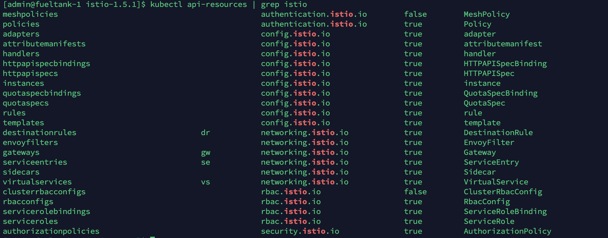

# Istio crd (一) 概述

我是用的版本：1.4.7，这一版本的 CRD 相对来说比较少，每一个 CRD 都是 Istio 中的一个知识点。基本上学会了这些 CRD 就会 Istio 的使用了。

查看有哪些 istio 的 crd：

```
$ kubectl api-resources | grep istio
```

列表如下：



一共 23 个，共分 5 类。

接下来的文章中分类来学习下这些 CRD。

在官方代码库中：https://github.com/istio/api，有这些 CRD 的定义。