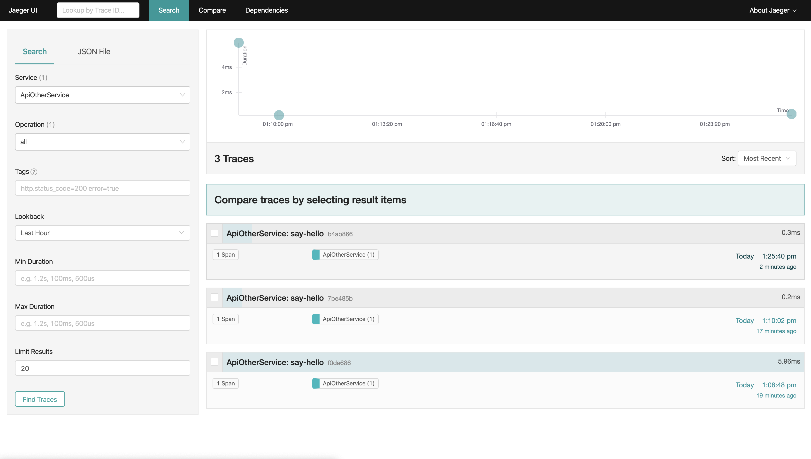
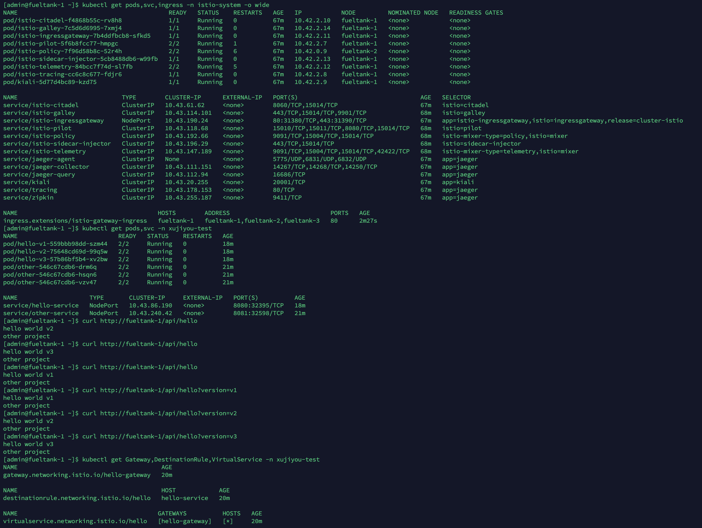

# Istio Hello-world 教程

网上的教程太复杂，并且应用代码不是自己写的，所以用起来理解的不那么透彻。这篇文章的目的就是从头开发一个简单的 Istio 应用。

本篇的微服务采用 Spring boot，方便快捷。也可以用其他 RESTFul 服务框架，一样的道理。

前提：

1. 有一个 K8s 集群
2. K8s 集群中安装有 Istio
3. 最好把 Istio 官方的 book-info 示例跑通。保证不会出像证书错误，sidecar 不能注入之类的问题。

下面的代码可以根据自己的需求稍加改动。


---


## 创建命名空间

首先要创建命名空间，然后打上允许 Istio 注入的标签：

```bash
$ kubectl create ns xujiyou-test
$ kubectl label namespace xujiyou-test istio-injection=enabled
```


---


## 创建 Hello world 程序

使用 Idea 创建一个 Spring boot 程序，名字为 hello，包含 web 和 devtools 依赖。

然后写代码：

```java
package workxujiyou.hello.api;

import org.springframework.web.bind.annotation.GetMapping;
import org.springframework.web.bind.annotation.RequestMapping;
import org.springframework.web.bind.annotation.RestController;

/**
 * HelloApi class
 *
 * @author jiyouxu
 * @date 2020/2/3
 */
@RestController
@RequestMapping("/api")
public class HelloApi {

    @GetMapping("/hello")
    public String hello() {
        return "hello world";
    }
}
```

然后在本地启动，启动后，访问：http://localhost:8080/api/hello ，保证能看到 hello world。

下一步使用 `Telepresence` 将本地应用映射到 k8s 集群中。


---


## 使用 Telepresence 简化开发流程

Telepresence 也是 CNCF 的项目，用来简化 k8s 中微服务的开发流程。

官方文档：https://www.telepresence.io/

系统为MacOS，首先在本地安装 Telepresence：

```bash
$ brew cask install osxfuse
$ brew install datawire/blackbird/telepresence
```

安装完成后，在本地运行以下命令，把本地服务暂时性的映射到 k8s 集群中：

```bash
$ telepresence --namespace xujiyou-test -n hello --expose 8080
```

命令运行过程中会要求 root 权限，需输入密码。运行完成后，会出来一个bash命令行，在这个命令行里边，可以直接访问 k8s 的 service ！！！

简单说明一下这个命令，这里的 -n 参数代表新创建一个名为 hello 的 Deployment 和同名的 Service。如果集群中已经存在这样的 Deployment 了，可以把 -n 替换成 -s，-s 是 --swap-deployment 的简称，-n 是 --new-deployment 的简称。指定命名空间用 --namespace 。

然后在 telepresence 生成的 bash 命令行中，运行以下命令

```bash
$ curl http://hello:8080/api/hello
```

然后会看到 hello world 显示出来，说明成功了。这里的域名 hello 就是访问的 service 的名字


---


## 发布程序到 k8s 集群

首先创建 docker 镜像，编写 Dockerfile文件：

```dockerfile
FROM openjdk:8-jdk-alpine
ARG JAR_FILE=target/*.jar
COPY ${JAR_FILE} app.jar
ENTRYPOINT ["java","-jar","/app.jar"]
```

然后在本地使用 IDEA Maven 打包程序，之后进行 Docker 打包。

这里我不想把代码都上传到服务器进行打包，本地我也不想装一个 Docker，太耗我本地资源了。所以决定使用 Docker 远程打包。

首先打开服务端 Docker 的远程连接

---

### Docker 远程连接

服务端是 CentOS 系统，客户端是 MacOS。

首先在服务端编辑 `/etc/docker/daemon.json` ，加入：

```json
"hosts": [
    "tcp://0.0.0.0:2376",
    "unix:///var/run/docker.sock"
]
```

然后执行 `sudo systemctl edit docker.service` 加入以下代码：

```
[Service]
ExecStart=
ExecStart=/usr/bin/dockerd
```

完成后重启Docker：

```bash
$ sudo systemctl daemon-reload
$ sudo systemctl restart docker.service
```

在 MacOS 上，需要下载 Docker Toolbox，注意不是 Desktop。

然后在 MacOS 上执行以下命令来测试是否成功：

```bash
$ docker -H tcp://fueltank-1:2376 info
```

---

Docker 远程连接搞定后，就可以在本地打包镜像了!

打包镜像并上传，上传到我自己的公开的 DockerHub 库。

```bash
$ docker -H tcp://fueltank-1:2376 build -t hacksoul/hello:0.0.1  ./
$ docker -H tcp://fueltank-1:2376 push hacksoul/hello:0.0.1
```

### 发布

为方便编写 yaml 文件，可以在 IDEA 中安装 kubernetes 插件，该插件会自动检测包含 `apiVersion`  和 `kind` 的 yaml 文件，然后给予语法提示，非常好用，开发必备利器。

编写文件 hello-service-deployment.yaml ：

```yaml
apiVersion: v1
kind: Service
metadata:
  name: hello-service
  namespace: xujiyou-test
  labels:
    app: hello
spec:
  ports:
    - port: 8080
  selector:
    app: hello
  type: NodePort

---

apiVersion: apps/v1
kind: Deployment
metadata:
  name: hello
  namespace: xujiyou-test
  labels:
    app: hello
spec:
  selector:
    matchLabels:
      app: hello
  template:
    metadata:
      labels:
        app: hello
    spec:
      containers:
        - name: hello
          image: hacksoul/hello:0.0.1
          ports:
            - containerPort: 8080
      nodeSelector:
        kubernetes.io/hostname: fueltank-1
```

因为刚才是从 fueltank-1 打包并上传的 docker 镜像，所以这里直接把 pod 绑定到 fueltank-1 上，可以省去拉取镜像的时间。

这里我不想把 yaml 文件上传到服务端进行 `kubectl apply -f hello-service-deployment.yaml` ，就想在本地执行。怎么办呐。

可以在官方 Github 上下载个 MacOS 的kubectl 二进制文件，然后拷贝到任意一个 PATH 路径中。再执行 `scp admin@fueltank-1:/home/admin/.kube/config ~/.kube/config` 把 k8s 的默认配置文件拷贝到本地就可以了。

先退出刚才的 Telepresence ，在 Telepresence 的 bash 命令行中运行 `exit` 来退出，不要强退，否则会有残留。

然后在本地运行：

```bash
$ kubectl apply -f hello-service-deployment.yaml
```

测试：

```bash
[admin@fueltank-1 ~]$ kubectl get pods -n xujiyou-test
NAME                     READY   STATUS    RESTARTS   AGE
hello-6fdd484598-4cjwk   2/2     Running   0          11m
[admin@fueltank-1 ~]$ kubectl get svc -n xujiyou-test
NAME            TYPE       CLUSTER-IP     EXTERNAL-IP   PORT(S)          AGE
hello-service   NodePort   10.43.39.244   <none>        8080:30742/TCP   11m
[admin@fueltank-1 ~]$ curl http://fueltank-1:30742/api/hello
hello world
```


---


## 使用 istio gateway

前提：istio 开启了 ingress gateway 功能

```
$ kubectl get svc istio-ingressgateway -n istio-system
NAME                   TYPE       CLUSTER-IP     EXTERNAL-IP   PORT(S)                      AGE
istio-ingressgateway   NodePort   10.43.59.165   <none>        80:32380/TCP,443:32390/TCP   2d22h
```

编写 hello-gateway.yaml 文件

在编写之前，需要把 istio 的 crd 加入到 IDEA 的 kubernetes 插件中，来让 IDEA 提示 istio 的语法。

生成 istio 的 crd 文件

```bash
$ helm template install/kubernetes/helm/istio-init --namespace istio-system > istio-crd.yaml
```

生成的 yaml 文件还不能使用，需要手动提取出 ConfigMap 中的 crd-10.yaml , crd-11.yaml，crd-14.yaml。然后把多余的删掉，再规范一下缩进。

之后，istio-crd.yaml 文件里面包含一堆 crd，但是 IDEA 的 kubernetes 插件只能从一个文件里面读取一个crd，所以要把这个文件切分中一个一个的crd：

```bash
$ split -p "---" istio-crd.yaml
```

然后把生成的文件保存在一个本地的目录中，然后在 IDEA 的 Perferences -> Langguages&Frameworks -> kubernetes 中，把这些 crd 全部加入进去，这样，IDEA 也会提示 istio 的语法了！！！ 

---

编写 hello-gateway.yaml 文件：

```yaml
apiVersion: networking.istio.io/v1alpha3
kind: Gateway
metadata:
  namespace: xujiyou-test
  name: hello-gateway
spec:
  selector:
    istio: ingressgateway
  servers:
    - port:
        number: 80
        name: http
        protocol: HTTP
      hosts:
        - "*"

---

apiVersion: networking.istio.io/v1alpha3
kind: VirtualService
metadata:
  namespace: xujiyou-test
  name: hello
spec:
  hosts:
    - "*"
  gateways:
    - hello-gateway
  http:
    - match:
        - uri:
            prefix: /api/hello
      route:
        - destination:
            host: hello-service
            port:
              number: 8080
```

然后在本地执行：

```bash
$ kubectl apply -f hello-gateway.yaml
```

查看 istio ingress gateway 的地址：

```bash
$ kubectl get svc istio-ingressgateway -n istio-system
NAME                   TYPE       CLUSTER-IP     EXTERNAL-IP   PORT(S)                      AGE
istio-ingressgateway   NodePort   10.43.59.165   <none>        80:32380/TCP,443:32390/TCP   2d22h
```

测试自己添加的 gateway 是否生效：

```bash
$ curl http://fueltank-1:32380/api/hello
hello world
```

完美！！！


---


## 微服务之间的连接

为测试微服务之间连接，需要再开发一个项目，这里命名为 other。

按照上边的套路，再开发一个同样的项目，把 hello 替换为 other 即可（gateway不用加），这里不再赘述。

other 开放的是 8081 端口，application.properties 中：

```properties
spring.devtools.restart.additional-paths=src/main/java
server.port=8081
```

另外，other 项目，我想加入 jaeger 埋点，来跟踪服务，下面是需要改动的代码。

首先 maven 中加入依赖代码

```xml
    <dependency>
			<groupId>io.jaegertracing</groupId>
			<artifactId>jaeger-client</artifactId>
			<version>1.1.0</version>
		</dependency>
```

查看 `jaeger-collector` 的服务地址：

```bash
$ kubectl get svc jaeger-collector -n istio-system
NAME               TYPE        CLUSTER-IP     EXTERNAL-IP   PORT(S)                         AGE
jaeger-collector   ClusterIP   10.43.225.23   <none>        14267/TCP,14268/TCP,14250/TCP   2d23h
```

在 k8s 内部，jaeger-collector 的服务地址就是：`http://jaeger-collector.istio-system:14268/api/traces`

编写 JaegerTracerHelper 类：

```java
package work.xujiyou.other.config;

import io.jaegertracing.internal.JaegerTracer;
import io.jaegertracing.internal.metrics.Metrics;
import io.jaegertracing.internal.metrics.NoopMetricsFactory;
import io.jaegertracing.internal.reporters.CompositeReporter;
import io.jaegertracing.internal.reporters.LoggingReporter;
import io.jaegertracing.internal.reporters.RemoteReporter;
import io.jaegertracing.internal.samplers.ConstSampler;
import io.jaegertracing.thrift.internal.senders.HttpSender;

/**
 * JaegerTracerHelper class
 *
 * @author jiyouxu
 * @date 2020/2/6
 */
public class JaegerTracerHelper {


    public static JaegerTracer initTracer(String service) {
        final String endPoint = "http://jaeger-collector.istio-system:14268/api/traces";
        final CompositeReporter compositeReporter = new CompositeReporter(
                new RemoteReporter.Builder().withSender(new HttpSender.Builder(endPoint).build()).build(),
                new LoggingReporter()
        );
        final Metrics metrics = new Metrics(new NoopMetricsFactory());
        JaegerTracer.Builder builder = new JaegerTracer.Builder(service)
                .withReporter(compositeReporter)
                .withMetrics(metrics)
                .withExpandExceptionLogs()
                .withSampler(new ConstSampler(true));
        return builder.build();
    }
}
```

OtherApi 类：

```java
package work.xujiyou.other.api;

import io.opentracing.Span;
import io.opentracing.Tracer;
import org.springframework.web.bind.annotation.GetMapping;
import org.springframework.web.bind.annotation.RequestMapping;
import org.springframework.web.bind.annotation.RestController;
import work.xujiyou.other.config.JaegerTracerHelper;

/**
 * OtherApi class
 *
 * @author jiyouxu
 * @date 2020/2/3
 */
@RestController
@RequestMapping("/api")
public class OtherApi {

    @GetMapping("/other")
    public String other() {
        Tracer tracer = JaegerTracerHelper.initTracer("ApiOtherService");
        Span span = tracer.buildSpan("say-hello").start();
        span.setTag("name", "other");

        String otherStr = String.format("other project");

        System.out.println(otherStr);
        span.log("Love service say hello");
        span.finish();

        return otherStr;
    }

}
```

代码写完之后，按照 hello 项目的套路部署就可以了。


----


### hello 访问 other

部署完成后，hello 项目想访问 other 项目，怎么办呐？

使用 http 请求呗。

Java的 HttpClient 的代码太复杂，而且不直观，为简化 http 请求，我们使用 `openfeign`。

`openfeign` 不依赖 Spring Cloud 也可以使用，可以直接用到 Spring Boot 上！

为 hello 项目的添加一个 maven 依赖：

```xml
        <dependency>
            <groupId>org.springframework.cloud</groupId>
            <artifactId>spring-cloud-starter-openfeign</artifactId>
            <version>2.2.1.RELEASE</version>
        </dependency>
```

这里注意 `spring-cloud-starter-openfeign` 的版本要和 Spring Boot 的版本相近。

然后修改启动类：

```java
package workxujiyou.hello;

import org.springframework.boot.SpringApplication;
import org.springframework.boot.autoconfigure.SpringBootApplication;
import org.springframework.cloud.openfeign.EnableFeignClients;

@SpringBootApplication
@EnableFeignClients
public class HelloApplication {

    public static void main(String[] args) {
        SpringApplication.run(HelloApplication.class, args);
    }

}
```

编写 OtherClient 类：

```java
package workxujiyou.hello.client;

import org.springframework.cloud.openfeign.FeignClient;
import org.springframework.stereotype.Component;
import org.springframework.web.bind.annotation.GetMapping;
import org.springframework.web.bind.annotation.RequestMapping;

/**
 * OtherClient class
 *
 * @author jiyouxu
 * @date 2020/2/3
 */
@FeignClient(url = "http://other-service:8081", value = "other")
@RequestMapping(path = "/api")
@Component
public interface OtherClient {

    @GetMapping("/other")
    public String other();
}
```

这代码跟 api 的代码差不多，看着多舒服啊，简洁明了。

修改 HelloApi 类：

```java
package workxujiyou.hello.api;

import org.springframework.beans.factory.annotation.Autowired;
import org.springframework.web.bind.annotation.GetMapping;
import org.springframework.web.bind.annotation.RequestMapping;
import org.springframework.web.bind.annotation.RestController;
import workxujiyou.hello.client.OtherClient;

/**
 * HelloApi class
 *
 * @author jiyouxu
 * @date 2020/2/3
 */
@RestController
@RequestMapping("/api")
public class HelloApi {

    private final OtherClient otherClient;

    @Autowired
    public HelloApi(OtherClient otherClient) {
        this.otherClient = otherClient;
    }

    @GetMapping("/hello")
    public String hello() {
        String other = otherClient.other();
        System.out.println(other);
        return "hello world\n" + other + "\n";
    }
}
```

然后这时候可以使用 telepresence 进行本地测试，也可以直接打包部署，这里先本地测试吧，本地运行命令（注意这里使用 -s 参数）：

```bash
$ telepresence --namespace xujiyou-test -s hello --expose 8080
```

测试：

```bash
@local|bash-3.2$ curl http://fueltank-1:32380/api/hello
hello world
other project
```

完美！！！

测试完成后，重新打包部署即可：

```bash
$ mvn clean package
$ docker -H tcp://fueltank-1:2376 build -t hacksoul/hello:0.0.1  ./
$ docker -H tcp://fueltank-1:2376 push hacksoul/hello:0.0.1
$ kubectl delete -f hello-service-deployment.yaml
$ kubectl apply -f hello-service-deployment.yaml
```

线上测试：

```bash
$ kubectl get svc -n xujiyou-test
NAME            TYPE       CLUSTER-IP     EXTERNAL-IP   PORT(S)          AGE
hello-service   NodePort   10.43.26.150   <none>        8080:32253/TCP   2m29s
other-service   NodePort   10.43.71.84    <none>        8081:30525/TCP   17m
$ curl http://fueltank-1:32253/api/hello
hello world
other project
```

查看 Jaeger UI，先找到  Jaeger UI 的地址，在本地执行：

```bash
$ kubectl -n istio-system port-forward $(kubectl -n istio-system get pod -l app=jaeger -o jsonpath='{.items[0].metadata.name}') 15032:16686
```

访问 http://localhost:15032/ ，选择代码中设置的 Service，会发现刚才的埋点已经起作用了：




---


## 流量治理

下面开始对 hello 项目进行流量治理

首先修改 HelloApi：

```java
package workxujiyou.hello.api;

import org.springframework.beans.factory.annotation.Autowired;
import org.springframework.web.bind.annotation.GetMapping;
import org.springframework.web.bind.annotation.RequestMapping;
import org.springframework.web.bind.annotation.RestController;
import workxujiyou.hello.client.OtherClient;

/**
 * HelloApi class
 *
 * @author jiyouxu
 * @date 2020/2/3
 */
@RestController
@RequestMapping("/api")
public class HelloApi {

    private final OtherClient otherClient;

    @Autowired
    public HelloApi(OtherClient otherClient) {
        this.otherClient = otherClient;
    }

    @GetMapping("/hello")
    public String hello() {
        String other = otherClient.other();
        System.out.println(other);
        return "hello world v1 \n" + other + "\n";
    }
}
```

注意，这里返回字符串中加了 **v1**

然后打包镜像：

```bash
$ mvn clean package
$ docker -H tcp://fueltank-1:2376 build -t hacksoul/hello:v1  ./
$ docker -H tcp://fueltank-1:2376 push hacksoul/hello:v1
```

然后以同样的套路打包 v2 和 v3 的镜像。

三个版本的镜像打包完成后，再准备三个版本的 Deployment

修改 hello-service-deployment.yaml :

```yaml
apiVersion: v1
kind: Service
metadata:
  name: hello-service
  namespace: xujiyou-test
  labels:
    app: hello
spec:
  ports:
    - port: 8080
  selector:
    app: hello
  type: NodePort

---

apiVersion: apps/v1
kind: Deployment
metadata:
  name: hello-v1
  namespace: xujiyou-test
  labels:
    app: hello
    version: v1
spec:
  selector:
    matchLabels:
      app: hello
      version: v1
  template:
    metadata:
      labels:
        app: hello
        version: v1
    spec:
      containers:
        - name: hello
          image: hacksoul/hello:v1
          ports:
            - containerPort: 8080
      nodeSelector:
        kubernetes.io/hostname: fueltank-1

---

apiVersion: apps/v1
kind: Deployment
metadata:
  name: hello-v2
  namespace: xujiyou-test
  labels:
    app: hello
    version: v2
spec:
  selector:
    matchLabels:
      app: hello
      version: v2
  template:
    metadata:
      labels:
        app: hello
        version: v2
    spec:
      containers:
        - name: hello
          image: hacksoul/hello:v2
          ports:
            - containerPort: 8080
      nodeSelector:
        kubernetes.io/hostname: fueltank-1

---

apiVersion: apps/v1
kind: Deployment
metadata:
  name: hello-v3
  namespace: xujiyou-test
  labels:
    app: hello
    version: v3
spec:
  selector:
    matchLabels:
      app: hello
      version: v3
  template:
    metadata:
      labels:
        app: hello
        version: v3
    spec:
      containers:
        - name: hello
          image: hacksoul/hello:v3
          ports:
            - containerPort: 8080
      nodeSelector:
        kubernetes.io/hostname: fueltank-1
```

然后部署：

```bash
$ kubectl apply -f hello-service-deployment.yaml
```

这时再访问 hello-service 的话，就会随机从四个版本（无版本号，v1，v2 和 v3）中选取一个：

```bash
[admin@fueltank-1 ~]$ kubectl get svc -n xujiyou-test
NAME            TYPE       CLUSTER-IP     EXTERNAL-IP   PORT(S)          AGE
hello-service   NodePort   10.43.26.150   <none>        8080:32253/TCP   48m
other-service   NodePort   10.43.71.84    <none>        8081:30525/TCP   64m
[admin@fueltank-1 ~]$ curl http://fueltank-1:32253/api/hello
hello world
other project
[admin@fueltank-1 ~]$ curl http://fueltank-1:32253/api/hello
hello world v2 
other project
[admin@fueltank-1 ~]$ curl http://fueltank-1:32253/api/hello
hello world v3 
other project
```

---

准备好不同的版本之后，开始使用 Istio 的流量治理功能

定义 DestinationRule, 编写 hello-destination-rule.yaml : 

```yaml
apiVersion: networking.istio.io/v1alpha3
kind: DestinationRule
metadata:
  name: hello
  namespace: xujiyou-test
spec:
  host: hello-service
  subsets:
    - name: default
      labels:
        app: hello
    - name: v1
      labels:
        version: v1
    - name: v2
      labels:
        version: v2
    - name: v3
      labels:
        version: v3
```

再定义一个 VirtualService ，编写 hello-virtual-service.yaml，注意路由是有顺序的，默认路由要放到后边：

```yaml
apiVersion: networking.istio.io/v1alpha3
kind: VirtualService
metadata:
  namespace: xujiyou-test
  name: hello
spec:
  hosts:
    - "*"
  gateways:
    - hello-gateway
  http:
    - match:
        - uri:
            prefix: /api/hello
          queryParams:
            version:
              exact: v1
      route:
        - destination:
            host: hello-service
            subset: v1
            port:
              number: 8080
    - match:
        - uri:
            prefix: /api/hello
          queryParams:
            version:
              exact: v2
      route:
        - destination:
            host: hello-service
            subset: v2
            port:
              number: 8080
    - match:
        - uri:
            prefix: /api/hello
          queryParams:
            version:
              exact: v3
      route:
        - destination:
            host: hello-service
            subset: v3
            port:
              number: 8080
    - route:
        - destination:
            host: hello-service
            subset: default
            port:
              number: 8080
```

这两个文件的意思是根据 url 中的 `version` 参数来选择不同的服务版本。

这个 VirtualService 作用于 hello-gateway 上， hello-gateway 在上面有定义过。

部署这俩文件：

```bash
$ kubectl apply -f hello-destination-rule.yaml
$ kubectl apply -f hello-virtual-service.yaml
```

查看结果：

```bash
[admin@fueltank-1 ~]$ kubectl get DestinationRule -n xujiyou-test
NAME    HOST            AGE
hello   hello-service   112s
[admin@fueltank-1 ~]$ kubectl get VirtualService -n xujiyou-test
NAME    GATEWAYS          HOSTS   AGE
hello   [hello-gateway]   [*]     115m
```

要使用 Istio 的流量治理，需要通过 Istio 的 ingress gateway 来访问服务

验证：

```bash
[admin@fueltank-1 ~]$ kubectl get svc istio-ingressgateway -n istio-system
NAME                   TYPE       CLUSTER-IP     EXTERNAL-IP   PORT(S)                      AGE
istio-ingressgateway   NodePort   10.43.59.165   <none>        80:32380/TCP,443:32390/TCP   3d1h
[admin@fueltank-1 ~]$ curl http://fueltank-1:32380/api/hello
hello world v2 
other project
[admin@fueltank-1 ~]$ curl http://fueltank-1:32380/api/hello?version=v1
hello world v1 
other project
[admin@fueltank-1 ~]$ curl http://fueltank-1:32380/api/hello?version=v2
hello world v2 
other project
[admin@fueltank-1 ~]$ curl http://fueltank-1:32380/api/hello?version=v3
hello world v3 
other project
```


---


## 使用 Ingress 代替 NodePort

由于自建的私有云环境没有外部负载均衡可以用，NodePort 又不够优雅，所以 Ingress 是最后的方案了。

通过 ingress 这种运行在集群里的七层负载均衡加上本机的 keepalived 四层负载均衡的方式来报漏服务是比较优雅的。

要使用 Ingress ，前提是集群中安装有 Ingress Controller，这个是需要自己安装的，推荐使用 Nginx Ingress Controller。

一般 Rancher 安装的集群都会带有 Nginx Ingress Controller，如果自己建立的集群可以使用下面的方式：

```bash
$ helm install my-ic stable/nginx-ingress  --namespace kube-system --set rbac.create=true --set controller.kind=DaemonSet --set controller.hostNetwork=true --set controller.daemonset.useHostPort=true --set controller.daemonset.hostPorts.http=80 --set controller.daemonset.hostPorts.https=443 --set controller.service.type=ClusterIP
```

安装完成后，Ingress 就可以使用了。


下面来建立一个 Ingress ，编写 istio-ingress.yaml：

```yaml
apiVersion: networking.k8s.io/v1beta1
kind: Ingress
metadata:
  name: istio-gateway-ingress
  namespace: istio-system
spec:
  rules:
    - host: fueltank-1
      http:
        paths:
          - backend:
              serviceName: istio-ingressgateway
              servicePort: 80
            path: /api
```

创建：

```bash
$ kubectl apply -f istio-ingress.yaml
```

创建成功后，就可以通过域名直接访问服务，而不用加端口号了：

```bash
$ curl http://fueltank-1/api/hello
$ curl http://fueltank-1/api/hello?version=v1
```

最终效果：




