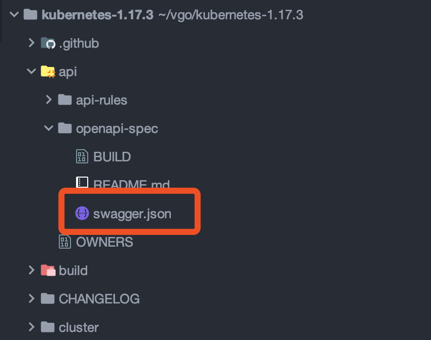

# Swagger.json 位置

有了 swagger.json 这个文件，就可以利用工具生成可视化的 API 文档界面了。

在 kubernetes 源码中，有一个 swagger.json 的文件，源码下载地址：https://github.com/kubernetes/kubernetes



然后下载 swagger 二进制文件，下载地址：https://github.com/go-swagger/go-swagger/releases

然后运行：

```bash
$ swagger serve swagger.json 
```

这样就可以看到 k8s 的全部 API 了。

验证 json 文件：

```bash
$ swagger validate swagger.json
```

生成 server 端代码：

```bash
$ swagger generate server -f swagger.json -A one
```


## 访问 k8s 集群中的 swagger.json

1.17.3 版本中可以访问 https://fueltank-1:6443/openapi/v2 来获取这个文件。

1.17.3 版中是没有 API 的可视化的文档界面的。

官方 API 文档：https://kubernetes.io/docs/reference/generated/kubernetes-api/v1.17/


