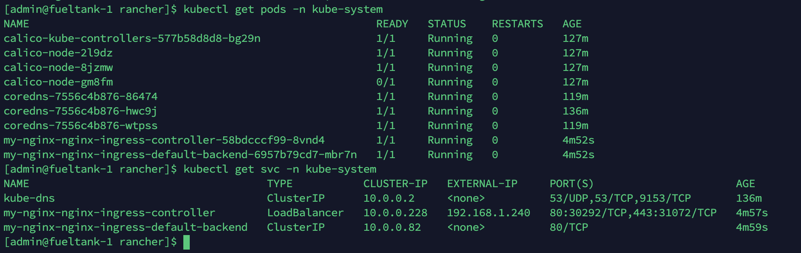

# Kubernetes Ingress Controller

为保证 Ingress 能正常工作，需要先安装 Ingress Controller。

这里我选 Nginx Ingress Controller

由于这个东西需要负载均衡，但是本地或私有云环境是没有负载均衡的，可以使用 Metallb

安装文档：https://metallb.universe.tf/installation/

```bash
$ kubectl apply -f https://raw.githubusercontent.com/google/metallb/v0.8.3/manifests/metallb.yaml
```

等待部署好之后，还需要创建 ConfigMap 提供 IP 池：

```bash
$ wget https://raw.githubusercontent.com/google/metallb/v0.8.3/manifests/example-layer2-config.yaml
```

下载下来之后，修改其中的 IP 地址池跟自己本地相近，然后部署：

```bash
$ kubectl apply -f example-layer2-config.yaml
```


然后安装 Nginx Ingress Controller

安装文档：https://kubernetes.github.io/ingress-nginx/deploy/

使用 Helm 安装：

```bash
$ helm repo add stable https://kubernetes-charts.storage.googleapis.com/
$ helm install my-nginx stable/nginx-ingress --set rbac.create=true -n kube-system
```

还需注意，国内无法下载其中的一个镜像，但是可以这样：

```bash
$ docker pull googlecontainer/defaultbackend-amd64:1.5
$ docker tag googlecontainer/defaultbackend-amd64:1.5 k8s.gcr.io/defaultbackend-amd64:1.5
```


查看效果：




----


另，上边的安装方式有些弊端，强制负载均衡又不不行。可以使用下边的安装方式：

```bash
$ kubectl apply -f https://raw.githubusercontent.com/kubernetes/ingress-nginx/nginx-0.30.0/deploy/static/mandatory.yaml
```

参见：https://github.com/kubernetes/ingress-nginx/blob/master/docs/deploy/index.md


---


还是不行，但是在 https://www.jianshu.com/p/22509970c1f5 这里找到了解决方案

#### 以 hostPort 暴露 Pod 导入流量的方式，进行配置

一键安装：

```bash
$ helm install my-ic stable/nginx-ingress  --namespace kube-system --set rbac.create=true --set controller.kind=DaemonSet --set controller.hostNetwork=true --set controller.daemonset.useHostPort=false --set controller.daemonset.hostPorts.http=80 --set controller.daemonset.hostPorts.https=443 --set controller.service.type=ClusterIP
```

配置了 hostNetwork 为 true 之后，就可以直接通过本地地址来访问 nginx pod 了，设置为 DaemonSet 之后，就在每个机器上都部署了一个 Pod，这样就可以访问每个主机都能实现转发了。

另外可以通过：

```bash
$ helm inspect values stable/nginx-ingress > nginx-ingress-custom.yaml
```

来查看可配置的值。