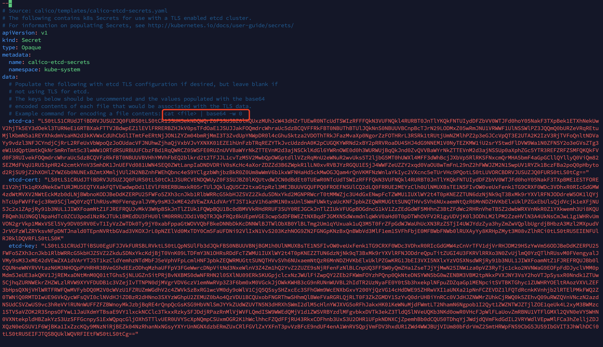
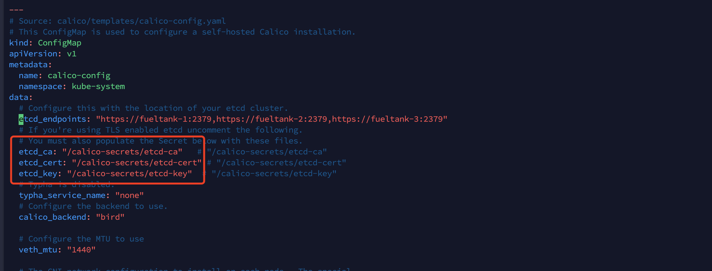
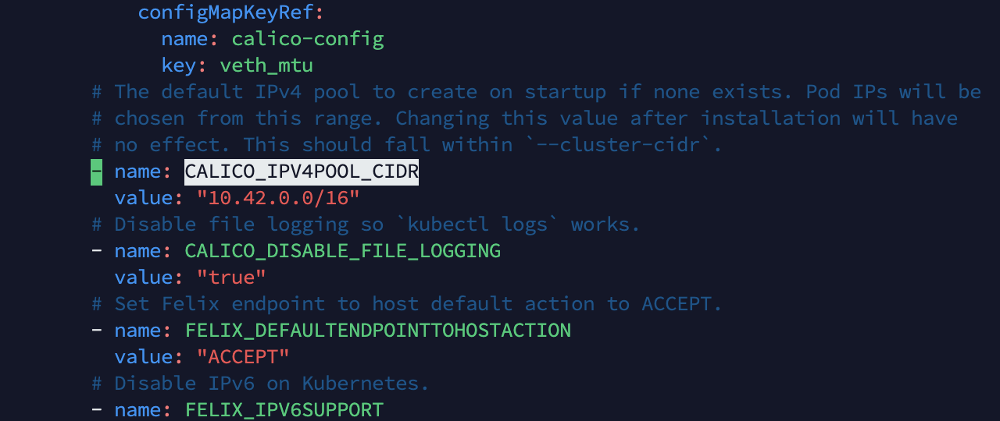
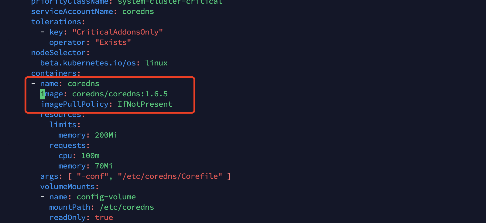

# Kubernetes-1.17.3 二进制安装

首先，集群中每个节点 Docker 是安装好的，并且其储存也是挂在一个外部的盘中的，并且没有正在运行中的容器。

各个节点之间的 admin 账户都是配置了免密的。

SELinux 和防火墙都是关闭的。

每个节点下， proxychains4 代理都可以使用。

---

各项环境如下：

```bash
$ cat /etc/hosts
127.0.0.1   localhost localhost.localdomain localhost4 localhost4.localdomain4
::1         localhost localhost.localdomain localhost6 localhost6.localdomain6
172.20.20.162 fueltank-1.cloud.bbdops.com fueltank-1
172.20.20.179 fueltank-2.cloud.bbdops.com fueltank-2
172.20.20.145 fueltank-3.cloud.bbdops.com fueltank-3 
172.20.20.222 fueltank-4.cloud.bbdops.com fueltank-4
172.20.20.218 fueltank-5.cloud.bbdops.com fueltank-5
172.20.20.233 fueltank-6.cloud.bbdops.com fueltank-6

$ cat /etc/redhat-release 
CentOS Linux release 7.6.1810 (Core) 

$ uname -a
Linux fueltank-1.cloud.bbdops.com 3.10.0-957.27.2.el7.x86_64 #1 SMP Mon Jul 29 17:46:05 UTC 2019 x86_64 x86_64 x86_64 GNU/Linux

$ docker --version
Docker version 19.03.5, build 633a0ea
```

 下面将使用纯二进制的方式来打造一个坚固的 k8s 集群，k8s 各组件版本均为 1.17.3

 

 

---

 

 

## 第一步：安装 etcd 集群（静态发现）

kuberntes 集群使用 etcd 存储所有数据，是最重要的组件之一，注意 etcd集群需要奇数个节点(1,3,5...)，本文档使用3个节点做集群。

关于 etcd 的配置，可以看我的翻译：  [etcd配置详解.md](../Etcd/etcd配置详解.md) 

 

以下每个节点都要做。

首先 yum 安装 etcd：

```bash
$ sudo yum install etcd -y
```

设置 etcd api 版本：

```bash
$ echo "export ETCDCTL_API=3" >> ~/.bash_profile
$ source ~/.bash_profile
```

检查安装是否完成：

```bash
$ etcd --version
etcd Version: 3.3.11
Git SHA: 2cf9e51
Go Version: go1.10.3
Go OS/Arch: linux/amd64
$ etcdctl version
etcdctl version: 3.3.11
API version: 3.3
```

下一步需要自建 etcd 的证书，自建前，先创建 CA，之后的每一个证书都使用这一个  CA 。

```bash
$ cd ~/k8s-cluster/cert
$ openssl genrsa -out ca-key.pem 2048
$ openssl req -x509 -new -nodes -key ca-key.pem -days 10000 -out ca.pem -subj "/CN=kube-ca"
```

然后创建 etcd 证书。

```bash
$ mkdir etcd && cd etcd

$ vim openssl.cnf
[req]
req_extensions = v3_req
distinguished_name = req_distinguished_name
[req_distinguished_name]
[ v3_req ]
basicConstraints = CA:FALSE
keyUsage = nonRepudiation, digitalSignature, keyEncipherment
subjectAltName = @alt_names
[alt_names]
DNS.1 = fueltank-1
DNS.2 = fueltank-2
DNS.3 = fueltank-3
IP.1 = 127.0.0.1
IP.2 = 172.20.20.162
IP.3 = 172.20.20.179
IP.4 = 172.20.20.145

$ openssl genrsa -out etcd-key.pem 2048
$ openssl req -new -key etcd-key.pem -out etcd.csr -subj "/CN=etcd" -config openssl.cnf
$ openssl x509 -req -in etcd.csr -CA ../ca.pem -CAkey ../ca-key.pem -CAcreateserial -out etcd.pem -days 365 -extensions v3_req -extfile openssl.cnf

```

yum 在安装时，已经帮我们创建了一个名为 etcd 的用户，etcd 在运行时就是用的这个用户：

```bash
$ cat /etc/passwd | grep etcd
etcd:x:998:995:etcd user:/var/lib/etcd:/sbin/nologin
```

因为上面生成的证书是在家目录生成的，etcd 用户没权访问，所以要将上面的证书、私钥和CA文件都放到 /etc 目录中，并配置好权限。这里我为了方便，把 etcd 用户加入到 admin 用户组了：

```bash
$ sudo usermod -aG admin etcd
```

为了保证数据的安全，下面为 etcd 单独创建储存目录，并配置好权限：

```bash
$ sudo mkdir /mnt/vde/etcd
$ sudo chown -R admin:admin /mnt/vde/etcd
$ sudo chmod 775 /mnt/vde/etcd
```


关于 etcd 的配置，官网并没有讲 yum 方式的配置，但是官网推荐通过 yum 方式安装。

另外，发现这篇讲配置讲的不错：https://medium.com/@uzzal2k5/etcd-etcd-cluster-configuration-for-kubernetes-779455337db6

下面修改 etcd 配置文件 `/etc/etcd/etcd.conf` ，以 fueltank-1 为例，其他两台以同样的套路修改。

注意，这里只能是 IP 地址，不能是域名或 hostname

```properties
#[Member]
ETCD_DATA_DIR="/mnt/vde/etcd" # 数据储存地址
ETCD_LISTEN_PEER_URLS="http://172.20.20.162:2380" # 用于和其他节点通讯的地址
ETCD_LISTEN_CLIENT_URLS="https://172.20.20.162:2379,https://127.0.0.1:2379" # 监听客户端的地址
ETCD_NAME="fueltank-1" # 节点名称
#[Clustering]
ETCD_INITIAL_ADVERTISE_PEER_URLS="http://172.20.20.162:2380"
ETCD_ADVERTISE_CLIENT_URLS="https://172.20.20.162:2379"
ETCD_INITIAL_CLUSTER="fueltank-1=http://172.20.20.162:2380,fueltank-2=http://172.20.20.179:2380,fueltank-3=http://172.20.20.145:2380"
#[Security]
ETCD_CERT_FILE="/etc/etcd/cert/etcd.pem"
ETCD_KEY_FILE="/etc/etcd/cert/etcd-key.pem"
ETCD_TRUSTED_CA_FILE="/etc/etcd/cert/etcd/ca.pem"
```

可以看到，2379 端口都使用了 https，2380都使用的是 http。这是让客户端访问时用 https，集群之间访问时用 http。

然后在每台节点上启动 etcd，最好是都配置完成后，统一启动：

```bash
$ sudo systemctl enable etcd
$ sudo systemctl start etcd
```

如果出错了，可以用 `sudo journalctl -xe`  或 `sudo journalctl -u etcd` 查看原因，一般会出错都是出在文件权限问题上。

验证集群：

```bash
$ etcdctl put foo bar --cacert=/etc/etcd/cert/etcd/ca.pem
OK
$ etcdctl get foo --cacert=/etc/etcd/cert/etcd/ca.pem
foo
bar
$ curl --cacert /etc/etcd/cert/etcd/ca.pem --cert /etc/etcd/cert/etcd/etcd.pem --key /etc/etcd/cert/etcd/etcd-key.pem https://fueltank-2:2379/v2/keys/aaa -XPUT -d value=bbb -v
$ curl --cacert /etc/etcd/cert/etcd/ca.pem --cert /etc/etcd/cert/etcd/etcd.pem --key /etc/etcd/cert/etcd/etcd-key.pem https://fueltank-2:2379/v2/keys/aaa

```

注意上边的 curl 是用的 v2 版本的API。v2 和 v3 的数据是不互通的。v3 版本没办法用 curl。

查看 etcd 成员：

```bash
$ export ETCDCTL_CACERT=/etc/etcd/cert/ca.pem
$ export ETCDCTL_CERT=/etc/etcd/cert/etcd.pem
$ export ETCDCTL_KEY=/etc/etcd/cert/etcd-key.pem
$ etcdctl member list
87664c3cc645be22, started, fueltank-1, http://172.20.20.162:2380, https://172.20.20.162:2379
8cf2a5bef867d7cf, started, fueltank-2, http://172.20.20.179:2380, https://172.20.20.179:2379
a8070c86c64102fa, started, fueltank-3, http://172.20.20.145:2380, https://172.20.20.145:2379
```

完美！！！

错误处理。服务虽然起来了，但 journalctl -xe 一直报错：

```
etcd request cluster ID mismatch (got a want b)
```

这是因为之前各种纠错，`/mnt/vde/etcd` 目录有了错误数据导致的，先停掉服务，再删掉这个目录重建，然后再重启服务就好了。

这次安装 etcd 集群的姿势还是比较正确的。。。


另外，如果想通过 动态发现的方式来安装 etcd 集群，可以看： [etcd动态发现.md](../Etcd/etcd动态发现.md) 


etcd 集群搞定之后，下一步安装 k8s 的各个组件，最后安装 Calico 和 CoreDNS。

关于 k8s 各组件的作用可以参考  [核心组件运行原理.md](核心组件运行原理.md) 

 

 

---

 

 

## 第二步：安装 kube-apiserver

目前 yum 还不能很好的安装这些组件。只能自己动手，丰衣足食了。

先下载各项组件：https://github.com/kubernetes/kubernetes/blob/master/CHANGELOG/CHANGELOG-1.17.md#downloads-for-v1173

分别下载 server，node，client，src 四个压缩包。下载完成解压，server，node，client这三个在一块解压即可，src 要解压到单独的目录。 

将 kube-apiserver 加入 PATH：

```bash
$ sudo cp kube-apiserver /usr/bin/
```

编辑 systemd 服务文件：

```bash
$ sudo vim /usr/lib/systemd/system/kube-apiserver.service
[Unit]
Description=Kubernetes API Server
After=etcd.service
Wants=etcd.service

[Service]
EnvironmentFile=/etc/kubernetes/apiserver
ExecStart=/usr/bin/kube-apiserver $KUBE_API_ARGS
Restart=on-failure
Type=notify
LimitNOFILE=65536

[Install]
WantedBy=multi-user.target
```

生成 kube-apiserver 的证书及私钥，参考：https://github.com/coreos/coreos-kubernetes/blob/master/Documentation/openssl.md

```bash

# 生成 kube-apiserver 的证书及私钥
$ cd ~/k8s-cluster/cert && mkdir kube-apiserver & cd kube-apiserver

$ vim openssl.cnf
[req]
req_extensions = v3_req
distinguished_name = req_distinguished_name
[req_distinguished_name]
[ v3_req ]
basicConstraints = CA:FALSE
keyUsage = nonRepudiation, digitalSignature, keyEncipherment
subjectAltName = @alt_names
[alt_names]
DNS.1 = kubernetes
DNS.2 = kubernetes.default
DNS.3 = kubernetes.default.svc
DNS.4 = kubernetes.default.svc.cluster.local
DNS.5 = fueltank-1
DNS.6 = fueltank-2
DNS.7 = fueltank-3
IP.1 = 127.0.0.1
IP.2 = 172.20.20.162
IP.3 = 172.20.20.179
IP.4 = 172.20.20.145
IP.5 = 10.43.0.1

$ openssl genrsa -out apiserver-key.pem 2048
$ openssl req -new -key apiserver-key.pem -out apiserver.csr -subj "/CN=kube-apiserver" -config openssl.cnf
$ openssl x509 -req -in apiserver.csr -CA ../ca.pem -CAkey ../ca-key.pem -CAcreateserial -out apiserver.pem -days 365 -extensions v3_req -extfile openssl.cnf
```

编辑配置文件：

```bash
$ sudo vim /etc/kubernetes/apiserver
KUBE_API_ARGS=" \
--admission-control=NamespaceLifecycle,LimitRanger,ServiceAccount,DefaultStorageClass,ResourceQuota,NodeRestriction,MutatingAdmissionWebhook,ValidatingAdmissionWebhook \
--endpoint-reconciler-type=master-count \
--apiserver-count=3 \
--allow-privileged=true \
--audit-log-maxage=30 \
--audit-log-maxbackup=3 \
--audit-log-maxsize=100 \
--audit-log-path=/mnt/vde/kube-apiserver \
--authorization-mode=Node,RBAC,Webhook \
--authorization-webhook-config-file=/home/admin/.kube/config \
--anonymous-auth=false \
--etcd-cafile=/etc/etcd/cert/etcd/ca.pem \
--etcd-certfile=/etc/etcd/cert/etcd/etcd.pem \
--etcd-keyfile=/etc/etcd/cert/etcd/etcd-key.pem \
--etcd-servers=https://fueltank-1:2379,https://fueltank-2:2379,https://fueltank-3:2379 \
--kubelet-https=true \
--enable-swagger-ui=true \
--client-ca-file=/home/admin/k8s-cluster/cert/ca.pem \
--tls-cert-file=/home/admin/k8s-cluster/cert/kube-apiserver/apiserver.pem \
--tls-private-key-file=/home/admin/k8s-cluster/cert/kube-apiserver/apiserver-key.pem \
--enable-aggregator-routing=true \
--service-account-key-file=/home/admin/k8s-cluster/cert/kube-apiserver/apiserver-key.pem \
--allow-privileged=true \
--service-cluster-ip-range=10.43.0.0/16 \
"
```

关于 kube-apiserver 的配置：https://kubernetes.io/zh/docs/reference/command-line-tools-reference/kube-apiserver/

我数了下，配置项也不多，也就 96 个的样子。。。

etcd 的地址和证书是要正确配置的

- `--audit-log-path` 用来配置日志地址。
- `--authorization-mode` 配置中是一定要包含 RBAC 的，否则逼格不够。有一些服务需要使用 Webhook。
- `--authorization-webhook-config-file` webhook 模式下必须提供
- `--kubelet-https` 默认是 true，但是不必加 kubelet 的证书及私钥。
- `--client-ca-file` 、`--tls-cert-file` 、`--tls-private-key-file` 一定要配置，否则启动不起来 ，客户端访问 kube-apiserver 都是要加密的。
- `--service-account-key-file` 也是一定要配的，不配的话会影响 ServiceAccount 的使用，这个值和 `--tls-private-key-file ` 一样即可，被这个参数坑了半天。
- `--allow-privileged` 一定要为 true ，因为后边的 calico 需要特权模式。

启动服务：

```bash
$ sudo systemctl enable kube-apiserver.service
$ sudo systemctl start kube-apiserver.service
```

检查 kube-apiserver 运行状态：

```bash
$ sudo systemctl status kube-apiserver
```

 

 

---

 

 

## 第三步：安装 kube-controller-manager

kube-controller-manager 也是安装在 master 节点的。

将 kube-controller-manager  放到 PATH 中：

```bash
$ sudo cp kube-controller-manager /usr/bin/
```

创建 service 文件：

```bash
$ sudo vim /usr/lib/systemd/system/kube-controller-manager.service
[Unit]
Description=Kubernetes Controller Manager
After=kube-apiserver.service
Wants=kube-apiserver.service

[Service]
EnvironmentFile=/etc/kubernetes/kube-controller-manager
ExecStart=/usr/bin/kube-controller-manager $KUBE_CONTROLLER_MANAGER_ARGS
Restart=on-failure
RestartSec=5

[Install]
WantedBy=multi-user.target
```

kube-controller-manager 的配置参考：https://kubernetes.io/zh/docs/reference/command-line-tools-reference/kube-controller-manager/

编写配置文件：

```bash
$ sudo vim /etc/kubernetes/kube-controller-manager
KUBE_CONTROLLER_MANAGER_ARGS=" \
--address=127.0.0.1 \
--master=http://127.0.0.1:8080 \
--allocate-node-cidrs=true \
--service-cluster-ip-range=10.43.0.0/16 \
--cluster-cidr=10.42.0.0/16 \
--cluster-name=kubernetes \
--cluster-signing-cert-file=/home/admin/k8s-cluster/cert/ca.pem \
--cluster-signing-key-file=/home/admin/k8s-cluster/cert/ca-key.pem \
--service-account-private-key-file=/home/admin/k8s-cluster/cert/ca-key.pem \
--root-ca-file=/home/admin/k8s-cluster/cert/ca.pem \
--leader-elect=true \
--service-account-private-key-file=/home/admin/k8s-cluster/cert/kube-apiserver/apiserver-key.pem \
"
```

启动服务：

```bash
$ sudo systemctl enable kube-controller-manager.service
$ sudo systemctl start kube-controller-manager.service
```

检查：

```bash
$ sudo systemctl status kube-controller-manager.service
```

 

 

---

 

 

## 第四步：安装 kube-scheduler

kube-scheduler 也是运行在 master 上的。

先把 kube-scheduler 放到 PATH：

```bash
$ sudo cp kube-scheduler /usr/bin/
```

创建 service 文件：

```bash
$ sudo vim /usr/lib/systemd/system/kube-scheduler.service
[Unit]
Description=Kubernetes Scheduler
After=kube-apiserver.service
Wants=kube-apiserver.service

[Service]
EnvironmentFile=/etc/kubernetes/kube-scheduler
ExecStart=/usr/bin/kube-scheduler $KUBE_SCHEDULER_ARGS
Restart=on-failure
RestartSec=5

[Install]
WantedBy=multi-user.target
```

创建配置文件，可参考官方配置：https://kubernetes.io/zh/docs/reference/command-line-tools-reference/kube-scheduler/

```bash
$ sudo vim /etc/kubernetes/kube-scheduler
KUBE_SCHEDULER_ARGS=" \
--address=127.0.0.1 \
--master=http://127.0.0.1:8080 \
--leader-elect=true \
"
```

启动服务：

```bash
$ sudo systemctl enable kube-scheduler.service
$ sudo systemctl start kube-scheduler.service
```

检查：

```bash
$ sudo systemctl status kube-scheduler.service 
```

 

 

---

 

 

## 第五步：配置 kubeconfig

先创建 admin 用户的证书及私钥，注意这里的 CA 证书一定使用和 kube-server 一样的 CA 证书，CN 是用户名。

```bash
$ cd ~/k8s-cluster/cert && mkdir admin && cd admin

$ vim openssl.cnf
[req]
req_extensions = v3_req
distinguished_name = req_distinguished_name
[req_distinguished_name]
[ v3_req ]
basicConstraints = CA:FALSE
keyUsage = nonRepudiation, digitalSignature, keyEncipherment
subjectAltName = @alt_names
[alt_names]
IP.1 = 127.0.0.1
IP.2 = 0.0.0.0

$ openssl genrsa -out admin-key.pem 2048
$ openssl req -new -key admin-key.pem -out admin.csr -subj "/CN=admin" -config openssl.cnf
$ openssl x509 -req -in admin.csr -CA ../ca.pem -CAkey ../ca-key.pem -CAcreateserial -out admin.pem -days 365 -extensions v3_req -extfile openssl.cnf

```

将 kubectl 放入到 PATH，并配置命令自动补全(CentOS，Bash)：

```bash
$ sudo cp kubectl /usr/bin/
$ yum install bash-completion -y
$ source <(kubectl completion bash)
$ echo "source <(kubectl completion bash)" >> ~/.bashrc
```

下面需要指定该证书的 Group 为 `system:masters`，而 `RBAC` 预定义的 `ClusterRoleBinding` 将 Group `system:masters` 与 ClusterRole `cluster-admin` 绑定，这就赋予了kubectl **所有集群权限**

```bash
$ kubectl describe clusterrolebinding cluster-admin
Name:         cluster-admin
Labels:       kubernetes.io/bootstrapping=rbac-defaults
Annotations:  rbac.authorization.kubernetes.io/autoupdate: true
Role:
  Kind:  ClusterRole
  Name:  cluster-admin
Subjects:
  Kind   Name            Namespace
  ----   ----            ---------
  Group  system:masters 
```

使用`kubectl config` 生成 kubeconfig ，这会自动保存到 ~/.kube/config，生成后 `cat ~/.kube/config`可以验证配置文件包含 kube-apiserver 地址、证书、用户名等信息:

```bash
$ kubectl config set-cluster fueltank --certificate-authority=/home/admin/k8s-cluster/cert/ca.pem --embed-certs=true --server=https://fueltank-1:6443
$ kubectl config set-credentials admin --client-certificate=/home/admin/k8s-cluster/cert/admin/admin.pem --embed-certs=true --client-key=/home/admin/k8s-cluster/cert/admin/admin-key.pem
$ kubectl config set-context fueltank --cluster=fueltank --user=admin
$ kubectl config use-context fueltank
$ cat .kube/config
```


这时候检查组件，但是会出一个错误：

```bash
$ kubectl get componentstatus
Error from server (Forbidden): componentstatuses is forbidden: User "admin" cannot list resource "componentstatuses" in API group "" at the cluster scope
```

怎么解决呐？解决方法在：https://github.com/kelseyhightower/kubernetes-the-hard-way/issues/197

这是为什么呐？因为没有为 admin 用户只是在外部创建了，还没有集群的管理权限，可以创建一个新的 ClusterRoleBinding，也可以修改上边的 `cluster-admin` 这个 ClusterRoleBinding。

注意这里在没有权限时要使用 8080 这个非安全端口，这里一定要是 127.0.0.1 ，且防火墙应该把 8080 端口封掉。

1. 可以修改 cluster-admin

   ```bash
   $ kubectl edit clusterrolebinding cluster-admin --server=http://127.0.0.1:8080
   ```

   往 subjects 中加入以下代码：

   ```yaml
   - apiGroup: rbac.authorization.k8s.io
     kind: User
     name: admin
   ```

   

2. 另外也可以创建 ClusterRoleBinding ，ClusterRole 是 cluster-admin ，绑定的是用户 admin，这就赋予了kubectl **所有集群权限**

```bash
$ kubectl create clusterrolebinding root-cluster-admin-binding --clusterrole=cluster-admin --user=admin --server=http://127.0.0.1:8080
$ kubectl get componentstatus
NAME                 STATUS    MESSAGE             ERROR
scheduler            Healthy   ok                  
controller-manager   Healthy   ok                  
etcd-0               Healthy   {"health":"true"}
```


OK，完美。

检查权限：

```bash
$ kubectl auth can-i list endpoints
$ kubectl auth can-i list endpoints --as admin
```

 

 

---

 

 

## 第六步：安装 kubelet

kubelet 是运行在 node 节点的，不过这里为了节约机器，先把它安装在 master 节点。

先把 kubelet 放到 PATH 之中：

```bash
$ sudo cp kubelet /usr/bin/
```

创建 service：

```bash
$ sudo vim /usr/lib/systemd/system/kubelet.service
[Unit]
Description=Kubernetes Kubelet Server
Documentation=https://github.com/GoogleCloudPlatform/kubernetes
After=docker.service
Requires=docker.service
 
[Service]
EnvironmentFile=/etc/kubernetes/kubelet
ExecStart=/usr/bin/kubelet $KUBELET_ARGS
Restart=on-failure
RestartSec=5
KillMode=process
 
[Install]
WantedBy=multi-user.target
```

再创建配置文件，kubelet 的配置可以参考：https://kubernetes.io/zh/docs/reference/command-line-tools-reference/kubelet/

```bash
$ sudo vim /etc/kubernetes/kubelet
KUBELET_ARGS=" \
--address=0.0.0.0 \
--hostname-override=fueltank-1 \
--kubeconfig=/home/admin/.kube/config \
--cgroup-driver=systemd \
--pod-infra-container-image=registry.cn-hangzhou.aliyuncs.com/google_containers/pause-amd64:3.1 \
--cluster-dns=10.43.0.2 \
--cluster-domain=cluster.fueltank. \
--root-dir=/mnt/vde/kubelet \
--network-plugin=cni \
"
```

这里 `--pod-infra-container-image` 修改了 pause 镜像，因为国内无法获取默认的谷歌的 pause 镜像。

`--cluster-dns` 指定了 dns ip，`--cluster-domain` 制指定了集群名称，这两个配置一会要在 CoreDNS 中使用。

`--root-dir` 将 kubelet 的数据保存到自定义目录中。

启动服务：

```bash
$ sudo systemctl enable kubelet.service
$ sudo systemctl start kubelet.service
```

检查：

```bash
$ sudo systemctl status kubelet.service
$ kubectl get nodes
NAME         STATUS   ROLES    AGE   VERSION
fueltank-1   Ready    <none>   24m   v1.17.3
```

 

 

---

 

 

## 第七步：安装 kube-proxy

为了让 kube-proxy 有权访问 kube-apiserver ，需要先生成 kube-proxy.kubeconfig 配置文件。

生成 kube-proxy 用户需要使用的证书：

```bash
$ cd k8s-cluster/cert && mkdir kube-proxy && cd kube-proxy

$ vim openssl.cnf
[req]
req_extensions = v3_req
distinguished_name = req_distinguished_name
[req_distinguished_name]
[ v3_req ]
basicConstraints = CA:FALSE
keyUsage = nonRepudiation, digitalSignature, keyEncipherment
subjectAltName = @alt_names
[alt_names]
DNS.1 = fueltank-1
IP.1 = 127.0.0.1
IP.2 = 0.0.0.0
IP.3 = 172.20.20.162

$ openssl genrsa -out kube-proxy-key.pem 2048
$ openssl req -new -key kube-proxy-key.pem -out kube-proxy.csr -subj "/CN=kube-proxy" -config openssl.cnf
$ openssl x509 -req -in kube-proxy.csr -CA ../ca.pem -CAkey ../ca-key.pem -CAcreateserial -out kube-proxy.pem -days 365 -extensions v3_req -extfile openssl.cnf
```

使用`kubectl config` 生成 kubeconfig 并保存到 kube-proxy.kubeconfig

```bash
$ kubectl config set-cluster fueltank --certificate-authority=/home/admin/k8s-cluster/cert/ca.pem --embed-certs=true --server=https://fueltank-1:6443 --kubeconfig=kube-proxy.kubeconfig
$ kubectl config set-credentials kube-proxy --client-certificate=/home/admin/k8s-cluster/cert/kube-proxy/kube-proxy.pem --embed-certs=true --client-key=/home/admin/k8s-cluster/cert/kube-proxy/kube-proxy-key.pem --kubeconfig=kube-proxy.kubeconfig
$ kubectl config set-context fueltank --cluster=fueltank --user=kube-proxy --kubeconfig=kube-proxy.kubeconfig
$ kubectl config use-context fueltank --kubeconfig=kube-proxy.kubeconfig
```

为用户 kube-proxy 创建 ClusterRoleBinding ，ClusterRole 是 system:node-proxier。

```bash
$ kubectl create clusterrolebinding root-cluster-proxy-binding --clusterrole=system:node-proxier --user=kube-proxy
```

运行完成后，会在当前目录生成一个 kube-proxy.kubeconfig 文件，下面需要把它放到 /etc/kubernetes 下：

```bash
$ sudo mv kube-proxy.kubeconfig /etc/kubernetes/
```

 

---

 

OK，下面来配置运行 kube-proxy

kube-proxy 也是运行在 node 上的，

将 kube-proxy 放入 PATH 中。

```bash
$ sudo cp kube-proxy /usr/bin/
```

创建 service ：

```bash
$ sudo vim /usr/lib/systemd/system/kube-proxy.service
[Unit]
Description=Kubernetes Kube-Proxy Server
Documentation=https://github.com/GoogleCloudPlatform/kubernetes
After=network.target

[Service]
EnvironmentFile=/etc/kubernetes/kube-proxy
ExecStart=/usr/bin/kube-proxy $KUBE_PROXY_ARGS
Restart=on-failure
RestartSec=5
LimitNOFILE=65536

[Install]
WantedBy=multi-user.target
```

创建配置文件：

```bash
$ sudo vim /etc/kubernetes/kube-proxy
KUBE_PROXY_ARGS=" \
--bind-address=0.0.0.0 \
--cluster-cidr=10.42.0.0/16 \
--hostname-override=fueltank-1 \
--kubeconfig=/etc/kubernetes/kube-proxy.kubeconfig \
"
```

- `--hostname-override` 要和 kubelet 中配置的一样
- `--kubeconfig` 使用刚才配置的配置文件

启动：

```bash
$ sudo systemctl enable kube-proxy.service
$ sudo systemctl start kube-proxy.service
```

检查：

```bash
$ systemctl status kube-proxy
```

 

 

---

 

所有组件安装完成后，还需要安装一些插件，最重要的就是网络插件和 CoreDNS。网络插件这里我选的是 Calico。


---

 

 

## 第八步：安装 Calico

Calico 安装官方文档：https://docs.projectcalico.org/getting-started/kubernetes/installation/calico#installing-with-the-kubernetes-api-datastore50-nodes-or-less

Calico 的官方文档还是比较坑的，简直坑的一逼。

先下载 yaml 文件：

```bash
$ curl https://docs.projectcalico.org/manifests/calico-etcd.yaml -o calico-etcd.yaml
```

这里让 calico 使用 etcd 储存。

修改 calico-etcd.yaml 文件。

首先修改名为 calico-etcd-secrets 的 Secret，注释中有说明怎么使用 CA，证书及私钥。

使用命令 `cat <file> | base64 -w 0` 来编码 etcd 的 CA，证书及私钥。然后将生成的代码填充到 calico-etcd.yaml 的相应的位置即可。



然后修改名为 calico-config 的 ConfigMap，按注释修改即可：



然后修改 CALICO_IPV4POOL_CIDR：



全部修改完成后，部署：

```bash
$ kubectl apply -f calico-etcd.yaml
```

查看结果：

```bash
$ kubectl get pods -n kube-system
NAME                                       READY   STATUS    RESTARTS   AGE
calico-kube-controllers-577b58d8d8-tcdjn   1/1     Running   0          2m
calico-node-xvb64                          1/1     Running   0          2m
```

如果遇到错误，可以使用 `kubectl describe pod` 和 `kubectl logs` 来查看错误，一般都是 etcd 连接 和 kube-apiserver 连接的错误。

etcd 连接出错要看 `calico-etcd.yaml` 中的 etcd 配置是否正确。

如果是 kube-apiserver 连接错误，可能错误出在 kube-proxy 组件中 ，也可能出在权限没配好。

### 配置 calicoctl

先去网上下载二进制文件，下载地址：https://github.com/projectcalico/calicoctl/releases

配置教程（etcd版本）：https://docs.projectcalico.org/getting-started/calicoctl/configure/etcd

下载好放入 PATH 中，然后写配置文件 `/etc/calico/calicoctl.cfg`：

```yaml
apiVersion: projectcalico.org/v3
kind: CalicoAPIConfig
metadata:
spec:
  etcdEndpoints: https://fueltank-1:2379,https://fueltank-2:2379,https://fueltank-3:2379
  etcdKeyFile: /etc/etcd/cert/etcd/etcd-key.pem
  etcdCertFile: /etc/etcd/cert/etcd/etcd.pem
  etcdCACertFile: /etc/etcd/cert/etcd/ca.pem
```


 

 

---

 

 

## 第九步：CoreDNS

https://www.jianshu.com/p/57d7c9e9f125

在上边，下载并解压了 kubernetes-src 目录，进入这个目录。

然后进入：

```bash
$ cd cluster/addons/dns/coredns/
```

编辑  transforms2sed.sed ：

```
s/__PILLAR__DNS__SERVER__/10.43.0.2/g
s/__PILLAR__DNS__DOMAIN__/cluster.fueltank./g
s/__PILLAR__CLUSTER_CIDR__/10.42.0.0\/16/g
s/__PILLAR__DNS__MEMORY__LIMIT__/200Mi/g
s/__MACHINE_GENERATED_WARNING__/Warning: This is a file generated from the base underscore template file: __SOURCE_FILENAME__/g
```

然后生成部署coreDNS所需的coredns.yaml文件：

```bash
$ sed -f transforms2sed.sed coredns.yaml.base > coredns.yaml
```

替换镜像，将 `k8s.gcr.io/coredns:1.6.5` 替换成`coredns/coredns:1.6.5`



部署dns：

```bash
$ kubectl apply -f coredns.yam
```

检查：

```bash
$ kubectl get pods -n kube-system
NAME                                       READY   STATUS    RESTARTS   AGE
calico-kube-controllers-577b58d8d8-tcdjn   1/1     Running   0          113m
calico-node-xvb64                          1/1     Running   0          113m
coredns-7556c4b876-dtd5p                   1/1     Running   0          114m
```

测试 DNS 看这个链接：

 [测试k8s集群中安装的CoreDNS.md](../CoreDNS/测试k8s集群中安装的CoreDNS.md) 

我测试的是可以运行的。

为测试 calico 是否完美运行，可以在本机 ping 一下 coredns 的 ip 看看通不通。

按道理说，Pod 的 ip 不论是在宿主机还是别的 Pod 内都必须要 ping 的通的。Service 的 ClusterIP 是 ping 不通的，但是可以通过 curl 来访问 Service 的 ClusterIP 上的服务！！！因为 ClusterIP 是 iptables 或 ipvs 虚拟出来的地址，不支持 ICMP 协议。

如果想修改配置，可以这样子：


停止服务脚本：

```bash
#!/usr/bin/env bash

sudo systemctl stop kube-proxy
sudo systemctl stop kubelet
sudo systemctl stop kube-scheduler
sudo systemctl stop kube-controller-manager
sudo systemctl stop kube-apiserver
```

启动服务脚本：

```bash
#!/usr/bin/env bash

sudo systemctl start kube-apiserver
sudo systemctl start kube-controller-manager
sudo systemctl start kube-scheduler
sudo systemctl start kubelet
sudo systemctl start kube-proxy
```


  

---

 在其他节点也按照上面的操作来一遍，就可以自动组成一个集群了，注意证书和 kubeconfig 这些可以共享，还要注意配置的修改。

---

 

 

## 错误处理

1. 节点的 ROLES 为 <none>：

```bash
$ kubectl get nodes
NAME         STATUS   ROLES    AGE   VERSION
fueltank-1   Ready    <none>   40h   v1.17.3
fueltank-2   Ready    <none>   12h   v1.17.3
fueltank-3   Ready    <none>   12h   v1.17.3
```

其实这里的 ROLES 是可以随便自定义的：

```bash
$ kubectl label node fueltank-1 node-role.kubernetes.io/master=master
$ kubectl label node fueltank-2 node-role.kubernetes.io/master=master
$ kubectl label node fueltank-3 node-role.kubernetes.io/master=master
```

自定义完成后：

```bash
$ kubectl get node
NAME         STATUS   ROLES    AGE   VERSION
fueltank-1   Ready    master   40h   v1.17.3
fueltank-2   Ready    master   12h   v1.17.3
fueltank-3   Ready    master   12h   v1.17.3
```


