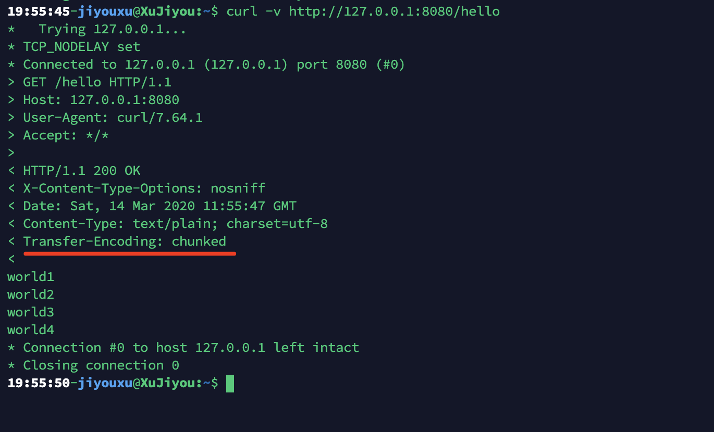

# List-Watch 原理

Kubernetes 集群中，到处都在使用 List-Watch 来实现消息的实时性。包括 kube-apiserver 与 etcd 之间，kube-controller-manager 、kube-scheduler、kubelet 与 kube-apiserver 之间，另外 kubectl 或浏览器访问 kube-apiserver 时也可以使用 List-Watch 机制，比如：

```
GET /api/v1/watch/pods
```

或：

```bash
$ kubectl get pods --watch
```

那 Kubernetes 中是如何实现这种机制的那？其实使用的是 HTTP Streaming，即在 HTTP header 中加入 **Transfer-Encoding： chunked** ！

不过上边的结论都是网上的传说，不知道是不是真的。下面就来测试一下，往 header 中加一个字段就能实现长链接。

看代码：

```go
package main

import (
	"fmt"
	"github.com/emicklei/go-restful/v3"
	"log"
	"net/http"
	"time"
)

func main() {
	webService := new(restful.WebService)

	webService.Route(webService.GET("/hello").To(hello))

	restful.Add(webService)
	log.Print("Start listening on localhost:8080")
	log.Fatal(http.ListenAndServe(":8080", nil))
}

func hello(req *restful.Request, resp *restful.Response) {
	resp.Header().Set("X-Content-Type-Options", "nosniff")
	_, _ = fmt.Fprintf(resp, "world1\n")
	resp.Flush()
	time.Sleep(1 * time.Second)
	_, _ = fmt.Fprintf(resp, "world2\n")
	resp.Flush()
	time.Sleep(1 * time.Second)
	_, _ = fmt.Fprintf(resp, "world3\n")
	resp.Flush()
	time.Sleep(1 * time.Second)
	_, _ = fmt.Fprintf(resp, "world4\n")
}
```

代码中并木有看到 `Transfer-Encoding： chunked` 哇！！！！

其实再使用 `resp.Flush()` 时会自动往响应 header 中加入 `Transfer-Encoding： chunked` 。

`resp.Header().Set("X-Content-Type-Options", "nosniff")` 这句的作用是让浏览器也能看到效果。

浏览器或 curl 访问： http://127.0.0.1:8080/hello




这种长链接再配合协程就可以轻易实现 List-Watch 机制了。比如下面这个 Demo：

```go
package main

import (
	"fmt"
	"github.com/emicklei/go-restful/v3"
	"log"
	"net/http"
)

var myChan = make(chan string)

func main() {
	webService := new(restful.WebService)

	webService.Route(webService.GET("/hello").To(hello))
	webService.Route(webService.GET("/ok/{id}").To(ok))

	restful.Add(webService)
	log.Print("Start listening on localhost:8080")
	log.Fatal(http.ListenAndServe(":8080", nil))
}

func hello(req *restful.Request, resp *restful.Response) {
	resp.Header().Set("X-Content-Type-Options", "nosniff")
	_, _ = fmt.Fprintf(resp, "wait:\n")
	resp.Flush()
	for i := range myChan {
		fmt.Println(i)
		_, _ = fmt.Fprintf(resp, "id: %s\n", i)
		resp.Flush()
	}
}

func ok(req *restful.Request, resp *restful.Response) {
	myChan <- req.PathParameter("id")
	_, _ = fmt.Fprintf(resp, "OK")
}
```

写完代码之后运行，然后用 curl 访问：

```bash
$ curl -v http://127.0.0.1:8080/hello
```

curl 并不会退出，而是一直处于等待状态。

打开另一个命令行，访问：

```bash
$ curl http://127.0.0.1:8080/ok/haha
$ curl http://127.0.0.1:8080/ok/hehe
$ curl http://127.0.0.1:8080/ok/heihei
```

这时在第一个命令行中就会出现数据了。


## 总结

这种机制简单方便，不用任何第三方中间件，很轻量，从 HTTP 协议和协程级别就搞定了消息的实时性和可靠性。

但也有一个缺点，就是这种数据流是单向的，只能从服务端往客户端发送数据流，客户端往服务端发数据只能另外启动一个连接了。 