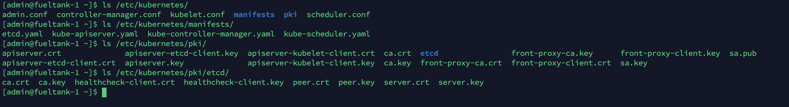

# kubeadm 1.18 安装集群

我的集群中，Docker 是安装好的。系统是 CentOS。

首先按照官方教程安装 kubeadm：https://kubernetes.io/zh/docs/setup/production-environment/tools/kubeadm/install-kubeadm/

使用 YUM 安装：

```bash
$ sudo yum install kubeadm kubelet kubectl cri-tools kubernetes-cni -y
```

或者指定版本安装：

```bash
$ sudo yum install kubeadm-1.18.0 kubelet-1.18.0 kubectl-1.18.0 cri-tools kubernetes-cni -y
```


---


## kubeadm 配置命令提示

`kubeadm completion -h` 查看命令提示教程。我的是 CentOS bash，配置方法如下：

```bash
$ kubeadm completion bash > ~/.kube/kubeadm_completion.bash.inc
$ printf "\n# Kubeadm shell completion\nsource '$HOME/.kube/kubeadm_completion.bash.inc'\n" >> $HOME/.bash_profile
$ source $HOME/.bash_profile
```


---


## kubeadm 使用到的镜像

为避免被墙，先查看镜像列表：

```bash
$ kubeadm config images list
k8s.gcr.io/kube-apiserver:v1.18.0
k8s.gcr.io/kube-controller-manager:v1.18.0
k8s.gcr.io/kube-scheduler:v1.18.0
k8s.gcr.io/kube-proxy:v1.18.0
k8s.gcr.io/pause:3.2
k8s.gcr.io/etcd:3.4.3-0
k8s.gcr.io/coredns:1.6.7
```

k8s.gcr.io 在国内是不能访问的。自己想办法解决。

我已经将镜像上传到了 `registry.cn-chengdu.aliyuncs.com/bbd-image`，可以像下面这样下载(密码找我要)：

```bash
$ docker login --username=552003271@qq.com registry.cn-chengdu.aliyuncs.com
```

脚本如下：

```bash
#!/bin/bash

docker pull registry.cn-chengdu.aliyuncs.com/bbd-image/kube-apiserver:v1.18.0
docker tag registry.cn-chengdu.aliyuncs.com/bbd-image/kube-apiserver:v1.18.0 k8s.gcr.io/kube-apiserver:v1.18.0
docker pull registry.cn-chengdu.aliyuncs.com/bbd-image/kube-controller-manager:v1.18.0
docker tag registry.cn-chengdu.aliyuncs.com/bbd-image/kube-controller-manager:v1.18.0 k8s.gcr.io/kube-controller-manager:v1.18.0
docker pull registry.cn-chengdu.aliyuncs.com/bbd-image/kube-scheduler:v1.18.0
docker tag registry.cn-chengdu.aliyuncs.com/bbd-image/kube-scheduler:v1.18.0 k8s.gcr.io/kube-scheduler:v1.18.0
docker pull registry.cn-chengdu.aliyuncs.com/bbd-image/kube-proxy:v1.18.0
docker tag registry.cn-chengdu.aliyuncs.com/bbd-image/kube-proxy:v1.18.0 k8s.gcr.io/kube-proxy:v1.18.0
docker pull registry.cn-chengdu.aliyuncs.com/bbd-image/pause:3.2
docker tag registry.cn-chengdu.aliyuncs.com/bbd-image/pause:3.2 k8s.gcr.io/pause:3.2
docker pull registry.cn-chengdu.aliyuncs.com/bbd-image/etcd:3.4.3-0
docker tag registry.cn-chengdu.aliyuncs.com/bbd-image/etcd:3.4.3-0 k8s.gcr.io/etcd:3.4.3-0
docker pull registry.cn-chengdu.aliyuncs.com/bbd-image/coredns:1.6.7
docker tag registry.cn-chengdu.aliyuncs.com/bbd-image/coredns:1.6.7 k8s.gcr.io/coredns:1.6.7
```

查看镜像：

```bash
$ docker images | grep "k8s.gcr.io"
```


---


## kubeadm 配置

查看 init 默认配置：

```bash
$ kubeadm config print init-defaults
```

查看 join 默认配置：

```bash
$ kubeadm config print join-defaults
```

生成一份默认配置，一会使用：

```bash
$ kubeadm config print init-defaults > kubeadm-config.yaml
```

官方配置文档：https://godoc.org/k8s.io/kubernetes/cmd/kubeadm/app/apis/kubeadm/v1beta2

源码在 `cmd/kubeadm/app/apis/kubeadm/types.go` 中，看源码比较好，可以看到所有配置。

我的最终配置如下，kubeadm-config.yaml：

```yaml
apiVersion: kubeadm.k8s.io/v1beta2
kind: InitConfiguration
bootstrapTokens:
- groups:
  - system:bootstrappers:kubeadm:default-node-token
  token: abcdef.0123456789abcdef
  ttl: 24h0m0s
  usages:
  - signing
  - authentication
localAPIEndpoint:
  advertiseAddress: 0.0.0.0
  bindPort: 6443
nodeRegistration:
  criSocket: /var/run/dockershim.sock
  name: fueltank-1
  taints:
    - key: node-role.kubernetes.io/master
      value: ""
      effect: NoSchedule
  kubeletExtraArgs:
    cgroup-driver: systemd
---
apiVersion: kubeadm.k8s.io/v1beta2
kind: ClusterConfiguration
controlPlaneEndpoint: 10.28.63.16:6443
apiServer:
  timeoutForControlPlane: 4m0s
certificatesDir: /etc/kubernetes/pki
clusterName: fueltank
controllerManager: {}
dns:
  type: CoreDNS
etcd:
  local:
    dataDir: /mnt/vde/etcd
imageRepository: registry.cn-chengdu.aliyuncs.com/bbd-image
kubernetesVersion: v1.18.0
networking:
  dnsDomain: cluster.fueltank
  serviceSubnet: 10.43.0.0/16
  PodSubnet: 10.42.0.0/16
scheduler: {}
```

`controlPlaneEndpoint` 在需要做高可用时必须要加入。

---


## 配置 kubelet

在初始化 kubeadm 之前，还需要 enable 一下 kubelet，以生成 kubeadm 相关的配置：

```bash
$ sudo systemctl daemon-reload
$ sudo systemctl enable kubelet
```

配置文件是 `/etc/sysconfig/kubelet` ，可以自定义参数，像这样：

```
KUBELET_EXTRA_ARGS=--cgroup-driver=systemd
```

启动 kubelet 以生成配置文件：

```bash
$ sudo systemctl restart kubelet
```

这个文件将由 `kubeadm init` 和 `kubeadm join` 使用以获取额外的用户自定义的 kubelet 参数，来生成最终的 kubelet 的配置文件。最终会生成 `/usr/lib/systemd/system/kubelet.service.d/10-kubeadm.conf ` 。

service.d 目录中的 config 文件会覆盖 .service 文件中的配置，来看下这个配置文件：

```toml
# Note: This dropin only works with kubeadm and kubelet v1.11+
[Service]
Environment="KUBELET_KUBECONFIG_ARGS=--bootstrap-kubeconfig=/etc/kubernetes/bootstrap-kubelet.conf --kubeconfig=/etc/kubernetes/kubelet.conf"
Environment="KUBELET_CONFIG_ARGS=--config=/var/lib/kubelet/config.yaml"
# This is a file that "kubeadm init" and "kubeadm join" generates at runtime, populating the KUBELET_KUBEADM_ARGS variable dynamically
EnvironmentFile=-/var/lib/kubelet/kubeadm-flags.env
# This is a file that the user can use for overrides of the kubelet args as a last resort. Preferably, the user should use
# the .NodeRegistration.KubeletExtraArgs object in the configuration files instead. KUBELET_EXTRA_ARGS should be sourced from this file.
EnvironmentFile=-/etc/sysconfig/kubelet
ExecStart=
ExecStart=/usr/bin/kubelet $KUBELET_KUBECONFIG_ARGS $KUBELET_CONFIG_ARGS $KUBELET_KUBEADM_ARGS $KUBELET_EXTRA_ARGS
```


---


## kubeadm init

```bash
$ sudo kubeadm init --config kubeadm-config.yaml
```

如果失败，执行完 `sudo kubeadm reset` ，再执行上边的命令。。。

故障排查：https://kubernetes.io/zh/docs/setup/production-environment/tools/kubeadm/troubleshooting-kubeadm/

我执行成功了。。。

生成的配置文件及证书全部在 `/etc/kubernetes/` 。

来仔细看下这个目录 ：



`/etc/kubernetes/` 目录下是一些组件访问 kube-apiserver 时使用到的 kubeconfig 文件。`/etc/kubernetes/manifests/` 目录下是各组件的静态 Pod 配置文件，kubelet 会自动检查这个目录来监控静态 Pod。`/etc/kubernetes/pki/` 目录下是各种证书，根据名字就可以看出是干什么用的。


---


## 生成 kubectl 配置文件

可以拷贝到每台主机上。

```bash
$ mkdir -p $HOME/.kube
$ sudo cp -i /etc/kubernetes/admin.conf $HOME/.kube/config
$ sudo chown $(id -u):$(id -g) $HOME/.kube/config
```


---


## kubeadm join

把其他节点当作工作节点加入集群：

```bash
$ sudo kubeadm join 172.20.20.162:6443 --token abcdef.0123456789abcdef \
    --discovery-token-ca-cert-hash sha256:bb97cc772a836dd7125365218dbd9b1e7f58373c20daf0948b703f35ff8b4cbe
```

把其他节点当作控制节点加入集群：

```bash
$ sudo kubeadm join 172.20.20.162:6443 --token abcdef.0123456789abcdef --discovery-token-ca-cert-hash sha256:bb97cc772a836dd7125365218dbd9b1e7f58373c20daf0948b703f35ff8b4cbe --control-plane --certificate-key f8902e114ef118304e561c3ecd4d0b543adc226b7a07f675f56564185ffe0c07
```


怎么查看这里的 token 值那，可以这样：

```bash
$ kubeadm token list
```

这个证书 hash 值怎么获取那：

```bash
$ openssl x509 -pubkey -in /etc/kubernetes/pki/ca.crt | openssl rsa -pubin -outform der 2>/dev/null | openssl dgst -sha256 -hex | sed 's/^.* //'
```

--certificate-key 获取方式：

```bash
$ kubeadm init phase upload-certs --upload-certs
```


默认token的有效期为24小时，当过期之后，该token就不可用了。怎么办那：

```bash
$ kubeadm token create
```

join 完成后，查看信息：

```bash
$ kubectl get nodes
$ kubectl get pods -A
```

这时候看到 CoreDNS 一直在创建中，没关系，后面装好网络插件就自动变好了。


---


## 安装扩展

官方文档：https://kubernetes.io/zh/docs/concepts/cluster-administration/addons/

最重要的扩展就是网络插件，这里我选 calico：

```bash
$ curl https://docs.projectcalico.org/v3.11/manifests/calico.yaml -O
```

定义 Pod 地址池，注意要和上边的配置一致：

```bash
$ POD_CIDR="<your-pod-cidr>" \
sed -i -e "s?192.168.0.0/16?$POD_CIDR?g" calico.yaml
```

一键创建：

```bash
$ kubectl apply -f calico.yaml
```


---


## 安装 ingress nginx controller

没有 ingress controller 的话，ingress 是不工作的，通过 NodeIP 来报漏服务端口的方式不够优雅，但是一般我们的私有云环境是没有外部的负载均衡可以使用的。通过 ingress 这种运行在集群里的七层负载均衡加上本机的 keepalived 四层负载均衡的方式来报漏服务是比较优雅的。

下面来安装 ingress nginx controller，这里注意使用 hostNetwork 和 DaemonSet 的方式来安装，这样可以直接走宿主机的 80 和 443 端口，相当于给每个宿主机节点都装了一个 nginx，只不过这个 nginx 是通过 ingress 来配置的，并且具有直接访问 Pod 内服务的能力。

安装方法一：

```bash
$ helm install my-ic stable/nginx-ingress  --namespace kube-system --set rbac.create=true --set controller.kind=DaemonSet --set controller.hostNetwork=true --set controller.daemonset.useHostPort=true --set controller.daemonset.hostPorts.http=80 --set controller.daemonset.hostPorts.https=443 --set controller.service.type=ClusterIP
```

安装方法二：

```bash
$ helm fetch stable/nginx-ingress
$ tar -xvf nginx-ingress-1.41.3.tgz 
$ vim nginx-ingress/values.yaml # 修改其中的变量
$ helm install prod stable/nginx-ingress --namespace kube-system -f nginx-ingress/values.yaml
```


OK，可以愉快的玩耍了。


## 去掉污点

污点，Taints，用于给 node 添加污点，Pod 忍不了这个污点就不会被调度到这个 node。

使用 kubeadm 安装时，因为指定了 `effect: NoSchedule` ，所以 master 是不会接收 Pod 的。这里我想去掉。

先查看污点：

```bash
$ kubectl get nodes --show-labels
$ kubectl describe node fueltank-1 | grep "Taints"
Taints:             node-role.kubernetes.io/master:NoSchedule
```

干掉它：

```bash
$ kubectl taint node fueltank-1 node-role.kubernetes.io/master:NoSchedule-
```


## 安装 istio

这里我安装的是 1.15 版本的。去 github 下载 istioctl 二进制文件并放到 path 中。

下面先安装 istio-operator：

```bash
$ istioctl operator init
```

然后等待 Pod 安装完成：

```bash
$ kubectl get pods -n istio-operator
```

创建安装配置文件 istio-config.yaml:

```yaml
apiVersion: install.istio.io/v1alpha1
kind: IstioOperator
metadata:
  namespace: istio-system
  name: example-istiocontrolplane
spec:
  profile: demo
  components:
    cni:
      enabled: true
  values:
    cni:
      excludeNamespaces:
       - istio-system
       - kube-system
      logLevel: info
```

安装 istio:

```bash
$ kubectl create ns istio-system
$ kubectl apply -f istio-config.yaml
```

等待 Pod 创建完成：

```bash
$ kubectl get pods -n istio-system --watch
```

然后就可以按照教程： [Istio之Hello-world教程.md](../Istio/Istio之Hello-world教程.md) 玩耍了。


