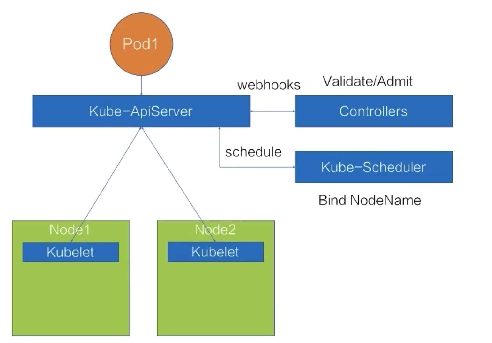
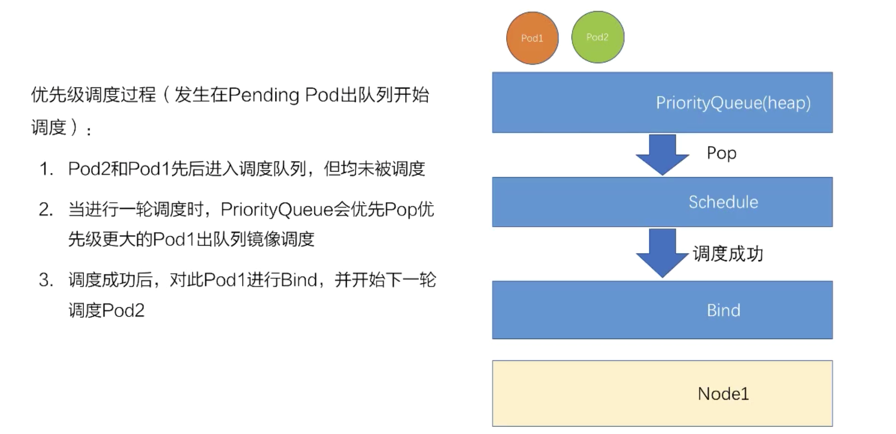
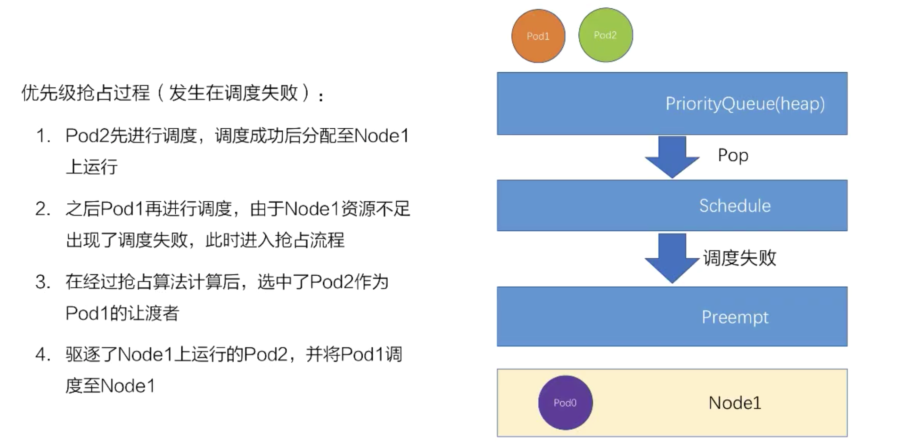
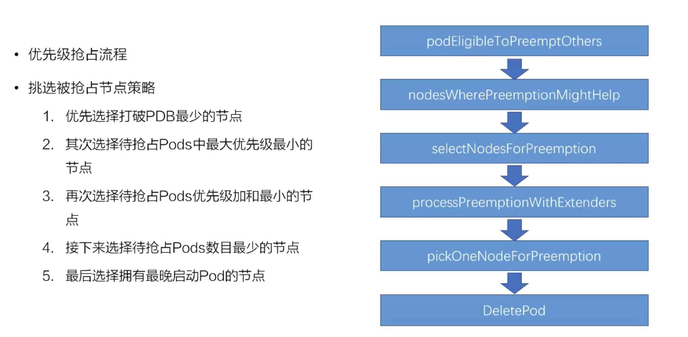

# Kubernetes 调度与资源管理

公开课地址：https://edu.aliyun.com/lesson_1651_13090?spm=5176.10731542.0.0.33d720beJkvduZ#_13090


## Kubernetes 调度过程



调度过程 = 把 Pod 放到合适的 Node 上。

那怎么定义合适？

- 满足 Pod 资源要求
- 满足 Pod 特殊关系要求
- 满足 Node 限制条件的要求
- 集群资源的合理利用


## Kubernetes 基础调度能力

- 资源调度 - 满足 Pod 资源要求
  - Resources: CPU/Memory/Storage/GPU/FGPA
  - QoS: Guaranteed/Burstable/BestEffot
  - Resource Quota
- 关系调度 - 满足 Pod/Node 的特殊关系/条件要求
  - PodAffinity/PodAntiAffinity: Pod 与 Pod 之间的关系
  - NodeSelector/NodeAffinity: 由 Pod 决定适合自己的 Node
  - Taint/Tolerations: 限制调度到某些 Node


## 资源调度

#### 资源配置方法

Pod 的资源类型：

- CPU
- Memory
- ephemeral-storage
- Extended-resource: nvmdia.com/gpu

CPU 和 Memory 很常见，关于 扩展资源见： [为节点发布扩展资源-为容器分派扩展资源.md](../动手操作/为节点发布扩展资源-为容器分派扩展资源.md) 

关于 ephemeral-storage 参见：https://kubernetes.io/zh/docs/concepts/configuration/manage-resources-containers/#local-ephemeral-storage


#### 如何满足资源需求

- request 和 limit
- Pod QoS（Quality of Service）
  - Guaranteed - 高，保障
  - Burstable - 中，弹性
  - BestEffort - 低，尽力而为

关于 QoS 参考： [配置Pod的服务质量.md](../动手操作/配置Pod的服务质量.md) 

QoS Class 是隐性的，不能显示的指定，而是通过 request 和 limit 的组合来自动映射 QoS Class 的。


#### QoS

- 对于 QoS 类为 Guaranteed 的 Pod：
  - Pod 中的每个容器必须指定内存请求和内存限制，并且两者要相等。
  - Pod 中的每个容器必须指定 CPU 请求和 CPU 限制，并且两者要相等。

- 如果满足下面条件，将会指定 Pod 的 QoS 类为 Burstable：
  - Pod 不符合 Guaranteed QoS 类的标准。
  - Pod 中至少一个容器具有内存或 CPU 请求。
- 对于 QoS 类为 BestEffort 的 Pod，Pod 中的容器必须没有设置内存和 CPU 限制或请求。

个人理解：

在宿主机资源耗尽时，QoS 为 BestEffort 会被最先驱逐，Burstable次之，Guaranteed 最后驱逐。


#### 不同 QoS 的表现

- 调度表现不同
  - 调度器会使用 request 进行调度，不管 limit 设置了多大。

- 底层表现不同
  - CPU 按照 request 划分权重
    - 如果设置了参数 --cpu-manager-policy=static-guaranteed 的话，QoS 是 Guaranteed ，并且 request.cpu 是整数，k8s 会绑定CPU核心。
  - Memory 按 QoS 来划分 OOMScore，OOMScore得分越高的话，在宿主机出现OOM的时候，会优先被 Kill 掉！
    - Guaranteed -998
    - Burstable 2～999
    - BestEffort 1000
  - Eviction 发生驱逐时
    - 优先驱逐 BestEffort
    - Kubelet - CPUManager


#### 资源 Quota

当一个k8s集群部署多个业务时，需要限制业务使用资源的总量，防止出现整个资源都会被某个业务应用都使用掉，导致另外一个业务没有资源使用。

限制每个 Namespace 的资源可以使用 ResourceQuota：

```yaml
apiVersion: v1
kind: ResourceQuota
metadata:
  name: default-hzwjv
  namespace: canghai
spec:
  hard:
    requests.cpu: "8"
    requests.memory: 16000Mi
    pods: "10"
  scopeSelector: #可以不填
    matchExpressions:
    - operator: Exists
      scopeName: NotBestEffort
```

限制 canghai 命名空间下非BestEffort的Qos只能使用8个CPU核心、16000M内存、10个Pod

Scope 包括：

- Terminating/NotTerminating
- BestEffort/NotBestEffort
- PriorityClass

当 Quota 使用超过后，再提交就会返回一个 forbidden 的 403 错误。


## 关系调度

官方文档：https://kubernetes.io/zh/docs/concepts/scheduling-eviction/assign-pod-node/

#### Pod 亲和调度

- Pod 亲和调度 PodAffinity

  - 必须和某些 Pod 调度到一起 - requiredDuringSchedulingIgnoredDuringExecution
  - 优先和某些 Pod 调度到一起 - preferredDuringSchedulingIgnoredDuringExecution

- Pod 反亲和性调度 PodAntiAffinity

  - 禁止和某些 Pod 调度到一起 - requiredDuringSchedulingIgnoredDuringExecution
  - 优先不和某些 Pod 调度到一起 - preferredDuringSchedulingIgnoredDuringExecution

- Operator

  - In/NotIn/Exists/DoesNotExist（In 和 Exists 有区别，In 匹配Key和Value、Exists只匹配Key）

  

Pod 反亲和示例：

```yaml
apiVersion: apps/v1
kind: Deployment
metadata:
 name: nginx-aff
spec:
 selector:
  matchLabels:
   app: web_server-aff
 replicas: 10
 template:
  metadata:
   labels:
    app: web_server-aff
  spec:
   affinity:
     podAntiAffinity:
       preferredDuringSchedulingIgnoredDuringExecution:
       - weight: 1
         podAffinityTerm:
           labelSelector:
             matchExpressions:
             - key: app
               operator: In
               values:
               - web_server-aff
           topologyKey: kubernetes.io/hostname
   containers:
   - name: nginx
     image: nginx:1.7.9
     ports:
     - containerPort: 80
```


#### Node 亲和调度

- NodeSelector
  - 必须调度到某些标签的 Node
- NodeAffinty
  - 必须调度到某些 Node上 - requiredDuringSchedulingIgnoredDuringExecution
  - 优先调度到某些 Node 上 - preferredDuringSchedulingIgnoredDuringExecution
  - Operator
    - In/NotIn/Exists/DoesNotExist/Gt/Lt

NodeSelector 示例：

```yaml
apiVersion: v1
kind: Pod
metadata:
  name: nginx
  labels:
    env: test
spec:
  containers:
  - name: nginx
    image: nginx
    imagePullPolicy: IfNotPresent
  nodeSelector:
    disktype: ssd
```


Node 亲和示例：

```yaml
apiVersion: v1
kind: Pod
metadata:
  name: with-node-affinity
spec:
  affinity:
    nodeAffinity:
      requiredDuringSchedulingIgnoredDuringExecution:
        nodeSelectorTerms:
        - matchExpressions:
          - key: kubernetes.io/e2e-az-name
            operator: In
            values:
            - e2e-az1
            - e2e-az2
      preferredDuringSchedulingIgnoredDuringExecution:
      - weight: 1
        preference:
          matchExpressions:
          - key: another-node-label-key
            operator: In
            values:
            - another-node-label-value
  containers:
  - name: with-node-affinity
    image: k8s.gcr.io/pause:2.0
```


#### Node 污点/容忍

- Node Taints（污点）
  - 一个 Node 可以有多个 Taints
  - Effect（效果，不能为空）
    - NoSchedule 只是禁止新的 Pod 调度上来
    - PreferNoSchedule 尽量不要调度到这台
    - NoExecute 最严格，不仅不会调度到新的Pod上来，而且也会 evict（驱逐） 没有对应 toleration（容忍） 的 Pods。
- Pod Tolerations（容忍）
  - 一个 Pod 可以有多个 Tolerations
  - Effect 可以为空，匹配所有
    - 取值和 Taints 的 Effect 一致
  - Operator
    - Exists/Equal

查看 Node 的污点：

```bash
$ kubectl describe node fueltank-1 | grep "Taints"
```

去掉 Node 的污点：

```bash
$ kubectl taint node fueltank-1 node-role.kubernetes.io/master:NoSchedule-
```

示例：

Node 上带了 k1=v1 且效果是 NoSchedule 的 Taints：

```yaml
apiVersion: v1
kind: Node
metadata:
  name: demo-node
spec:
  taints:
    - key: "k1"
      value: "v1"
      effect: "NoSchedule"
```

Pod 上必须带有 k1=v1 且效果是 NoSchedule 的 Tolerations

```yaml
apiVersion: v1
kind: Pod
metadata:
  name: demo-node
sepc:
  containers:
    - image: nginx:latest
      name: demo
  tolerations:
    - key: "k1"
      operator: "Equal"
      value: "v1"
      effect: "NoSchedule"
```


## Kubernetes 高级调度能力

- PodPriority 优先级调度
- Preemtion 抢占调度

这两个特性在 v1.14 之后已经是生产环境可用了，并且这俩功能默认是开启的。

如果资源够的话，通过基础调度能力即可，如果资源不够，就需要高级调度了。

如何做到集群资源合理利用？

- 先到先得策略（FIFO）- 简单、相对公平、上手快
- 优先级策略（Priority）- 复合公司日常业务特点


#### 优先级调度配置

创建一个高优先级的 PriorityClass，得分为 10000:

```yaml
apiVersion: scheduling.k8s.io/v1
kind: PriorityClass
metadata:
  name: high
value: 10000
globalDefault: false
```

创建一个低优先级的 PriorityClass，得分为100:

```yaml
apiVersion: scheduling.k8s.io/v1
kind: PriorityClass
metadata:
  name: low
value: 100
globalDefault: false
```

为 Pod 配置 priorityClassName：

```yaml
sepc:
  priorityClassName: high #或 low
```


- 一些内置优先级

  - 内置默认优先级 - DefaultPriorityWhenNoDefaultClassExists=0
  - 用户可配置的最大优先级 - HighestUserDefinablePriority=1000000000

  - 系统级别优先级 - SystemCriticalPriority=2000000000

  - 内置系统级别优先级
    - system-cluster-critical
    - system-node-critical


#### 优先级调度过程

只开了优先级，没有开抢占：



开了优先级，也开了抢占：



抢占选择 Node 过程：




