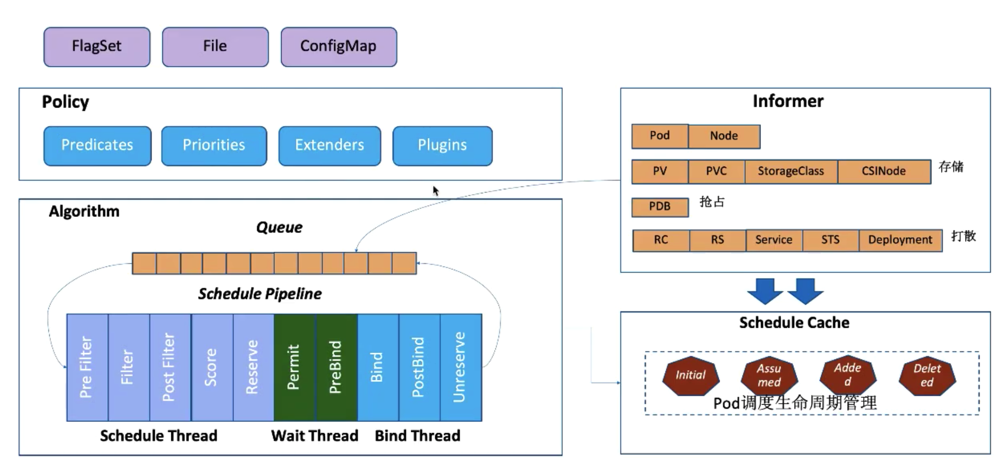
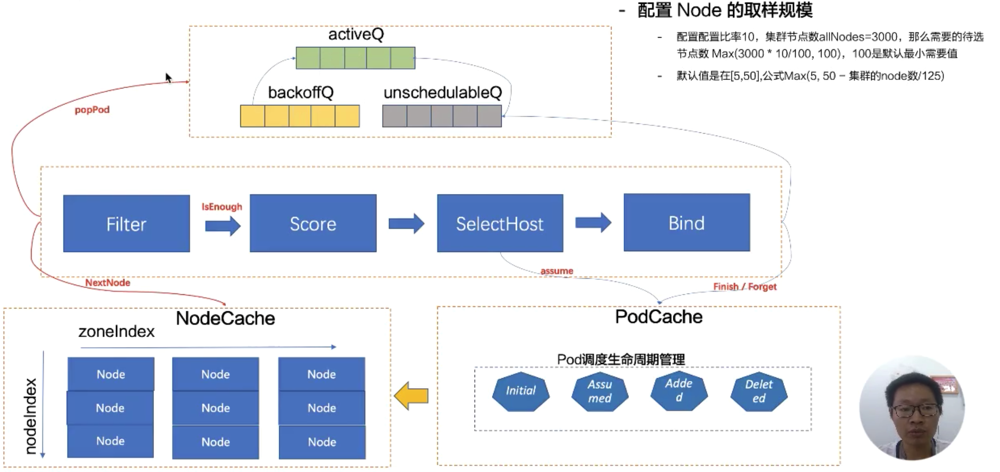

# Kubernetes 调度器调度流程与算法介绍

公开课地址：https://edu.aliyun.com/lesson_1651_17018?spm=5176.10731542.0.0.3ac020bejxHTGK#_17018

## 调度流程

可以从命令行参数、文件或 ConfigMap 中设置调度器的参数。

可以配置使用来了哪些 Predicates（过滤器）、Priorities（打分器）、Extenders（调度器）、Plugins（扩展点）

在运行过程中，调度器 watch apiserver 来获取 informer 信息，包括 Pod、Node；PV、PVC、StorageClass、CSINode；PDB；RC、RS、Service、STS、Deployment；

把必须的信息放入到队列之后，算法会对队列进行循环读取，算法分为图中的三部分，调度完成后，会写入调度缓存，就是 Pod 的状态。

调度的详细流程：

 

调度队列分为三个队列：activeQ、backoffQ、unschedulableQ

每次都会从 activeQ 中拿出一个 Pod 来进行调度。

拿到 Pod 之后，会获取 Node 数据，在获取 Node 数据时，可以只获取一部分数据（如图右上角），可以配置比率10，集群节点数 allNodes=3000，那么需要的待选节点数 Max（3000 * 10/100，100），100是默认最小需要值。

选 Node 的时候还有一个关键点，就是选出来的 Nodes ，需要足够分散，这样能够容灾，k8s 会维护一个 ZoneIndex，里面记录了每个区域有哪些 Node。

选择好 Pod 和 Node 之后，会进行打分，然后选出一个最优的节点。

选择完节点后，会对 Pod 缓存进行处理，设置 Pod 的状态为 Assumed。

最后进行 Bind，如果 Bind 成功，则 Pod 的状态为 Added，如果不成功，Pod 就会被丢到 uunschedulableQ 中，过一分钟后会重新放入 activeQ 中进行调度，如果 Pod 很紧急，那就放到 backoffQ 中，backoffQ 是按2的指数次幂进行重试的，比如第一次2秒，第二次4秒，第三次8秒以此类推。

>小结：
>
>Node 数量虽然很多，但可以配置算法只拿出一部分 Node ，并且拿出的 Node 是分散的，所以可以容灾。

## 调度算法实现

先看一下过滤器 Predicates：

- 储存相关：
  - NoVol

## 如何配置调度器

## 如何扩展调度器

