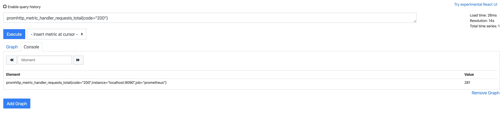

# Prometheus 入门

官方文档：https://prometheus.io/docs/introduction/overview/

## 二进制运行

首先去 https://prometheus.io/download/ 下载对应系统的二进制包。

下载，解压，进入目录

查看帮助：

```bash
$ ./prometheus --help
```

prometheus.yml 是配置文件。

启动：

```bash
$ ./prometheus --config.file=prometheus.yml
```

prometheus 自带的UI地址：http://localhost:9090/graph

查看所有的 metrics：http://localhost:9090/metrics

在 UI 界面中，搜索 `promhttp_metric_handler_requests_total`， 再搜索 `promhttp_metric_handler_requests_total{code="200"}` ，看效果：



这就是 PromQL。

统计 metric 的数量：

```
count(promhttp_metric_handler_requests_total)
```

这会返回 3 。

下面这句将返回 每秒钟内，http 的响应速度。

```
rate(promhttp_metric_handler_requests_total{code="200"}[1m])
```

