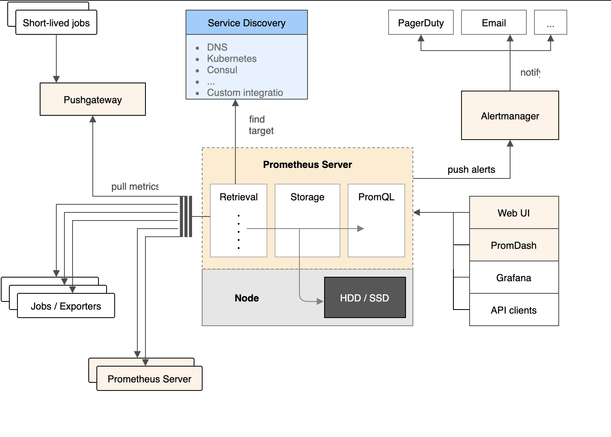

# Prometheus 架构 

架构图如下

这张图已经很明显了。

关于数据收集的方式：

### pull方式

Prometheus采集数据是用的pull也就是拉模型,通过HTTP协议去采集指标，只要应用系统能够提供HTTP接口就可以接入监控系统，相比于私有协议或二进制协议来说开发、简单。

### push方式

对于定时任务这种短周期的指标采集，如果采用pull模式，可能造成任务结束了，Prometheus还没有来得及采集，这个时候可以使用加一个中转层，客户端推数据到Push Gateway缓存一下，由Prometheus从push gateway pull指标过来。(`需要额外搭建Push Gateway，同时需要新增job去从gateway采数据`)

## 组成及架构

- Prometheus server
  主要负责数据采集和存储，提供PromQL查询语言的支持
- 客户端sdk
  官方提供的客户端类库有go、java、scala、python、ruby，其他还有很多第三方开发的类库，支持nodejs、php、erlang等
- Push Gateway
  支持临时性Job主动推送指标的中间网关
- PromDash
  使用rails开发的dashboard，用于可视化指标数据
- exporters
  支持其他数据源的指标导入到Prometheus，支持数据库、硬件、消息中间件、存储系统、http服务器、jmx等
- alertmanager
  实验性组件、用来进行报警
- prometheus_cli
  命令行工具
- 其他辅助性工具