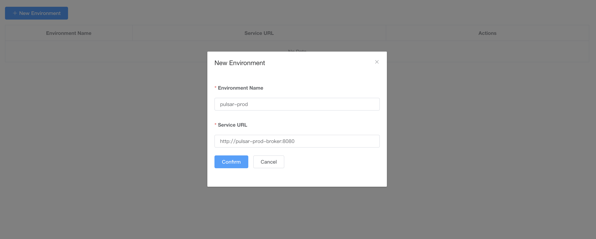

# Pular 在 Kubernetes 中安装

在 https://github.com/apache/pulsar/releases 中下载最新的源码包。


## 安装

我下载的 [pulsar-2.6.1.tar.gz](https://codeload.github.com/apache/pulsar/tar.gz/v2.6.1)

解压，进入目录，再执行：

```bash
$ cd deployment/kubernetes/helm/
$ ./scripts/pulsar/prepare_helm_release.sh -n pulsar -k pulsar-prod --control-center-admin pulsar  --control-center-password pulsar -c
$ helm install pulsar-prod pulsar -n pulsar
```

直到所有 Pod 处于运行状态：

```bash
$ kubectl get pods -n pulsar
```

修改 `deployment/kubernetes/helm/pulsar/values.yaml` 将其中的 LoadBalancer 改为 ClusterIP，

然后再从这个文件中加入 ingress。

事实证明，这这个文件中加 ingress 并没啥卵用，所以自己创建个 Ingress：

```yaml
apiVersion: networking.k8s.io/v1beta1
kind: Ingress
metadata:
  name: pulsar-ingress
  namespace: pulsar
spec:
  rules:
    - host: pulsar.testing.com
      http:
        paths:
          - path: /
            backend:
              serviceName: pulsar-prod-pulsar-manager
              servicePort: 9527
    - host: grafana.testing.com
      http:
        paths:
          - path: /
            backend:
              serviceName: pulsar-prod-grafana
              servicePort: 3000
```


## Dashboard

浏览器打开：http://pulsar.testing.com，输入用户名/密码：pulsar/pulsar

进入 Dashboard 第一步需要添加新环境，如下：




## 卸载

```bash
$ helm uninstall pulsar-prod -n pulsar
```

