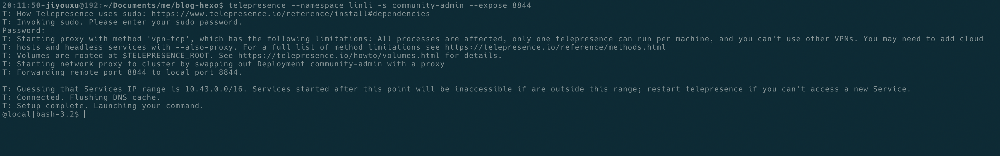

在本地安装 Telepresence 二进制文件。

以调试 community-admin 文件为例。

执行命令：

```bash
$ telepresence --namespace linli -s community-admin --expose 8844
```

8844 是 community-admin 对外开放的端口，-s 是 swap 的简称，表示用本地的服务替换远程集群中的 Deployment 和 Service。

等待一段时间，完成后如下图所示：



现在就可以在命令行，甚至在浏览器里面直接访问 k8s 集群中的 service 了。

在本地配置环境变量：

```bash
export CLOUD_CONFIG_ADDRESS=http://cloud-config-server-dev:8008
export SPRING_PROFILES_ACTIVE=dev
export SPRING_REDIS_DATABASE=0
export EUREKA_SERVER=cloud-registry-server
```

`cloud-config-server-dev` 就是提供 dev 配置的配置中心的 service 名。`http://cloud-config-server-dev:8008` 也可以直接在本地浏览器访问。

完成后，启动 IDE，再启动 community-admin 服务，我这里服务启动顺利。

浏览器打开：http://localhost:8844/admin

或者浏览器打开：http://community-admin:8844/admin


