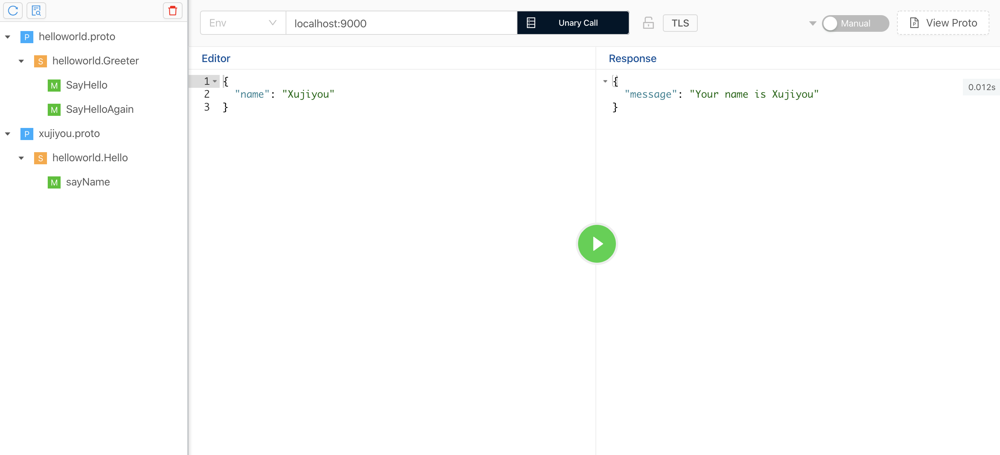

# Golang 构建 gRPC 服务

首先，获取依赖：

```bash
$ go get -u google.golang.org/grpc
```

安装 protoc 插件：

```bash
$ go get -u github.com/golang/protobuf/protoc-gen-go
```

编写 helloworld.proto ：

```protobuf
syntax = "proto3";

option objc_class_prefix = "HLW";

package helloworld;

service Hello {
    rpc sayName(NameRequest) returns (NameReply) {};
}

message NameRequest {
    string name = 1;
}

message NameReply {
    string message = 1;
}
```

编译 proto 文件生成 golang 代码：

```bash
$ mkdir helloworld
$ protoc helloworld.proto --go_out=plugins=grpc:helloworld
```

执行完成后，会在 helloworld 目录下生成 helloworld.pb.go 文件。

实现接口，编写 server.go :

```go
package main

import (
	"golang.org/x/net/context"
	"grpc-test/helloworld"
)

type XujiyouServer struct {}


func (s *XujiyouServer) SayName(ctx context.Context, nameRequest *helloworld.NameRequest) (*helloworld.NameReply, error) {
	return &helloworld.NameReply{Message: "Your name is " + nameRequest.Name}, nil
}
```

然后编写 main.go 来启动 server：

```go
package main

import (
	"flag"
	"fmt"
	"google.golang.org/grpc"
	"grpc-test/helloworld"
	"log"
	"net"
)

func main() {
	flag.Parse()
	lis, err := net.Listen("tcp", fmt.Sprintf(":%d", 9000))
	if err != nil {
		log.Fatalf("failed to listen: %v", err)
	}

	grpcServer := grpc.NewServer()
	helloworld.RegisterHelloServer(grpcServer, &XujiyouServer{})
	grpcServer.Serve(lis)
}
```

启动程序。

使用 BloomRPC 桌面客户端验证程序：



