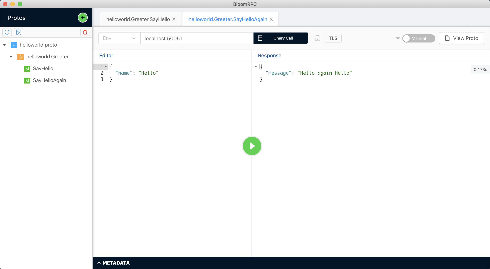
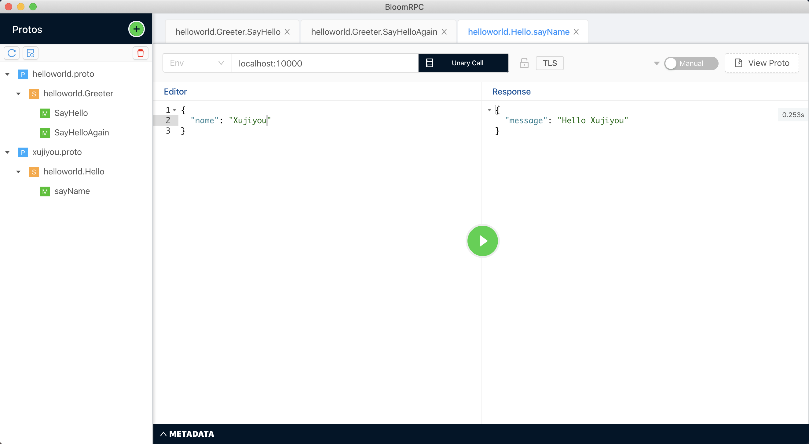

# gRPC 入门

gRPC 官方文档：https://grpc.io/docs/

下面使用 Java 来跑 gRPC 的 demo。

---

## Java - gRPC 入门教程

文档地址：https://grpc.io/docs/quickstart/java/

执行命令：

```bash
$ # Clone the repository at the latest release to get the example code:
$ git clone -b v1.26.0 https://github.com/grpc/grpc-java
$ # Navigate to the Java examples:
$ cd grpc-java/examples
```

这里可以用 IDEA 打开 grpc-java 项目，然后添加 examples 模块。这样就可以看代码了。

然后执行 examples 下的 task：installDist。或者执行 ` ./gradlew installDist` 命令也行。

然后运行 server ：

```
$ ./build/install/examples/bin/hello-world-server
```

再打开另一个命令行，运行 Client：

```
$ ./build/install/examples/bin/hello-world-client
```

在我的 Mac 中，我安装了一个 gRPC 的 GUI Client，叫 BloomRPC，可以打开，导入 examples 项目里面的 helloworld.ptoto 。然后输入服务端的地址，再运行，就可以看到输出了。

 


## 更新 Service

可以更新 helloworld.proto 文件，加入 SayHelloAgain ：

```protobuf
// The greeting service definition.
service Greeter {
  // Sends a greeting
  rpc SayHello (HelloRequest) returns (HelloReply) {}
  // Sends another greeting
  rpc SayHelloAgain (HelloRequest) returns (HelloReply) {}
}

// The request message containing the user's name.
message HelloRequest {
  string name = 1;
}

// The response message containing the greetings
message HelloReply {
  string message = 1;
}
```

完成后，重新 build 一下，会重新生成对应的 java 代码。

然后更改 HelloWorldServer.java ，加入 sayHelloAgain 方法：

```java
private class GreeterImpl extends GreeterGrpc.GreeterImplBase {

  @Override
  public void sayHello(HelloRequest req, StreamObserver<HelloReply> responseObserver) {
    HelloReply reply = HelloReply.newBuilder().setMessage("Hello " + req.getName()).build();
    responseObserver.onNext(reply);
    responseObserver.onCompleted();
  }

  @Override
  public void sayHelloAgain(HelloRequest req, StreamObserver<HelloReply> responseObserver) {
    HelloReply reply = HelloReply.newBuilder().setMessage("Hello again " + req.getName()).build();
    responseObserver.onNext(reply);
    responseObserver.onCompleted();
  }
}
```

重新编译，再重新运行服务端。

然后打开 BloomRPC，刷新之前导入的 helloworld.proto 文件，会看到新加入的 sayHelloAgain 方法，访问这个方法会看到对应的输出：




OK，以上就是使用 gRPC 的套路！！！


---


## 自建 Java - gRPC 服务端

由于上边的项目并不是我们自己写的，所以下面从头开始下一个使用 gRPC 的程序。

使用 IDEA 新建 Gradle 项目，建好后，布置 gradle。

具体文档在：https://github.com/grpc/grpc-java/blob/master/README.md

对于 Gradle 来说，就是在 build.gradle 中将以下代码加入正确的位置（哪个位置就不说了，都懂）：

```groovy
implementation 'io.grpc:grpc-netty-shaded:1.27.1'
implementation 'io.grpc:grpc-protobuf:1.27.1'
implementation 'io.grpc:grpc-stub:1.27.1'
```

```groovy
plugins {
    id 'com.google.protobuf' version '0.8.8'
}

protobuf {
  protoc {
    artifact = "com.google.protobuf:protoc:3.11.0"
  }
  plugins {
    grpc {
      artifact = 'io.grpc:protoc-gen-grpc-java:1.27.1'
    }
  }
  generateProtoTasks {
    all()*.plugins {
      grpc {}
    }
  }
}
```

做完上边的步骤之后，IDEA 还不能发现 proto 生成的 Java 类。

怎么办那，还需要在 build.gradle 中加入以下代码：

```groovy
sourceSets {
    main {
        java {
            srcDirs = [
                    "src/main/java",
                    "src/main/proto",
                    "${protobuf.generatedFilesBaseDir}/main/java",
                    "${protobuf.generatedFilesBaseDir}/main/grpc"
            ]
        }
    }
}
```

OK，刷新一下 Gradle 后开始写代码：

首先写 proto 代码。

xujiyou.proto：

```protobuf
syntax = "proto3";
option java_multiple_files = true;
option java_package = "work.xujiyou.helloworld";
option java_outer_classname = "XujiyouProto";
option objc_class_prefix = "HLW";

package helloworld;

service Hello {
    rpc sayName(NameRequest) returns (NameReply) {};
}

message NameRequest {
    string name = 1;
}

message NameReply {
    string message = 1;
}
```

写完之后，打开 gradle 面板，运行 Tasks -> other -> compileJava 。这一步会生成 Java 代码。

然后写 XujiyouService.java ：

```java
package work.xujiyou.service;

import io.grpc.stub.StreamObserver;
import work.xujiyou.helloworld.HelloGrpc;
import work.xujiyou.helloworld.NameReply;
import work.xujiyou.helloworld.NameRequest;

/**
 * XujiyouService class
 *
 * @author jiyouxu
 * @date 2020/2/20
 */
public class XujiyouService extends HelloGrpc.HelloImplBase {

    @Override
    public void sayName(NameRequest req, StreamObserver<NameReply> responseObserver) {
        NameReply reply = NameReply.newBuilder().setMessage("Hello " + req.getName()).build();
        responseObserver.onNext(reply);
        responseObserver.onCompleted();
    }
}
```

最后写 XujiyouServer.java ：

```java
package work.xujiyou.server;

import io.grpc.Server;
import io.grpc.ServerBuilder;
import work.xujiyou.service.XujiyouService;

import java.io.IOException;
import java.util.logging.Logger;

/**
 * XujiyouServer class
 *
 * @author jiyouxu
 * @date 2020/2/20
 */
public class XujiyouServer {

    private static final Logger logger = Logger.getLogger(XujiyouServer.class.getName());

    private final Server server;

    private XujiyouServer() {
        server = ServerBuilder.forPort(10000).addService(new XujiyouService()).build();
    }

    public static void main(String[] args) throws IOException, InterruptedException {
        XujiyouServer server = new XujiyouServer();
        server.start();
        server.blockUntilShutdown();
    }

    private void start() throws IOException {
        server.start();
        logger.info("Server started, listening on 10000");
        Runtime.getRuntime().addShutdownHook(new Thread() {
            @Override
            public void run() {
                // Use stderr here since the logger may have been reset by its JVM shutdown hook.
                System.err.println("*** shutting down gRPC server since JVM is shutting down");
                XujiyouServer.this.stop();
                System.err.println("*** server shut down");
            }
        });
    }

    private void stop() {
        if (server != null) {
            server.shutdown();
        }
    }

    private void blockUntilShutdown() throws InterruptedException {
        if (server != null) {
            server.awaitTermination();
        }
    }

}
```

然后运行 Server。

打开 BloomRPC，访问服务：




OK ，大功告成，以后就按这个套路写。
