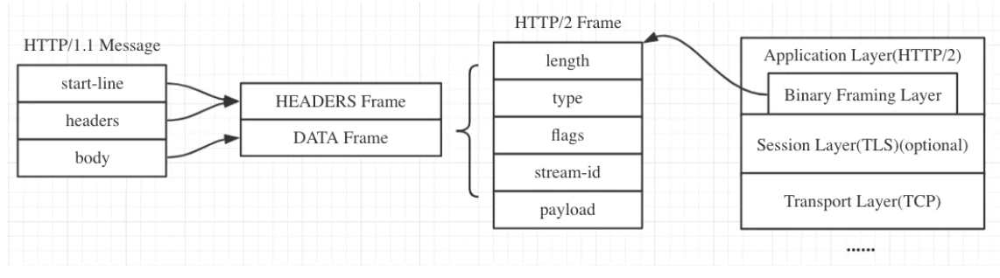
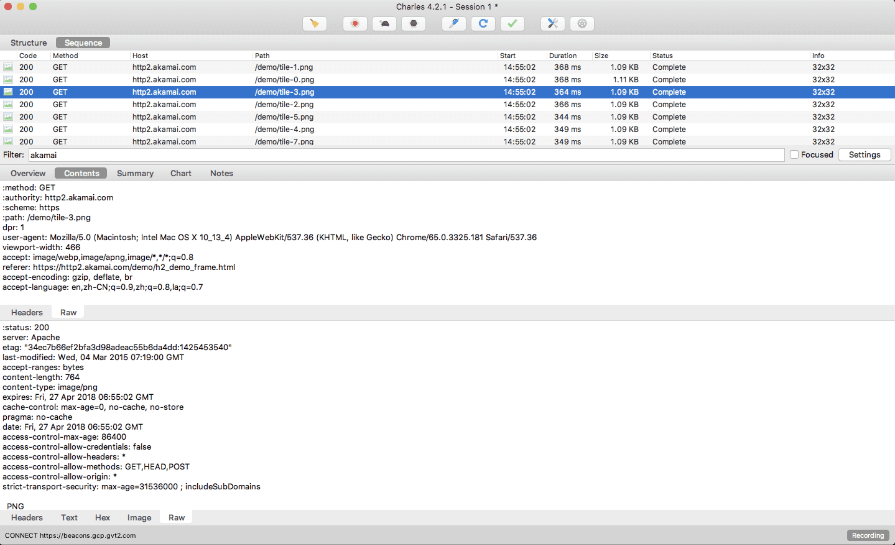
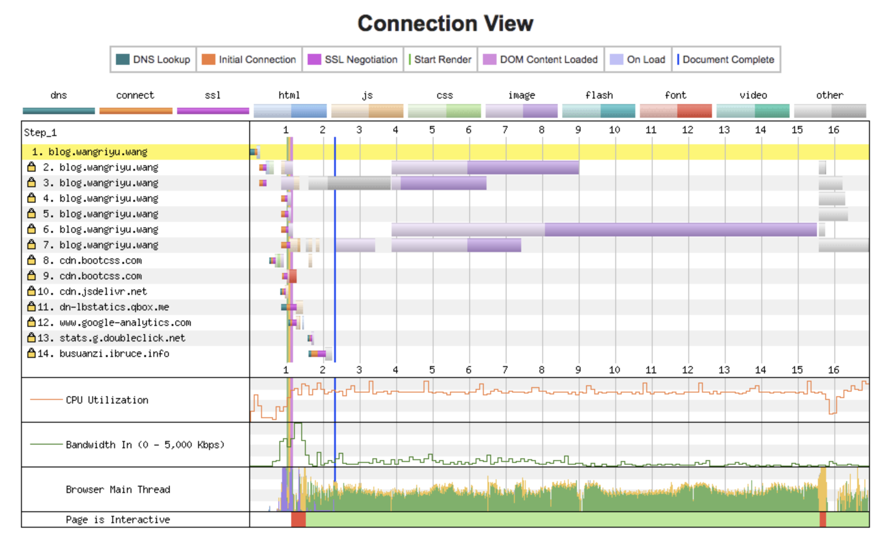
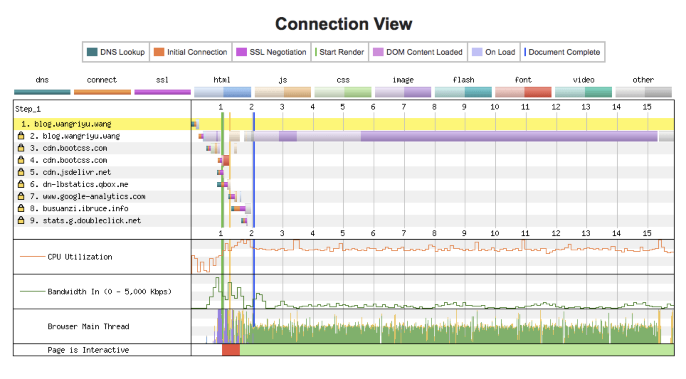

# HTTP2 详解

参考：https://juejin.cn/post/6844903667569541133

## HTTP 1.1 存在的问题

1. TCP 连接数限制

   对于同一个域名，浏览器最多只能同时创建 6~8 个 TCP 连接 (不同浏览器不一样)。为了解决数量限制，出现了  技术，其实就是资源分域，将资源放在不同域名下 (比如二级子域名下)，这样就可以针对不同域名创建连接并请求，以一种讨巧的方式突破限制，但是滥用此技术也会造成很多问题，比如每个 TCP 连接本身需要经过 DNS 查询、三步握手、慢启动等，还占用额外的 CPU 和内存，对于服务器来说过多连接也容易造成网络拥挤、交通阻塞等，对于移动端来说问题更明显，可以参考这篇文章: [Why Domain Sharding is Bad News for Mobile Performance and Users](http://dev.mobify.com/blog/domain-sharding-bad-news-mobile-performance/)

   

   

   在图中可以看到新建了六个 TCP 连接，每次新建连接 DNS 解析需要时间(几 ms 到几百 ms 不等)、TCP 慢启动也需要时间、TLS 握手又要时间，而且后续请求都要等待队列调度。

2.  队头阻塞问题

   每个 TCP 连接同时只能处理一个请求 - 响应，浏览器按 FIFO 原则处理请求，如果上一个响应没返回，后续请求 - 响应都会受阻。为了解决此问题，出现了 [管线化 - pipelining](https://zh.wikipedia.org/wiki/HTTP管線化) 技术，但是管线化存在诸多问题，比如第一个响应慢还是会阻塞后续响应、服务器为了按序返回相应需要缓存多个响应占用更多资源、浏览器中途断连重试服务器可能得重新处理多个请求、还有必须客户端 - 代理 - 服务器都支持管线化

3. Header 内容多，而且每次请求 Header 不会变化太多，没有相应的压缩传输优化方案

4. 为了尽可能减少请求数，需要做合并文件、雪碧图、资源内联等优化工作，但是这无疑造成了单个请求内容变大延迟变高的问题，且内嵌的资源不能有效地使用缓存机制

5. 明文传输不安全

## HTTP2 的优势

#### 二进制分帧层 (Binary Framing Layer)

帧是数据传输的最小单位，以二进制传输代替原本的明文传输，原本的报文消息被划分为更小的数据帧:

h1 和 h2 的报文对比:

图中 h2 的报文是重组解析过后的，可以发现一些头字段发生了变化，而且所有头字段均小写

> `strict-transport-security: max-age=63072000; includeSubdomains` 字段是服务器开启 [HSTS 策略](https://zh.wikipedia.org/wiki/HTTP严格传输安全)，让浏览器强制使用 HTTPS 进行通信，可以减少重定向造成的额外请求和会话劫持的风险。
>
> 在 HSTS 有效期内且 TLS 证书仍有效，浏览器访问 blog.wangriyu.wang 会自动加上 https:// ，而不需要做一次查询重定向到 https
>
> 服务器开启 HSTS 的方法是: 以 nginx 为例，在相应站点的 server 模块中添加 `add_header Strict-Transport-Security "max-age=63072000; includeSubdomains" always;` 即可
>
> 在 Chrome 中可以打开 `chrome://net-internals/#hsts` 进入浏览器的 HSTS 管理界面，可以增加 / 删除 / 查询 HSTS 记录，比如下图:
>
> 

#### 多路复用 (MultiPlexing)

在一个 TCP 连接上，我们可以向对方不断发送帧，每帧的 stream identifier 的标明这一帧属于哪个流，然后在对方接收时，根据 stream identifier 拼接每个流的所有帧组成一整块数据。 把 HTTP/1.1 每个请求都当作一个流，那么多个请求变成多个流，请求响应数据分成多个帧，不同流中的帧交错地发送给对方，这就是 HTTP/2 中的多路复用。

流的概念实现了单连接上多请求 - 响应并行，解决了线头阻塞的问题，减少了 TCP 连接数量和 TCP 连接慢启动造成的问题

所以 http2 对于同一域名只需要创建一个连接，而不是像 http/1.1 那样创建 6~8 个连接:

#### 服务端推送 (Server Push)

浏览器发送一个请求，服务器主动向浏览器推送与这个请求相关的资源，这样浏览器就不用发起后续请求。

Server-Push 主要是针对资源内联做出的优化，相较于 http/1.1 资源内联的优势:

- 客户端可以缓存推送的资源
- 客户端可以拒收推送过来的资源
- 推送资源可以由不同页面共享
- 服务器可以按照优先级推送资源

#### Header 压缩 (HPACK)

使用 [HPACK](https://httpwg.org/specs/rfc7541.html) 算法来压缩首部内容

#### 应用层的重置连接

对于 HTTP/1 来说，是通过设置 tcp segment 里的 reset flag 来通知对端关闭连接的。这种方式会直接断开连接，下次再发请求就必须重新建立连接。HTTP/2 引入 RST_STREAM 类型的 frame，可以在不断开连接的前提下取消某个 request 的 stream，表现更好。

#### 请求优先级设置

HTTP/2 里的每个 stream 都可以设置依赖 (Dependency) 和权重，可以按依赖树分配优先级，解决了关键请求被阻塞的问题

#### 流量控制

每个 http2 流都拥有自己的公示的流量窗口，它可以限制另一端发送数据。对于每个流来说，两端都必须告诉对方自己还有足够的空间来处理新的数据，而在该窗口被扩大前，另一端只被允许发送这么多数据。

#### HTTP/1 的几种优化可以弃用

合并文件、内联资源、雪碧图、域名分片对于 HTTP/2 来说是不必要的，使用 h2 尽可能将资源细粒化，文件分解地尽可能散，不用担心请求数多。

